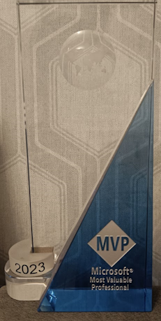
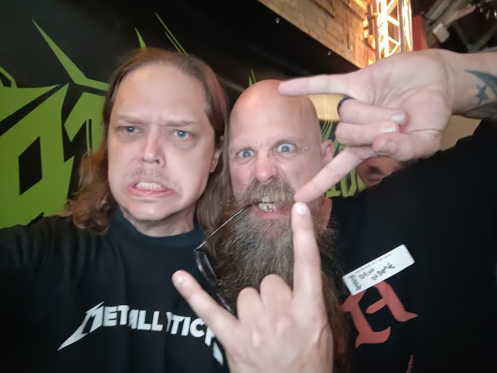
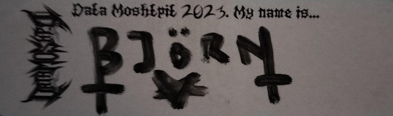

# 2023 - A summary

> I started writing this post and made it half way through before I realized my mistake: I named it and kept using 2024 instead of 2023... It seems with age it really does get hard to keep track of years 😂

One day to go, and we can make it through one more post, right? A short, non technical one at least.

Like I wrote in my [last post](posts/azdo.pipelinelogging.md) I am not that good with Christmas. I don't like my routines broken, I don't like buying present, And I don't like being stressed, which for some reason seems to be the main theme of the season.

But just a couple of days ago, sitting at my computer, I turned my head a bit and saw  something that reminded me of how good this year has been to me...

So I thought let's try to change my mood and end it on a good note. After all, this year has been nothing short of amazing.

To quote [my favourite podcast](https://www.nosuchthingasafish.com/): In no particular order here we go...

## A brief history of me

Everyone has goals in life, be they "learn to play the guitar", "get a medal in the Olympics" or "pet a dog", all of them good goals.

Me, I am no different. I have had, and still have, many goals in life ranging from "Play in a Norwegian black metal band" to "own a boat". But those are personal goals.

I was taught early on in life (thanks dad for my first employment) to have high working morals. I barely ever show up late, work hard, and try to achieve my goals. 
Sure, this is different today than it was back in the kitchen of a restaurant. Back then one of the things that mattered weas showing up in time. Today I have rather flexible hours, and often do my work at night because it suits me better. Back then it was "keep the tables clean", where now it is "this is an issue, solve it" and it doesn't really matter how or when, as long as it is done.

But I like to think I still have my work morals, and that having goals helps me keep them.

And so it came that I always had goals. Short and long term goals of what I wanted to do. Goals that often could be expressed as "I want to do what my heroes does".

Now, I've been told I should curse less, and I do try, but for once I need to use a bad word.

Because **fuck me** this has been a good year for crushing my goals!

## Speaking

I think I've beaten my own record on amounts of sessions this year, and this is probably my favourite hobby right now. I absolutely love it.
No less than seven conferences around the world was crammed in this year, and that's not counting internal or company presentations.

I started out easy with [ESMuG #5](https://www.meetup.com/east-sweden-microsoft-user-group/) in March. I often use local user groups as testing ground for bigger conferences, and this one was no different. A follow up on one of the sessions I gave a PSConf 2022, and a dry run of what was given in my first major milestone of the year..

### As a PowerShell nerd there are a couple of conferences that matter

No wait, let's go even further back..

### 2015 was the year

When I first went to a PowerShell conference. I wasn't supposed to go as I had already blown my yearly conf budget, but managed to nag my way in to it anyway. The reason was simple - It was located in Stockholm and didn't cost too much for my work.

The conference in question was the second (I think) PowerShell conference, PowerShell summit Europe.

And my god, was I blown away. After sitting in my corner of the world believing I was actually quite good at this I saw speakers such as Jeffrey Snover, June Blender, Dr. Tobias Weltner whom I after this bought ISE on steroids from, Jeff Hicks, And Simon Wåhlin who I later got to work with.

And Don Jones. Don gave an impromptu closing session where he uttered the words "No one is responsible for your education but you". Logical, yes, but this stuck with me, and there and then my journey began. I joined the PowerShell user group in Sweden, Started speaking there, then arranging it, and so on and so forth.

Now this was the last PowerShell Summit conference. After this it split in to two different conferences - PSConfEU and PowerShell + DevOps global summit. I made my debut at the PSConfEU stage in 2022.

Which leads us back to 2023

### PowerShell + DevOps global - The non European one

On the 26:th of April this year I made my debut at the big stage in the States. I got to share the stage with some of my absolute heroes, and oh my god was it fun. The session I gave was on Azure DevOps security, one of my favourite topics, and the room was filled to the brim with people standing in the back.

One of the reason I love this topic is it always leaves people somewhat shocked over how easy it is to pwn an entire Azure DevOps org, mostly because everyone seems to forget that it is a security boundary.  You can go watch the video for yourself [over here](https://www.youtube.com/watch?v=StvroRI-WW4).

And so 2023 marks the year I have spoken at all of the biggest PowerShell conferences so far. Please tell 2015 Bjompen if you see him.

(Bonus shout out to Mr. [James Brundage!](https://github.com/StartAutomating/) Was awesome to meet you!)

### Onwards my noble steed, there is f**ery to be spread!

Once PS+DevOps was done I went back home and not just spoke at, but also arranged the Swedish version of the [Global Azure](https://globalazure.net/) conference in May. This was the second year we did so, and again, so much fun. We even managed to get a guest speaker all the way from Holland. None other than the man, the myth, the legend - [Jaap Brasser](https://github.com/jaapbrasser)!

Again I took the chance of practicing before my second big one of the year - PSConfEU.

This is my absolute favourite conference and I've been a visitor since year one. It is to the point where I negotiated this with my boss before I joined. I go to PSConf, or no signing. 2023 marked my second year as a speaker here, doing two sessions - #PTMF2 on CD, and GitHub Actions. This also marked my first major setback as a speaker as i completely lost my track and messed up. After my GitHub session I kind of wanted to fall through the earth and die.

Fortunately I live in the best of communities. The support was insane, and I want to send all my love to the amazing and wonderful soul that is [Rob Sewell](https://robsewell.com/). Your support made my day so so much better, and I even left with a feeling of "it's ok, everyone messes up". And you know what? I did it. I stood there. I am proud of myself for doing it.

And I kept doing it. I joined my first non-PowerShell conference this year when I spoke at the [Data Moshpit](https://www.data-moshpit.com/) conference in Berlin in September! Now instead of giving all the details, I'll give you a couple of pictures. Now tell me - How could a conference be any more metal? I'll wait...

I ended my speaker year with two sessions in November, both on a really cool new product that I have spent way to much time exploring this year - GitHub Advanced Security for Azure DevOps. [Västerås Azure User group](https://vazug.cloud/) and the conference my company arranges - Cloudrunner.

### Over all

Like I said I beat my record of conferences. I hope to make it again in 2024, but we'll see. So far I am accepted to the PowerShell + DevOps Global, and I have a number of CFPs sent (And a lot of them in open tabs to be sent 😂)

I do hope to see you all on the road somewhere.

## Not just conferences

Conferences takes practice, And I often find myself using them to force myself to dig deeper in a topic I have been meaning to mess around in. After all, if I can't answer my own questions, how am I supposed to answer other peoples?
So I find myself reading learn articles. A lot of learn articles. And I find errors in them. Since learn is open source, I of course fix those errors to the best of my skills.

To the shock of most people reading this I also write code. Both for demos, and projects. This year I, alongside my fellow friend and colleague [Emanuel Palm](https://github.com/PalmEmanuel), released the 2.0 release of [ADOPS](https://github.com/AZDOPS/AZDOPS/), and by doing so we are AFAIK the first Azure DevOps module supporting OAuth with built in authentication. That is of course super cool.

And all of this coding, fixing, speaking, and other community involvement finally resulted in reaching another goal: In May I was selected and awarded the MVP title. I have already blogged about this in a previous post, but I can't stress how proud this made me. It is a goal I set up some almost ten years ago, after the aforementioned PowerShell Summit in Stockholm. If my heroes has the title, I want it.

But there are other titles out there as well. Also well blogged about by now is my newest in line of certifications, [Az-204](posts\az204.pt1.md). This certification marked the last one of my "need" certificates. Sure, there are many certs left, but when I looked through them some years ago I really felt that 10x to 40x were "mine", and now I have them all. Good job, me!

## Training

I don't just read learn, take courses, and write certificates, but I also do training. I have given courses in PowerShell for many years now, and recently also gave my first Azure training session. In fact my idea for quite some time was to do training as my primary thing.

But there was always one thing keeping me from doing it the proper Microsoft way: an [MCT certification](https://learn.microsoft.com/credentials/certifications/mct-certification?wt.mc_id=DT-MVP-5005317).

The major problem I had with this was not that I lacked the skills, but there are limited places and people allowed to do actual certification. Unlike MS certs you have to actually meet people.

But this was also something that resolved itself this year. I took an actual test (gave a short training session on RegEx) in front of a certification authority and passed, which means that since this fall I am also a certified Microsoft trainer allowed to give you all training in standard Microsoft courses.

## Other cool stuff

All of this of course led to some other cool things. I've been interviewed on the [PowerShell podcast](https://powershell.org/2023/07/the-powershell-podcast-bjorn-sundling-from-powershell-developer-to-mvp-an-unfiltered-journey/) and on an [MVP pod/videocast](https://soundcloud.com/collabtalk/mvpbuzzchat-episode-221-with-bjorn-sundling).

I've written 23 blog posts counting this one.

I've met and hung out with so many cool people it is crazy, doing what I love - Share knowledge, discuss ideas, and have fun.

And amongst those heroes from the 2015 conference I have now shared stage with not all, but a lot of them.

## The bad and the wrap up

Holy hell. Writing this makes me realize what a year this has been. All of those goals I set up so so many years ago are fulfilled.

But unfortunately this also comes with downsides. As I sit here wrapping up 2023 I can't help but wonder what my next goals will be.
I have achieved everything I ever set out to do.

Sure, keeping the MVP, MCT, and all those amazing titles will be a lot of work, and I am really looking forward to it (although I am already nervous for renewals... 😱😱), but I need to find new goals. Higher goals. If you have any ideas let me know.

But hey, they did release some new [certifications for GitHub stuff](https://examregistration.github.com/), and those are on the 2024 todo list.

And I have one bigger project I am working on in the hidden so far.

And me and some other people are talking about starting a new user group.

Actually I think I can fill my 2024 schedule already. But first I have a new year to celebrate. Soon life will go back to normal and I can have my routines again. I am looking forward to it. 

And I have to remind myself of this: I am actually living my dream. Enjoy it, Bjompen. 2015 me sits there in the audience dreaming of becoming me.

See you all in 2024.

(Oh, and if you want to follow me and see if the renewals get through you can follow me on learn [here](https://learn.microsoft.com/users/bjrnsundling-8967/transcript/7kw8kimyxxg1znk?wt.mc_id=DT-MVP-5005317))
