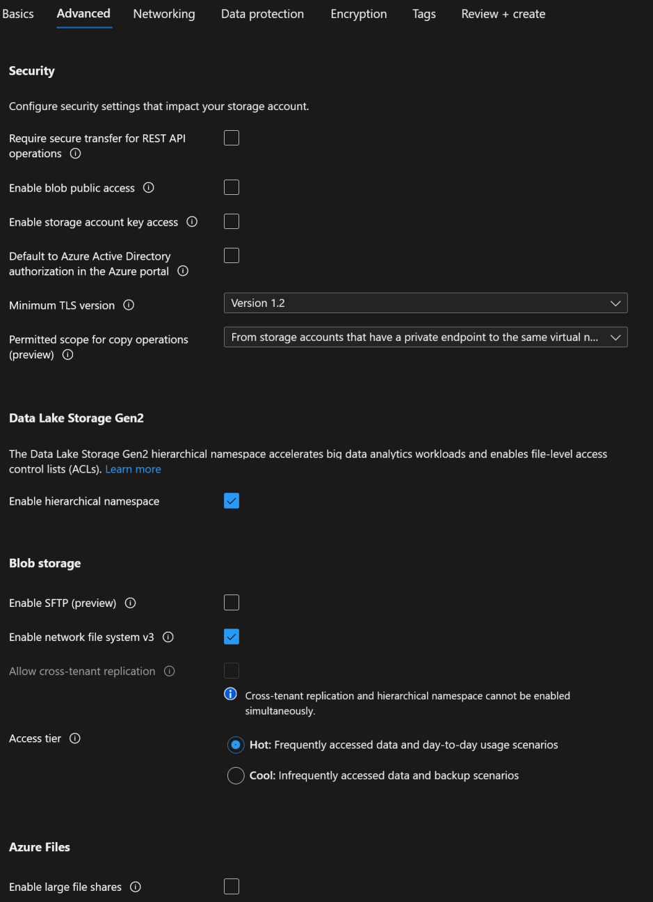
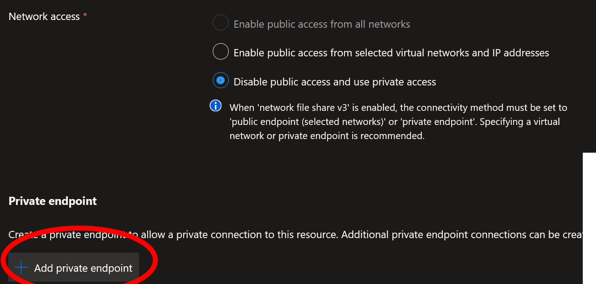
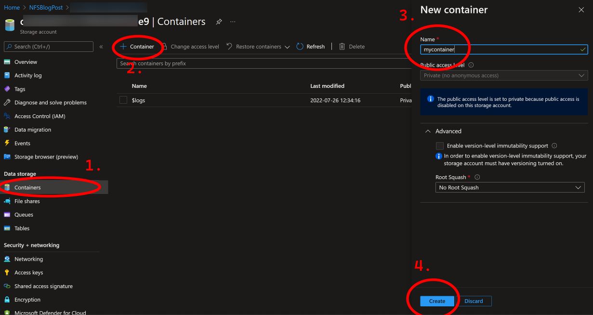
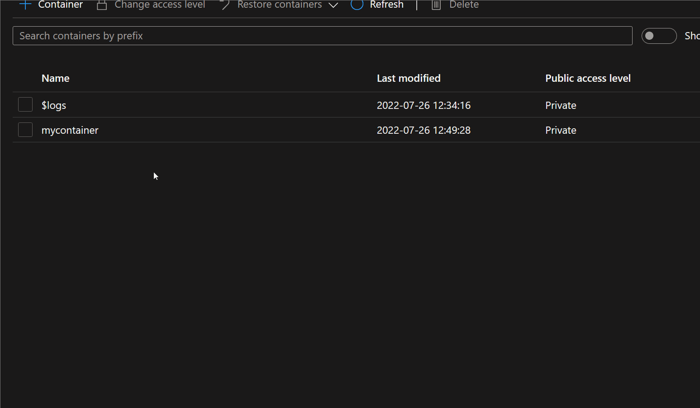
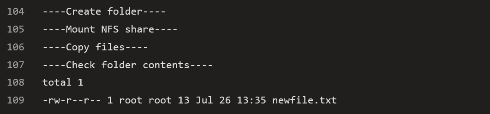

# Using NFS as a secure storage for pipeline data

(Long title, but I'm short of ideas of catchy ones, so thi has to do..)

## Back from vacation

Started working again last monday after a three week vacation, after one week in Vienna.

It's weird how tired one can be after vacation.. It's really hard to get started with anything in the mornings, especially since I', pretty much alone at work and noone to report anything to.

Yet here we are, two weeks in. So far I've released a new version of [PSSecretScanner](https://github.com/bjompen/PSSecretScanner), a new version of [ADOPS](https://github.com/AZDOPS/AZDOPS), and some more stuff.

But I haven't yet written anything, so lets do that today 😉

## This spring, one of the jobs I've been doing

is setting up a release pipeline that was quite interesting.

The goal was something like this

- Produce the artifact (a file)
- Publish this to a storage blob in Azure of some kind
- Access said artifact from a Linux machine
- No external access to the file(s) as they may contain sensitive data.

Doesn't sound to hard, but a couple of interesting points here. Most of all the fact that I have no idea how to do anything in Linux.

## Setting up the Azure stuff

I recently blogged about [VM Scale Sets](AzdoVMSS.md), and this is the first place we will have to use those.

We will, of course, also need to set up the blob storage that we will deploy to. In this case I used [Bicep](https://github.com/Azure/bicep) to do the storage deploy, but for the sake of this post, lets do it manually with some screenies on the important stuff.

First of, since blobs needs globaly unique names, lets generate something random in PowerShell

```PowerShell
-join ((New-Guid).guid.replace('-','')[0..23]) | clip
```

But it is in the `Advanced` tab most of the magic is.

First of all, we want to turn of

- Require secure transfer (see note)
- Public access
- Storage account key access
- Permitted scope for copy operations (This is new to me, but generally, lock down if you dont need right?)

Secondly, we need to turn _on_

- Hierarchical namespaces
- Enable network file system v3 (This is what we really need, but it requires Hierrak..harakir... that checkbox up there ⬆️)

We want the `Advanced` tab to look something like this



**note: yes, secure transfer is good, but it doesn't behave nicely with NFS. If you have a fix, let me know..**

And on to networking.

Of course you need to know which network and subnet you want to connect to. For my post here I'm going to reuse the network I placed my VMSS hosts in and I will use a private endpoint. You may also select `Public access...` and pick the networks needed, but that's another blog post I guess.

What I will to do is create a [private endpoint](https://docs.microsoft.com/azure/private-link/private-endpoint-overview?wt.mc_id=DT-MVP-5005317) to our resource. This way no machines not on our dedicated network will be able to access our blobs. At all.



There isn't too much to set up in the endpoint itself, just remember to chose the correct region where your network is located.

After this you can set up your tags and stuff, but I'm just going to head on to the end.

Once the storage account is set up, lets go create a blob in the `Storage account` azure plane.



Once created we can now verify one of the things the request included:

- Prevent all public access.

If we click the blob to browse it using the portal we will, although we do have "real" access to it, not be able to see the blob contents.



## The Linux adventures

Like I mentioned in the beginning I know nothing about Linux, So of to google we go.

Of course, like (almost) always, theres a [great article on Docs](https://docs.microsoft.com/azure/storage/blobs/network-file-system-protocol-support-how-to?wt.mc_id=DT-MVP-5005317) describing this.

The first thing to note is that we are currently using a vanilla Ubuntu image on our VMSS, and those does not have the packages to mount nfs installed.

In order to first update our installer repos and then install what we need we run these commands.

```Bash
sudo apt-get update
sudo apt-get install -y nfs-common
```

After this we can create a folder where the NFS share will be mounted:

```Bash
sudo mkdir -p /MyNfsFolder
```

We can then mount the NFS share in our new folder by funning the command:

```Bash
sudo mount -o sec=sys,vers=3,nolock,proto=tcp <storageAccountName>.blob.core.windows.net:/<storageAccountName>/<storageContainerName>  /MyNfsFolder
```

> Humbly I must admit - _I have no idea what the parameters realy do,_ but replace the `<>` placeholders and this should work.

The final step in our NFS runner is to copy the artifact to our share

```Bash
sudo cp artifact.file /MyNfsFolder/
```

So collecting the commands and replacing the placeholders we should now have a bash script that looks a bit like this:

```Bash
sudo apt-get update
sudo apt-get install -y nfs-common

sudo mkdir -p /MyNfsFolder

sudo mount -o sec=sys,vers=3,nolock,proto=tcp c0afaab65c5c4f66a902bde9.blob.core.windows.net:/c0afaab65c5c4f66a902bde9/mycontainer  /MyNfsFolder

sudo cp artifact.file /MyNfsFolder/
```

Now the kicker here is that since we run a VMSS, and not a custom image, we will need to run this _every time_ our build runs and starts a new machine for now.

## But on to the pipeline

Once we gathered all we need it's time to wrap it in to a pipeline.

I'm not going to bother you with the artifact creating and such stuff,
But best practice from MS is "build using MS hosted machines, publish using internal, so that's what our pipeline will do.

Instead, lets look at the end result.

```YAML
trigger:
- main

jobs:
  - job: BuildArtifact
    pool: 
      vmImage: 'Ubuntu-latest'
    displayName: Build my artifacts and publish to pipeline
    steps:
      - task: PublishPipelineArtifact@1
        inputs:
          targetPath: '$(Pipeline.Workspace)/newfile.txt'
          artifact: 'MyArtifact'
          publishLocation: 'pipeline'

  - job: PublishArtifact
    pool: MyBlogVMSSPool
    displayName: Download my built artifacts and publish them to NFS share
    steps:
    - task: DownloadPipelineArtifact@2
      inputs:
        buildType: 'current'
        artifactName: 'MyArtifact'
        targetPath: '$(Pipeline.Workspace)/myArtefact'
    - script: |
        echo "----Set up NFS3----"
        sudo apt-get update -y
        sudo apt-get install -y nfs-common

        echo "----Create folder----"
        sudo mkdir -p /MyNfsFolder

        echo "----Mount NFS share----"
        sudo mount -o sec=sys,vers=3,nolock,proto=tcp c0afaab65c5c4f66a902bde9.blob.core.windows.net:/c0afaab65c5c4f66a902bde9/mycontainer  /MyNfsFolder

        echo "----Copy files----"
        sudo cp $(Pipeline.Workspace)/myArtefact/newfile.txt /MyNfsFolder/

        echo "----Check folder contents----"
        sudo ls -lA /MyNfsFolder/
      displayName: 'Run linux scripts as inline'

```

So what are we looking at?

Wee, we have two jobs, needed to separate what hosts are running our commands.

The first job, `Build my artifacts and publish to pipeline`, simply creates a pipeline artifact containing the file `newfile.txt`.
Like I said: I wont bother you with the building of artefacts.

The second job is the interesting one.

We start by downloading said artefact to the folder `myArtefact`.

We then run our script, with some added verbose output (the `echo` command, works like `Write-Host` but not as good 😉)

Appart from the script above I also added a final command, `ls`. This is Linux for `dir`, or `Get-ChildItem`, And I want it there to make sure my file is in place.

## Run CMD

So how does it look once we run it?

Well, again, skipping to the interesting part:



Woop! Apart from the NFS install, it is not particularely verbose, but it works! My artifact is there!

## The end result

So did we achieve our goals? Let's look back, shall we?

- Produce the artifact (a file)
  - Well, yes.
- Publish this to a storage blob in Azure of some kind
  - Blob is used
- Access said artifact from a Linux machine
  - We can use native Linux stuff to access our file, and have a Linux client manage whatever is in the share
- No external access to the file(s) as they may contain sensitive data.
  - ...And it is only availble to access via private endpoint. Not even the Azure GUI peeps can browse it.

Goal achieved!

## Todo

There are, of course, like always, more places to secure.

- Who can access the Azure DevOps pipelines?
- Who can manage the Private endpoints?
- If you do own the portal and is a global admin, then yes, you can still access it...
- Someone needs to manage the Linux ACLs in the folder hierarchy!

But over all this is a good place to start, and the customer we designed it with was very happy.

And a happy customer makes a happy Bjompen.

## Last words

For now, I'm going to spend a couple of days reverse engineering [Posh-Git](https://github.com/dahlbyk/posh-git) for another interesting project, but I'll see you again in the near future.

And as always, questions, corrections, and contact is welcome. Hit me up on twitter. The link is in the corner up there ↗️
