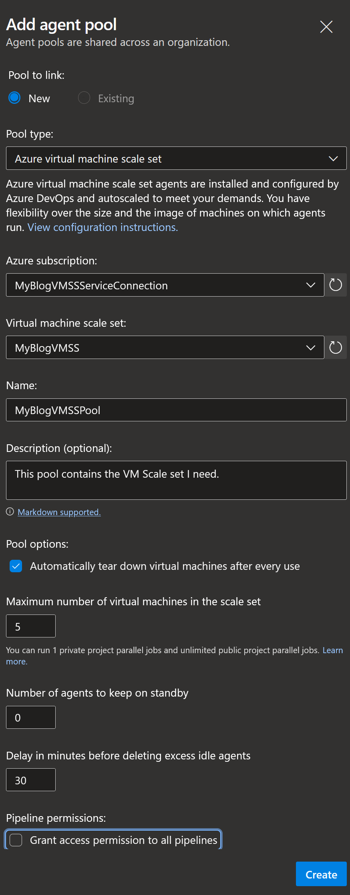

# Back from the... living?

An odd week ago I landed back in Sweden after [PSConf EU](https://psconf.eu/), and let me tell you, I've officially had the best time ever.

Although it was a bit weird seeing that many people after two years in a couch, the conference was nothing short of amazing. Sessions we're fantastic, arrangement was great, the crowd had no problem following the rules set up (at least not that I noticed).. all in all 10/10, awesome arrangement by the crew.

And I held my sessions! It was super scary, but felt amazing, and I got so many good comments afterwards. Will absolutely do it again, both at PSConf and other places I can find :)

But thats not why I'm here today.


## Before Vienna

I had some seriously fun tasks that I wanted to blog about, but I needed to focus on getting my presentations in place.

That means I now have a number of intersting topics going for this summer/fall instead!

One thing I realized both from the presentations I've done and the work I'm doing is how underused and unknown the concept of using VMSS for deploys are.

This is something I use more or less all the time in my pipelines as it increases security for internal jobs massively.

It is also kind of a prerequisite for many of the other blogposts on my schedule, so today, we're going to look at how to set up a virtual machine scale set for usage with Azure DevOps

## Now I admit

[This guide over at Docs](https://docs.microsoft.com/azure/devops/pipelines/agents/scale-set-agents?view=azure-devops&wt.mc_id=DT-MVP-5005317) is actually fantastic and covers it all, but aditional views is never wrong, so here we go.

## Creating a VM scale set in Azure

Creating the scale set is actually rather straight forward if you have ever created an azure resource before.

Logically enough, we start by logging in to [the azure portal](https://portal.azure.com), click create a new resource, and select "Virtual machine scale set"


Most of the settings here we can leave as is (unless we have some company specific requirements of course), but there are a couple we need to make sure they are correct.

Under the "Scaling" tab, we need to make sure the scaling policy is set to "Manual".


Mext stop is the "Management" tab where we also need to verify the "Upgrade mode" setting under "Upgrade policy". This setting also needs to be set to "Manual"


This is required to allow Azure DevOps to force the up and down scaling of new machines.

While still in the "Management" tab, make sure to check the "System assigned managed identity" checkbox as well. This is something we will use for many future blogposts, so we might as well make sure it's created right away.


And thats it really.

Now yes, you should probably consider how you login to your machines, which images you need (more on image building in a future post), and so on and so forth, but this is what we need to get started.

Most certainly you should also do this as code, and that is yet one more future blog post in the making ("Creating VMSS using Bicep" maybe? I want to do more bicep!)

For now, lets just review and create, and we should end up with something like this


(the SSH key only of if you use SSH login to linux of course. More on this in the final chapter)

## Connecting the scale set to your Azure DevOps environment

### The service connection

Once our resources are in place we need to connect to them. The first thing needed here is a service connection that Azure DevOps will use to scale up and down machines upon request. We create this by going to the project that needs to access the scale set, go in to "Project settings", and under "Pipelines" we go to the "Service connections" menu and click the "Create service connection" button.


There are a number of different service connections to choose from, but we're going to use the "Azure Resource Manager" one


Our service connection needs an identity to use when talking to the ARM api. If you have full access to your Azure AD you can have Azure DevOps create this identity for you, but if not you will have to manually create and specify the account settings later. Since I own everything I'm going with the "Automatic" selection.


And finally we end up in the important window. The one where we create our service connection.


A couple of things worth noting here

- Subscriptions and resource groups will be listed if you have access to them. If you selected "Manual" in the "Service principal" window it will look a bit different.
- You should scope this service connection as small as possible. Since we only use it to control our VMSS we only need access to the "VMSSBlogPost" resource group. If other things need access to other resources, create more service connections.
- The "Grant access permissions to all pipelines" checkbox is default checked. It shouldn't be. only the pipelines using your scale set should have access to it. (This is actually a general problem in Azure DevOps. never check this box. Ever. I'm watching you)

Once this is done, click "Save" and on to the next chapter...

### Agent pools

After we made sure we can talk to our resources we of course need to make sure our pipelines can as well.

We need to set up an Agent Pool.

Again we start by going to the project that needs the pool, go to "Project settings", but under "Pipelines" this time we select "Agent pools".

By default you will always have two pools already set up

- Azure Pipelines. This is your connected Azure hosted build pool.
- Default. This can be used to register your self hosted agents.


We will create a new one for our scale set agents by clicking the "Add pool" button.

There are a number of settings here to note, so lets go through them one by one.

- Pool type. Virtual machine scale set. because.. well.. yeah.
- Azure Subscription. Select your newly created service connection. You can select your azure subscription here as well, but that would create new authorizations and this is not what we want.
- Virtual machine scale set. Pick the scale set we just created in Azure.
- Automatically tear down.. This option is not checked by default, and not checking it could lead to information leakage between builds. You generally want to tear down your machine after a use.
- Maximum number of virtual machines. This setting tells azure DevOps how many machines to run simultaneously. If you would run, in my case, 6 simultaneous build jobs then one would be put on queue instead of imediately started.
- Number of agents to keep on standby. Having machines idle would increase your startup time for your first build. It takes about 2 minutes to start your first machines up. The downside is price. Paying for idle machines is not that cost effective.
- Delay in minutes before... Every time Azure DevOps needs a machine it will start two, so the first morning run will fire up 2 machines, the next build will fire up another, and so on. this setting tells Azure DevOps when to remove any unused machines. Combine this with the number to keep on standby to create a setup that works for you.
- Grant access permissions to all pipelines. No. 



Once you set this up, just click create. (You didn't check the "grant all access button did you? I'm watching you.)


## Using it in a pipeline

Awesome! We have everything set up. So how do we go about using it?`

If you have used YAML pipelines before you probably already know, but for the sake of demo, lets create a pipeline and run it.

If we create a starter pipeline, the only thing we _need_ to change is the pool setting, and point it to our new pool instead.

```YAML
# Starter pipeline

trigger:
- main

pool: MyBlogVMSSPool

steps:
- script: echo Hello, world!
  displayName: 'Run a one-line script'

- script: |
    echo Add other tasks to build, test, and deploy your project.
    echo See https://aka.ms/yaml
  displayName: 'Run a multi-line script'

```

There are, however, a couple of more steps to it.

Since we didn't check the "Grant all pipelines..." checkboxes we will see this message the first time we try to run our pipeline


And if we click view we see this


Just click "Permit" here and the pipeline should move on.

Once we have granted the access we will now be greated with a pipeline log starting with the line

```Text
The agent request is not running because all potential agents are running other requests. Current position in queue: 1
No agents in pool MyBlogVMSSPool are currently able to service this request.
```

This is because no machines are started in our scale set yet. Like previously stated, the first machines started takes a couple of minutes to fire up, but if we go back to our Azure portal and check our scale set we can see this


And if we wait about two more minutes our Azure DevOps pipeline instead looks like this


Wohoo! We can now run our jobs on a scale set agent!

## But why though?

So why go through all this hassle to do something we already could do on an Azure hosted machine?

Lets go through some pros and cons of having this available.

I do a lot of deploys to Azure. Infra as code using Bicep (ARM), or deploying software to internal resources like Azure functions.

Using Azure DevOps hosted machines requires me to set up some rather intricate access rules, firewall openings, and account management to do this.

Using my VMSS I can instead use the afore mentioned System Assigned Managed Identity. This allows me to access resources without any public IP access required, and without having to manage acounts. I will demo this in one of my forthcoming blog posts about deploying to NFS shares.

Using a VMSS instead of a self hosted machine also takes care of problems such as scaling and information leakage. I can scope my VMSS to my project, and only grant access to the pipelines needing it, and it will only be available where it should be.

And by scoping it like this we can also make sure _all deploys and access to our resources go through our pipelines._

- Need access to the assigned keyvault? Request access to the pipeline / GIT repo and use Managed identity.
- Need to deploy to your new subscription? Request access to the pipeline / GIT repo and use Managed identity.
- Need to read the contents of a blob? Guess what. Request access to the pipeline / GIT repo and use Managed identity.

Now of course, there are more considerations than what we looked at here as well.

There are settings for saving machines if build fails so you can log in to them and see what happened. In our example we use SSH and a key to log in, and this might not be the best for you, but it is pretty straight forward if you use Linux machines. After all, this post is about scale sets, not AAD/Kerberos/Auth. If you do this, remember to store the downloaded key though. Without it you wont be able to log in. (Note: I have _very_ rarely needed to, but famius last words and all that.)

You may also want to consider the price of machines. VMSS is just a number of exact copied VMs, and they cost like the same size VM costs in Azure. If you set the "keep on standby" setting high, you will pay for it quite literally.

You should of course, like I previously said, do all of this as code if you're running a setup bigger than one project, but thats a different blog post for you.

## In the end

This post is kind of a side track. I will need it for some of my other upcomming posts, and hopefully you will see more and more why I end up doing this all the time, and why the sessions I did at PSConf both mentioned the usage of VMSS for your pipelines.

I will of course post the links to youtube for my sessions as soon as they are released, but for now, I think I will focus on vacation, crack open a beer in my garden, and wait until friday before I do anything else.


