# Setting up Azure VM Scale Set for your pipelines pt. 2 - Flexing your Biceps

I have a confession to make. I talk a lot. I have opinions on many things. I don't know for sure, but I think people generally believe I know more than I actually do, and it's not imposter syndrome, I just get the impression they do.

One example being Bicep. (Not the muscles, [the programming language](https://github.com/Azure/bicep))

I have talked to many people about Bicep. Its simplicity compared to ARM. Its amazing VSCode plugin.

I have been involved in the [GitHub Bicep module](https://github.com/PSBicep/PSBicep)

I regularly attend the [Bicep community calls](https://github.com/Azure/bicep/issues?q=is%3Aopen+%22Bicep+community+call%22)

Yet I have _extremely_ little experience in writing it for real.

Time to make a change.

## A couple of posts ago

I wrote about how to [set up a VMSS to run your pipelines](posts/AzdoVMSS.md). Fine and dandy, but we can't be running large scale operations using clicks right? Let go explore and try to set up everything again, but this time using code!

Before we can get going there are a few things we need to set up to be able to write and run Bicep code.
Like always, [there's a guide on docs for it](https://docs.microsoft.com/en-us/azure/azure-resource-manager/bicep/install), but like always I will go through how I did it as well.

## Bicep tooling

The first thing we need is of course the Bicep CLI. There are a number of different ways to install and run this depending on how and what your preferred way of working is.

- [Download](https://github.com/Azure/bicep/releases/latest/) and install directly from latest over at GitHub. Bicep is released as a self containing executable, and you can run it from the CLI. Remember to add it to your path though.
- (do not?) Install it using [Azure PowerShell](https://docs.microsoft.com/en-us/powershell/azure/). If you are using Azure PowerShell to deploy Bicep files it will run whatever Bicep is installed to your CLI. Basically, this will wrap the `bicep.exe <command>` in some PowerShell magic.
- Install it with the [az cli](https://docs.microsoft.com/en-us/cli/azure/). This is kind of the odd one out here. If you run `az Bicep install` (or `az Bicep upgrade`) to get the latest and greatest, az cli will install a self contained version of the Bicep executable. This one will _not_ be available to the other CLIs or command line to run.

The downside here is of course that **if you run multiple tools and use them all to deploy Bicep code, you may have different versions of the tooling depending on where and how you run it, and hence you might get different results from different tools**

Since I run PowerShell and az cli on my computer I simply have to update and maintain two different Bicep installs on my computer.

After the CLI is installed, we also need to install the VSCode tooling. Fortunately this is a bit easier to do. Search for `bicep` in the extension manager, or go to [marketplace](https://marketplace.visualstudio.com/items?itemName=ms-azuretools.vscode-bicep) and click install. That's it.

We're ready to dive in to code.

## But where do we start?

If we look at the result of the previous post we can see that we ended up with four resources in Azure:

- Our VMSS
- One vnet
- One nic
- One SSH key

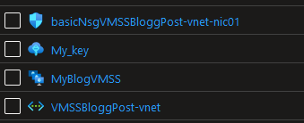

One way to see what these resources _really_ looks like is to look in the json view in the Azure portal that can be found on any resource you have in you portal.

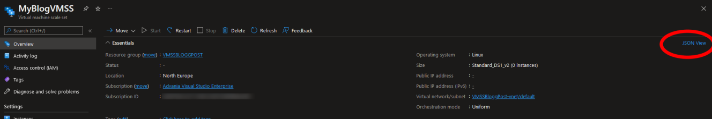

Once in there we get, well.. a json view over how this resource looks and what it does! (My example here is cut for brevity.. you get the point)

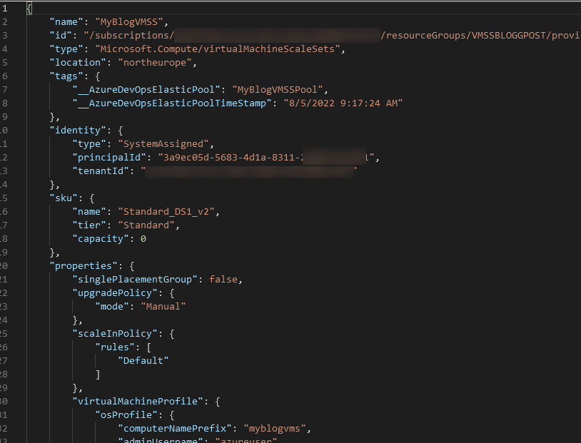

What we first want to note here is the line **type**.

This is the actual resource type in azure that we are going to create. You can learn a whole lot more about these types [here for example](https://docs.microsoft.com/en-us/azure/azure-resource-manager/management/resource-providers-and-types), but that topic is waaay to big for me right now.

another thing worth noting is that the type key is not always available. Some resources, for example Resource groups, doesn't have them.

Anyhow, we now know what resource to start with.

## Lets go in to VSCode

When the Bicep plugin is installed we get a whole lot of help from it. Remember the type we just found? The _type_ of the _resource_?

Lets start by using those two things!

Already by typing `resource` the plugin starts helping us.

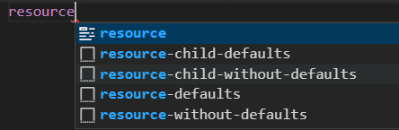

For now, lets not use this though, and just settle with the `resource` keyword (remember, we're going to define a resource..)

All resources in Bicep follow the exact same baseline.

```Bicep
resource <resourceName> <resourceType>@<apiversion> = {
    //insert code here soon
}
```

(There are a few more keywords, yes. Let's not go to fast 😉)

Now remember again the type we just found? Lets complete the line with a name and our resource, and see what the plugin helps us with this time.

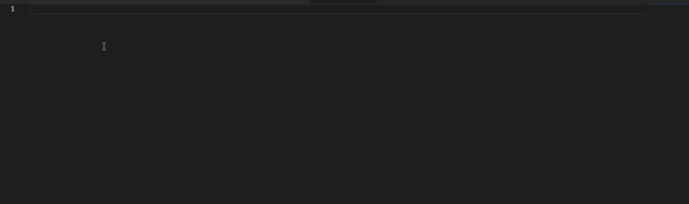

There are a few things worth noting here:

- The name is only internal for this Bicep file. We will use this later, but for now it doesn't really matter what you put here.
- As soon as I start to type the **resourceType** (VirtualMachineScaleSets) it searches through all existing types. This is what actually exists in Azure. All of them. (My point is even if you don't know the resource type you can use this to search and explore!)
- As soon as you pick the resource type, it will automatically give you all the available API versions for this particular type. (Pick the newest unless you need something specific)
- Last but not least, again the autocompleter comes alive! we select `=` followed by `required-properties` and it will automatically generate everything we need to fill in!

After this code block is generated we can simply fill in the values of the parameters we need and eventually we end up with this code block

```Bicep
resource myVmss 'Microsoft.Compute/virtualMachineScaleSets@2022-03-01' = {
  name: 'myVmss' //This is the name the scale set will have
  location: 'Sweden central'
}
```

And that's it! You may now deplonaaaaah it's almost that easy, but not quite.

## The devil's in the details

So we have found the resource type, and we have found how to create a Bicep resource, but there are probably a _lot_ of things you want to set that isn't `name` and `location`. Remember, in the original article we set the scaling policy, the network, and the managed identity amongst others... And also, the original post created four resources (think of the keyword _resources_ here).

Again the Bicep plugin can help us with quite a lot here. Start by making a new line, and click **CTRL + SPACE** and you will be greeted with something like this

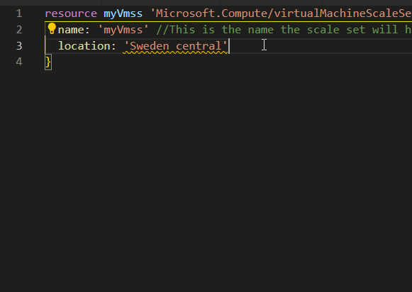

- First of all it tells us _exactly_ what properties can be set on this resource. (Everything with a wrench is a property of some kind)
- Once we pick our property we again click **CTRL + SPACE** and it tells us what values are accepted (with a square icon, in this case a hashtable denoted by `{}`)

Unfortunately it cant help us with what we actually want to put as a value. (well in some cases it can, but only some cases..)

Wouldn't it be great to read the documentation? Well guess what...

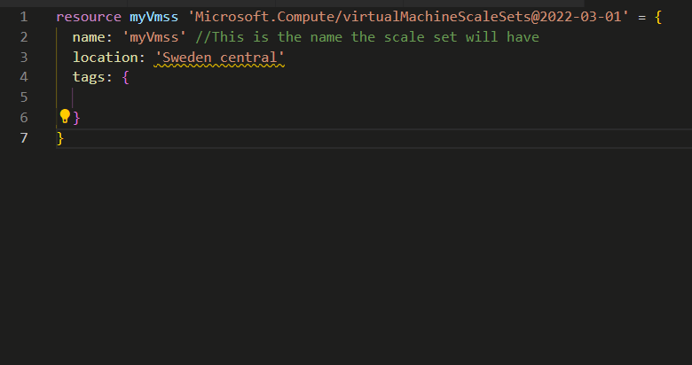

Once you have defined a resource, If you hover over the `name` part and click the `View type documentation` text you're there! Just go read!

The last piece of the puzzle here is what we already have done. If we again go up to the image with the json from the original deploy we can see, amongst others, a `sku` key.

And if we look at the above drop down (new line -> **CTRL + SPACE**) we see, amongst others, a `sku` property.

Connecting the helpfulness of the plugin, reading the API docs, and seeing what we actually have created before, we can now pretty much recreate our entire deployment in bicep.

Do we want to though? well, no.

We selected the `required-properties` before, and only got `name` and `location`, yet our json contains so much more. A lot of magic happens in the portal, and a lot of the values in our json is actually just defaults. for ease of reading we should probably only set the stuff we care about and need to change.

### Properties. One value to rule them all

Almost every single Azure resource has a `properties` property. This is where most of the resource specific settings hide.

Just like before, we can simply click **CTRL + SPACE**, select `properties`, click **CTRL + SPACE**, select hashtable, click **CTRL + SPACE** and voila! We get a list of settings!

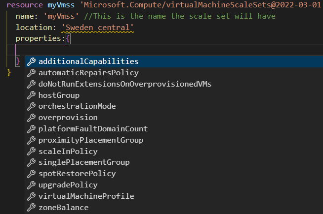

We can now continue reading docs, see what we want, and set stuff until we have something like this

```Bicep
resource vmss 'Microsoft.Compute/virtualMachineScaleSets@2022-03-01' = {
  name: name
  location: location
  sku: {
    capacity: 0
    name: 'Standard_DS1_v2'
    tier: 'standard'
  }
  identity: {
    type: 'SystemAssigned'
  }
  properties: {
    upgradePolicy: {
      mode: 'Manual'
    }
    platformFaultDomainCount: 1
    scaleInPolicy: {
      forceDeletion: true
      rules: [
        'Default'
      ]
    }
    // Cut for brevity here.. on to the next chapter!
  }
}
```

## Linters, parameters, and other keywords

Before we move on to more resources, we're going to do some cleanup.

### Linter

Did you notice that yellow twiggly under `Sweden central` above? That's the Bicep linter in action! It tells us there is a warning here. If we hover on it, it will not only tell us what the problem is, but if possible also help us fix it.

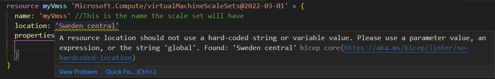

In this case, if we click `Quick fix` followed by `Create new parameter...` it will automagically transform our static value to a parameter, complete with a description!

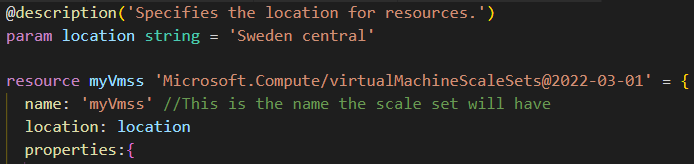

### Parameters you say? Can we make this reusable? Absolutely

Unfortunately this is one place where we have to do some manual work. The linter only helps us convert certain predefined properties of the resource, so for example the `name` we have to convert ourselves. Since we now can see how a parameter works that's no biggie though! Lets repeat it and add more parameters.

The standard for a parameter follows pretty much the same pattern as the resource, albeit with new keywords

```Bicep
param <parameterName> <parameterType> = 'default value'
```

The value will look different depending on the parameter type, for example we can cast the parameter type as array by doing like this

```Bicep
param addressPrefixes array = [
  '10.1.0.0/16'
]
```

but guess what? the autocompleter helps us with how the types works as well.

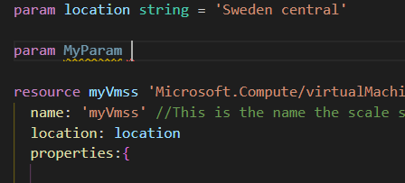

Before we leave this chapter we're going to look at one more keyword we will need:

### output

By default any ARM deployment will output some values and some result. What values may differ between resources.

But sometimes it doesn't give you what you will actually need. Enter the output keyword. (guess what? It's all the same again..)

```Bicep
output <outputName> <parameterType> = <outputValue>
```

We will come back to this after we start building more resources.. For now, let's settle with "the output keyword exists and is needed".

All together we now have something like this

```Bicep
@description('The name of the VMSS.')
param name string

@description('The location for resources.')
param location string = resourceGroup().location

resource vmss 'Microsoft.Compute/virtualMachineScaleSets@2022-03-01' = {
  name: name
  location: location
  sku: {
    capacity: 0
    name: 'Standard_DS1_v2'
    tier: 'standard'
  }
  identity: {
    type: 'SystemAssigned'
  }
  properties: {
    upgradePolicy: {
      mode: 'Manual'
    }
    platformFaultDomainCount: 1
    scaleInPolicy: {
      forceDeletion: true
      rules: [
        'Default'
      ]
    }
    
  }
}

output managedIdentity string = vmss.identity.principalId
```

### But wait Bjompen! There are two things here you haven't mentioned

Yes there are! First of, lets look at the `location` parameter.

> Didn't that just say 'Sweden central'?

You are correct! Oddly enough though not all people live in Sweden.

There are functions we can use to do some magic in Bicep. One of those being the `resourceGroup()` function. This function simply returns the resource group we are currently targeting with this folder. Adding the `.location` to it returns the value of the location property of the resource group.

The result being if the resource group where I am deploying my VMSS is located 'Sweden central', my VMSS will be in 'Sweden central'. If the resource group is located in 'West europe', my VMSS will be in 'West europe'.

This is also just a default value, so it is overrideable. We'll look at that in the deploy chapter.

> But what is this dot thing about? You're using it both in the `resourceGroup().location` and `vmss.identity.principalId`

Again, you are correct. Very observant of you!

Although we return text to our console, what we actually work with in Bicep are objects. An object contains properties, and these properties are "found" by using a dot and the path to the property we want. Notice the output value: `vmss.identity.principalId`

vmss is the name of the resource we are creating. Like I said before, this is only the internal name we use to cross reference our resources. Our `vmss` resource has a property called `identity`, as seen in the Bicep file. The created managed identity that this flag creates has a property called `principalId` which is the one we will need soon, hence we output the value of the path `vmss.identity.principalId`.

(This works very much like it does in PowerShell or C# amongst others.)

So how do we know about these properties that the resource creates? Take a wild guess!

**CTRL + SPACE** or just type a dot after the name and the plugin will work its magic!

## Back to resources

So we can now gather all this knowledge and create our VMSS in a reusable and amazing way? Almost.

Remember I said we created _four_ resources in the previous setup. Well, we need to do that here as well, and to top it of, they need to be created in the correct order to be able to be set up.

Lets look at another part of my resulting Bicep file: The network setup.

```Bicep
networkProfile: {
    networkInterfaceConfigurations:[
        {
        name: '${name}-nic01'
        properties: {
            primary: true
            enableAcceleratedNetworking: true 
            ipConfigurations: [
            {
                name: '${name}ipconfig'
                properties: {
                    primary: true
                    subnet: {
                        id: subnetId
                    }
                }
            }
            ]
        }
        }
    ]
}
```

We need to connect our VMSS to a subnet, and to do that we need a subnet id, and to have that we need to create a subnet..

In Bicep there are two ways to connect multiple resources like this: Running them in the same Bicep file, or making sure the Bicep deploy outputs any value you need to bring to the next deploy step. Which one you choose is mostly dependent on the scenario.

No matter, we need to create a subnet, and a subnet needs a vnet, and it should probably also need a NSG for some basic protection.

Using the skills above, reading the docs, and looking at the resource I created, I ended up with this:

```Bicep
@description('The name of the vnet.')
param name string

@description('The location for resources.')
param location string = resourceGroup().location

param addressPrefixes array = [
  '10.1.0.0/16'
]

param subnetAddressPrefix string = '10.1.0.0/24'

resource vnet 'Microsoft.Network/virtualNetworks@2022-01-01' = {
  name: name
  location: location
  properties: {
    addressSpace: {
      addressPrefixes: addressPrefixes
    }
    subnets: [
      {
        name: '${name}-subnet'
        properties: {
          addressPrefix: subnetAddressPrefix
          networkSecurityGroup: {
            id: nsg.id
          }
        }
      }
    ]
  }
}

resource nsg 'Microsoft.Network/networkSecurityGroups@2022-01-01' = {
  name: '${name}-nsg'
  location: location
}

output subnetId string = vnet.properties.subnets[0].id
```

You see in this file we created not one but two resources. Most of the details on the resource contents we have already gone through, but I want to mention the line `id: nsg.id`

This line tells the Bicep compiler that "you will need to create the resource named nsg to provide me with the id property in this field."

The resulting ARM template will now have this dependency in place, and even though the template order is

1. virtualNetworks
1. networkSecurityGroups

It will actually create the resources the opposite way. Magic dependency managing is magic!

We also introduce another concept here: String interpolation.
Instead of giving the NSG one name, and the subnet another, I want them to share name with different postfixes.

We can do this by calling the variable, `${name}` inside a string, `''`, like this  `'${name}-nsg'`

## Building the Bicep structure

So now we only have to create a Bicep file with all our resources, right?


Some of our resources have a natural connection together and will always be deployed together, such as the NSG and the network, But what if we already have a network in place and _only_ want to deploy our VMSS?

We need a strategy and structure for our Bicep resources.

I opted to create two files, vnet.bicep and vmss.bicep. I can deploy the network if needed, and if not I only need to get the subnet ID of the subnet I want to connect to, and I can get those using either az cli or Azure PowerShell.

## Deployment time

So we have created our Bicep files and it's  finally time to deploy!
Like I said in the setup part, how you do this is up to you. I am a PowerShell user, and as such will use Azure PowerShell.

Deploying a Bicep file is done using one of the `Deployment` CmdLets from the `Az.Resources` module

```PowerShell
get-command -Verb New -Noun "*deploy*" -Module Az.Resources

CommandType     Name                                               Version    Source
-----------     ----                                               -------    ------
Alias           New-AzSubscriptionDeployment                       6.0.0      Az.Resources
Cmdlet          New-AzDeployment                                   6.0.0      Az.Resources
Cmdlet          New-AzManagementGroupDeployment                    6.0.0      Az.Resources
Cmdlet          New-AzResourceGroupDeployment                      6.0.0      Az.Resources
Cmdlet          New-AzTenantDeployment                             6.0.0      Az.Resources
```

Depending on the scope of your Bicep deployment you pick the one that suits you. In our case we will be using the `New-AzResourceGroupDeployment` CmdLet.

You should of course go read the help documentation for every command you run (`Get-Help New-AzResourceGroupDeployment -Online`) but since this is not a post on Get-Help, I'm going to go right to what we need to do:

```PowerShell
$vnet = New-AzResourceGroupDeployment -ResourceGroupName 'MyResourceGroup' -TemplateFile .\vnet.bicep -TemplateParameterObject @{
    name = 'MyVnet'
} -Verbose
```

- Since we are targeting a resource group we need to say _which_ resource group we are targeting using the -ResourceGroupName parameter
- We give the CmdLet our Bicep file
- And any parameter we need to give to the Bicep file we throw in to a hashtable and use the -TemplateParameterObject parameter.

(Yes, yes, there are more ways, but I can't go through all the details.. read the help docs damnit!)

Since we defined our vnet.bicep to output the subnetId we can then use that id as a parameter to our VMSS deploy

```PowerShell
$vmss = New-AzResourceGroupDeployment -ResourceGroupName 'MyResourceGroup'  -TemplateFile .\vmss.bicep -TemplateParameterObject @{
    name = 'MyVmssName'
    sshPubKey = 'MyPublicSSHKey'
    subnetId = $vnet.Outputs['subnetId'].Value
} -Verbose
```

Neat, Innit! Some minor cleanup and we are done deploying our resources using Bicep! Woop!

> Hey, you said we had four resources, yet you only created three, and one of them aint even one of the resources we need!

Again, observant of you. The nic created in the original post is actually a subresource created using the vmss.bicep file. We don't need to create it specifically _unless we want to_ as it is implicitly created and connected to our subnet.

And the SSH resource? Well instead of downloading and recreating a million different public keys I'm just using the one I already have on my computer

```PowerShell
$sshPubKey = Get-Content C:\Users\bjompen\.ssh\id_rsa.pub
```

## Connecting it all do Azure DevOps

So we can create the resources as code, we should not have to fall back on connecting it using a GUI i think.

Fortunately [there's a module for that](https://github.com/AZDOPS/AZDOPS) 😉

Let's start by installing the ADOPS module and connect to our environment

```PowerShell
Find-Module ADOPS | Install-Module

Connect-ADOPS -Username 'MyAzdoUser' -Organization 'MyAzdoOrganization' -PersonalAccessToken $PAT
```

### Creating the service connection

When we set it up in Azure DevOps the first thing we needed was a service connection. A service connection is actually two things:

- An identity in Azure AD with access to the resource(s) you want
- A service connection in Azure DevOps that uses this identity.

In my previous post I created this identity magically, but we're going to do Bicep today.

The first thing we need to do this manually is the identity...

...And those can't be created using Bicep yet 🤦

Instead lets run the PowerShell command `New-AzADServicePrincipal` to create it. This command created a registered app and a related enterprise app in Azure AD that we then can use to connect our Azure DevOps organization. This identity, The enterprise app, can then be granted the "contributor" role on our resource group.

```Bicep
param principalId string

resource Contributor 'Microsoft.Authorization/roleDefinitions@2018-01-01-preview' existing = {
  scope: subscription()
  name: 'b24988ac-6180-42a0-ab88-20f7382dd24c'
}

resource roleAssignment 'Microsoft.Authorization/roleAssignments@2020-10-01-preview' = {
  name: guid(subscription().id, principalId)
  properties: {
    roleDefinitionId: Contributor.id
    principalId: principalId
    principalType: 'ServicePrincipal'
  }
}
```

The first recourse actually fetches the build in contributor role which ID we then use to grant our service principal the access needed. We introduce yet one more function here, the `guid()` function, and also we use the keyword `existing` _before_ our `=` when declaring our resource in order to fetch a resource instead of creating it.

Once we have set up our service principal we can use the `New-ADOPSServiceConnection` from the ADOPS module to create our service connection.

```PowerShell
$ServiceConenctionSplat = @{
    TenantId = $Context.Tenant.Id 
    SubscriptionId = $Context.Subscription.Id 
    SubscriptionName = $Context.Subscription.Name 
    Project = $AzDOProjectName
    ConnectionName = 'MyBicepConnection'
    ServicePrincipal = $AzureServicePrincipal
}
$ADOPSServiceConnection = New-ADOPSServiceConnection @ServiceConenctionSplat
```

### Connecting the VMSS

The final step of this weeks adventure is of course to connect the VMSS.

Again we can use the ADOPS module, and the `ElasticPool` commands

```PowerShell
$AzureDevOpsProject = Get-ADOPSProject -Project $AzDOProjectName
$AzureVMSS = Get-AzVmss -VMScaleSetName $VMSSName

$ElasticPoolObject = New-ADOPSElasticPoolObject -ServiceEndpointId $ADOPSServiceConnection.id -ServiceEndpointScope $AzureDevOpsProject.Id -AzureId $AzureVMSS.id -MaxCapacity 5 -RecycleAfterEachUse $true

$ElasticPool = New-ADOPSElasticPool -ElasticPoolObject $ElasticPoolObject -PoolName 'MyBicepCreatedElasticPool' -ProjectId $AzureDevOpsProject.id
```

## [The madness and the damage done](https://www.youtube.com/watch?v=Qslyq8CcXu0)

[All the code that this blog post resulted in can be found at my github page](https://github.com/bjompen/AZDOVMSSDeploy)

There are still a couple of things I want to add before I drop out and make this Friday a Friday. These are some of the questions I had during the research for this post.

- How come you set up the subnet as part of the vnet instead of as its own resource?
  - A Bicep deploy _only changes what needs to be changed_. If something is already in a correct state nothing will happen. If I create subnet resource and then connect that one to my vnet, a redeploy may in some cases end up deploying the vnet _without any subnets_, then check and see the subnet exists, and reconnect it. See [this article on docs](https://docs.microsoft.com/en-us/azure/azure-resource-manager/bicep/scenarios-virtual-networks#configure-subnets-by-using-the-subnets-property)
- In my vmss.bicep file I kept a large commented out section on `extensionProfile`.
  - This is the magic that happens when you connect a VMSS to Azure DevOps! The ElasticPool connection actually edits the json deploy in Azure and adds this block to it. It it not needed for deploy, but I found it interesting to keep there, and you _can_ have it there if you want to. (I tried)
- My run.ps1 is ugly and should be refactored. I know. But it works. I used it for research.

All in all I am satisfied with this journey. I will absolutely do more Bicep in the future.

And **The biggest of thank yous** to my awesome colleagues [Stefan Iwemo](https://twitter.com/StefanIvemo) and [Simon Wåhlin](https://twitter.com/SimonWahlin) who answered so many of my questions, and code reviewed my bicep code for this post!! I owe you.

For now, I wish you all a happy weekend. We'll see what I end up messing with next time.

//Bjompen
