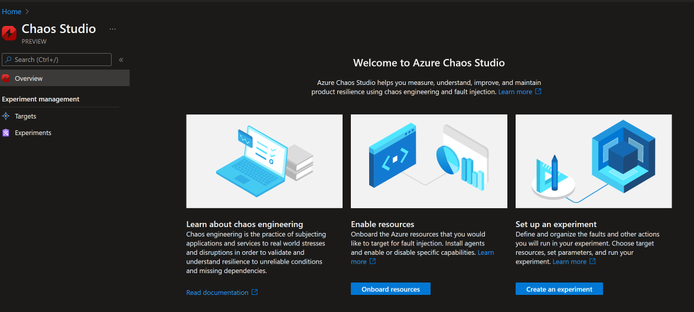
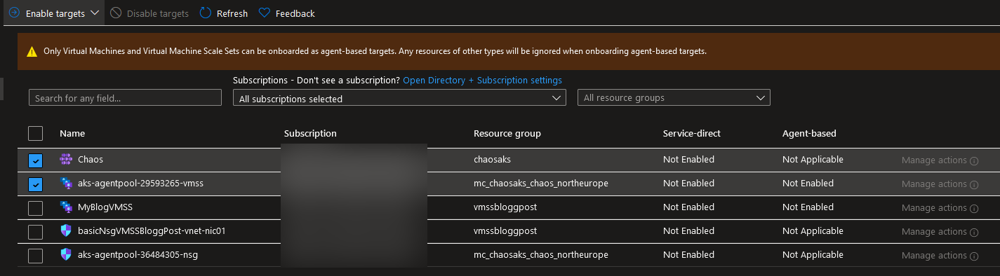
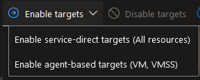
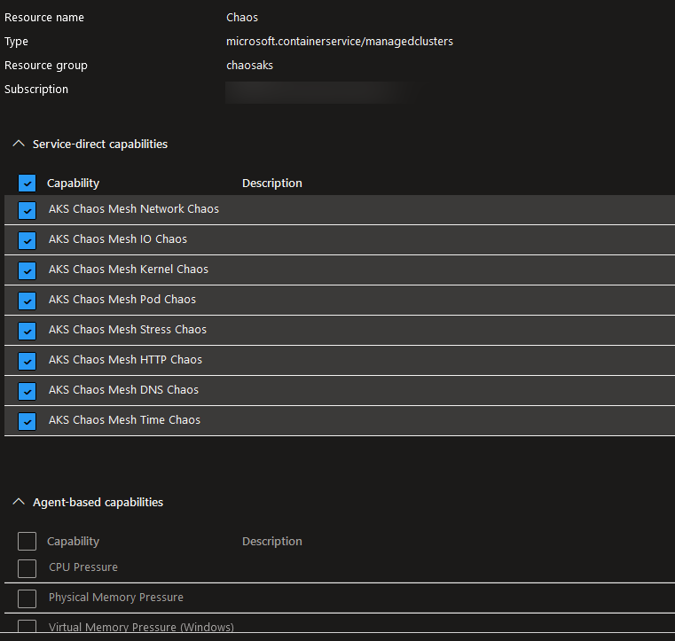
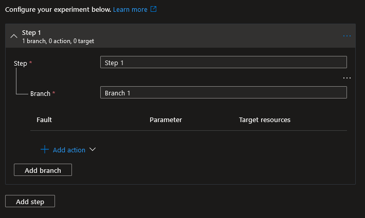
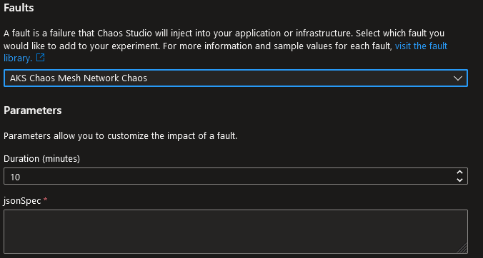
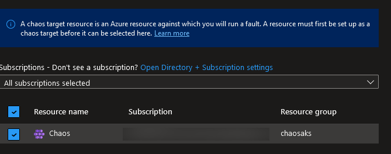
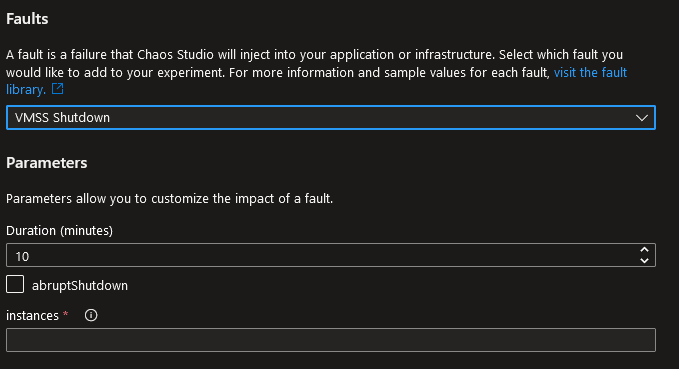
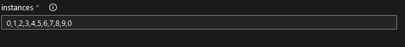
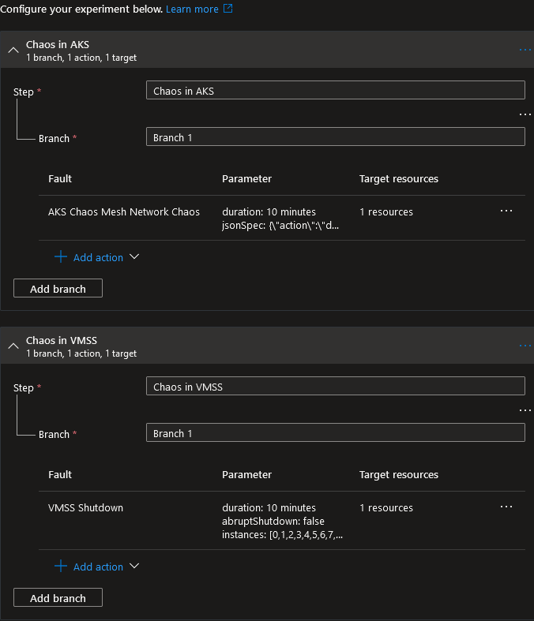

# Azure Chaos Studio

## Last week i was tired

Not the "I'm sleepy" tired, but the "I can't really muster the energy to write or create" tired.

Honestly I still am, but to not completely fall out of it, I'm going to do a short write up at least. Hopefully something longer and better will show up as soon as my energy is back.

## I've been interested in chaos engineering for quite some time now

It's a scarry yet super fun way of building stuff,
The most famous example probably being the [Netflix Chaos Monkey](https://netflix.github.io/chaosmonkey/).

Now I confess I have never tried that one either, but I always loved the concept.

Basically you inject faults into your environment on random, causing unknown and unplanned failures on purpose. This way you can find problems you didn't really plan for or knew existed. For example:

> If I have a job running on a distributed service, and one machine somewhere inside this cluster of distributed processing power disapears, what would happen?

Now I could of course just go and shut down a machine from my cluster, but that would mean I already know `machine x will die now`, and therefore I will already have built a solution to `What if machine x dies?`

Enter chaos engineering.

## Lets put the "Un" back in "Unknown errors"

So what I _imagine_ chaos engineering is about would be something like this

> I have a job running on a distributed service. This service consists of a kubernetes cluster, running pods on VMSS machines, connected to public network 10.0.0.0/24, using Azure api manager as a frontend.

Add the possibilities of error:

> - A kubernetes cluster has the possibility to
>   - kill pods
>   - Remove nodes
> - A VMSS has the possibility to
>   - Shut down a machine
> - A network has the possibility to
>   - Drop packets / connection
>   - Have bad DNS settings

(Other stuff as well of course, I'm still on examples here 😉)

And so, the chaos engineering part

> 1. Get random possibility
> 1. Get random host with possibility
> 1. Inject error

## So imagine my interest

When Microsoft released [Azure Chaos studio](https://docs.microsoft.com/azure/chaos-studio/chaos-studio-overview?wt.mc_id=DT-MVP-5005317)!

A chaos monkey for my Azure stuff! This is going to be so much fun!

Boy, was I wrong.

## A lot of studio

So lets fire up the Azure Chaos Studio GUI. I must say, it is by far one of the cleanest Azure resource blades I have seen. We have but three things on it:

- A start page with some links
- Targets
- Experiments



So the first thing we need to do is onboard one or more targets. We do this by, you guessed it, clicking `Targets`

An important thing to notice here is that Azure Chaos is still not available everywhere. For example, Sweden Central is missing.

As of today, 2022-09-01, the current regions are supported

> - centraluseuap
> - eastus2euap
> - westcentralus
> - eastus
> - centralus
> - westus3
> - uksouth
> - westus
> - northeurope
> - westeurope
> - japaneast
> - northcentralus
> - eastus2

And these resources

> - microsoft.compute/virtualmachines
> - microsoft.compute/virtualmachinescalesets
> - microsoft.network/networksecuritygroups
> - microsoft.documentdb/databaseaccounts
> - microsoft.containerservice/managedclusters
> - microsoft.cache/redis
> - microsoft.classiccompute/domainnames
> - microsoft.keyvault/vaults

## A bit of Azure

So, After recreating my entire lab environment of Kubernetes hosts in West Europe instead of Sweden, lets try to onboard a resource 😉



Appart from which resources we want to play with there are also two different "types" of targets:

- Service direct
  - These are errors with the service itself, such as network failures, machine shutdowns and so on
- Agent based
  - These are faults that require an installed agent on a resource to run, such as a windows service stopping, or a process killed.

Which types of faults you can run is (logically) dependent on what type of resource we pick.

So lets enable our scale set and our AKS cluster.



As we can see from both the above error message, and the dropdown, we will need to run Enable twice - once for each type.

Enabling a service direct target is as easy as clicking it, but enabling agent based targets does require some extra work, as it needs a service principal it can use to logon to the installed client. You can either pick one directly, or you have to go create one before you enable the target.

You may also add a Application Insights account for more detailed data collection about your injected faults, but for now I'm just going to not do that.

### Once a resource is onboarded

If we go back to the `Targets` blade, we can now click `Manage actions` on our newly enabled target to see which capabilities this resource actually have, and also enable or disable specific capabilities. Like previously said, what you can do depends on both the resource types enabled, and the type of resource.

Unfortunately, this is where Azure Chaos already is starting to show it's weirdness.



Notice anything unexpected? There is no such thing as enabling agent based actions on an AKS resource, yet there are capabilities that requires it that I cant check. Makes sense..

Anyhow, we have our resources, lets create some chaos!

## But not nearly enough Chaos

Once we have our resources we can create what's called "experiments". Basically, this is the part where I think we should connect the what and the who described in the beginning.

Lets explore the `Experiments` blade.

We start by creating a new experiment. After filling in the basics (Resource group, name, location.. the standard Azure stuff) we get to the experiment designer.



An experiment consists of three parts:

1. One or more steps
    - These runs in series. After Step 1 is done, Step 2 is started
1. Containing one or more branches
    - These run in paralell. Having two branches allows you to have two problems at the same time.
1. Containing one or more Actions
    - This is the actual problems we looked at in the resources blade.

We're going to look at two specific actions today, one AKS and one VMSS.

### AKS Chaos Mesh network faults

When creating AKS faults we need to install [Chaos Mesh](https://chaos-mesh.org/) to our cluster or we will imediately be greeted with the following when we run our experiment

> Chaos Mesh could not be found on the specified cluster 'ClusterNane'. Please ensure that Chaos Mesh is installed in the expected 'namespace' namespace.

Fortunately, as always, [there is a great guide for this over at Docs](https://docs.microsoft.com/azure/chaos-studio/chaos-studio-tutorial-aks-portal?wt.mc_id=DT-MVP-5005317#set-up-chaos-mesh-on-your-aks-cluster)

Once installed we can sety up our experiments.



When adding an AKS action we need to supply a parameter called `jsonSpec`.
If you haven't worked specifically with chaos mesh before these can be really hard to find or figure out, and I'm not going to claim to understand them myself, but reading [the docs](https://docs.microsoft.com/azure/chaos-studio/chaos-studio-fault-library?wt.mc_id=DT-MVP-5005317#aks-chaos-mesh-network-faults) is as always a great start, and we can steal the example code from there.

```Text
{\"action\":\"delay\",\"mode\":\"one\",\"selector\":{\"namespaces\":[\"default\"],\"labelSelectors\":{\"app\":\"web-show\"}},\"delay\":{\"latency\":\"10ms\",\"correlation\":\"100\",\"jitter\":\"0ms\"}}
```

For details what the actual values mean there are some documentation over at [chaos mesh](https://chaos-mesh.org/docs/simulate-network-chaos-on-kubernetes/#net-emulation-example)

Once we have filled in these fields we can select our AKS resource and call this step done.



### VMSS Shutdown

Let's create a new step and select the `VMSS Shutdown` fault instead. interestingly enough the closes documentation on the [fault library page](https://docs.microsoft.com/azure/chaos-studio/chaos-studio-fault-library?wt.mc_id=DT-MVP-5005317#arm-virtual-machine-scale-set-instance-shutdown) is for ARM VMSS, which as far as I know wasnt even available when the documentation was last updated.. But as the parameters are the same that might not matter.



Again, we are greeted with unexpected parameters.. Instances.
From the docs we can see that this is a list of [instances in our scaleset](https://docs.microsoft.com/azure/virtual-machine-scale-sets/virtual-machine-scale-sets-instance-ids?wt.mc_id=DT-MVP-5005317).

The only possible data to put here is numbers and comma, sp lets just put a list in and hope our instances happens to be in there.



Lastly we select our scaleset in the `Target resources` tab and we're good to go.

In the end we have an experiment looking like this



Before we click run however we will need to do one more thing.

The identity we created in the onboarding resources step needs to be granted the necessary RBAC roles on the resources to run the experinments. This is nothing different from any other RBAC role in Azure, but the role needed is different depending on what you do, so it might be a bit of trial and error here.

## Lets wreck havoc

Once we have created the experiments and the roles, running an experiment is as easy as going back to the experiments list, selecting your experinment, and clicking `Start experiment(s)`.

The experiments will imediately start running and after not too long...

...it will fail.

If we go in to the experiment, and the `Overview` blade we can see the details of what went wrong.

## Conclusions

> Already? But Bjompen, we haven't even fixed all the problems yet!

Your right, but I'm not going to figure all of it out right now either, and here's why

-----

1. The VMSS fails with the following message

> The provided instanceId 1 is not an active Virtual Machine Scale Set VM instanceId.

What does this tell me? _I can not randomly shot down a machine in my cluster_
I have to manually specify which machines to shut down, and this has two problems:

- Instanceids are incremental. each new machine spawned just adds one. Want to test on the latest one? Edit your experiment. Want to do this on a fast moving ephemeral scale set? nope. you cant have an ID in the list that doesnt exist.

All in all, there simply is no chaos involved. If I already know im shutting down machine XYZ then I miught just go to it and press stop.

Before I finb this usefull, allow me to fully randomize it by saying for example

```Text
Number of machines: [int]
Simultaneous shutdown: [bool]
Instances: *
```

And then just kill my machines. I need to find problems I _didn't_ expect.

-----

2. My AKS experiment, set up according to examples from Docs, fails with the following error:

> Invalid property identifier character: \. Path '', line 1, position 1.

I'm going to guess this is a problem in the json provided to the `jsonSpec` parameter, but it's going to take me _a long time_ to find this since neither docs (who just have this string without explanation) nor chaos-mesh (who seems to only be using YAML) seems to have a simple guide to understanding the format of this json. The hurdle here is simply to steep.

Now I'm not going to judge the chaos mesh service itself right now, but I do find the Azure implementation of it still needs polishing before a revisit.

For example create a _proper_ documentation of the json format, or even better, parametarize it so I dont have to start by learning a new undocumented format.

## A lot of studio, A bit of azure, and not nearly enough chaos

So in the end I droped this, and this was one of the hardest posts I've written, simply because I'm... dissapointed in the product.

Most services I have been working with in Azure have been quite simple to get started with although it takes _a lot_ to master, but this just felt like a two week experimenting hurdle with no end, and the results I finally got was uninteresting to say the least. No interesting insights, static experiments, and so much work to get it going it would be easier to just write it all in PowerShell or Python instead.

To put it mildly, the chaos I found was alot, but all of the wrong kind.

Now I sincerely hope I'm wrong and simply needs a better teacher here, so if anyone else have played with Chaos Studio, please reach out to me and tell me your experience over at [twitter](www.twitter.com/bjompen)

For now, I hope getting this post out there is enough to wake me up, and hopefully next experiment will be more energizing.

Til then, sleep well, and take care of your selves.
