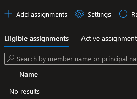

# Using Azure privileged access (PIM) to protect your Azure DevOps resources

In my research around my forthcomming presentations I recently stumbled uppon the [Azure DevOps Administrator](https://docs.microsoft.com/en-us/azure/active-directory/roles/permissions-reference#azure-devops-administrator) role in Azure AD. I have of course used this before, but haven't really thought much about what it does before. After all, I'm the super duper admin of my Azure DevOps environment, right?
But it got me thinking: Can we use Azure PIM to protect stuff in our Azure DevOps environment outside of the AD stuff? Well, turns out, the answer, like most cases in IT, is "Yes, but..."

## About PIM

So what is this PIM im talking about? Well, the short of it, what we are going to use now, is dynamic group or role memberships, on request, and time limited.

**Let me be a member of the group _xyz_ for $TimeSpan time please**

Of course there is more info over at [Microsoft Docs](https://docs.microsoft.com/en-gb/azure/active-directory/privileged-identity-management/pim-configure)

## Built in roles

So lets start by talking about the affore mentioned role, _Azure DevOps Administrator_.

One might think this role prevents and allows you to manage your DevOps organization, but thats not entirely true.

Since Azure DevOps has its own built in permission system it can't really work with Azure AD roles. What you _do_ get with this PIM role is the Azure AD management Policies located under **Organiztion settings** -> **Azure Active Directory**.

(More available, but cut for brevity...)

> So what about Azure DevOps stuff? Can we protect those?

This is where the "Yes, but..." comes.
We can do it, but we need to jump a few hoops. Let's go jumping, shall we?

## Creating a PIM group

The first thing we need to do is create a PIM enabled group in our Azure AD. Unfortunately you need to have a Azure AD Premium P2 (or similar) license to use Azure PIM, but they aren't all to expensive. Once we have that, we can go to our Azure AD Group management blade and create a new group.

The imnportant thing here is we need to set the **"Azure AD roles.."** switch to **"yes"** in order for our group to be PIM enabled. Other than this, go for whatever you want.

Once the group is created, we get a new fancy button in the group setting named **Privileged access (preview)**

And this button in turn takes us to this page:

I, for one, find this confusing.. Didn't we just enable PIM when creating the group 🤔? Well, ok.. Let's enable it again.

After enabling PIM on our group, we can now add assignments to it. This is the users we want to allow to escalate their access in Azure DevOps, and what kind of roles we want them to have.

If we click "Add Assignment" We are greeted with a role selection page.

Important to note here is the **Role** we need to select. The options we have are **Owner** or **Member**.

Basically, it tells PIM what your user should be allowed to do to the group once the privilege is in place. Since we are not going to use the group for more than access, we'll go with **Member**.

Once we have selected our member, on the settings page, make sure **Eligible** is selected. An eligible member needs to manually enable the requested access, where as an active one will default to have it enabled.

Click **Assign**, and this is all we need to do in Azure AD for now!

## Setting stuff up in Azure DevOps

Once we have our Azure AD Group in place it's time to set up access rights in Azure DevOps.

There are of course a million ways and levels you can set up your access, and I suggest reading up on details about it, but for now, lets set up two projects in our Azure DevOps organization - **MyUserProject** and **MyAdminProject**, and use different access to them.

Adding a role is fairly straight forward. Just go to **Project Settings** and click **Permissions**

I'll start by adding my user directly to the **MyUserProject** project contributor role.

And in the **MyAdminProject** project, instead I'll add the **ADOSuperAdmin** group we just created.

And.. well... thats all there is to it really!

Logging in with the **ADOUser** account we can verify that we initially only see our **MyUserProject** project.

## Activating your ADOSuperAdmin role

PIM is a feature of Azure AD, and as such we need to go through the [Azure portal](https://portal.azure.com) to enable it.

Once logged in to Azure we can go to the **Azure AD Privileged identity management** blade.

In which we have the **My roles** sub menu. This is where we create our PIM requests.

In the **My roles** blade, under the **Privileged access groups** menu, assuming everything works as expected, you should see your new fancy privileged access group!

Clicking the **Activate** button here slides in our activation window where we need to give a reason for our escalation request. (Yes, we can of course write [lorem ipsum](https://www.lipsum.com/) in it, but lets hope security will react if we do..)

After clicking **Activate** and a few seconds of thinking, we should get a reloaded page, and our activation should be in place.

We can of course verify this by going to the **Active assignments** tab..

All done, let's go back to Azure DevOps!

## Super Admin mode is go

A fresh hot reload lets us see...

Absolutely nothing new most likely.

Because this is where the "but..." comes in.

First of all: _PIM Groups takes some time to refresh. Some times very long._ You might have to wait for some minutes before this works.

Second: It appears we get our group memberships when we log in. Most likely this is since we do an OAuth login. This means we will want to log out and log back in again (or use private mode in our browser) to refresh our tokens.

However, with a little patience we are greeted with this page instead!

## UnPIMming (yes, thats a word)

After the time you enabled your PIM access (default 8 hours) your access will be revoked, and you will no longer have access to the **MyAdminProject** project.

You can, of course, also end it as soon as you're done by logging back in to Azure, going to the PIM blade, Active assignments, and click **Deactivate**.

## Conclusion

So is this a good sollution? I would say it absolutely can be.
Even though it isn't as fast as I would have hoped it to be, I can see a number of scenarios where this is really usefull as a protection, both from external threats and honest mistakes.

- Infrastructure as code. most critical backbone services will not be changed regularely, and requireing PIM prevents accidental deploys to production environments.
- Secure pipelines. One security risk in Azure DevOps is someone changing your pipelines, YAML, or build scripts. Locking down your pipelines prevents users from accessing them.
- Monitoring, as every PIM request is preperly logged in Azure audit logs.
- Any other secure scenario really.

I hope you will find it usefull to, and please let me know of other scenarios where this is good.

Untill next time, fellow travelers!
