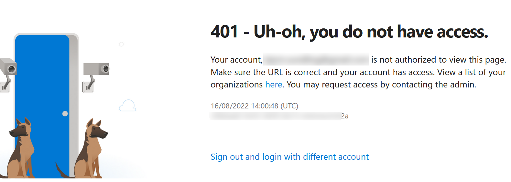

# I've discovered something amazing

[](https://www.youtube.com/watch?v=Jo6dkHgT6TI)

Truth be told, it's not as amazing as Brandons discovery, But I found something rather interesting and rather undocumented.

## An odd week ago

I had a question at one of my customers about Azure DevOps.
Something similar to this:
> Hey, Bjompen, When we create an environment and link a virtual machine to it it also creates a deployment pool with a messy name. Is there any way we can change that name?

Sounds rather simple, doesn't it?

It isn't. It also isn't what this blogpost will be about.

Instead, this is a story about how I spent days digging in an ever deeper rabbit hole of things I had no idea about. A story that doesn't really have a point or end goal. There is no amazing script at the end. But maybe, just maybe, it can peak your curiosity to explore weird behaviours as well, and tell me about them.

## Follow the black rabbit

So I started exploring what actually goes on when you set this up. I still don't fully understand it, but hopefully that will be a bloggpost in some kind of future. What i realized was this:

If I

- Install a VM client linked to an environment
- Go in to Azure DevOps and delete the created Deployment Pool
- Remove the client from the server
- Try to reinstall the server with the same settings as before

I get this peculiar error message:

```Text
ERR  VisualStudioServices] POST request to https://dev.azure.com/<organization>/<ProjectID>/_apis/pipelines/environments/<PipelineID>/providers/virtualmachines failed. HTTP Status: InternalServerError, AFD Ref: Ref A: 5AAEB8FF7A5749598B06250F1E262B6E Ref B: STOEDGE1222 Ref C: 2022-08-11T15:08:10Z
```

There are more lines to it, but for now, this is what matters.

Because there is somethign _really_ interesting here.

This endpoint, `<organization>/<ProjectID>/_apis/pipelines/environments/<PipelineID>/providers/virtualmachines` Does not exist in the [Azure DevOps API documentation](https://docs.microsoft.com/rest/api/azure/devops?view=azure-devops-rest-7.1&wt.mc_id=DT-MVP-5005317).


## Falling down the rabbit hole

So apparently we have some undocumented endpoints hiding in our Azure DevOps organization. Interesting. I can't possibly be the first to find this, so lets go google stuff.

And sure, there are many mentions of this, but nothing that conclusively can help my goal.

What I did find though, was [this thing over at GitHub](https://github.com/Azure/azure-devops-cli-extension/blob/master/tests/recordings/test_devops_projects_CreateListShowDelete.yaml).

This "thing" is some kind of test case file for verifying Azure DevOps API endpoints. It's one of the _extremely_ few places the endpoint I found is mentioned.

And its mentioned alongside...

## This drink makes me bigger

...A list of some 700 odd other endpoints in a long json string.

Looking more into the format of this file gives us a neat pattern.

Every test consists of a request, containing headers, method, and uri, and a response string.

Since github has a neat "raw" format we can parse this and run the tests ourselves.

```PowerShell
Find-Module powershell-yaml | install-module
$apis = irm https://raw.githubusercontent.com/Azure/azure-devops-cli-extension/2bd72a1d76cc00a84b348f573e9f8e14dfb42c5b/tests/recordings/test_devops_projects_CreateListShowDelete.yaml
$yamlObj = ConvertFrom-Yaml $apis
```

Running the tests

```PowerShell
$yamlObj.interactions | foreach {
    if (-not [string]::IsNullOrEmpty($_.request.body)) {
        $r = Invoke-RestMethod -Uri $_.request.uri -Method $_.request.method -Body $_.request.body
    }
    else {
        $r = Invoke-RestMethod -Uri $_.request.uri -Method $_.request.method
    }

    if ($r -notlike "*Azure DevOps Services | Sign In*") {
        # This is an actual response, not a login page...
        $r
    }
}
```

Neat! We get some answers!


## And this drink makes me smaller

But.. Wait.. Did I...

Let's go back and look at one of the request that worked.

```PowerShell
 $yamlObj.interactions[0].request 

Name                           Value
----                           -----
method                         OPTIONS
uri                            https://dev.azure.com/azuredevopsclitest/_apis
headers                        {Accept-Encoding, X-TFS-FedAuthRedirect, User-Agent, Connection…}
body
```

Did I just run a test... against a Microsoft environment? I shouldn't be able to, right?

Lets go see the frontend of this page.

```PowerShell
# Opening webpages from the console is cool.
# This has absolutely nothign to do with me wanting to do some regex. promise.
start-process ($yamlObj.interactions[0].request.uri -replace '_.*$','')
```



## Visit either you like: they're both mad

Ok, I can get a response from an endpoint in an organization I dont have access to.

Lets look back at the original reason we ended up here:

The github yaml had the string I was looking for in the reply. We can of course parse the reply as well.

```PowerShell
# the respons string is a Json object.. lets parse it right away.
$response = ($yamlObj.interactions[0].response.body['string'] | ConvertFrom-Json).value
```

And lets look at the resulting object


So what do we have here?

A list of _every single API endpoint in Azure DevOps.

## Would you like a little more tea?


By now I have completely forgotten what I was supposed to do.

In my computer I now have a list of _every api endpoint in Azure DevOps_, that i got from an open test yaml, that I can run against organizations I do not have access to. Can I do this against _everyone_? WTH is this I have stumbled upon?

Lets go back to the query again. If i replace the Azure DevOps test organization with, well, any other, will I still see the same result?

```PowerShell
Invoke-RestMethod $yamlObj.interactions[0].request.uri.Replace('azuredevopsclitest',$MyOrganizationName)
```

Nope, thats the login window. But wait, the test request object has a "method" as well. "Options"

```PowerShell
$Endpoints = Invoke-RestMethod $yamlObj.interactions[0].request.uri.Replace('azuredevopsclitest',$MyOrganizationName) -Method Options
```

Yup, that works. Lets test all kinds of different organization I can think of.

Turns out most of them gives me the same reply: A list of all the endpoints available.

All except one.. But let's revisit that one soon.

## Off with his head

Lets build a small script to test _all_ the endpoints, just to see what, if anything, we can find.

Theres a lot of placeholders in the list of endpoints, and we can try to replace them as good as possible. After some discussion with friends we created this simple script.

```PowerShell
[string[]]$EndpointStr = $Endpoints.value | % {
    $str = $_.routeTemplate
    $str = $str -replace '{project}', 'LabProject'
    $str = $str -replace '{repoType}', 'git'
    $str = $str -replace '{version}', '1'
    $str = $str -replace '{resource}', $_.ResourceName
    $str = $str -replace '{area}', $_.area
    $str = $str -replace '{providerName}', $_.area
    $str = $str -replace '{team}', 'insert the ID of one of your teams here'
    $str = $str -replace '{.*Id}', '1'
    $str
}

# Since some of the endpoints ends up having the same path lets just remove duplicates
$EndpointStr = $EndpointStr | where {$_ -notlike "*/{*}*"} | select -Unique

# Test them with get and Options to see what we get..
$resObj = $EndpointStr | foreach {
    # Unleash teh f#*!ng FjUri!
    $FjUri = "https://dev.azure.com/$MyOrganizationName/$_"
    try {
        $r = Invoke-RestMethod -Uri  $FjUri -Method Get -ErrorAction Stop
        if ($r -notlike "*Azure DevOps Services | Sign In*") {
            Write-Verbose "$FjUri Get" -Verbose
            @{
                uri = $FjUri
                Method = 'Get'
                res = $r
            }
        }
    }
    catch {}
    try {
        $r = Invoke-RestMethod -Uri  $FjUri -Method Options -ErrorAction Stop
        if ($r -notlike "*Azure DevOps Services | Sign In*") {
            Write-Verbose "$FjUri Options" -Verbose
            @{
                uri = $FjUri
                Method = 'Options'
                res = $r
            }
        }
    }
    catch {}
}
```


There are 89 endpoints I can get a reply from:

- 2 get
- 87 Options

By now I had also involved a couple of colleagues in this, and they also tried.. and got different results. Unauthorized. Interesting.

Lets go look at the gets, shall we?


That second one looks interesting.. lets look at the response.


Wait.. I'm authenticated?! As... `[guid]::new('aaaaaaaa-aaaa-aaaa-aaaa-aaaaaaaaaaaa')`

So lets go back and look at the organization I couldn't get no reply from.


This error message tells me that we are. We are authenticated in the organizations we fail to get replies from, but we are not authorized to see the resources. This reply comes from the _backend_ service of Azure DevOps.

This just keeps getting weirder.

## How deep does the rabbit hole go?

By now I had also involved a friend of mine over at Microsoft.

What is this guid? Why can I get this data from almost every organization? Why does the amount of endpoints differ between organizations? Can I use this to find some security hole? I had so many questions and so few answers.

Well, it turns out it is kind of all a big nothingburger of crap documentation.

After a while we heard back from the Azure DevOps developers, and it turns out that the `[guid]::new('aaaaaaaa-aaaa-aaaa-aaaa-aaaaaaaaaaaa')` identity is in fact hard-coded in to Azure DevOps. It will _always_ be there.
When you don't authorize, this is the user it will be using.

I for one think this is a really odd way of solving stuff, but ok. At least you should handle the error messages a bit better maybe?

And the data we could find? Well the data is mostly just metadata about the endpoints themselves. Nothing secret is hiding in the Options.

But _Nowwhere_ is this behaviour documented! It just works like this. There are a couple of discussions on the developer forums around this topic, but I could not find one single place where this is all written down. (You're welcome 😉)

Last but not least: The reason I could not get any reply from certain places is [you can actually disable the anonymous access](https://docs.microsoft.com/azure/devops/organizations/public/make-project-public?view=azure-devops&wt.mc_id=DT-MVP-5005317#enable-anonymous-access-to-projects-for-your-organization) by switching this button of!


Now there are more than one thing bad with this documentation:

- It's old and doesn't show the GUI the way it looks today
- Nowwhere is the endpoints, user, or anything else I found, mentioned.
- And if we go to the GUI to look at this... well... Here's a gif..


I might take a stab at improving the docs for it, after all, they are open source, but that will take some more work first. (Also, I already have a number of unapproved PRs to the Azure DevOps docs waiting. Can't be bothered to help if it's not wanted.)

## Madness returns

So if it was all just a switch to disable anonymous, why did I say I discovered something amazing?

Because it was. It was a couple of days of curiosity and digging in to the unknown.

And I still ain't done. The metadata of the `https://dev.azure.com/$MyOrganization/_apis/ -Method Options` call contains the API versions released, and there are _a lot_ of unreleased endpoints to explore.

```PowerShell
$endpoints.Value | Where-Object {$_.releasedVersion -eq "0.0"} | Out-GridView
```

And this makes my days a bit more interesting. I love me a good mystery endpoint.

But what about the deployment pool with the messy name? Well.. I still haven't found the bottom of that rabbit hole.
