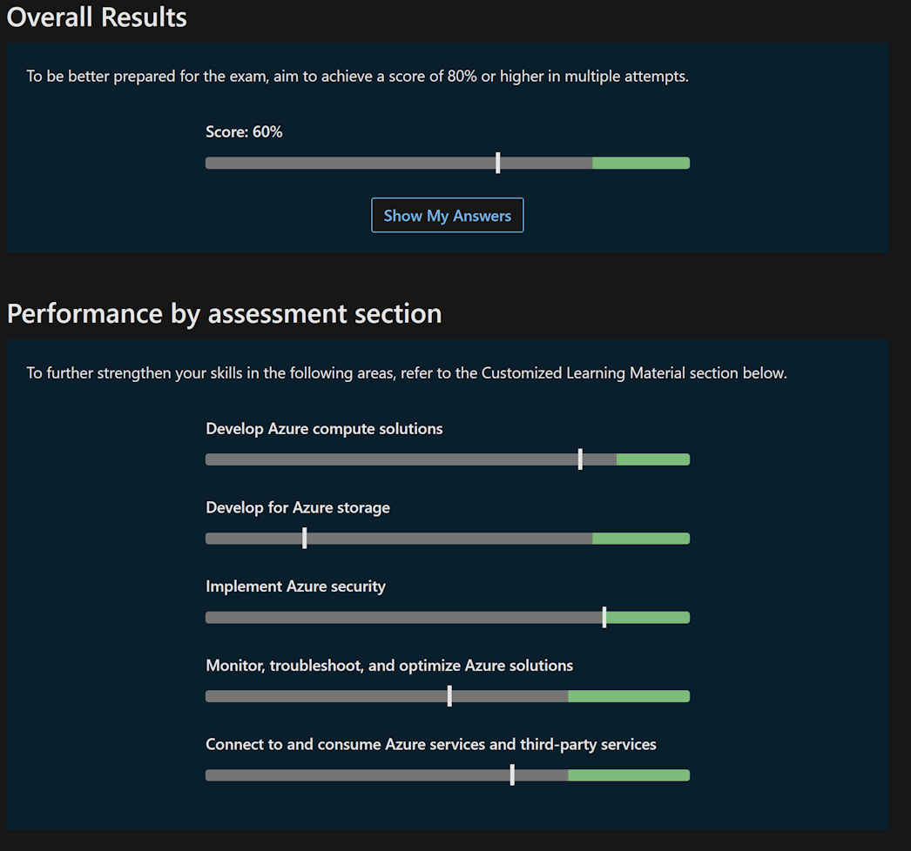

## Lets learn some Azure! Az204 Pt.1

For quite some time I've been meaning to get the [Az-204 certification.](https://learn.microsoft.com/en-us/certifications/azure-developer/)

I currently have 10*, 30*, and 40*, which gives me... Three shields and a number of stars if I'm not wrong, but not having the 200 series has bugged me.

The problem is this: I am absolutely terrible when it comes to learning.
I failed school, and didn't even try to do university simply because I can not study. At all.
And even when I _can_ study, writing tests gives me the shivers, I black out, and forget everything I know.

So having actually passed some exams makes me incredibly proud.

But I still haven't got the 204. It's time to fix that. And why not do it together?

This will be the first in a series of posts where I try to go through my process, and explain and write down my thoughts on each chapter. I have no idea how long this will take, but I do have a date booked for certification: August 18. So I guess with no further waiting - of we go!
 
## Starting out

Unless you already clicked the link above, the obvious place to start is [here](https://learn.microsoft.com/en-us/certifications/azure-developer/). The actual page of the exam. 

There is a small but important note on all exam pages named `Skills measured`. This is what we will spend the next months learning everything there is to know about.

We also have all the chapters we will go through and read and play around with.

One thing that _isn't_ linked there, but may be a good thing to check is the [certification demo](https://mscertdemo.starttest.com/). This is a demo of the actual certification layout. It looks exactly like the certification test does, and contains examples of all different types of questions to help you know what it will actually feel like on the big day.

## Practice makes 700! 

The first thing I like to do is take a practice exam. This gives me somewhat of a hint of what I am missing, and what topics I need to study more on.

I used to get my practice exams from [MeasureUp](https://www.measureup.com/microsoft-practice-test-az-204-developing-solutions-for-microsoft-azure.html), but quite recently Microsoft decided to create [their own practice exams as well!](https://learn.microsoft.com/en-us/certifications/exams/az-204/practice/assessment?assessment-type=practice&assessmentId=35)

The MeasureUp test is way more flexible, has a bigger selection of topics and settings, and replicates the testing experience almost 100%, and If you can afford it I can highly recommend them, but this time I'm opting for the free Microsoft one as it still gives me a good bit of knowledge and a decent assessment.

## Running the assessment test

Is mostly a straight forward thing. Start the test, answer the questions, get a result.

Every question also has a `Check your answer` button, and I really do recommend using it. It will show you if your answer is correct, which topics you are currently working with, and some good to read links. lots of useful info, straight from the source!

## Assessment tips!

I have issues with words. I often find myself not understanding what is actually asked, and struggling to understand the answers. I do have some tips on how to make it easier for me though, so here are some of _my_ tips..

> When I first took a certification test I failed. A colleague of mine said I needed to stop assuming things. remember: __Only the things put in to text exists. No other things should be assumed!__

> Some questions comes in the format of code. I always found these questions hard simply because the answers often look similar. Instead of trying to figure out the correct answer right away, I like to start by reading and checking the differences of all the code blocks first. If I already know the every answer starts with `az group create --name MyRG` then what I am looking for is after this. 

> Some questions are multi choice. Remember to check the correct amount of checkboxes! (Yes, I miss this way to often..)

> Sometimes it's easier to think backwards. What is _not_ the correct answer!

> Don't overthink and spend too much time on the assessment. It's meant to give you a hint of what you know, not what you can figure out given a minute of thinking. 

## The result

As expected I brutally failed. This is good though.

I now know what I actually need to practice harder!

I can also draw some other conclusions from this assessment, for example one of the questions I generally have a hard time answering are questions regarding code (not az cli or PowerShell, but which libraries does what and which c# classes to use for what)

I will go back and retake this assessment regularly during my learning, and I do recommend you do as well, but doing it to often does have a downside:

> If you take the assessment to often there is a chance of learning where the checkbox should be instead of the answer. The actual questions at the test may be similar, but the answers will move and change. Don't learn the checkbox order, learn the facts!

## Summary

A good start. I know what I don't know, which is a lot, and next time we will jump in to the learning path. Until then!
