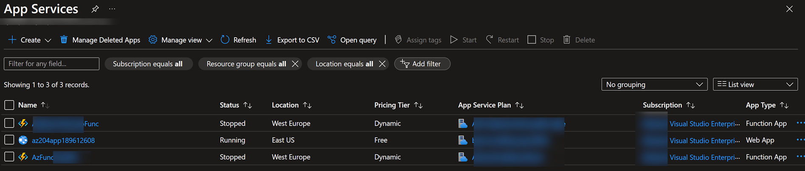
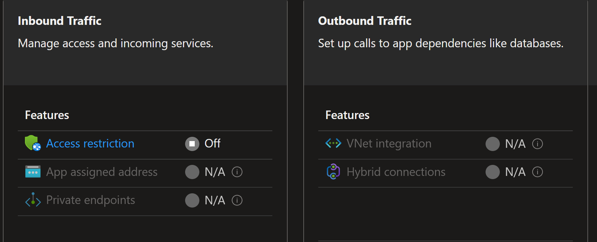
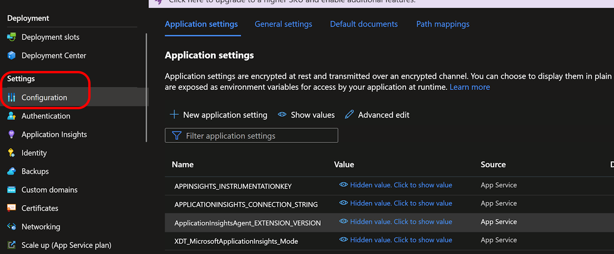
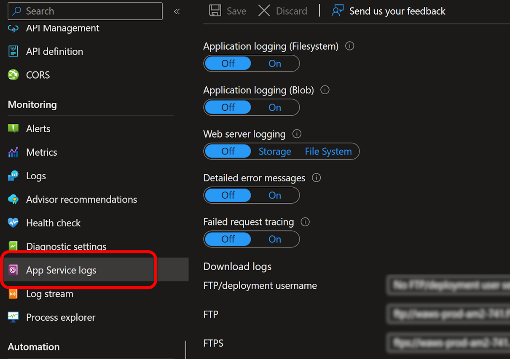
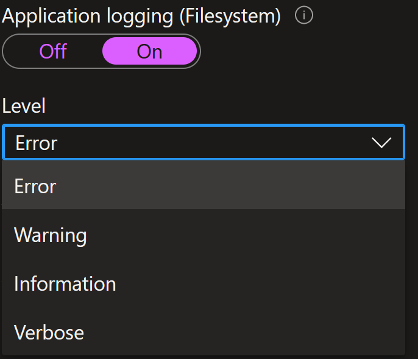
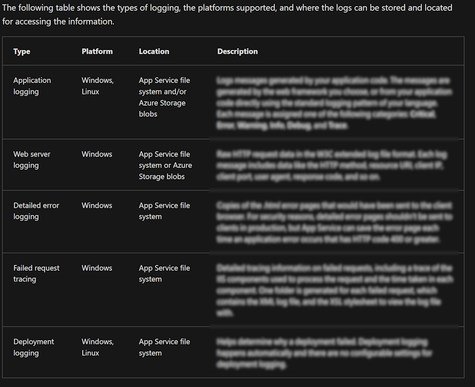

# Lets learn some Azure! Az204 Pt.2 - App services

This is the second post in a series called `Let's learn some Azure! Az204`.
To read them all, and in the right order, start here:

- [pt. 1 - Space....](posts/az204.pt1.md)
- [pt. 2 - App services](posts/az204.pt2.md)
- [pt. 3 - Implement Azure Functions](posts/az204.pt3.md)
- [pt. 4 - Develop solutions that use Blob storage](posts/az204.pt4.md)
- [pt. 5 - Develop solutions that use Azure Cosmos DB](posts/az204.pt5.md)
- [pt. 6 - Onwards and upwards. ACR, ACI, and ACA.](posts/az204.pt6.md)
- [pt. 7 - The final frontier!](posts/az204.pt7.md)

----

Head first in to the learning path, the first chapter of out journey is [Implement Azure App Service web apps](https://learn.microsoft.com/en-us/training/paths/create-azure-app-service-web-apps/).

Instead of me just repeating the learning chapters I though a good way for me to remember what I actually read would be to try to explain each part using my own words.

I will also add some pop quizzes. This is questions I believe can be relevant in the certification tests. (Disclaimer though: It is just guesses. There may be questions outside of this, and this may not matter at all. It is just my guesses.)

The first service being App Services. I have never worked with those before, so this will be interesting.

## App services

At least that's what I thought before I started clicking around the [azure portal!](https://portal.azure.com)

### So what is an app service?

Simply put, it is Azures PaaS service that allows you to publish web apps, static web apps, and something called "web app + database".

Here's the funky part though:
When I went in to the [App Service blade](https://portal.azure.com/#view/HubsExtension/BrowseResource/resourceType/Microsoft.Web%2Fsites) in the portal it shows my Azure Functions as well!

So why is this? Well, I'm going to go out on a limb and guess: Web apps runs on an App Service plan. This is basically what describes the "hardware" of your PaaS thingie. This hardware in turn can run a lot of different services, for example an Azure Function (which is basically a container with a customizable [entrypoint](https://docs.docker.com/engine/reference/builder/#entrypoint)), or a web app (which can be either a virtual IIS folder or a container running Linux)

But back on learning.

### Stacks, Scaling, and Slots

Azure App services can be run using a lot of different stacks. Whether you run .Net, Java script, Python, Ruby, or PHP there is an image that supports it. This of course also requires different operating systems, and app services can be run on both Windows and Linux hosts depending on your needs.

Which platforms supporting which resources can be found by running the command `az webapp list-runtimes`.

App services also supports scaling.
There are two types of scaling:
- Scale up
    - This is simple up (or down) grading your current SKU. Higher SKUs gives you more CPU, More RAM, and more disk space. It also grants you more CPU hours, but how those are counted I do not know.
- Scale out
    - Gives you more instances of your container image. 

There are some differences depending on what size SKU you select, and here is something that I believe might show up on a test:

> Pop quiz: Which sizes SKU supports which types of scaling?
>
> Answer: 
> - Free: No scaling
> - Basic: Manual scaling
> - Standard, Premium, and Isolated: Automatic scaling

Some good learning here would probably be to go through the [pricing plan](https://azure.microsoft.com/en-us/pricing/details/app-service/windows/), even though you don't need to know it by heart.

Last but not least in the fly over of App services: Deployment slots. A great feature that allows you to deploy a new version of an app in the same host, but with its own hostname. This lets you deploy a new version of an app, let is start up properly, then switch production over when you are ready. Again though, depending on SKU:

> Pop quiz: If you want to use deployment slots for zero downtime deployments, which SKU do you need?
>
> Answer: Standard or better.

[More good reading on SKUs and limits can be found here](https://learn.microsoft.com/en-us/azure/azure-resource-manager/management/azure-subscription-service-limits#app-service-limits)

### Authentication

Authentication is integrated in Web Apps, and activating it is as easy as going in to the authentication page and adding a provider. The flow you're setting up is OAuth, and your app gets a token store and authentication data in HTTP headers.

I honestly don't think this will be on the test, but if there is something surrounding it my guess would be...

> Pop quiz: You want to allow users to authenticate to your app. Which providers are supported?
>
> Answer: Azure AD, Apple ID, Facebook, GitHub, Google, Twitter, and any OpenID platform.

Also good to know: This is only Authentication. You still need to manage Authorization somehow.

### Networking

This was probably the chapter I had the hardest time to understand. I'm guessing it's because I am not a network pro. This said _I may get things wrong here, and would love it if you told me so!_

As a default your web app will always only be connected directly to the internet. Both incoming (requests, pushing code and so on) and outgoing (sending http pages) traffic will go through the internet. Unfortunately that's where the easy parts end.

Because we are running container loads and they are running on shared hosts, there is no one way of managing incoming and outgoing traffic, but instead we have to use different techniques.

For example you may use IP filters and access restriction to make sure your backend app is only accessible from your dedicated front end servers, and you may use vnet integration to force outbound traffic through your proxies on security thingamajigs, but you cant do it the other way around.

Note though, as always, which ones you can use depends on your SKU..

- Inbound
    - Access restriction
        - Always available
    - App assigned address
        - Basic or higher, excluding Isolated
    - Private endpoint
        - Basic, Elastic premium, premium v2 and v3, and Isolated
- Outbound
    - VNet integration
        - Basic and higher (some exclusions may apply, but not in our scenario)
    - Hybrid connections
        - Not supported in free, shared, or consumption plans

As you can see, there is a lot of different scenarios to know here, and I honestly do not know them all, so instead of a pop quiz that I might think shows up on a test I will leave this chapter with a note to self:

> Note: Go back and read up on the underlying structure of web apps to better understand the networking setup and behaviour.

And with this we are officially leaving the first chapter of the "Implement Azure App Service web apps" path. Next up:

## Configure web app settings

Phew, this was actually a much easier chapter. I needed this after struggling with networks.

Lets break it down: Settings, other settings, logging, and certificates. That's what we need to know.

### Settings

If you go to `Settings` -> `Configuration` you will find a number of settings, the first of them being app settings.

Most commonly your application can have two files for various settings:

- web.config
- appsettings.json

These settings can be overridden by creating an app setting.

App settings are the presented as environment variables in the operating system running your app.

Since they are overridden you may for example have your development connection strings to local databases in appsettings.json, and your production connection strings in an app setting in Azure.

One thing I don't really understand is why there is a separate app setting list for connection strings.
They both show up as environment variables, and the only difference seems to be that the connection string one also has a "Type" property saying which type of database it is used for. The docs simply says `connection strings require special formatting in the variable keys in order to access the values.` Ok then. Special formatting.

Oh, last thing on this tab: You can batch manage app settings in json formatted hash tables.

Next tab is General settings. This is where you configure anything related to the container images or host that runs your web app such as runtimes or connection possibilities like FTP, TLS version and so on.

Last but not least we should go through the "Path mapping" tab.

This setting lets you create virtual folders and paths based on some different criteria.

For example, you can map https://myPage.com/subpage to redirect to your development folder ./path/to/anotherpage/. I hope this makes sense.

There are three different mappings you can create:

- extension mapping
    - If a user browses to a file with extension '.myScript', redirect to script runner 'myScript.runner'
- Virtual app or directory
    - map a real path on your local storage to a relative virtual one presented to the web page visitor
- Azure storage mount
    - If you are running a Linux machine or a custom container image this lets you mount Azure blobs as static storage to be used on your web page.

> Pop quiz: You want to change your app to support the HTTP/2 standard. Where do you change this setting?
> 
> 1. Update application settings.
> 2. web.config. 
> 3. General settings. 
> 4. appsettings.json
>
> Answer: 3. General settings contains data surrounding operating system, runtime stacks, and connection setup. One of these settings is `HTTP version`.

### Logging

If there is something here I believe will show up on the exam this would be it. In fact I already got one question about this topic on the test exam I did, So I guess this is a chapter to remember.

Let's start with a...

> Pop quiz: Which of these logs are available on Windows and Linux hosts?
>
> 1. Deployment logging
> 2. Web server logging
> 3. Application logging
> 4. Detailed error logging
> 5. Failed request tracing
>
> Answer:
> - Windows: All of the above
> - Linux: 1 and 3.

There, now that we established there are 5 logs you can read, the first thing we should do is visit `Monitor` -> `App service logs`. This is where you activate logging.

As you can see, all of the logs needs to be activated separately. Once activated they will automatically turn of after a set period.

Once you activate a setting you also get to set the log levels. As expected, the settings are "...and higher", so for example setting it to "warning" will also include "error"

Like I said I got a question on the test exam on this topic. I'm not going to answer it for you, but _do read this part of the training material!_

> Pop quiz: You use the command `System.Diagnostics.Trace.TraceError("If you're seeing this, something bad happened");` to generate an error from your app. Which log would you see this message in?
>
> Answer: Application logging, either on disk or in a blob storage depending on your setting.

### Certificates.

If you have Basic or higher SKU you can use certificates for your webapp and custom domain name.

There are three base types to pick from

- Free managed certificate
    - 100% free, and fully managed by Azure. Supports basic features, but most importantly lacks wildcard support and can't be exported.
- Paid managed certificate
    - Still mostly managed by Azure, but supports a lot more features such as, well, wildcards and exports. Also lets you store certificate in KeyVault. You will need to verify your domain to get this to work.
- Bring your own cert.
    - Supports self hosted in KeyVaults and importing of .pfx files. There are some requirement specifics for this to work, but I do not believe those are important to memorize for now.

And that's about it. I told you this was an easy chapter 😉

Tomorrow we're reading

## Scale apps in Azure App Service

Again, a simple chapter.

We go through the concept of manual and autoscaling. Worth remembering is that we are _only_ talking about sideways scaling, in and out, when we talk about rules here.

Almost at least.

Which type of scaling we support is actually based on what machines our app service plan are running, and this is kind of the type of questions I imagine can show up. Remember which machine types support what types of scaling:

- F* or D* Tiers is single instance and can't scale.
- B* only supports manual scale ("run my web page on _n_ servers).
- S* or P* Supports autoscale (see the rest of this chapter 😂)

If you are running the wrong size host machine you may need to scale _up_ before you can scale _out_.
Once you have the correct size machine, you can start looking at autoscaling.

One thing worth mentioning is the choice of words in one of the descriptions here:

> Changes in application load that are predictable are good candidates for autoscaling

The knowledge check in the end of this chapter is one of those places where not fully understanding the scenarios may mess you up. (It did for me.. I blame non native language 😂)
Remember something like this:

- You have a regular pattern of eventual increases in traffic such as "Monday to Friday, working hours"
    - Use autoscale
- You are expecting a one of burst of traffic such as "new product release" or "holiday sale"
    - Use manual scale
- You experience a sudden rapid change of traffic
    - Don't autoscale, but look in to why. Having autoscale during a DDoS can be terribly expensive...

But with this clear, lets create our rules to use when autoscaling.
You create an `autoscale condition` which is a set of rules, for example `if CPU(%) is greater than 90 for an average of 10 minutes, add 1 machine to my cluster`. Rules are quite easy to create and understand, so I'm not going to spend much time here.

A term that might be worth remembering:
- Time grain: How often a metric is read.  for example `time grain: 1` in the above rule would mean sample every 1 minutes. This is measured across all instances, so for example the `cpu 90%` if you have 2 machines means 90% average on both (100%+80% would do, 80%+90% wouldn't)

Also, best practice is to have a matching and well measured down scale rule. Don't just add, remove when the problem is fixed.

> Pop quiz: Which of these metrics can you _not_ use to trigger autoscaling?
>
> 1. Disk Queue Length.
> 2. Bytes received.
> 3. CPU usage (%).
> 4. Http Queue Length.
> 5. Bytes sent.
> 6. Disk bytes read.
> 7. Memory usage (%).
>
> Answer: 6. Disk bytes read.

One more chapter on app services and release of chapter two of my study:

## Explore Azure App Service deployment slots

One more to go. Deployment slots. 

If I'm going to guess, this will not be a test lab at least. I'm guessing because there is no "lab" or "try" chapter in the learn path. 

Instead it focuses on what swapping is, and how you can use it, So let's look at those.

> What is it?

We've already established that a web app is actually two resources: An app service plan (the "machine") and an app (the IIS server, Linux host, or container that runs your code).
A deployment slot adds a clone of your app to the app service plan that you then can push new or changed code to.

After new code is pushed you can swap over traffic to the new version and so both test your new version for quick failback, and also prevent any downtime by cold starts, fail overs, or other back end switches.

> And how can we use it?

Well.. Automatic fail backs, and traffic switching 😂

Basically you can choose from any of three ways to test and switch.

- Percentage.
    - From the `Deployment slots` blade set a percentage of traffic that will be routed to the new page
- Swap.
    - Click `Swap`, select source and target slot, and click swap. the hostname will now redirect to the new target slot, and it will get the "Production" tag. You can also select "Swap with preview", Multi stage swap. This will let you verify your app before clicking "finish" and finalizing the swap.
- Auto swap.
    - This lets you automatically swap slots when code is pushed to a slot. According to the learn docs it _only_ works in Azure DevOps Services (the online version), but no explanation why this is.

Like always, supported amount of slots is in some way related to the SKU you're running, but unlike the other chapters it wasn't mentioned in deep details, which again leads me to think this won't be a big chapter in the test.

If we want to add something to the "remember" list I would say it's this: You can do a clone to create a new slot you can then deploy to, however, when doing this there are some settings that won't be cloned. Likewise, a number of settings will not follow you when you swap slots as they are bound to the slot where they were created.

There is a good list on unit 3 here if you want to dig in to it a bit.

## Wrap up

This finalizes chapter 1 of the learning path - Implement Azure App Service web apps.

I hope you enjoyed it and that it can help you pass the exam eventually. Or me. Let me pass the exam.

If you have any feedback on format, complains on content, or want to correct me somewhere, give me a shout at [my mastodon page](https://mastodon.nu/@bjompen)

And no matter what, tomorrow I'm starting chapter 2: [implement azure functions/](https://learn.microsoft.com/en-us/training/paths/implement-azure-functions/)

Onwards towards another shield we go!
