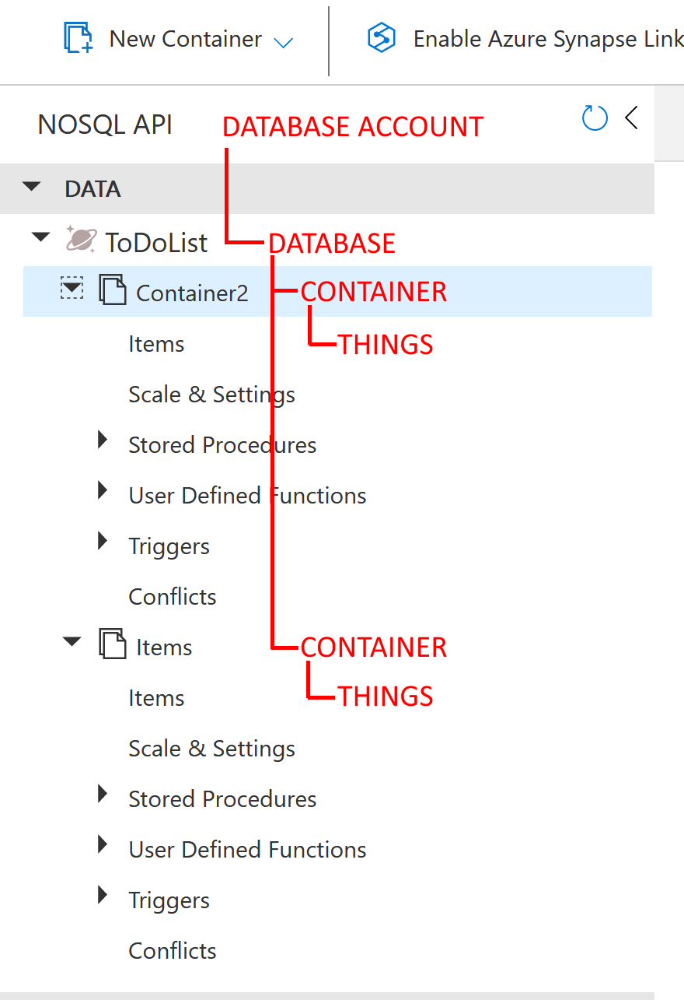

# Lets learn some Azure! Az204 Pt.5 - Develop solutions that use Azure Cosmos DB

This is the fifth post in a series called `Let's learn some Azure! Az204`.
To read them all, and in the right order, start here:

- [pt. 1 - Space....](posts/az204.pt1.md)
- [pt. 2 - App services](posts/az204.pt2.md)
- [pt. 3 - Implement Azure Functions](posts/az204.pt3.md)
- [pt. 4 - Develop solutions that use Blob storage](posts/az204.pt4.md)
- [pt. 5 - Develop solutions that use Azure Cosmos DB](posts/az204.pt5.md)
- [pt. 6 - Onwards and upwards. ACR, ACI, and ACA.](posts/az204.pt6.md)
- [pt. 7 - The final frontier!](posts/az204.pt7.md)

----

From the easy to me feeling like a mess.. This is super hard!

But That's why we study, isn't it? 

Cosmos DB is up, and there were some parts that was really hard to grasp here.

## Explore Azure Cosmos DB

So what is it? Well, as the name suggests, a database.

Cosmos DB is a globally distributed database system for NoSQL databases. NoSQL meaning there is no particular schema or enforced layout. Just toss whatever you have in there, and it is indexed and queryable (is that a word?) in a standard way.

It supports a number of different languages and layouts, and can be used to replace or use as any of the following databases:

> Pop quiz: Which of these languages is _not_ supported by Cosmos DB
>
> 1. PostgreSQL
> 2. Table
> 3. Oracle SQL
> 4. Apache Cassandra
> 5. NoSQL
> 6. Apache Gremlin
> 7. MongoDB
>
> Answer: Oracle SQL. Relational database languages are not a part of Cosmos DB.

It "emulates" the non NoSQL languages by implementing the Wire protocol, but does not go in to depth as to what the wire protocol is. Open source something.

The pricing for Cosmos DB is based on something called RU's which is short for request units, and is a combination of queries/writes and storage used. The first fix is always free, so you get up to 1000 RU's for free.

### Distribution

The key benefit, and one of the things you _should_ know, is the distribution model of Cosmos DB.

You can set up your databases to replicate over one or more regions around the world, such as `west europe` _and_ `west US` and it will replicate data between these regions, allowing users to run ultra fast queries wherever they may be located.

Query time is guaranteed to be less than 10ms.

You can set up two regions on initial creation, and add more after creation is done.

This also leads to the hardest part of Cosmos DB

### Consistency levels

As Cosmos DB is globally distributed, and data does take time to sync across regions, and even internally across replicas, you will have to pick a consistency level. This means you must choose to what level you accept things like

- Old data results from queries
- Out of sync updates
- Global delays

In all different consistency layers except strong you replicate data through _at least_ three different replicas in a region

There are five layers of consistency available, and I do recommend reading [the learn chapter](https://learn.microsoft.com/en-us/azure/cosmos-db/consistency-levels) to get a good grasp of this. I imagine questions surrounding this might show up on a test. I'll try to explain them here.

- Strong
    - If you write anything to _any_ region, and perform a query, you _will_ get the latest data result. This requires the replication to pass through all regions, and therefore is the slowest. It will _always_ give you the latest data though.
- Bounded staleness
    - This allows you to set a maximum _age_ of data replicated between regions. If you write something to region A, and query data from region B, the data returned _can_ be old, but never older than a set number of versions _or_ a set time interval. The behaviour of this is _highly_ depending on how many regions for read and write you configure.
- Session
    - This setting gives the client a token that guarantees this specific session to always be consistent. You can share this token in between regions to make sure you always get the correct data, not matter where you query. The token guarantees a "this version or later" of data requested, so any writes _after_ the token is created will be honoured.
- Consistent prefix
    - This setting will batch your jobs using transactions. This guarantees all jobs to be _in order_ but no guarantee as to how old. Like the description states, if you update two documents in a transaction and then query those docs you _may_ get 
        - doc1.version1 _and_ doc2.version1 
        - doc1.version2 _and_ doc2.version2 
    - but never
        - doc1.version1 _and_ doc2.version2
- Eventual
    - This is the fastest setting, but with the least guarantee of latest data. A read query will only be performed using 1 of the 4 possible regional replicas, and will get whatever result this replica has. Eventually all writes will be synchronized, but there is _no_ guarantee as to when. Unlike consistent prefix, writes are _not_ synchronized in order, so a query can return mixed state data.

Remember, this is just _my_ interpretations, and there is even more details about consistencies and latency detailed in the learn doc mentioned above. No need for me to duplicate the entire article. My last takeaway here is that in _many_ cases you will always get the latest, and correct, data from a read. The consistency setting just enforces a certain level. This is measured using _Probabilistically Bounded Staleness (PBS)_ (aka "how big is the chance you're actually going to have the same consistency as the strong setting")

### consistency levels

Is hard for me to understand. Like I often say: There's a reason DBA is a title on it's own. I _hope_ my understanding of this is enough for now, so we can move on to module two:

## Work with Azure Cosmos DB

One thing the discover chapter goes through that I didn't mention is the structure of Cosmos DB. The reason is simply that it makes much more sense to have it here.

What we looked at above is all part of the Database account setup. Things like replication and consistency are shared among all databases in the same account. You may have one or more databases in one account.

Databases in turn consists of one or more containers. A container is a boundary for programmatic content such as items (Things in my drawing, more on that soon), stored procedures, triggers, and so on.

### The hierarchy of Cosmos DB

So, this is my interpretation of this hierarchy

I choose to name it Things instead of Items because the actual data you find here depends on what type of database language you are working with. It may be rows, documents, nodes, or edges. To put it easy - Items is where your data is stored, no matter what data you are storing.

### Using the SDK

So why does this make sense here? Because when you write code using the SDK you use this hierarchy in the following order:

1. Connect using a key to the database account - `cosmosClient = new CosmosClient(EndpointUri, PrimaryKey);`
2. Use the created _account_ object to create or connect to a database - `database = cosmosClient.CreateDatabaseIfNotExistsAsync(databaseId);`
3. Use the created _database_ object to create or connect to a container - `container = database.CreateContainerIfNotExistsAsync(containerId, "/LastName");`
4. Logically, use this object to query, update, or do stuff with the _items_ in this container.

### Other container stuff

Apart from items you have more things you can to within the boundaries of a container. In the examples we look at these using Java script. This makes me feel dirty.. Java script.. 🤢

But ok, we can use Java script to create stored procedures. They work like stored procedures do mostly. aYou have input and output objects, and run code within the constraints of your container to perform ~~magical~~ automatic processes.

You may also use Java script to create triggers. This is code run automatically upon create, delete, or update actions of an item, and you can configure them to run before or after the action is performed.

One such scenario may be "verify that the data inserted to a row contains correctly formatted data and fix it if not"

Again, since Java script I will not go through this in detail, as I would not be able to explain it anyway.

### Change feed

Now this on the other hand is useful, not necessarily in deep detail, but there may be questions surrounding one specific scenario:

Azure functions.

All Cosmos databases have a change feed that you can subscribe to. This feed contains data about what is done, changed, or updated, and you can use this data to trigger an Azure function.

This can be extremely useful as it lets you use Cosmos DB as a backend for whatever your automations want to do, such as "whenever a line is added to the database, run a function to set up this role in ~~Azure AD~~ Entra ID.

I'm not here to give examples like this right now though, but since Azure Functions are included in the Az204 certifications I fully expect some questions surrounding this scenario.

## Summary

This chapter really shows how much I don't know. Playing around with resources is _well_ invested time, and if you don't have Azure credits it's time to take a step back. It's nearly impossible to pass a certification without playing around with the resources at least a bit beforehand. Believe me, I speak from experience 😉

But I do feel a lot safer now after this. Let's hope I still remember all of this when it's time to take the test.

Next up we're looking at implementing containerized solutions. That's seriously cool stuff.

until then!
