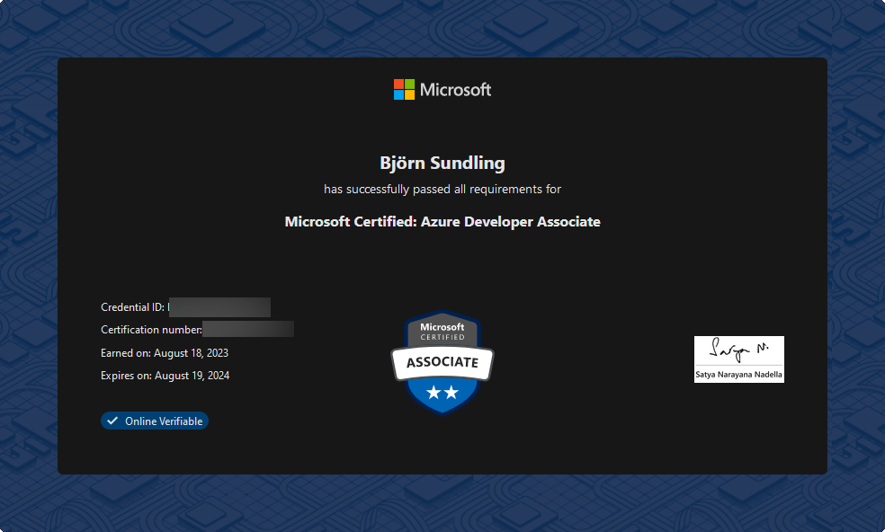

# Lets learn some Azure! Az204 Pt.7 - The final frontier!

This is the last post in a series called `Let's learn some Azure! Az204`.
To read them all, and in the right order, start here:

- [pt. 1 - Space....](posts/az204.pt1.md)
- [pt. 2 - App services](posts/az204.pt2.md)
- [pt. 3 - Implement Azure Functions](posts/az204.pt3.md)
- [pt. 4 - Develop solutions that use Blob storage](posts/az204.pt4.md)
- [pt. 5 - Develop solutions that use Azure Cosmos DB](posts/az204.pt5.md)
- [pt. 6 - Onwards and upwards. ACR, ACI, and ACA.](posts/az204.pt6.md)
- [pt. 7 - The final frontier!](posts/az204.pt7.md)

----

## So came the big day: Certification!

I haven't been not doing anything, I just haven't had time to write everything down, and like already mentioned, by now you may have figured out how I study.

I finished the last chapters continuing to do one per day, and it was exactly the amount of days needed. Yesterday I did one final test exam, and did pass it with.. not flying colours, but 80% which is what is needed.

And this morning it was certification time!

### But before this, some last tips!

One thing that I had big issues with was the chapters on [Azure Event Grid](https://learn.microsoft.com/en-us/azure/event-grid/), [Azure Event Hub](https://learn.microsoft.com/en-us/azure/event-hubs/event-hubs-about), and [Azure Service Bus](https://learn.microsoft.com/en-us/azure/service-bus-messaging/service-bus-messaging-overview).

Not because they were particularly hard themselves, they are all message services with pub/sub functionality, but because the chapters on them pretty much explained them in the same way, and I found it lacked good examples of when to use which one.

The solution to this was of course to spend another couple of hours googling not just Azures own docs, but also blogs, recommendations, and comparisons.

So to save you some time: The biggest differences are scale and amount of messages, where and how to store them, and push or pull to recipients of messages. I won't say which is which, but go read the above linked docs.

> Tip: Lots of Azure services are based on open source or external tools and ideas. Remember to read up on what the _original_ technologies such as pub/sub actually do as well, not just what the Azure implementation does.

I also had a real hard time remembering all the different consistency levels of [Cosmos DB](posts/az204.pt5.md). This probably because, well.. I haven't worked with it and didn't know them before. So before discussing taking the actual test, I'll leave you with one final tip:

> It's easier for some people to remember phrases or rhymes. Instead of trying to learn all the names, I remember "S-B-S-C-E". "SBS" is a Swedish acronym comparable to the English [PEBCAK](https://en.wiktionary.org/wiki/PEBCAK), and [CE](https://single-market-economy.ec.europa.eu/single-market/ce-marking_en) is the safety marker of electronics in Europe.

After this I memorized the edges: Strong and Eventual. those are the extremes. Last but not least I memorized the differences, not the names. Finally I spend dinner last night explaining the differences to my _super interested_ wife 😂

And as of right now I do believe I can explain them without looking at my notes.

## The test

in [part one](posts/az204.pt1.md) I wrote that this time I am going to do only the Microsoft practice exams, and so I have done.

I must say they are incredibly well done and does give you a good lead on where you are, but I will _not_ recommend this for a first time student. Sure, the price is hard to argue, but there is a lot missing from the  [MeasureUp](https://www.measureup.com/microsoft-practice-test-az-204-developing-solutions-for-microsoft-azure.html) test.

Taking a certification test is actually, if you ask me, a two fold thing:

- Skills, of course. Do you know your stuff.
- The art of taking a test!

The second part is where I didn't feel as well prepared. The MeasureUp tests closely reflects the look and feel of the actual exams, and that is incredibly good. Learning how to read a question, where the examples are and how they are structured, and how, for example, a code question looks is a big thing, especially if you, like me, have a bit of a language problem. I believe I spent way longer than necessary just finding my way around scenarios, finding where and how examples are structured, and so on.

So, if you do have the money, I do recommend getting a MeasureUp test, but if you don't, they do offer free demos as well. 

On the other hand, if you only want to measure skills, the Microsoft exams are well ok. I even found a lot of the questions there harder than the actual exam, but that of course comes down to what we know.

Anyway, today then...

## PICARD: On screen

I honestly don't think I've ever been this nervous over a test. I even threw up when going to the car! (yes, for real!)

But I did get to the test centre on time. You can book a certificate exam at home too, but [I don't think any of my rooms would fulfil the requirements](https://learn.microsoft.com/en-us/certifications/online-exams).

Sitting in a room next to people may seem intimidating as well, but the cover screens are big enough to make you forget other people are there.

Oh, I know I said the previous one was the last tip, but

> Tip: Go to the bathroom before you start! 😂

But guess what...

I did it!

## Final notes

So goes another summer, and what a summer. MVP, MCT, and now this. 
maybe next vacation it's time for [az 500](https://learn.microsoft.com/en-us/certifications/exams/az-500/), but for now I don't want to study for at least a month.

Right now I need a bit of sleep, and then prepare for my next presentation at [Data Moshpit](https://www.data-moshpit.com/). Will I see you in Berlin?

Until next time, and good luck with your certifications!
