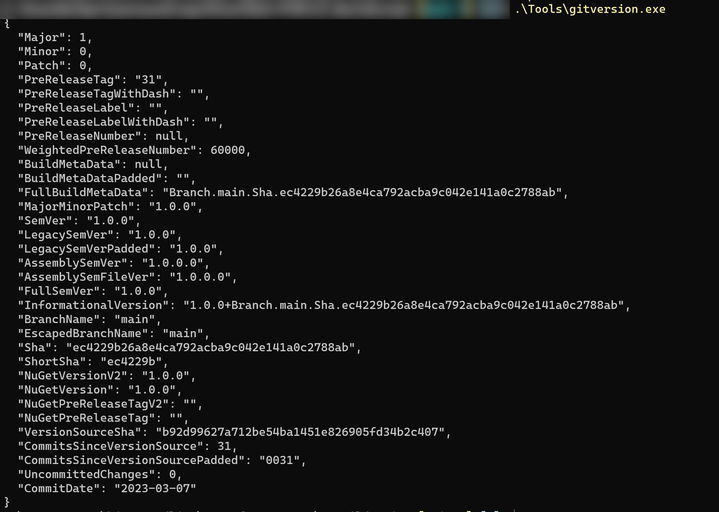
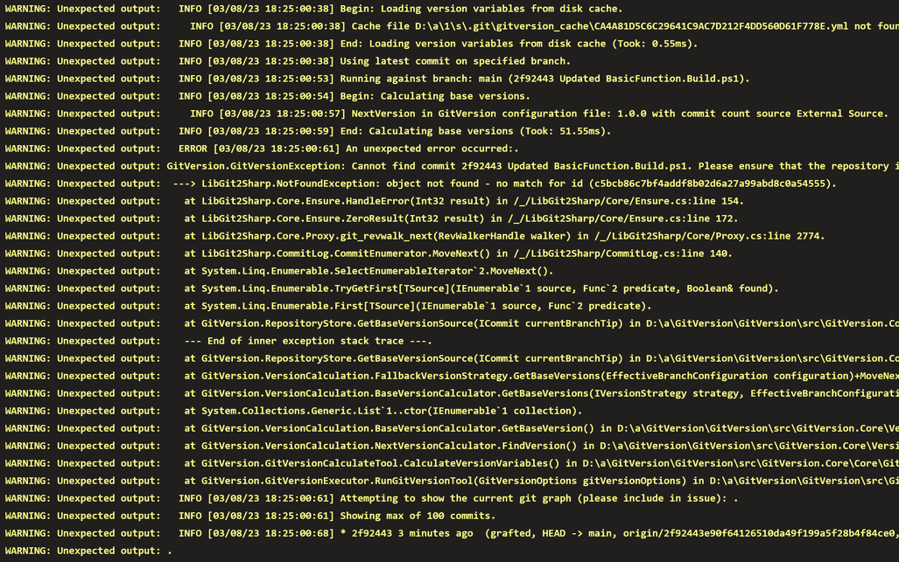

# On Azure DevOps, GitVersion, and the art of changing built in defaults...

I've been wanting to write something for quite some time now, but haven't really had the time.
Too much work on writing presentations.

Kicked it all of just last week by presenting on [ESMUG, East Sweden Microsoft User Group](https://www.meetup.com/east-sweden-microsoft-user-group/events/291158738/) and it felt really good to be back on stage (although we did disagree about what counts as east sweden 😁).

Next up that I know of is [PowerShell and DevOps global summit](https://powershellsummit.org/) like I've written about before, but after general rehearsal I feel ready for it. Can't wait!

So now, I'm currently working on my [PSConfEU](https://psconf.eu/) presentations, which, spoiler, brings us right in to this posts major topic.

## GitVersion

I've used [GitVersion](https://gitversion.net/) to and from for a long time now. Sometimes in pipelines, but honestly most of the time I just run it in my console.

It's a really nifty little tool that counts your commits, tags, and other "git stuff" and can tell you which [semantic version number](https://semver.org/) your release should have if you follow a particular strategy.

In this example I have created 31 commits, and no tags, and so my version is set as `1.0.0.31`. Neat, right?



## Setting up some basics in GitVersion

Noted above we are already at version 1.n, yet I am not using any tags or other Git stuff in my repository.

That's because I also include a config file in my repository.

You can initiate GitVersion by running the command `GitVersion.exe init` in any console. GitVersion will give you some options, and you can select your branching strategy, next version, and some more stuff.

After running this you will get a new file in your repository called `GitVersion.yml`. As I am a simple man that prefers simple solutions I am more or less only using the `next-version` flag. My entire file looks like this:

```yaml
mode: Mainline
next-version: 1.0.0
branches: {}
ignore:
  sha: []
merge-message-formats: {}
```

And I still manually bump major and minor by changing them here.

Whenever my module is ready to become 2.0.n, manually change and go. It might not scale for huge projects, but it works for me.

Put this file in the root path of your repository, check it in, and boom! you've simplified versioning.

## Adding it to your build script

I want my version to be calculated and updated on release as this is.. well... when I release updates. So the logical place to add GitVersion is of course out build script.

I use [InvokeBuild](https://github.com/nightroman/Invoke-Build) to compile my modules, and so I Add the following to my build script to calculate a version

```PowerShell
. $PSScriptRoot\Tools\gitversion.exe /output file /outputfile GitVersion.json
$GitVersion = Get-Content "$PSScriptRoot\GitVersion.json" | ConvertFrom-Json
$Version = '{0}.{1}.{2}' -f  $GitVersion.Major, $GitVersion.Minor, $GitVersion.PreReleaseTag
```

I later do some RegEx magic to replace the version number in my module manifest with this one, and we're ready to release a new version! 

Why use a file instead of piping the output directly you ask? Because reasons.

## Publishing a pipeline

Like I said, I most often just do this in my own console, but for my presentation I wanted to add GitVersion the above way to a pipeline. So I did. Add it to my `ModuleName.build.ps1` script, add the following to my pipeline yaml, and were done!

```yaml
displayName: Build 
inputs:
targetType: 'inline'
script: |
    Install-Module InvokeBuild -Force
    invoke-Build -File $(System.DefaultWorkingDirectory)/ModuleName.Build.ps1
failOnStderr: true
pwsh: true
```

In the before times at least.

## Invoke-Build and output

Invoke-Build is a really cool module for building modules. Except it isn't. A module that is. It is a .ps1 script wrapped in some magic, and code I am for to unskilled to understand, that does some really advanced stuff.

One of the "stuff" it does is capture output. 

So when I now added this all to my pipeline I got this:



There _is_ an error in there, but as Invoke-Build handles output weird it actually gets output to the Warning stream, and as such doesn't stop my pipeline. It took quite some time to just find the issue.

```Text
WARNING: Unexpected output: GitVersion.GitVersionException: Cannot find commit 2f92443 Updated BasicFunction.Build.ps1. Please ensure that the repository is an unshallow clone with `git fetch --unshallow`..
```

## The changing of defaults

So what has happened, and why can't we run GitVersion in our pipeline?

Turns out some time ago, in [September 2022](https://learn.microsoft.com/azure/devops/pipelines/yaml-schema/steps-checkout?view=azure-pipelines&wt.mc_id=DT-MVP-5005317#shallow-fetch) to be exact, Azure DevOps changed the default behaviour of the checkout task.

In Azure DevOps you normally don't even have to add a checkout step in order to get your sources. If no `checkout: self` step is added it does this automagically.

But in September -22 they changed how _much_ of the history it fetches. Instead of getting all git history to your build pipeline it only gets the last commit. This makes sense in a way as it can make the amount of data to download less.

But it also prevents GitVersion from counting commits.

So in order to get GitVersion working in Azure DevOps yaml pipelines we need to add the following to the job where we run GitVersion

```yaml
- checkout: self
  fetchDepth: 0
```

## Back to presentations

Oh, a sidenote: Before you spend half an evening debugging why GitVersion.exe doesn't work as expected, make sure you are running the correct host image. You can't run an .exe file on an ubuntu build host. Believe me, I tried. For over an hour before I realized my mistake.


But there, I finally got my pipeline working with GitVersion, and can continue writing presentations.

It's a hell of a lot of work, but so much fun, and I'm learning a lot on the way. I just need to get some time for blogging and code as well to keep my GitHub statistics up 😂

Until next time, happy versioning!
