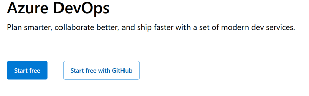
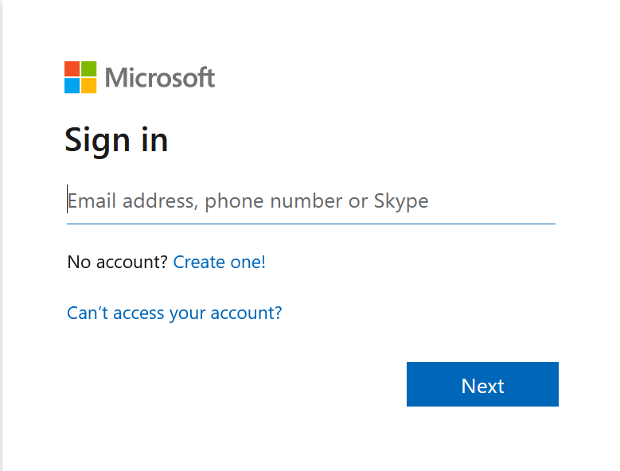
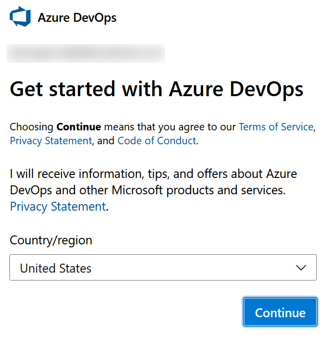
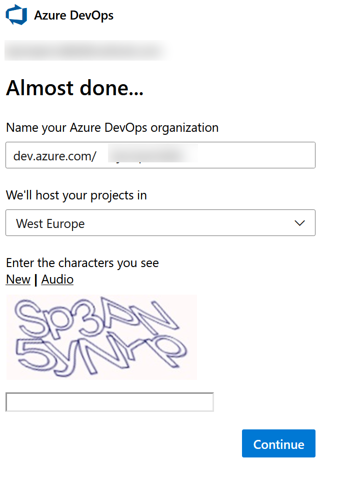
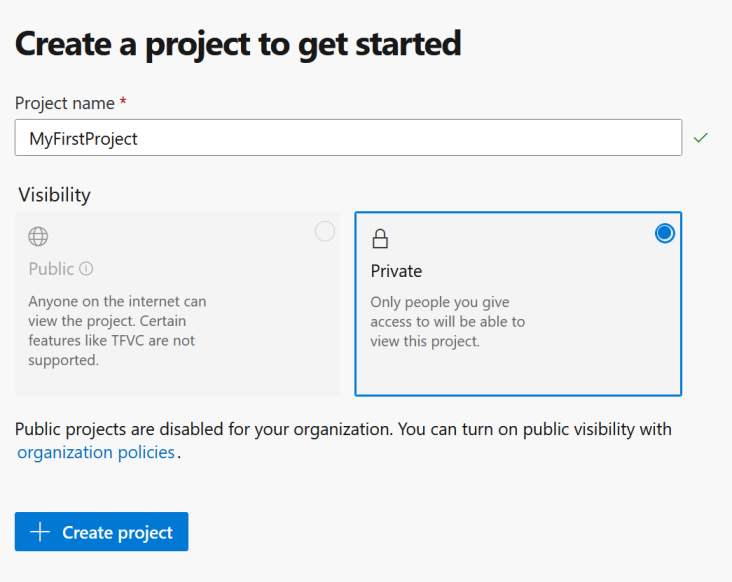
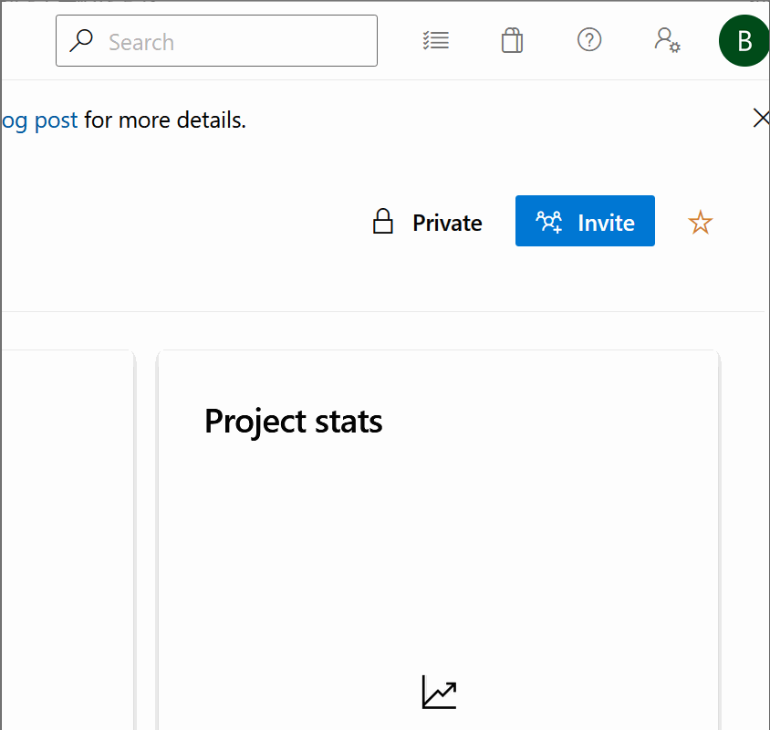
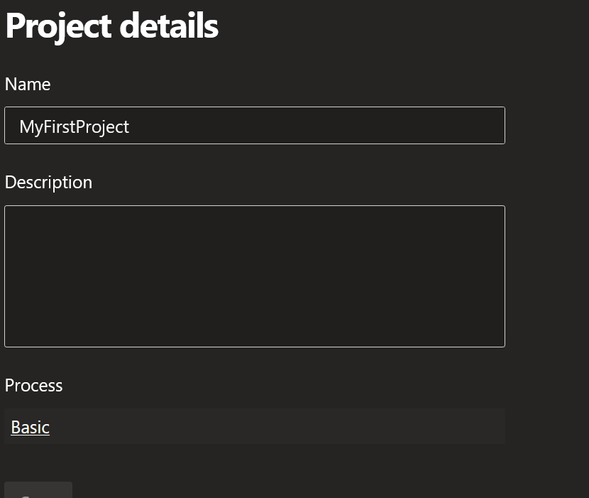
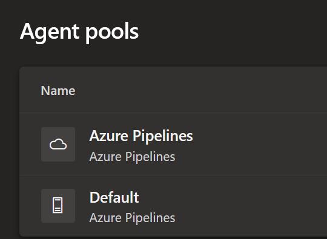
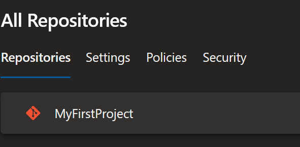

# Azure DevOps part I - The phantom DevOps

For a long time now I've been wanting to write more, but haven't really known what about. Most topics seems to special, to easy, to advanced, or to work related (can't really show what my customers do, right 😉)

But now it struck me. Azure DevOps. The system I spend most of my days in. From scratch.

There are so many things I just take for granted, and that I don't even think about when doing my day to day stuff, so let's write about that.

## A Long long time ago, in a DevOps nerd far far away...

So where do we start?

Well, how about the beginning?

I signed up and started using Azure DevOps a long time ago, So I bet the process of getting up and running has changed.

So lets start by going to [dev.azure.com](dev.azure.com) in a new and fresh browser session!

Initially we are greeted with a proper sales pitch page. A big button with "Start free" sounds quite like what we're looking for.

clicking this brings us to microsofts normal login and account creation setup. 

So let's go creating a new account here.

I decided to go with creating a new email address even, just to get the proper feeling, But I wont bore you with details here. Getting an account is something you should be able to figure out.

## You were right about one thing, Master. The negotiations were short

The first that you are greeted by in your new Azure DevOps setup is this:

After ~~Completely ignoring~~ carefully reading through the ToS, Privacy statement, and CoC, I picked "Sweden" in the drop down and continued.

Next up is naming your DevOps organization.The setup automatically suggests your email name, with any dots removed (`bjompen.plays@internet.se` becomes `dev.azure.com/bjompenplays`) so I went along with this.

## Now this is podracing!

After a couple of seconds of spinning wheels we're welcomed in to our brand new fancy Azure DevOps organization!

The first thing we are asked to set up is a Project. A "project" in Azure DevOps language is a separate entity of boards, repos, feeds, and all the other goodies that Azure DevOps gives us. I will try to follow up this bloggpost with more details on the different parts of Azure DevOps, but for now, let's just create one.

The first thing worth noting is that a newly created organization does not allow you to create public projects. Lets add to the list of future posts how to do those.

Again, after a few seconds of spinning wheels, our brand new organization is officially up and running, and we can start exploring it!

## We’ll take the long way

### Fear leads to anger. Anger leads to hate. Hate leads to suffering.

Before doing anything else, like a good developer, lets find the dark mode switch.

Good. Now we can work.

### User details

Going in to user settings, using the same menu as the theme switch, an interesting detail is that it does not seem to pick up your country and time zone properly.
Azure DevOps believes I am located in UTC time zone (I'm in UTC+2) and my default date format is 'dd/MM/yyyy', where Sweden normally uses 'yyyy-MM-dd'.

No biggie, not hard to fix, but interesting.

## And you, young Skywalker. We will watch your career with great interest.

(Yes, the quotes are far fetched, but I started the Star wars theme, I'm going to finnish it.)

### Boards

The project we created is of course in place, and looking in to the project settings the first thing I notice is that we're running a ['basic' process.](https://docs.microsoft.com/azure/devops/boards/work-items/guidance/choose-process?view=azure-devops&tabs=basic-process&wt.mc_id=DT-MVP-5005317)

The process template set here decides the layout of your tasks and boards.
This, like much else, I hope to go through in the future. For now, we're looking at defaults.

On the topic of boards we also have a sprint automatically created, `sprint 1`, but no dates set. If you're planning on using sprints, you should probably set this up.

The rest of board settings seems pretty basic. I'm no big fan of using boards, so lets leave it at that.

### Pipelines

as soon as your project is set up you have two [agent pools](https://docs.microsoft.com/azure/devops/pipelines/agents/pools-queues?view=azure-devops&tabs=yaml%2Cbrowser&wt.mc_id=DT-MVP-5005317) created.
- Azure pipelines. This is the pool for hosted agents in Azure, such as `ubuntu-latest`
- Default. Ment to be used to register your own self hosted build agents.

The default settings for pipelines are quite decent, but there are some things we will want to look at in the future.
For example, retention policies are set to 30 days. While this is good, we might need to adjust them to our company, and legal, standards. Same time goes for release retention as well, but since those are only for classic pipelines they probably shouldn't matter as much (after all, we're creating a new setup here..)

### Repositories

There is one default repo created, named the same as your project. Microsoft have set the default branch name to `main` which is good.

The default security and policy setup for your repos are pretty slack. For open source, or few contributors, this might work, But I'm definately going to dig in to lots of stuff here.

# Artifacts and Tests

Well, since we haev neither code, nor runs, nor artifacts, there really isnt much to see here..

## I can assure you they will never get me on one of those dreadful starships.

And with that I guess we can round up this episode I. A new Azure DevOps setup is created, and in the next post I will start looking in to using it.

So keep an eye out for *Episode II - Attack of the Git Clones* or some other bad pun... 

//Bjompen