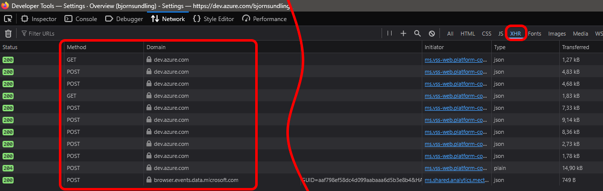

# Holy moly this is hard...

Writing a blog with somewhat regular posts that is. I am very much aware that I haven't, and I honestly kind of envy those who can write something once a month, or even once a week! How do you figure out topics? Granted I do get to do cool stuff in my day to day work, but not everything is new.

In fact - last couple of months there has been nothing really new at all.

I started doing _a lot_ of work with [PowerShell Universal](https://powershelluniversal.com/), and let me tell you - it is really really cool. Adam has done some seriously amazing stuff with it. Adam has also written _a lot_ about it, and I.. well, I can't really add anything he hasn't already written.

I have also not been to MVP summit or [PowerShell Summit](https://www.powershellsummit.org/). Mainly for political reasons - I do not in any way shape oir form want to support the regime - but I also kind of realized how close I was to a burnout after last year. I did I don't know how many sessions, traveled the world, and met some awesome peeps. Don't get me wrong, I love it, but even a labour of love is a labour, and sometimes I need to.. well.. not prepare for conferences.

And with that - I am of course also preparing for conferences! So far this year I am only doing [PSConf](https://psconf.eu/) which takes place im Malmö, Sweden. I am doing three sessions there (well, two and a half) and there is a lot of preparation - but I feel like I for once have energy to do it.

Who knows, there may be one or two more this year, but I am definately _not_ going to break yesteryears amount.

## Instead - let's do something else

One thing that has _very much_ fallen behind is coding. I haven't had time or energy. I hope to change this this year. But we are going to start easy.

[ADOPS](https://github.com/AZDOPS/AZDOPS) - "My" toolkit / api wrapper for managing Azure DevOps - has slowly been growing. Slowly because I have been more focused on [AzDM](https://github.com/AZDOPS/AzDM) - The bastard sibling managing framework - andonly added functionality I needed for that.

But there are others helping out as well. One of those people I truly admire and love to hang around with is [Sebastian Cleasson](https://github.com/SebastianClaesson), Generally smart guy and supoer cool dude. He know stuff I dont, and amongst them he know a framework called [Maester](https://maester.dev/).

Apparently you can use Maester to test and verify your security settings using [Pester](https://pester.dev/), and what tool to use to create tests for Azure DevOps settings?

ADOPS!

And so Sebbe created a massive [PR with functionality for Maester](https://github.com/AZDOPS/AZDOPS/pull/244/). As of this writing it is not yet merged, but I expect it to be soon.

That is not what I am going to write about today..

But it did lead me down a rabbit hole.

In this code Sebbe is exploring some unsupported Azure DevOps APIs. This is something I have explored earlier as I sort of stumbled upon a lot of things mentioned in [this old post](posts/SomethingAmazing.md). But Sebbe is also using other base URIs that I have not seen before. Which got me thinking:


## Finding all the endpoints

We could of course go about reading the entire [API docs page](https://learn.microsoft.com/rest/api/azure/devops?view=azure-devops-rest-7.2&wt.mc_id=DT-MVP-5005317), and truth be told I think I am going to do so in a future itteration of this post, but there are other ways.

When clicking aroung in Azure DevOps we often use the same base URI as we do for API calls, and Firefox developer mode can help us here. Basically, we fire up [Developer Tools (F12)](https://developer.mozilla.org/en-US/docs/Learn_web_development/Howto/Tools_and_setup/What_are_browser_developer_tools) and click through every single page and setting we can find in Azure DevOps. Set the Developer Tool display to `XHR` to only get the actual calls, and not stuff like Javascripts, cookies, and other stuff we dont care about.



Once we have done so we can right click in the list of calls/responses and select `Save all as HAR` to save the entire capture in json format.

I actually did so twice, once for every organization setting, and once for every project setting.

Since json is easy to work with we can now import the capture, only get the urls used, and using the `[uri]` accelerator we can export only the hostnames.

And so we start with this:

```PowerShell
$r = (Get-Content '.\Downloads\dev.azure.com_Archive `[25-04-13 20-50-27`].har' | ConvertFrom-Json).log.entries.request.url
$r += (Get-Content '.\Downloads\dev.azure.com_Archive `[25-04-13 20-44-39`].har' | ConvertFrom-Json).log.entries.request.url

$res = $r | ForEach-Object {([uri]$_).host} | Select-Object -Unique
```

But we're not done yet 😉

## Clicking through the docs? Nah..

The API specs for Azure DevOps are actually open source. Although this repo per se is not ment for public consumption - something we can conclude from the lack od readmes - the api spec is actual available on [GitHub](https://github.com/MicrosoftDocs/vsts-rest-api-specs)!

And not only that - since they are made for [DocFX](https://dotnet.github.io/docfx/) the docs are in a standardized json format. Good stuff. Not because we need to parse json, but we can now safely know the format of the url key and use some RegEx to get the data straight from file which is faster.

I don't need to clone them, but searching is easier on disk, so a quick `Download Zip` and extracting lets us index these pages using some simple PowerShell

```PowerShell
$res += (Get-ChildItem .\Downloads\vsts-rest-api-specs-master -Recurse | 
        Select-String -Pattern '"host":\s+"(?<host>[^"]+)",').Matches.Groups.Where({$_.Name -eq 'host'}).value | 
        Select-Object -Unique
```

And so we have yet anouther batch of URIs to look at..

But we're not done yet 😉

## Sorting the uris

There are some URIs that are malformed, some placeholders, and some other stuff going on, so we are going to end it with a bit of cleanup.

```PowerShell
$r = (Get-Content '.\Downloads\dev.azure.com_Archive `[25-04-13 20-50-27`].har' | ConvertFrom-Json).log.entries.request.url
$r += (Get-Content '.\Downloads\dev.azure.com_Archive `[25-04-13 20-44-39`].har' | ConvertFrom-Json).log.entries.request.url

$res = $r | ForEach-Object {([uri]$_).host} | Select-Object -Uniquee

# No I would not break the lines on pipe normally, but for readabillity it does work..
$res += (Get-ChildItem .\Downloads\vsts-rest-api-specs-master -Recurse | 
        Select-String -Pattern '"host":\s+"(?<host>[^"]+)",').Matches.Groups.Where({$_.Name -eq 'host'}).value | 
        Select-Object -Unique

$res = $res.Where({
    ($_) -and 
    ($_ -notlike "{*}*") -and 
    ($_ -notlike "*fabrikam*") -and
    ($_ -notlike "browser.events*") 
}) | Select-Object -Unique

$res | Sort-Object
```

This gives us a nice output looking a bit like this

```PowerShell
advsec.dev.azure.com
aexprodweu1.vsaex.visualstudio.com
almsearch.dev.azure.com
amcdn.msftauth.net
app.vssps.visualstudio.com
artifacts.dev.azure.com
auditservice.dev.azure.com
azcommprodcus1.commvtwo.visualstudio.com
azdevopscommerce.dev.azure.com
azloadtest.gallery.vsassets.io
<myEntraDomain>.gallery.vsassets.io
browser.events.data.microsoft.com
cdn.vsassets.io
dev.azure.com
extmgmt.dev.azure.com
feeds.dev.azure.com
js.monitor.azure.com
marketplace.visualstudio.com
ms-securitydevops.gallery.vsassets.io
ms.gallery.vsassets.io
ms.gallerycdn.vsassets.io
pkgs.dev.azure.com
sariftools.gallery.vsassets.io
spsprodeus25.vssps.visualstudio.com
status.dev.azure.com
vsaex.dev.azure.com
vsblob.dev.azure.com
vsrm.dev.azure.com
vssps.dev.azure.com
vstmr.dev.azure.com
```

but we're not done yet 😉

## What to do with a list like this?

Well - If we once again look back at [this old post](posts/SomethingAmazing.md) we know that we can use an `Options` flag to a request. If it works this will give back all the endpoints this one supports. The problem is this though

- Some endpoints needs the named organization (f.eg `https://dev.azure.com/myOrg/_apis/`)
- Some endpoints target the root directly (f.eg `https://status.dev.azure.com/_apis/`)
- There are edgecases that lives outside of this list (mor on that soon..)

Back to some PowerShell magic and we can see which of these endpoints may be hiding something cool

This time we assume you have the [ADOPS module](https://www.powershellgallery.com/packages/ADOPS/) installed and have connected using [Connect-ADOPS](https://github.com/AZDOPS/AZDOPS/blob/main/Docs/Help/Connect-ADOPS.md)

```PowerShell
$objRes = foreach ($u in $res) {
    try {
        $respUri = "https://$u/<myAzureDevOpsOrganization>/_apis/"
        $v = Invoke-ADOPSRestMethod -Uri $respUri  -Method Options
        if (-not($null -eq $v)) {
            $opt = $true
        }
        else {
            $opt = $false
        }
    }
    catch {
        try {
            $respUri = "https://$u/_apis/"
            $v = Invoke-ADOPSRestMethod -Uri $respUri -Method Options
            if (-not($null -eq $v)) {
                $opt = $true
            }
            else {
                $opt = $false
            }
        }
        catch {
            $opt = $false
            $respUri = 'none'
        }
    }
    [PSCustomObject]@{
        uri        = $u
        hasOptions = $opt
        respUri    = $respUri
    }
}
```

And from this we can now get a list of all roots available to us using an authenticated Azure DevOps session

```PowerShell
$objRes | Where-Object {$_.hasOptions} | Sort-Object Uri
uri                                      hasOptions respUri
---                                      ---------- -------
advsec.dev.azure.com                           True https://advsec.dev.azure.com/<myAzureDevOpsOrganization>/_apis/
aexprodweu1.vsaex.visualstudio.com             True https://aexprodweu1.vsaex.visualstudio.com/_apis/
almsearch.dev.azure.com                        True https://almsearch.dev.azure.com/<myAzureDevOpsOrganization>/_apis/
app.vssps.visualstudio.com                     True https://app.vssps.visualstudio.com/_apis/
artifacts.dev.azure.com                        True https://artifacts.dev.azure.com/<myAzureDevOpsOrganization>/_apis/
auditservice.dev.azure.com                     True https://auditservice.dev.azure.com/<myAzureDevOpsOrganization>/_apis/
azcommprodcus1.commvtwo.visualstudio.com       True https://azcommprodcus1.commvtwo.visualstudio.com/_apis/
azdevopscommerce.dev.azure.com                 True https://azdevopscommerce.dev.azure.com/_apis/
dev.azure.com                                  True https://dev.azure.com/<myAzureDevOpsOrganization>/_apis/
extmgmt.dev.azure.com                          True https://extmgmt.dev.azure.com/<myAzureDevOpsOrganization>/_apis/
feeds.dev.azure.com                            True https://feeds.dev.azure.com/<myAzureDevOpsOrganization>/_apis/
marketplace.visualstudio.com                   True https://marketplace.visualstudio.com/_apis/
pkgs.dev.azure.com                             True https://pkgs.dev.azure.com/<myAzureDevOpsOrganization>/_apis/
spsprodeus25.vssps.visualstudio.com            True https://spsprodeus25.vssps.visualstudio.com/_apis/
status.dev.azure.com                           True https://status.dev.azure.com/_apis/
vsaex.dev.azure.com                            True https://vsaex.dev.azure.com/<myAzureDevOpsOrganization>/_apis/
vsblob.dev.azure.com                           True https://vsblob.dev.azure.com/<myAzureDevOpsOrganization>/_apis/
vsrm.dev.azure.com                             True https://vsrm.dev.azure.com/<myAzureDevOpsOrganization>/_apis/
vssps.dev.azure.com                            True https://vssps.dev.azure.com/<myAzureDevOpsOrganization>/_apis/
vstmr.dev.azure.com                            True https://vstmr.dev.azure.com/<myAzureDevOpsOrganization>/_apis/
```

Thats an impressive list of APIs we can explore!

but we're not done yet 😉

## Edgecases, weird stuf, and next step

Actually - for now I am done. I wont dig deeper right now. But there are more stuff to figure out.

For example - I already know what some of these endpoints do such as `advsec` for GHAzDO.. but the rest?

But there is another issue: I _know_ there are endpoints not in this list. How do I know? Well - Lets go back to [Sebbes PR](https://github.com/AZDOPS/AZDOPS/pull/244/) and look at some of the functions. For example we have this line `(InvokeADOPSRestMethod -Uri "https://azdevopscommerce.dev.azure.com/$OrganizationId/_apis/AzComm/MeterUsage2" -Method Get).value` in the function `Get-ADOPSOrganizationCommerceMeterUsage`. The thing is - azdevopscommerce _does not work with organization name or id according to my tests_.. So where does this come from? I don't know - it only works with the `Get` method, nothing else that I have found.

We also have this one `$Uri = "https://dev.azure.com/$Organization/_api/_versioncontrol/AllGitRepositoriesOptions?__v=5"` from the function `Get-ADOPSOrganizationRepositorySettings`. Notice anything different in this one? theres no S in the `_api` part of the URI. This is the only page I have encountered that use `_api` instead of `_apis`.. Interesting.

But it is a start. I now have at least 20 URIs that seems to publish stuff we can look at. more stuff to dig in to and more rabbit holes to drown in.

And maybe, just maybe, more posts to write.

## But for now

I am going to look at some presentation material for PSConf. Today is "TDD" day.

Or maybe just play some Fallout 4 instead. I dont need to do presentations every day. I wish last year Björn had known.

Until next time, Internet!
