# Azure DevOps part II - Attack of the Git Clones

After a brief intervention of getting my brand spanking new Outlook account blocked I'm back for another chapter of exploring Azure DevOps.

Apparently "logging in to Azure DevOps" is considered "strange and/or unallowed account usage" or smth according to Microsoft.

Anyhow, After creating an account and setting stuff up I thought we'd start by setting up some repo defaults and getting some code in place. "Why not start with the top of the list, boards!" I hear you ask...

Becuase boards are boring and I dont want to. 

## Padmé Amidala: You're not all-powerful, Ani
## Anakin Skywalker: Well, I should be

When creating and naming your first project, Azure DevOps is friendly and creates a default repo for you named the same as your project. Going to this repo greets you with a really nice and helpful "Get Started" page.

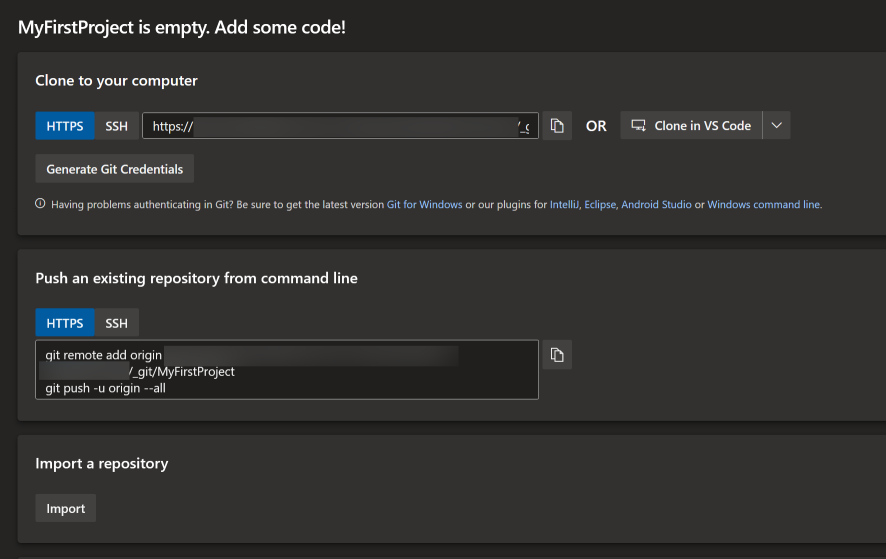

This of course can be really helpfull, but I want to set some better defaults before starting.

## This separatist movement, under the leadership of the mysterious Count Dooku, has made it difficult for the limited number of Jedi Knights to maintain peace and order in the galaxy

The first thing we should do is setting up some default git security.

Like most things in Azure DevOps, Git security is set on approximately [forty thousand bilion](https://www.youtube.com/watch?v=pPpcdTzALWE) different levels.

By clicking `Project Settings` -> `Repositories` we find a menu where all our existing repos are found.

We can also set some project wide standards here, so lets start with those.

### Settings

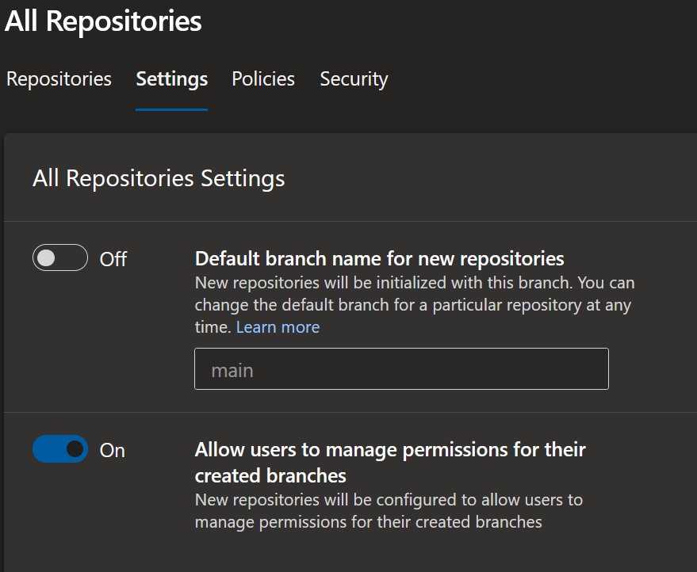

The Default repositories settings allows you to change default branch names, which I wont, Main is good, but more interesting is the ["Allow users to manage permissions..."](https://docs.microsoft.com/en-us/azure/devops/release-notes/2021/sprint-192-update#configure-branch-creators-to-not-get-manage-permissions-on-their-branches) setting.
By default, any user can change access on a branch that user creates, so if "user1" creates a branch, he can give "externalHacker" access to that branch. If you set up your access properly this wont be a big problem, but it might be worth turning off.

### Policies

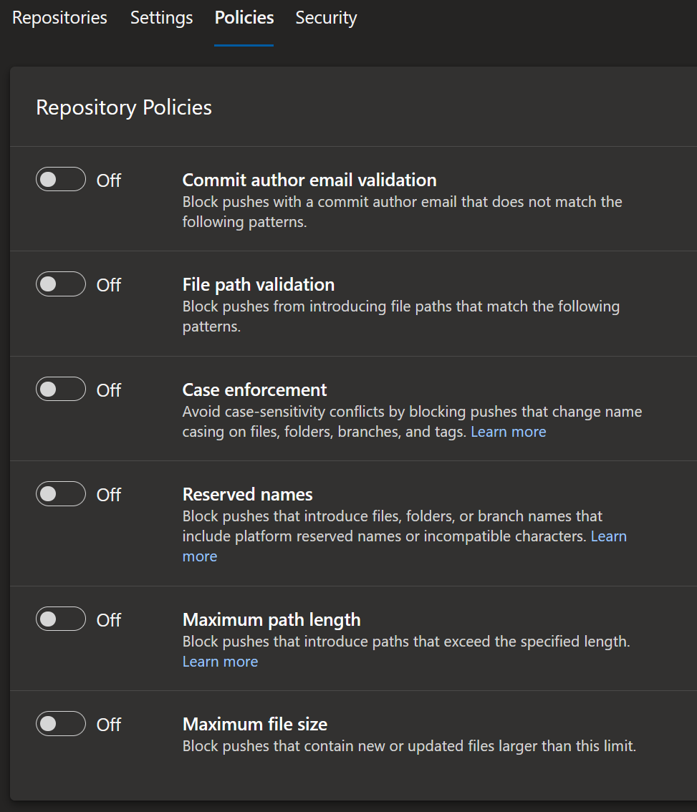

Next up is policies. It would be easy to think the "Commit author email validation" setting could be useful as a security setting, but alas no, you can set any email address in your git config, hence this setting is not a security measure.

The rest of the settings I can see clear values of activating if you, f.eg, work in a mixed plattform environment (Case enforcement), have a multitude of files and paths (maximum path length), or just want to make sure noone checks in the lates version of Windows server ISO (maximum file size).

More interesting though is the bottom setting - Branch policies

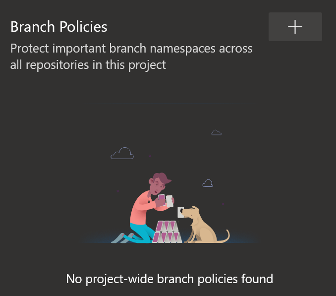

Byclicking the `+` here we can create global security policies for either all `Default branches` such as "main", or `current and future branches matching a specified pattern` for even more flexibility.

Once in the `Policies for default branch` window there are some really usefull settings

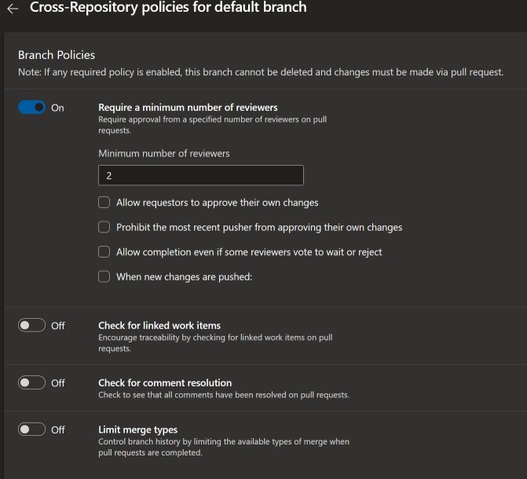

One thing we would want to activate is the `require a minimum number of reviewers` setting. This enforces at least the selected amount of people to do a code review before a pull request can be merged to the main branch. Given we should always apply a [four eyes principle](https://www.openriskmanual.org/wiki/Four_Eyes_Principle) we will want this.

The other settings are really usefull if you use boards, but for now, let's leave them.

Last bur not least on this page, we can set `Build validation`, `Status checks`, and `Automatically include reviewers`. The latter of theese will allow you to not having to add yourself as code reviewer on every pull requestm which can be usefull. The first two though, are really usefull, and really big. In fact, they are both so big I will create a full blogg post about those two alone in the future.

### Security

The last tab here is the security tab.

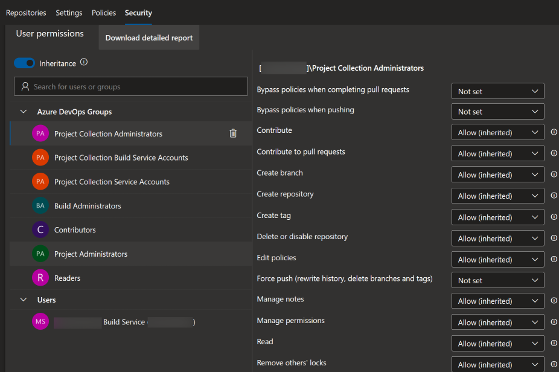

Some pretty standard ACL style access lists? Yes, but the important thing to note when it comes to ACL in Azure DevOps is that ACLs can be set on `Projects`, `Repositories`, `branches`, `tags`, and probably some other places to. There's a good reason [the docs chapter on it is big](https://docs.microsoft.com/en-us/azure/devops/organizations/security/about-permissions?view=azure-devops&tabs=preview-page), and we will use this in out advantage to create a good security baseline in a few sentences..

### But first, back to the first tab, "repositories"

... and clicking on the default created repo name lets us see an almost identical setup as the one we just looked at, but this time scoped to _only the default repo_.

I tould you there are lots of levels of security here.

## I'm programmed for etiquette, not destruction!

What I want to do now is setting up a good default Git branching strategy, enforced using security settings, and on all my repos, exisitng and new.

First, of course, we need to figure out [what strategy to use](https://docs.microsoft.com/en-us/azure/devops/repos/git/git-branching-guidance?view=azure-devops) which can be a chapter of its own, but I usualy prefer a simple version of the [GitHub flow](https://www.w3schools.com/git/git_github_flow.asp)

According to [Microsofts documentation on branch policies](https://docs.microsoft.com/en-us/azure/devops/repos/git/require-branch-folders?view=azure-devops&tabs=command-line) The only way to do this is by using the `tf.exe` tool, like I wrote a couple of days ago.

## Anakin, don't do anything without consulting either myself or the Council

In order to move on and set things up we need to create ourselves a Personal Access Token, PAT. In most Azure DevOps API scenarios we need this to authenticate.

Bu clicking our `settings` button, and `Personal access tokens` we reach the token creation menu.

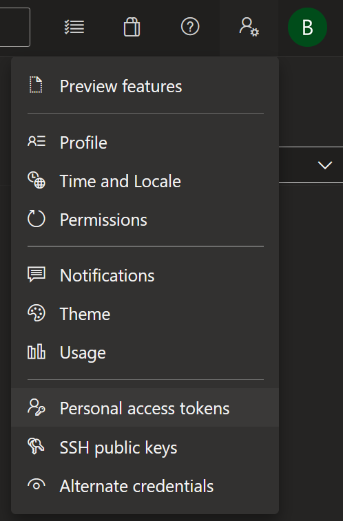

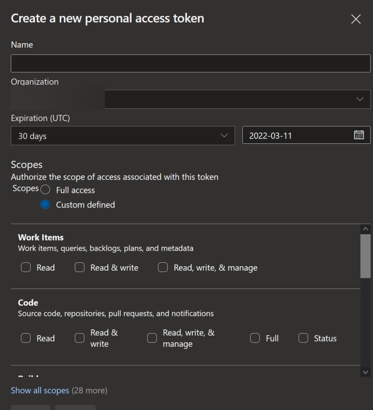

There are a lot of things we can set here, and of course you should only select the scopes needed for the action you're taking, but for simplicity, let's add one with `Full access` and instead set a realy short lifetime to make sure we have no secrets laying around.

## Protect the senator at all costs

Using my PowerShell command `Set-AzDoRepoPermission` we can now instead run the following command:

```PowerShell
Set-AzDoRepoPermission -AzDoUserName 'bjompensPlayAccount@MyEmail.com' -AzDoToken 'MyNewlyCreatedAzreDevopsPAT' -OrganizationName 'BjompensPlayOrganization' -ProjectName 'MyNewlyCreatedProject' -GroupName '[MyNewlyCreatedProject]\Contributors' -Deny CreateBranch
```

Notice the group name corelates to the project name? This group is scoped to the current project.

This command sets a default deny of the "contributors" group to create any branches, on all exisiting and future branches. Good, right? well, almost.

Since we actually do want people to help us we need to allow contributors to create the branches we want, feature/* in this case, And this can't be set globaly without having a repo name. We need to get back to this in a flash.

## This is just the beginning!

So let's go back to where we started, the repository settings for our default, still data-less, repo, and verify that our access policies are good.

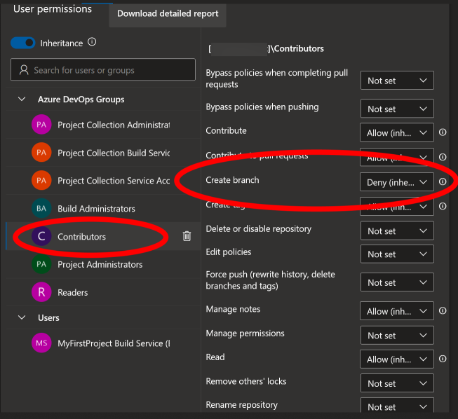

Default setting is deny, So lets initialize the repo and create some branches.

Hovering over the `Repos` button and selecting `Branches`

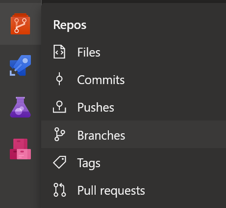

Gets us to the branches page (who could have imagined! 🤯)

Since we have no files here, the page looks just like the default repo page.

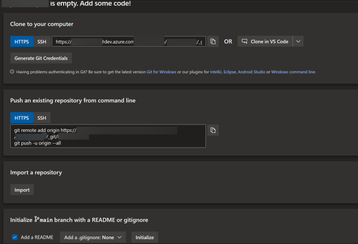

There are of course many ways to "start" a repo, but since there's more security to be done, lets just start by clicking the "Initialize" button, and...

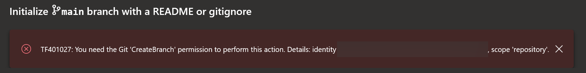

What? Did we destroy our setup before we even got some work in there? No.

## And don't forget, she's a politician, and they're _not_ to be trusted

Azure DevOps security is based on a lowest privilige setting.

When you create a new project in Azure DevOps a whole lot of things happen in the background, one of which is creating a default team (pretty much the same thing as a group, but scoped differently) and adding your user to this team. It also adds this team to the "[ProjectName]\Contributors" role that we just set deny on.

Since I created the organization I am also a member of the administrator group, and the project team is not necessary for me right now, so going to `Project settings` -> `Teams` -> `My project team` and simply removing myself from there is good for now.

So back to branches, and clicking `Initialize` again.

## Welcome home Lord Tyranus. You have done well

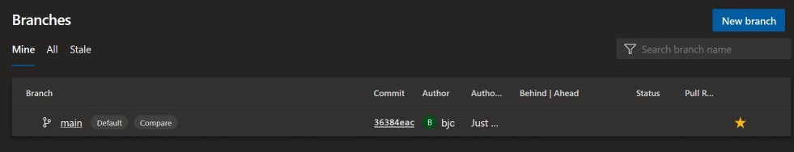

Now we can finally click the `New branch` button to create a feature branch, and verify it works as expected for our admin.

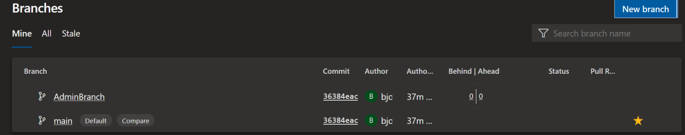

As I didn't set any policies on my admin user, I can create any branches I want.

but logging in as a guest user:

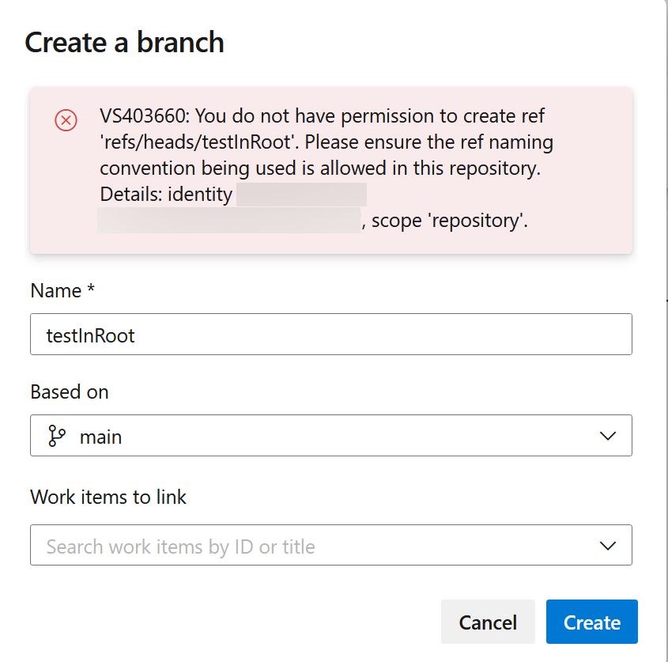

### So let's add the branch policy

by going back to our console and running

```PowerShell
Set-AzDoRepoPermission -AzDoUserName 'bjompensPlayAccount@MyEmail.com' -AzDoToken 'MyNewlyCreatedAzreDevopsPAT' -OrganizationName 'BjompensPlayOrganization' -ProjectName 'MyNewlyCreatedProject' -GroupName '[MyNewlyCreatedProject]\Contributors' -Allow CreateBranch -branch 'feature' -RepoName 'MyFirstRepo' 
```

and trying to create a feature branch...

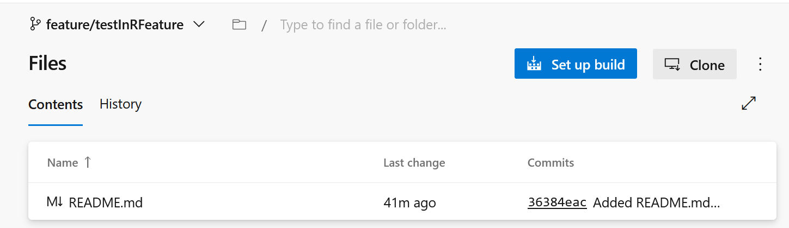

Success!

## I've heard this lesson before

So where does this leave us today?

Well, this turnd out way longer than I expected, and way more confusing, but we have at least managed to set up some basic security, a branching strategy, and most important of all: _We explored some more things_

Hopefully we'll be back for pt.3 in an odd week or two, when we will start setting up our pipelines!

until then: May the force be with you!
