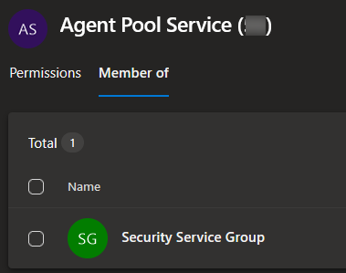
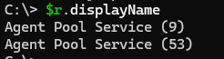
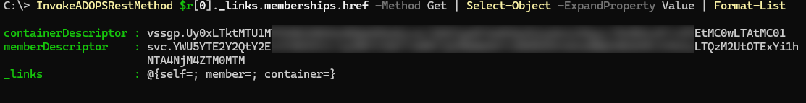
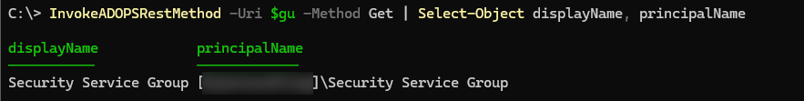
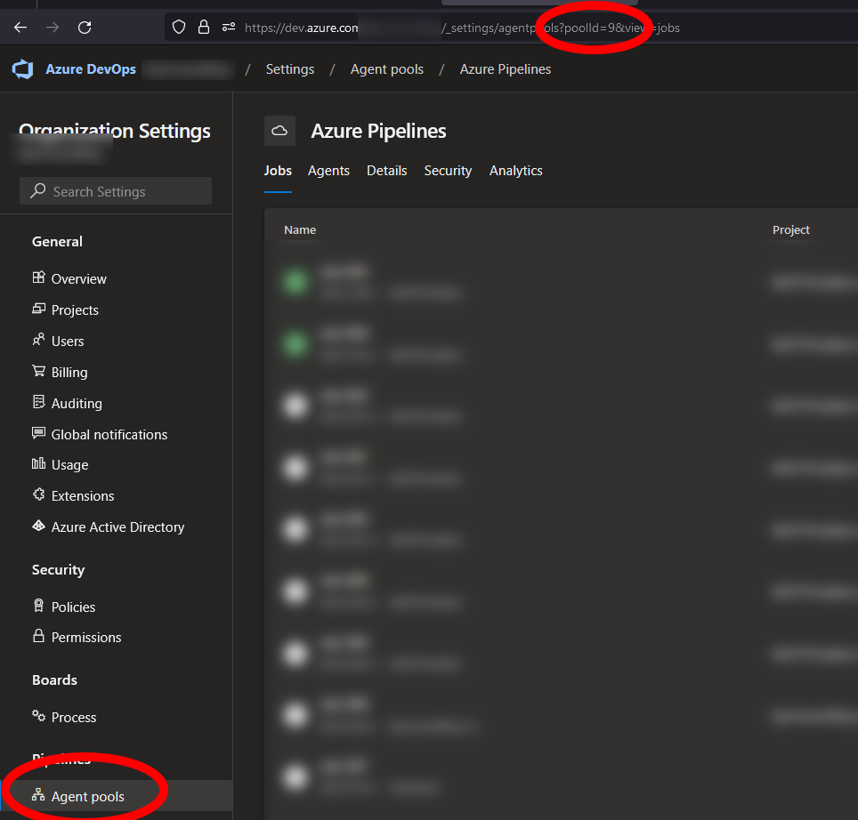
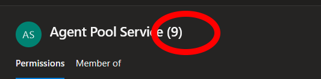

# It's alive!


I Wrote some time ago in a side note that my Azure DevOps organization hosted images stoped working.

Well, It work again, and I thought that in order to really check it of my list I'd write down what happened and how it was solved.

## Some background story

Every Azure DevOps organization comes with a number of built in service accounts. You can find them by going to `Organization settings` -> `Permissions` -> `Users`.

Basically these are accounts that makes sure your stuff  such as service connections, board connections, Build services, and more run. Of course, Like always, there's a brilliant [MS learn page describing this.](https://learn.microsoft.com/azure/devops/organizations/security/permissions?view=azure-devops&tabs=preview-page&wt.mc_id=DT-MVP-5005317)

One of these accounts, the [agent pool service](https://learn.microsoft.com/azure/devops/organizations/security/permissions?view=azure-devops&tabs=preview-page&wt.mc_id=DT-MVP-5005317#service-accounts), takes care of, amongst other things, sending the "startup" command to your Azure hosted agent pool (commonly called `Azure Pipelines` in your organization)

Now if you read the above linked learn page, it rather specifically states

> In most cases, you should not have to manage members of this group. The agent registration process takes care of it for you.

Well it turns out sometimes it doesn't.

## I spent some time trying to figure this out myself

before I created a case over at [the dev forums](https://developercommunity.visualstudio.com/t/hosted-agents-hang-with-pool-provider-s/10152498), and after they couldn't figure it out I got in contact with the [Microsoft Support team for Azure](https://portal.azure.com/#view/Microsoft_Azure_Support/HelpAndSupportBlade) DevOps, and got some excelent support.

And it turns out for some reason my organization has created a new `Agent Pool Service` account, but forgot to add it to the `Security Service` group, and hence it couldn't send the start commands.

Thats the short of it.

## So lets look at how to find and solve this issue

First of all we need to verify what service account we are working with. The easiest way to see this is to go to the permissions page, and the user tab. The Default name for these accounts is `Agent Pool Service (nn)` where `nn` is a unique number.

Once you've found it, click on it to verify that it is a member of the `Security Service Group`



Unfortunately when we checked this we got the impression that it was correct and we needed to go in to the API to verify stuff.

The reason is simple and stupid: We never got around to verify the account we checked was the account actually running and you may have more than one of these accounts. You normaly dont, but you may. I can't really figure out why my organization decided to create a new one, but it correlates strangely in time to when I started messing about with undocumented APIs..

## Using the API to find pool agent users

There is no easy way that I know of to connect all of the needed pieces here together, but lets see what we can find out.

To start with, using the users API we can get all users. Users whos domain property is `AgentPool` is, logically enough, agent pool users.

The uri we need is "https://vssps.dev.azure.com/$Organization/_apis/graph/users?api-version=6.0-preview.1", but I'm using the [ADOPS](https://github.com/AZDOPS/AZDOPS)module right now.

```PowerShell
$r = Get-ADOPSUser | Where-Object -Property Domain -eq 'AgentPool'
$r.displayName
```



Ok, we have our possible accounts, and can go check group memberships.

Using this object we can now go fetch the group memberships of our user

```PowerShell
# Yes, we are missing a command for this.. working on it.
# Im using the internal function InvokeADOPSRestMethod to use my exising connection
InvokeADOPSRestMethod $r[0]._links.memberships.href -Method Get | Select-Object -ExpandProperty Value | Format-List
```



The resulting objects is the group descriptors which we can use to get the group.

```PowerShell
# Again using the InvokeADOPSRestMethod command
$GroupDesc = InvokeADOPSRestMethod $r[0]._links.memberships.href -Method Get | Select-Object -ExpandProperty Value | Select-Object -ExpandProperty containerDescriptor

# Notice the {} around the variable name. see link*
$gu = "https://vssps.dev.azure.com/$organizationName/_apis/graph/groups/${GroupDesc}?api-version=6.0-preview.1"

InvokeADOPSRestMethod -Uri $gu -Method Get | Select-Object displayName, principalName
```



[* on variables](posts/variables.md)

So using this, and a bit of loop magic instead of `$r[0]`, we can now verify and add the groups that is not members of the `Security service group`

## But which service account is _actually_ being used to start this specific pipeline?

Well, truth be told I still haven't found an API that exposes this to me. Might be something hidden in the [undocumented stuff?](posts/SomethingAmazing.md)

The default is that the id of your agent pool, which can be found in your URL by going to `organization settings` -> `Agent pools`



seems to be the same ID within the parenthesis in the user account



I might dig more in this rabbit hole whenever I have the time, but right now I have other things to do.

For now I am at least happy my organization is up and running again so I can focus on other more interesting stuff.

## Post findings wrap up

So after this is up and running again I have a couple of new tasks to do... So note to self:

- Create some new functions in ADOPS for the above needed stuff
- Finally set up me demo repos for my [Azure Iceland user group presentation](https://www.facebook.com/events/411611144305159)
- Stop testing everything I can and messing up my organization all the time 😂

For now, untill next time.
