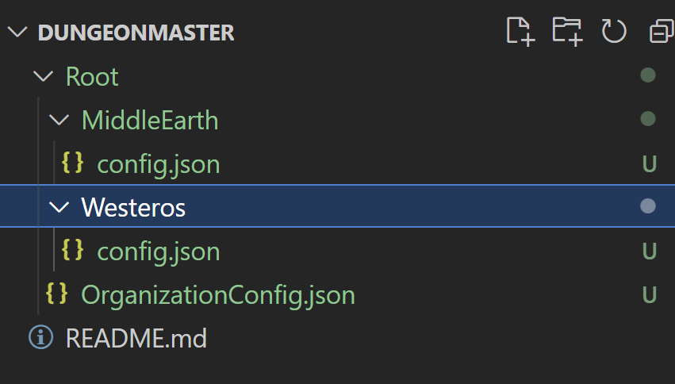
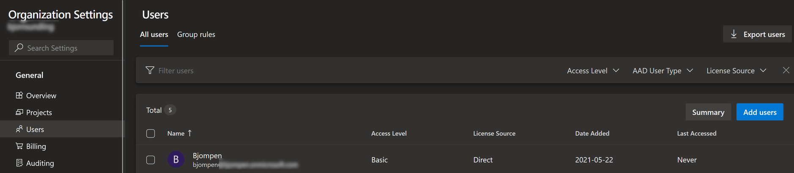
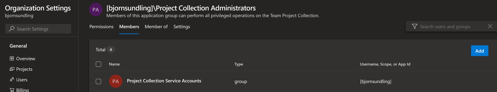
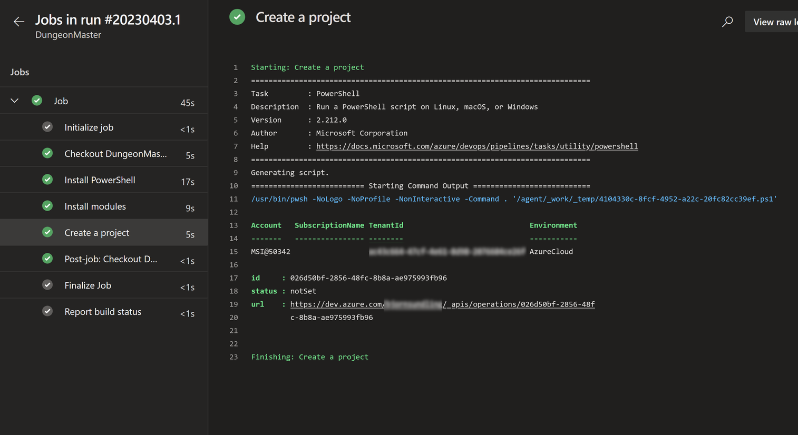
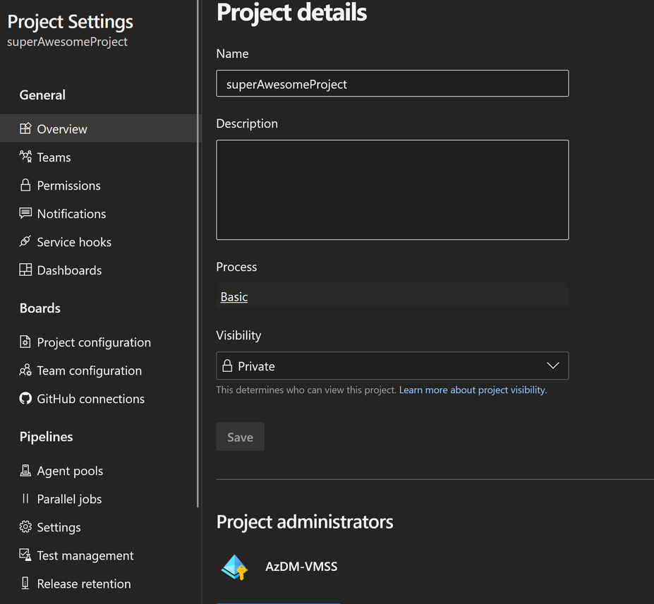

# Managed identity support in Azure DevOps

I truly can't think of any fancier or better headline. 

Normally I start my posts with some witty, funny, or random story from life, but this is the biggest thing that has happened since last post.

[The Azure DevOps team released support for managed identities!](https://devblogs.microsoft.com/devops/introducing-service-principal-and-managed-identity-support-on-azure-devops/)

So why is this such a big deal? It finally makes managing Azure DevOps possible without using personal accounts!

> But Bjompen, personal accounts are what we _should_ use. Non personal accounts can't be traced!

Well yes, but also, no. 

So today let's take a first look on how we can do some cool stuff with this new fangled feature we've been yelling about.

We're going to create a first early alpha preview simple version of something I so far call "AzDM"

## What "is" AzDM?

So far nothing, because I have just started it, but the plan is to manage Azure DevOps in a similar way to how [AzOps](https://github.com/Azure/AzOps) does it for Azure.

I'm thinking a Git structure something like this



Root, in this case, means "Manage everything inside this namespace". This lets us ignore certain projects, such as the one running our automation. Basically, we do not want a pipeline to be able to delete itself and its own project.

Under this level we have folders representing projects. This will have our automation and pipeline creating and managing the projects "MiddleEarth" and "Westeros".

json files represents settings in every scope, global and project wide. Settings can be such things as groups, access, default git settings, default pipelines, and more depending on how long I care to play with it.

Like I said, I just started this.

So what does this have to do with managed identities?

Well guess who's going to build it?

Today we're going to set up a project in Azure DevOps, with a pipeline running on a self hosted VMSS with a manged identity that can create projects in my Azure DevOps organization. We have to start somewhere.

## Setting up a VMSS

Since we [already have done this in another post](posts/AzdoVMSSBicep.md) I'm not going to go in to details on this. The important things that we need to think about is this:

- We should isolate this VMSS in either it's own subscription or at least a separate resource group. Remember, this VMSS will have _a lot_ of access to our systems. 
- We need a system assigned managed identity on our scale set
- We do not need any network connectivity except to fetch software
- If we use the default MS Ubuntu image we will need to manually install some software in the pipeline.

Once we have our VMSS set up it's time to connect it to our Azure DevOps project. This process can also be found in my [earlier posts](posts/AzdoVMSS.md) so no need to repeat myself.

What I can say is that I've set up a separate project to easier isolate this one from the ones we want to manage.

## Importing a managed identity

One thing that differs between a managed identity and a normal user is the concept of "discovery".

Normally, the first time a user logs on to Azure DevOps, a number of checks are applied such as what license you have, or if your account is tied to a visual studio account, and you are granted access based on these results.

But a managed identity cant log on to a gui, and so no discovery can be done. Instead we have to manually import our managed identity to our Azure DevOps organization.

This can be done by going to "Organization settings -> Users -> click Add users"



Followed by adding the user to the Project collection administrator group



But clicky makes me feel.. icky..


(get it?! clicky?! icky.. cl icky! I'm so funny sometimes!)

Were going to do it using the ADOPS module! It may require a bit more, but it's easier to repeat and less clicky.

```PowerShell
$UserName = '<replace@me.now>'
$PAT = '<personal access token>'
$org = '<organization>'
$VMSSName = '<fill it in here>'
$AzureDevOpsProject = '<fill it in here>'

# Connect to your accounts
Connect-AzAccount
Connect-ADOPS -Username $UserName -PersonalAccessToken $pat -Organization $org

# Get the managed identity id
$Sami = Get-AzSystemAssignedIdentity -Scope (get-azvmss -VMScaleSetName $VMSSName).id 

# Add the managed identity to the DevOps org. This is the "Discovery" phase
$uri = "https://vssps.dev.azure.com/$org/_apis/graph/serviceprincipals?api-version=7.1-preview.1"
$body = "{""originId"": ""$($Sami.PrincipalId)""}"
$User = Invoke-ADOPSRestMethod -Uri $uri -Method Post -Body $body

## Add a license to the managed identity
$Uri = "https://vsaex.dev.azure.com/$org/_apis/serviceprincipalentitlements?api-version=7.1-preview.1"
$body = @{
	accessLevel         = @{
		licenseDisplayName = "Basic"
		accountLicenseType = 2
	}
	servicePrincipal    = @{
		origin      = $($user.origin)
		originId    = $($user.originId)
		subjectKind = $($user.subjectKind)
	}
} | ConvertTo-Json -Compress 
$License = Invoke-ADOPSRestMethod -Uri $uri -Method Post -Body $body 

# Add user to group.
$Group = Get-ADOPSGroup | Where-Object -Property principalName -EQ "[$org]\Project Collection Administrators" 
$Uri = "https://vssps.dev.azure.com/$org/_apis/Graph/ServicePrincipals?groupDescriptors=$($Group.descriptor)&api-version=7.1-preview.1"
$Body = "{""originId"":""$($User.originId)""}"

$GroupMembership = Invoke-ADOPSRestMethod -Uri $Uri -Method Post -Body $Body
```

There we go! Our identity can now do stuff in our organization!

> Disclaimer: We can discuss the importance of least privilege, and why granting the principal "Project collection administrator" is a bad idea. It is. But for the sake of demo and getting started it works. This _should_ be revisited and improved if we put this to production. 

## Testing our managed identity

So lets see if we can create a project with our new identity!

In its simplest form, all we should need to do is create a pipeline that

- Runs on our VMSS
- Installs PowerShell (remember, were working on a default blank image)
- Installs the modules we need: Az.Accounts and AzAuth. (No ADOPS? More on that later 😉)
- Logs in using the managed identity
- Create a test project

Sounds easy, right?

Well even easy is a whole lot'a'yaml

```Yaml
trigger: none

pool: AzDM-VMSS

steps:
- task: CmdLine@2
  displayName: 'Install PowerShell'
  inputs:
    script: |
      sudo apt-get update
      sudo apt-get install -y wget apt-transport-https software-properties-common
      wget -q "https://packages.microsoft.com/config/ubuntu/$(lsb_release -rs)/packages-microsoft-prod.deb"
      sudo dpkg -i packages-microsoft-prod.deb
      sudo apt-get update
      sudo apt-get install -y powershell

- task: PowerShell@2
  displayName: Install modules 
  inputs:
    targetType: 'inline'
    script: |
      Install-Module Az.Accounts, AzAuth -Force
    failOnStderr: true
    pwsh: true

- task: PowerShell@2
  displayName: Create a project
  inputs:
    targetType: 'inline'
    script: |
      Connect-AzAccount -Identity
      $org = '<organization>'
      $newProjectName = '<project name>'

      # Get Azure DevOps OAuth token
      $AuthToken = Get-AzToken -Resource 499b84ac-1321-427f-aa17-267ca6975798 

      # Get organization process templates
      $URI = "https://dev.azure.com/$org/_apis/process/processes?api-version=7.1-preview.1"
      $InvokeSplat = @{
          Method = 'Get'
          Uri = $URI
          ContentType = 'application/json'
          Headers  = @{
              Authorization = "Bearer $($AuthToken.token)"
          }
      }
      $ProcessTemplates = (Invoke-RestMethod @InvokeSplat).value
      $ProcessTemplateTypeId = $ProcessTemplates | Where-Object isDefault -eq $true | Select-Object -ExpandProperty id

      # Create project 
      $URI = "https://dev.azure.com/$org/_apis/projects?api-version=7.1-preview.4"

      $Body = @{
          'name'         = $newProjectName
          'visibility'   = 'Private'
          'capabilities' = @{
              'versioncontrol'  = @{
                  'sourceControlType' = 'Git'
              }
              'processTemplate' = @{
                  'templateTypeId' = $ProcessTemplateTypeId
              }
          }
      } | ConvertTo-Json -Compress

      $InvokeSplat = @{
          Method       = 'Post'
          Uri          = $URI
          Body         = $Body
          ContentType = 'application/json'
          Headers  = @{
              Authorization = "Bearer $($AuthToken.token)"
          }
      }
      Invoke-RestMethod @InvokeSplat
    failOnStderr: true
    pwsh: true
```

A brief walkthrough:

- Like mentioned, we are running a vanilla Ubuntu image, and need to manually install prerequisites. No PowerShell per default in Ubuntu.
- We use the brilliant little tool [AzAuth](https://github.com/PalmEmanuel/AzAuth) to get a OAuth token. The resource id given is one of the [well known ids](https://learn.microsoft.com/en-us/troubleshoot/azure/active-directory/verify-first-party-apps-sign-in#application-ids-of-commonly-used-microsoft-applications)
- When creating a new project we need do define the id of a process template. In this case we simply get the default one.
- Lastly we create a project with, shall we say, absolute minimum settings.

> About ADOPS! So why don't we use New-ADOPSProject instead of all of this code? Current released version of ADOPS, 1.2, only supports PAT token login, but managed identities only works with OAuth. We are currently working on ADOPS 2.0 which will be OAuth first, but more on that later.

## The result

After replacing the above placeholders with some real values and clicking run we get a nice and green pipeline



And going back to our project list we get confirmation it worked.


And we can even go in to the project and verify it was created by our managed identity!



## Wrap up. For now...

We have proof everything works. Next chapter would be to start getting the project list and create projects from folders maybe.

Or add OAuth to ADOPS to make this and two other projects better.

Or finish those !"#%¤@& presentations I'm literally doing anything to procrastinate away..

No matter, it was cool to play with this, and see what we can do. I for one will use this a lot I believe.

Until next time.
