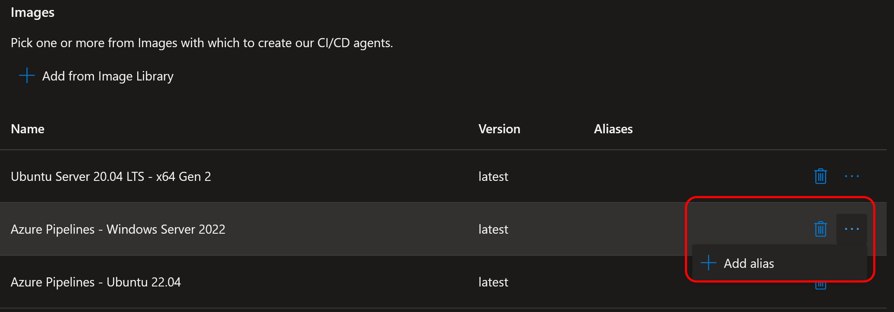

# Azure DevOps Managed DevOps pools

It's been awfully quiet here some time. That's not to say I've done nothing though, but the things I've worked on aren't really public yet.

I've spent _a lot_ of time working on presentations and frameworks. As previously stated ~~I'm presenting~~ I presented at [PSConf](https://psconf.eu/) in June, and ~~will be releasing~~ released AzDM by then as well.

I am also speaking at the newly created [Nordic integration summit](https://nordicintegrationsummit.com/) in October, and a couple of user groups somewhere in between. More on that when I have details.

But the thing I've played around most with, which AzDM is dependent on, and that I have so far not been allowed to talk about is this:

## Introducing Azure DevOps Managed DevOps pools!

For a number of months now I have been part of the private preview of Managed DevOps pools, henceforth called "MDP" for short. Today, MDP goes public, and I am super excited to start talking about it and using it amongst customers and for myself.

So what is MDP? Well, straight from the docs, this:

> Managed DevOps Pools is an evolution of AzureDevOps Elastic Pools / VM ScaleSet pool, simplifying custom pool creation even further, improving scalability and reliability of custom pools. Managed DevOps Pool is a fully managed service where VMs or containers powering the agents will live in a Microsoft Azure subscription and not in your own Azure subscription like it is in Azure DevOps VM Scale set Pools.

And what does this mean translated from Microsoftish?

The short and simple answer is - It's everything good from VM Scale sets, combined with everything good from Azure DevOps hosted images, and some extra added goodies.

MDP is an entirely new type of Azure DevOps host that lets you manage multiple VM images, including those offered by Microsoft hosted agents, connected to your own internal networks, without the hassle of managing.. well.. much of anything really.

It all runs in Microsofts subscription, just as with the normal hosted images, but lets you connect to internal resources just like a VMSS does. Just read ahead and we'll see what it's all about.

Before we go any further, I must add this short but rather important note:

> **As of this writing MDP is in preview. Lots of things are set to change, and lots of features are not yet in place. Expect things to change, features to be missing, and report any bugs you may encounter.** 

Let's dig in to how it looks.

## Prerecs. Before the fun can begin

> The setup is one of the key things that _will_ change between now and the final product. If this guide is wrong, [let me know](https://mastodon.nu/@bjompen) and I'll update and fix it.

There are a couple of requirements for creating an MDP pool:

- Registering the Microsoft.DevOpsInfrastructure resource provider
- Create a Dev center in Azure and a project created
- A manged identity

Creating them are to a large point as simple as any other Azure resource, this is after all just one more, but for the sake of demoing lets go through it.

### Register the resource provider

Naturally and as always there is an excellent [learn article](https://learn.microsoft.com/azure/azure-resource-manager/management/resource-providers-and-types?wt.mc_id=DT-MVP-5005317#azure-portal) on the topic, but the steps are as follows:

- Go to the [Subscriptions blade](https://portal.azure.com/#view/Microsoft_Azure_Billing/SubscriptionsBladeV2) in the Azure portal and select the subscription where your resources should be located
- In the side menu, expand "Settings" and go to "Resource providers"

- Search for 'Microsoft.DevOpsInfrastructure', select it, and click "register"

### Creating a Dev center

A Dev center is one of those curious Azure resources that isn't too well documented. Or, more correctly, there are a lot of docs about products _using_ dev center, but not as much specifically _on_ dev center. As far as I know MDP is the third resource type depending on a dev center - the previous being [Deployment environments](https://learn.microsoft.com/azure/deployment-environments/quickstart-create-and-configure-devcenter?wt.mc_id=DT-MVP-5005317) and [Dev box](https://learn.microsoft.com/azure/dev-box/how-to-manage-dev-center?wt.mc_id=DT-MVP-5005317).

In our case creating the MDP dev center is as easy as they get.

Create a new dev center, and don't select any quick starts -> done.


### Adding a dev center project

Once the dev center is in place we can move on to the project. This is done by going to our newly created dev center, and either from the overview page, or from the "Manage" -> "Projects" menu and clicking "Create"

Again, we only need to configure the very basics and create it. No need to do any dev box setup (which is the only other tab available right now..)


## Set up MDP, and your first hosted pool

This is where the fun begins. It's time to create the pool!

We do this _either_ by going to the project -> overview -> "Create Managed DevOps pool" _or_ going to the project -> "Manage" -> "Managed DevOps pools" _or_ searching for "Managed DevOps pool" in the Azure search bar and creating new.


### The pool resource

There are _a lot_ of things you can set in an MDP pool. Instead of trying to explain it all, we are going to start pretty vanilla and expand our pool afterwards. I don't know about you, but I think it is easier to understand what's going on this way.

Most of the data on the create page is fairly easy to figure out.
- Select your freshly created Dev center project
- Give your pool a name (the name it will have in your Azure DevOps organization)
- Select maximum amount of agents (This of course also needs to be correlated to [your parallel jobs settings](https://learn.microsoft.com/azure/devops/pipelines/licensing/concurrent-jobs?view=azure-devops&tabs=ms-hosted&wt.mc_id=DT-MVP-5005317))


Like I said - I will start easy. The only other tab we are looking at right now is the `Security` one. And why is that? Because once the creating of your MDP is done this will be setup in Azure DevOps, and it is easier to have it right to start with than to fix it afterwards. Also - If you , potentially, grant your pool access to resources, and give all projects access to the pool then you have effectively given everyone access to those resources. [I love badly configured DevOps orgs 😉](https://www.youtube.com/watch?v=StvroRI-WW4)

So - **If you are to grant this pool resource access and you do not want _everyone_ to have this access, make sure you fill in the correct project names here!**

I would also suggest changing the pool admin settings to inheritance. This makes managing the pool easier if you, the creator, is not available. This, however, comes down to you and your security measures.


Once this is done, let's go create it and run our first pipeline!

### Running a job in Azure DevOps

Once your setup is complete you should have a new pool in your Azure DevOps organization. Interesting thing to note is that it also has the same icon as the "Azure Pipelines" pool containing hosted images.


Testing it out is as easy as creating a pipeline and selecting our pool to run it.

```yaml
trigger: none

pool: MyNewMDPPool

steps:
- script: |
    echo Get some host details
    uname -a
```

Once we have granted the pipeline access to our pool it takes a couple of seconds for our host to be provisioned, but eventually we should end up with a result similar to this


So what is it we have achieved? And what happened behind the scenes? Well, lets go back in to Azure and check our resource for some data, shall we?

## Stats, logs, and other goodies

Right away, in the MDP overview blade, we can follow the logs of what has taken place.

We have allocated a machine (Teal), who was then provisioned (Red), and after the job was done, Pending return (Blue).


We can also follow how lone the machine took to provision, and any unexpected errors.

CLicking one of the metrics takes you to the Azure monitor page where you can dig even deeper in to the logs for more details, and just as in all Azure resources, create your own monitor queries, layouts and other goodies.


If you are fast enough to catch it we also have an Agents blade that shows any agents ant what they are currently doing. As of this writing it is an interesting overview of your platforms, images, and concurrency.


There are still things I miss in the logging and client overviews. More details, digging in to clients, I've had some errors where I had a hard time finding the actual causes in Azure Monitor, but considering MDP is _just_ released in preview this is to be expected. I Assume the logging and status pages will grow after we reach _real_ release instead of preview. (Downloading client logs for solving issues? Restarting agents? [There's no end to the possibilities!](https://i.ytimg.com/vi/o826XZu-aRs/maxresdefault.jpg))

## Adding images, aliases, and special requirements

Now then - So far we have basically achieved nothing more than a standard runner. It's time to start showing where MDP actually stands out and shines.

Have you ever had the need to run multiple images? You know, you have more that one pipeline, or custom dependencies in different custom built images, or different version of runtimes, or... We can go on forever.

Azure hosted images are excellent for those scenarios. Either a matrix pipeline, or different hosted pools.

```yaml
pool:
    vmImage: ubuntu-latest
# or
pool:
    vmImage: windows-latest
```

But this doesn't solve the issue when you have custom software. Or custom dependencies. Or software that [isn't in the standard list](https://learn.microsoft.com/azure/devops/pipelines/agents/hosted?view=azure-devops&tabs=yaml&wt.mc_id=DT-MVP-5005317#software)

Normally, this is when you have to resort to self hosted agents, custom image builder scripts, VMSS, or inline script installations. And you have to keep track of who has access to this specific host, which pool it is in, and so on.

MDT doesn't solve _all_ of these issues, but it does help you. A lot.

Lets start in the Pool blade of our pool


In the bottom we can se our image. Ubuntu server, just as we selected upon installation. But there is also a plus sign - `Add from image library`. Clicking it lets us select one or more additional images.


Notice the tabs? You can add any image you want!

- Azure pipeline images. These are the same images an Azure hosted agent, such as `ubuntu-latest` or `windows-latest` uses, with all the default software.
- Selected marketplace images. Here you can find standard operating system images available for other compute resources. Windows Server 2019 and 2022, Windows 11, Ubuntu server 20.04 and 22.04, and Visual studio images. You may also select different architectures! Want your pool to have both x64 and ARM? ~~No probs!~~ Well, unfortunately we can still only have one CPU type per pool, either X64 or ARM, but like I said, we can't solve everything.
- Azure compute gallery images. If you have custom images built, you can add these as well. Just publish them in a gallery and go. All those already in use images are not wasted.

For now, lets add two more images - `Azure pipelines - Windows server 2022` and `Azure pipelines - Ubuntu 22.04` by selecting them and clicking `add`, and then back in the Pool blade - `Apply`.

Now if we just go back to our pipeline with the yaml above and run we encounter an interesting question: What image will our pipeline run? We have both windows and Linux machines in place.

In the list we now have multiple images, and they are in priority order. If you do now tell your pipeline to do something else, the top one (Ubuntu in our case) is selected.


So how do we select our images? We add a requires to our yaml!

Back in the Overview blade there is a button top right - `JSON view`. This will show us the entire resource data. In there we have the following lines:

```Json
"images": [
    {
        "resourceId": "/subscriptions/00000aaa-00a0-00aa-a0a0-00000a0a0000/Providers/Microsoft.Compute/Locations/westeurope/publishers/canonical/artifacttypes/vmimage/offers/0001-com-ubuntu-server-focal/skus/20_04-lts-gen2/versions/latest",
        "aliases": [],
        "buffer": "*"
    },
    {
        "aliases": [],
        "buffer": "*",
        "wellKnownImageName": "windows-2022/latest"
    },
    {
        "aliases": [],
        "buffer": "*",
        "wellKnownImageName": "ubuntu-22.04/latest"
    }
],
```

From this list you can grab the resourceId or wellKnownImageName value and add the requirement `ImageOverride -equals <value>`.
Our pipeline yaml should now look something like this:

```yaml
pool:
  name: MyNewMDPPool
  demands:
  - ImageOverride -equals ubuntu-22.04/latest

steps:
- script: |
    echo Get some host details
    uname -a
```

Now you can probably already see the issues here. How am I to tell my users 
> "All you have to type is /subscriptions/00000aaa-00a0-00aa-a0a0-00000a0a0000/Providers/Microsoft.Compute/Locations/westeurope/publishers/canonical/artifacttypes/vmimage/offers/0001-com-ubuntu-server-focal/skus/20_04-lts-gen2/versions/latest"

But you may also have noticed the extra fields. Aliases.

Back in the Pool blade, next to our image, there is a small but important "three dots" menu. Clicking it lets us set aliases to our images.




We can even set multiple aliases. "Win" and "Windows"?

And now we can instead just do this:

```yaml
pool:
  name: MyNewMDPPool
  demands:
  - ImageOverride -equals Jones
```

So why didn't I give the ubuntu image an alias? Like I said - Top is the default. I can now tell my users "By default we run this, but if you need anything else, just add it to ImageOverride". Simple, useful, and awesome.


## Networking and internal deployments

So we have our custom images set up. So far so good. Its time to connect our pool to our internal network. After all, we don't want to be forced to open access from the internet to our internal servers just to deploy stuff to them. Once again MDP shines.

Before we do this there is one thing you need to be aware of: MDP requires a delegated subnet. This means no other resources but MDP can be connected to this subnet. This naturally also means you need to create a new subnet and give it as many IP addresses as you expect this pool to have agents.

I am not going to go through the process of creating a subnet here, there are many other places that has this info, but delegating a subnet is something I hadn't done before. Of course, as always, there is a brilliant [Learn article](https://learn.microsoft.com/azure/virtual-network/manage-subnet-delegation?wt.mc_id=DT-MVP-5005317) available for details, but the short of it goes something like this.

- Go to your VNET in Azure
- Select your subnet (Or create a new one)
- In the "Edit subnet" blade, under "Subnet Delegation", select `Microsoft.DevOpsInfrastructure/pools`
- Save


The person setting MDP up will need to have certain access to this network as well, but I'll leave it to you to figure out what for now as I do expect this requirement to change. Hopefully there will be a [RBAC role](https://learn.microsoft.com/azure/role-based-access-control/built-in-roles?wt.mc_id=DT-MVP-5005317) available somewhere in the future.

Once the subnet is set up the process of connecting it is super simple. In the `Networking` blade of your MDP pool select `Agents injected into existing virtual network` and configure.

In the pop-out `Subnet resource` simply select the subscription, virtual network, and subnet, and click `Ok`

Click `Apply` and you're done!


Et voila! You have internal network access.

One thing to remember though:

> Important: If you need outbound network access, remember to set it up as [Default outbound access will be retired for all Azure compute resources!](https://azure.microsoft.com/updates/default-outbound-access-for-vms-in-azure-will-be-retired-transition-to-a-new-method-of-internet-access?wt.mc_id=DT-MVP-5005317)

Trying it out to make sure we get the correct address does require us to fall back on running bash as the `NetTCPIP` module isn't available on the Azure DevOps ubuntu images, but a pipeline that looks like this:

```Yaml
pool: MyNewMDPPool

steps:
- task: CmdLine@2
  inputs:
    script: |
      ip address show
```

Now gives us the following output proving we are in fact on my internal network!


> Note: Private networking is good. If nothing else you can protect your resources behind your normal firewall. However - MDP does have some required external resources it **must** be able to access to work. The following list is ~~stolen~~ copied from the docs and should hopefully be everything you need to grant network access to:
> 
> // 1. Highly secure endpoints that our service depends on
> 
> "*.prod.manageddevops.microsoft.com", // Managed DevOps Pools endpoint
> 
> "rmprodbuilds.azureedge.net", // Worker binaries
> 
> "vstsagentpackage.azureedge.net", // Azure DevOps agent CDN location
> 
> "*.queue.core.windows.net", // Worker queue for communicating with Managed DevOps Pools service
> 
> "server.pipe.aria.microsoft.com", // Common client side telemetry solution (and used by the Agent Pool Validation extension among others)
> 
> "azure.archive.ubuntu.com", // Provisioning Linux machines - this is HTTP, not HTTPS
> 
> "www.microsoft.com", // Provisioning Linux machines
> 
> // 2. Less secure, more open endpoints that our service depends on
> 
> // 2.1 Needed by our service
> 
> "packages.microsoft.com", // Provisioning Linux machines
> 
> "ppa.launchpad.net", // Provisioning Ubuntu machines
> 
> "dl.fedoraproject.org", // Provisioning certain Linux distros
> 
> "https://auth.docker.io", // Running Azure Pipelines Container Jobs
> 
> // 2.2 Needed by Azure DevOps agent: https://learn.microsoft.com/en-us/azure/devops/organizations/security/allow-list-ip-url?view=azure-devops&tabs=IP-V4
> 
> "dev.azure.com",
> 
> "*.services.visualstudio.com",
> 
> "*.vsblob.visualstudio.com",
> 
> "*.vssps.visualstudio.com",
> 
> "*.visualstudio.com"
> 

## One final note to get all I need

So we have our custom images, and we have our internal network. There is one more thing we need to do to be totally rid of our VMSS servers: Managed identities.

One thing that differs MDP from VMSS or self hosted is that we can not use system assigned managed identities with MDP. This makes sense though since MDP agents aren't hosted in your tenant and it would be impossible to make this work. (Don't quote me on this, it may be my lack of understanding as well 😂)

But we can use User assigned managed identities, which to be honest, is just as good. The only difference is that if we delete the resource we need to manually delete the identity as well as they are not lifecycle managed together.

Just like above I wont go in to the details on how to create a managed identity. [There are already places that documents this](https://learn.microsoft.com/entra/identity/managed-identities-azure-resources/how-manage-user-assigned-managed-identities?wt.mc_id=DT-MVP-5005317#create-a-user-assigned-managed-identity)

What you need to do once this identity is created is go to the identity blade and add it.


This managed identity can now be granted any and all access that your deployment needs, and a simple login in your YAML and you can use it as we would normally do. After all - you do not want to store passwords anywhere. Right?


## The death (and rebirth) of self hosted agents

I can already hear you screaming:

> We are free from VMSS forever!

Well, not really. In some cases a VMSS or even a good old VM is still the best resource to go for. There are considerations like pricing, laws, security departments, and a lot of other things to take in to consideration, but I do believe MDP will fundamentally change how we use DevOps runners.

And combining all of these features - Internal networks, custom images, managed identities, alongside options I haven't even mentioned such as stand by agents, scheduled start/stop, and much much more I believe most of the VMSS installations I do will change for the better and be replaced by MDP.

## Summary - From the other side of the preview...

Like I said in the beginning this post is written in the preview era of MDP, and I imagine a lot will change in the near future. The very first official post was just released telling a bit about the background of MDP, and it is [definitely worth the reading](https://devblogs.microsoft.com/engineering-at-microsoft/managed-devops-pools-the-origin-story?wt.mc_id=DT-MVP-5005317). I look forward to many more of these posts and some official docs to go through.

All in all - Even the ride in private beta has been very smooth, and I have been running it flawless both for myself and at customers.  I can't see many customers that would not have _major_ improvements by using this.

And to top it of: This was my first real involvement as MVP in a somewhat major release, and I fell not only honoured but really happy to have been a part of it. It has been a whole lot of fun finding bugs, helping to add docs, improving features, and being able to just feel like I make a real difference. Huge thanks to Suraj, Eliza, Atoshi, and the rest of those involved (sorry, I am terrible with names..) for not only creating a great product, but for letting us be involved.

I sure hope there will be more opportunities like this for me. And I hope to see a lot of MDP pools running in the future.

But until then - And until I am allowed to talk about the next cool thing - See you out there somewhere, Internet.
