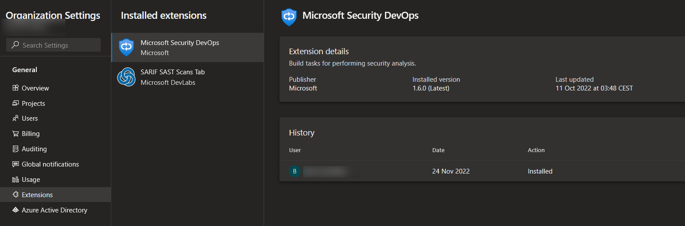
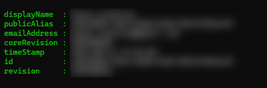
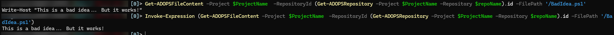
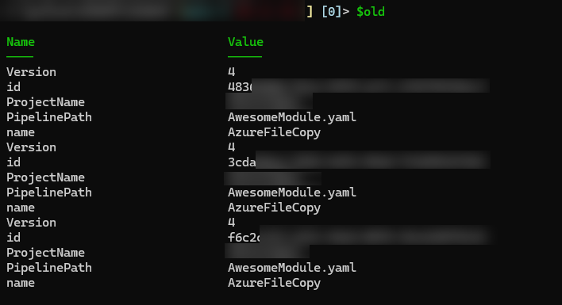

# New year, old code

> ----
>
> If you only want the code, the complete code block is at the very bottom of this page!
>
> If you copy parts while you go you may miss some details I didn't feel the need to explain..
>
> ----

2023! Another year of the plague survived. Who could have thought we'd make it this far, huh?

Well, the year started with a continued war in Ukraine, a terrorist coup in Brazil, The highest covid counts in a _long_ time including a closed down China, and the general chaos we seem to have gotten used to lately, but anyway...

For me personally it started out on top. Had a long vacation, spent time with family and friends, had time to successfully renew one of my [Azure certificates](https://learn.microsoft.com/en-us/certifications/azure-solutions-architect/), read a couple of books, wrote some code, and got used to an in to my new [Mastodon](https://mastodon.nu/@bjompen) adventures!

But maybe most important of it all:

## **I am once again speaking at PSConf 2023!!!!**

Am I happy?! You bet your arse I am. So far this year I'm doing two of my dream stages:

- [PowerShell + DevOps Global Summit, Bellevue, USA, April 24-27](https://powershellsummit.org/)
  - Azure DevOps security - Lessons learned
- [PSConfEU, Prague, Czech republic, June 19-22](https://psconf.eu/)
  - Get going with GitHub actions
  - Advanced pipelines: #PTMF 2 - Every day is Friday!

I hope to see you at one or more of these!

## I have a lot of favourite people

And being on mastodon made me find even more of them. One of my new favourite people is [Jesse Houwing](https://hachyderm.io/@jessehouwing), who happened to release [a blogpost on the security state of Azure DevOps tasks and extensions](https://jessehouwing.net/security-state-of-the-azure-devops-marketplace/) during the holidays, and this specific quote really peaked my interest.

> At present the security state of the Azure Pipelines extensions is pretty bad. **About 35% of all the tasks available in the marketplace have security issues. Across 40% of all extensions.**

So, today we are going to do a security review of our pipelines! Can't be using old tasks with security issues, right?

I should start by mentioning - Most of the heavy lifting, figuring out API calls, and the behind the scenes are done by Jesse in the mentioned blog post, I just tied it together in an easier to use way.

## A while ago I released a PowerShell module called ADOPS

I wrote about it before as well, and since this all is Azure DevOps, of course I added the needed functions to our module. 
You can find ADOPS over at [GitHub](https://github.com/AZDOPS/AZDOPS), but easiest, of course, is installing it through the PowerShell gallery.

```PowerShell
Find-Module ADOPS | Install-Module
```

In order to perform actions we also need to create a [PAT, Personal access token](https://learn.microsoft.com/en-us/azure/devops/organizations/accounts/use-personal-access-tokens-to-authenticate?view=azure-devops&tabs=Windows), in Azure DevOps. It will need at least read access to repos and pipelines, probably also extensions and extension data, and possibly more. I'm lazy and generate a full access token with a very short lifespan instead.

## Some basic task information

A task in Azure DevOps is the steps performed in a pipeline. They are most commonly typed in your YAML files like this

```yaml
- task: TaskName@1
```

where the number is the task major version. This task will always run the latest _minor and build_ version installed, and tasks and extensions do support auto updates.

If you are running Azure DevOps Services (SaaS DevOps) your tasks most likely will update themselves, but if you are running Azure DevOps Server (on prem) you may need to update stuff manually (again, see Jesses blog post).

That's all good, but the issue at hand is what's missing above: the _major_ version.



Once you create your yaml pipelines there is no good way of knowing if a new major version is released such as this

> Note: What about if I use an alias task such as `- script: echo Hello, world!`?
>
> Well truth be told I am not sure. I _think_ this will use the latest major version of the aliased task, but I am not sure. If anyone asks I will research.

```yaml
- task: TaskName@2
```

## Connecting to Azure DevOps

So where do we start? By logging in. ADOPS supports multiple connections to different organizations, but the easiest way is just to fill in your credentials and go.

```PowerShell
$pat = 'YourPersonAccessTokenGoesHere(ButRemoveItIfYouCheckYourCodeInToARepo)'
$Organization = 'YourAzureDevOpsOrganizationName'
$UserName = 'UserName'

Connect-ADOPS -Username $username -PersonalAccessToken $pat -Organization $Organization
```
If all goes well you should be greeted by something like this




## Exploring installed tasks

One thing I found interesting is how many tasks we get "for free" without actually installing anything.

We can get them all by running the command

```PowerShell
$tasks = Get-ADOPSPipelineTask | Group-Object -Property Name -AsHashTable
```

Running `$tasks.count` tells me I have no less than 159 different tasks installed, and indexing the hashtable, `$tasks['PowerShell']`, lets me see all different versions of a task (two in the case of PowerShell)

> Note: The output of this command is a matter of discussion. Why a hashtable? Because this API behaves bad. See [this discussion](https://github.com/AZDOPS/AZDOPS/pull/145#issuecomment-1376178641).

I spent quite some time finding out more about tasks here, but let's move on.

## Getting every pipeline in your organization

I mentioned creating a full access token. Well, The more access you have the better in this case. If you can't read all pipelines you can't verify all pipelines.

This said, you may want to alter this piece of code if you only want to review parts of your organization, or lack access to parts of it. The command `Get-ADOPSProject` does support only getting one project as well.

Next up, `Get-ADOPSPipeline` does pretty much what can be expected. Gets pipelines. From a project. Again, filtering _is_ possible, but if you can read the project this shouldn't be an issue.

```PowerShell
$projects = Get-ADOPSProject

[array]$all = foreach ($p in $projects) {
    $pipelines = Get-ADOPSPipeline -Project $ProjectName
```

> Note: Why do I cast `$all` as `[array]`? Because PowerShell is kind and will auto cast it to bad stuff in certain cases. If you want to be 100% certain you will always have an array, cast your variable as an array.

## Reading your pipeline file

A pipeline contains quite a lot of metadata, but there are only a few pieces we are interested in here:

- Which repository does this pipeline belong to
- What is the path to the yaml/yml file

By getting those two values we can run the `Get-ADOPSFileContent` command and get the actual contents of the yaml file.

```PowerShell
$repoId = $pipeline.configuration.repository.id
$YamlPath = $pipeline.configuration.path

$yaml = Get-ADOPSFileContent -Project $ProjectName -RepositoryId $repoId -FilePath $YamlPath
```

> Bad practice but fun note: You can use the `Get-ADOPSFileContent` to execute code directly from a repository.
> ```PowerShell
> Invoke-Expression (Get-ADOPSFileContent -Project $ProjectName -RepositoryId (Get-ADOPSRepository -Project $ProjectName -Repository $repoName).id -FilePath '/BadIdea.ps1')
> ```
>
> 

## RegEx, oh RegEx, How I love thee

Is a phrase not many will use, but it is insanely good at text filtering. The next part is figuring out: What is a task?

```PowerShell
$res = [regex]::Matches($yaml, '.*\s+(?<task>[a-zA-Z]+)@(?<version>[0-9]{1})')
```

So what will this pattern look for? Lets break it down:

- .*
  - Any character, any number of times.
- \s+
  - One or more whitespaces
- (?<task>[a-zA-Z]+)
  - Named capture group: Any characters, lower or capital, one or more
- @
  - literal character  '@'
- (?<version>[0-9]{1})
  - Named capture group: exactly one number.

And what does this match? Well, for example

```Yaml
- task: PowerShell@2
```

Now I admit, this pattern isn't perfect, it may match inline scripts, email addresses or other stuff as well, and if you are picky you probably should make this better to avoid false positives.

The output of the `[regex]` class combined with named capture groups allow us to move on to the last step in a nice and easy to read way.

> This is not a blog post on regex, but if you want to learn more I _highly_ recommend [regex101.com](https://regex101.com/) for pattern tests and the [Irregular module](https://github.com/StartAutomating/Irregular) by [James Brundage](https://fosstodon.org/@MrPowerShell)

## Last step

The last thing we need to do is simply comparing the tasks our regex found with what we have in our list of tasks our organization has installed, and if the major version is less than the latest lets add it to our list of old tasks.

```PowerShell
if ($c.Version -lt ($tasks[$($_.Groups['task'].value)].version.major | Sort-Object -Descending | Select-Object -First 1)) {
    $old += $c
}
```

## Checking the result

Once out script has run we have two lists

- $all, containing all tasks used in all our pipelines
- $Old, containing tasks where major version is superseded.

And lo and behold - I have old tasks in use!



Awesome! Now I can just notify the repository owner about it and tell them to update. No more unsupported and unpatched systems!

## Bonus 1 - Finding the repo details

We _could_ of course go to the pipeline in Azure DevOps, finding the correct pipeline, checking where it lives, and go from there. But since we do have the id let's instead use the `Get-ADOPSRepository` command to see more info about the repository itself!

```PowerShell
Get-ADOPSRepository -Project $old[0].ProjectName -Repository $old[0].id 
```

We could even use this command to go directly to the repo!

```PowerShell
Start-Process ((Get-ADOPSRepository -Project $old[0].ProjectName -Repository $old[0].id).webUrl)
```

## Bonus 2 - A proper review of the task

SAy you have installed an extension containing a task - How do you know it is secure to start with? Wouldn't it be cool if we could check everything included in the task? Well, there's a command for that to in the module. `Save-ADOPSPipelineTask` can either be run with manual input of task data, or pipeline input from the result of `Get-ADOPSPipelineTask`.

For example something like this:

```PowerShell
Get-ADOPSPipelineTask -Name $_.name -Organization $Organization | 
    Where-Object -FilterScript {$_.version.major -eq $version} |
    Save-ADOPSPipelineTask -Path $SavePath
```

The result will be a zip file containing the same code and configuration your build host will download end execute. Perfect thing to give to your security department for a review.

## Wrapping up

Another interesting journey, and one less way of being insecure in my pipelines. I highly recommend everyone to go visit [Jesses blog](https://jessehouwing.net/), It is packed to the brim with awesomeness.

And again, I don't take credit for _any_ of the discoveries here, they were all based on Jesses findings.

## The complete code

Here goes. This is what it looked like when I ran the entire report. You _should_ be able to run this as is given you input your user data in the top.

```PowerShell
# Get usage of old tasks

$pat = 'YourPersonAccessTokenGoesHere(ButRemoveItIfYouCheckYourCodeInToARepo)'
$Organization = 'YourAzureDevOpsOrganizationName'
$UserName = 'UserName'

Connect-ADOPS -Username $username -PersonalAccessToken $pat -Organization $Organization

$tasks = Get-ADOPSPipelineTask | Group-Object -Property Name -AsHashTable

# Get all projects
$projects = Get-ADOPSProject

$old = @()
[array]$all = foreach ($p in $projects) {
    $ProjectName = $p.name
    # Get all pipelines in the current project
    $pipelines = Get-ADOPSPipeline -Project $ProjectName

    foreach ($pipeline in $pipelines) {
        $repoId = $pipeline.configuration.repository.id
        $YamlPath = $pipeline.configuration.path

        # Read yaml
        $yaml = Get-ADOPSFileContent -Project $ProjectName -RepositoryId $repoId -FilePath $YamlPath

        # And parse it
        $res = [regex]::Matches($yaml, '.*\s+(?<task>[a-zA-Z]+)@(?<version>[0-9]{1})')
        $res | ForEach-Object {
            $c = @{
                PipelinePath = $YamlPath
                id = $repoId
                name = $_.Groups['task'].value
                Version = $_.Groups['version'].value
                ProjectName = $ProjectName 
            }
            if ($c.Version -lt ($tasks[$($_.Groups['task'].value)].version.major | Sort-Object -Descending | Select-Object -First 1)) {
                # Add old tasks to the $old variable
                $old += $c
            }
            # And output every used task to the $all variable
            $c
        }
    }
}

break # in case you copy and run you may not want to run the bonus code ;)

# Bonus 1 - Finding the repo details
Get-ADOPSRepository -Project $old[0].ProjectName -Repository $old[0].id 

## Bonus 2 - A proper review of the task
$SavePath = 'c:\temp\oldTasks\'
if (-Not (Test-Path $SavePath)) {
    mkdir $SavePath
}

$old | ForEach-Object {
    $version = $_.version
    Get-ADOPSPipelineTask -Name $_.name -Organization $Organization | 
        Where-Object -FilterScript {$_.version.major -eq $version} |
        Save-ADOPSPipelineTask -Path $SavePath
}

```
