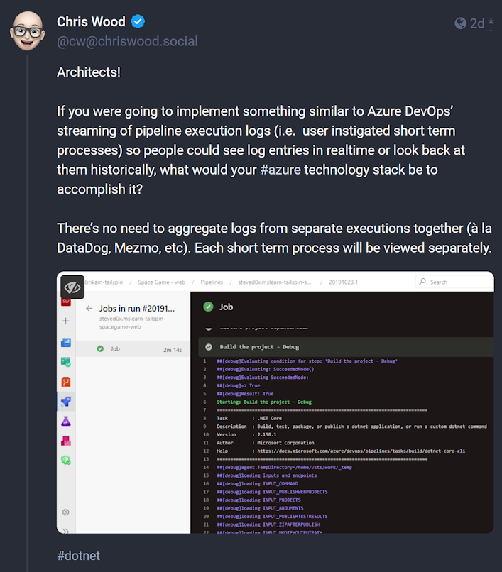
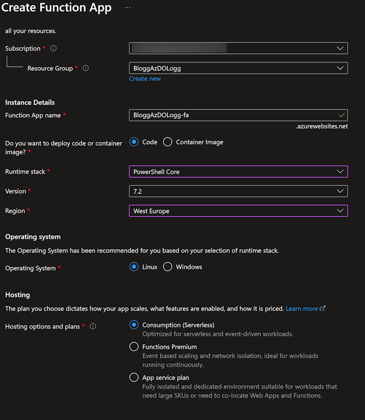

# Live logging Azure DevOps pipelines.

I'm sick! Poor poor Bjompen has a massive man cold. Way to end the year.
 
[](https://www.youtube.com/watch?v=Qg-md8geRkU)

Unfortunately this also comes colliding with a terrible outburst of depression. Hardly left bed for a couple of weeks, feeling like total shit. I never much enjoyed the holiday seasons.

But then again every now and then something comes by and peaks my interest. Something that gets me out of bed, even though my entire body screams no. Something like this:

[](https://chriswood.social/@cw/111532005722981673)

I've always talked about the importance of [setting up audit steaming](https://learn.microsoft.com/en-us/azure/devops/organizations/audit/auditing-streaming?view=azure-devops&wt.mc_id=DT-MVP-5005317) for your logs. After all, If someone hacks your environment it will be hard to find out if they can just delete all logs. The thought of streaming the very pipeline logs haven't really been anything I've looked at though. Until now.

So how do we go about this? Let's find out!

## Limitations

So the first thing worth noting is that there is no live log API supported. Yes, we could of course reverse engineer the streaming page in Azure DevOps, but I am aiming for a supported solution.

The second thought I had was if we can stream the logs directly from the host. If we are running self hosted agents such as VM, VMSS, or containers that would absolutely be doable, the logs are located on disk if I am not wrong (Don't quote me on this, I have still to find them 😉) but I want my solution to work no matter the hosts.

With this in mind, We are going to go as close as we can: Once a Stage, Job, or Task is done the log will directly be streamed to [log analytics](https://learn.microsoft.com/en-us/azure/azure-monitor/logs/log-analytics-tutorial?wt.mc_id=DT-MVP-5005317), where we then can do.. well, whatever we want with them.

The process is not that hard, and after a short time of thinking I ended up with something like this


## Creating the Azure function

The first piece of our puzzle is an [Azure function](https://learn.microsoft.com/en-us/azure/azure-functions/functions-overview?pivots=programming-language-powershell&wt.mc_id=DT-MVP-5005317). One might ask why we start here instead of in Azure DevOps? After all, Azure DevOps is where the logs are located. Well, the reason is that in order to set up the WebHook in Azure DevOps we need an URL, and the URL won't exist until we have a function.

What we _don't_ have to do yet is write all the code.

Start by creating a function app from the marketplace


The only details we need to make sure for this to work is on the very first page.

- Globally unique name (Harder)
- Run PowerShell Core version 7.2 or later (Better)
- Operating system Linux (Faster)
- Hosting on consumption (Cheaper)
- Something something Daft Punk (Or Scooter if you're as old as me)



The rest you can leave as is for now.

### My first function

There are a lot of good posts out there on how to get started with Azure functions. This will not be one of them.

This will, however, be a short post on what you need to deploy your stuff.

I find the easiest way to do this is using VSCode. Yes, eventually we should probably set this up as a pipeline, but hey, I can't write all my blog posts in one big blob.

You can find the [MS Learn how to here](https://learn.microsoft.com/en-gb/azure/azure-functions/functions-develop-vs-code?&pivots=programming-language-powershell&wt.mc_id=DT-MVP-5005317), but in short

- [Install VSCode](https://code.visualstudio.com/)
- [Install the PowerShell addon](https://marketplace.visualstudio.com/items?itemName=ms-vscode.PowerShell)
- [Install the Azure Functions addon](https://marketplace.visualstudio.com/items?itemName=ms-azuretools.vscode-azurefunctions)

Once you have these and have logged in to Azure as per the guide in the addon page your function app should be visible in the "resources" tab under "Function App"


Good. Now to create your first function. This is easiest done in the "Workspace" square of the Azure plugin. Click the Azure Functions icon (only visible when you hover the window 🤦) and select "Create Function"


In the function creating windows pick a fitting folder to create your function in (preferably a Git folder?) -> "PowerShell" as language -> "HTTP Trigger" -> and give your trigger a proper good name. 

Once you're done, you should end up with something like this


For now we are not going to edit the code, but just deploy the function so we can move on to the next step.

Deploying is simply done by going back to your function in the Azure plugin, right click your function app, and select "Deploy to Function App"


A warning should popup saying "you are about to overwrite..."  Simply click "Deploy"

Awesome! We have a function, now let's go get the URL to it.

Back in the Azure portal your function app should now have an Azure function


and clicking the function name should take you in to the function where you can copy the actual URL by clicking the "Copy" button


## Setting up the Web Hook

Back to Azure DevOps to set up the web hook. As far as I know you can not do this organization wide, but you have to do it on each project separately.

Go to Project Settings -> Service hooks and create a new connection. How this looks depends on if you have one already created or not.


Going through the setup we are going to create a web hook (duh..)


We are going to pick "Run job state changed" as trigger and state "waiting". This will trigger your webhook as soon as anyone starts a pipeline as the first thing that will happen is that it will wait for a new agent. If needed you could of course also pick the pipeline(s) you want to monitor. I'm going with all of them.


Last but not least we paste the URL to our function in the "URL" box.


> Disclaimer: you _should_ set up security to your function, but that is another post completely.

You can click test here and verify you get a "200 OK" back, but for now I'll just move on.

## The function code

Back to our Azure function we need to take action on the actual data the pipeline trigger will send. You will get _a lot_ of data, and I find the easiest way to see what we actually get is to simply output it as a json.

The default function setting will give you the entire post body as an input parameter object, and outputting it to the log can be done by using "Write-Host". Ergo, the following code will let you wee the entire body:

```PowerShell
using namespace System.Net

param($Request, $TriggerMetadata)

$r = $Request.Body | ConvertTo-Json -Depth 10
Write-Host $r

Push-OutputBinding -Name Response -Value ([HttpResponseContext]@{
    StatusCode = [HttpStatusCode]::OK
})
```

Replace the code in your `run.ps1` with this, right click your function, and "Deploy..."

In Azure you can now go to your function -> the "monitor" blade, and select "Logs". This will let you se the live logs from your function.


Now go to your Azure DevOps Project and run any pipeline, and after a short while you should see something like this


You can now copy this entire log as json and pick [your favourite way](https://learn.microsoft.com/en-us/powershell/module/microsoft.powershell.utility/convertfrom-json?wt.mc_id=DT-MVP-5005317) to explore the data available to you.

For us right now, the data we need would be the following

- The base URI to our Azure DevOps org. This allows the function to be somewhat more flexible and not have hardcoded data: `$Request.Body.resourceContainers.project.baseUrl`
- The Project ID. Also needed to build our log reader URLs: `$Request.Body.resource.projectId`
- The run ID. The specific ID of the current run: `$Request.Body.resource.run.id`
- The last commit ID that this run refers to. More on that soon: `$Request.Body.resource.repositories.change.version`

## Azure DevOps log API endpoints

There are a couple of endpoints we will need to explore to be able to get our logs. First of, every single run gets a run ID, and combined with the [Get Build Logs API](https://learn.microsoft.com/en-us/rest/api/azure/devops/build/builds/get-build-logs?view=azure-devops-rest-7.2&wt.mc_id=DT-MVP-5005317) this endpoint lets us list every single log related to this build.

Visiting it through a browser using an existing build ID should display something similar to this


Using this API endpoint we can see what logs exist, and the link (URL) to this specific step log, and if we follow one specific log link it will show us this specific log. Highly log...ical..


Now here is the issue:

> The log API is dynamically updated as soon as, and not until, a new log is created. We do not know beforehand how many logs there will be for this run.

What does this mean for our code? Well unfortunately, we will have to do some API hammering, and some ugly hacks.

Fortunately there seems to be a _somewhat_ trusty way of knowing when the  last log entry is written.

The last log in an Azure DevOps pipeline seems to always be the string "Set build status for commit abc123." where the last identifier is the [short SHA of the commit](https://git-scm.com/book/en/v2/Git-Tools-Revision-Selection) truncated to 6 chars.

And we had the SHA in our trigger which means all we have to do is

1. loop through the base log endpoint
2. keep track of which specific logs we have read
3. Check if current log matches the "final log" string

## Adding functionality to our function

So we will need a couple more things before we can get going:

### An identity that our function can use to access Azure DevOps

I [have blogged about this before](posts/azdo.managedidentity.md), but the short of it is

- [Create a system a system assigned managed identity](https://learn.microsoft.com/en-us/azure/app-service/overview-managed-identity?wt.mc_id=DT-MVP-5005317)
- [Import it to your Azure DevOps org](https://learn.microsoft.com/en-gb/azure/devops/integrate/get-started/authentication/service-principal-managed-identity?view=azure-devops&wt.mc_id=DT-MVP-5005317)
- [Grant it access to your project](https://learn.microsoft.com/en-us/rest/api/azure/devops/build/builds/get-build-log?view=azure-devops-rest-7.2&wt.mc_id=DT-MVP-5005317#security)

### Some modules to make your life easier

Yes, I am partial, but the built in modules, the azure modules, and the Azure DevOps modules are too large and too advanced. Instead I will opt for the [ADOPS](https://github.com/AZDOPS/AZDOPS) and the [AzAuth](https://github.com/PalmEmanuel/AzAuth) modules. Please note you _will_ need AzAuth 2.2.5 or later.

Azure Functions _do_ have a way of downloading and importing modules on start up, but I find this a bit sluggish, and above all, less secure, so instead you can download them directly to your function code by opening a terminal, going to the directory where your function is stored, and run the commands

```PowerShell
Find-Module AzAuth -MinimumVersion 2.2.5 | Save-Module -Path .\Modules\ 
Find-Module ADOPS | Save-Module -Path .\Modules\ 
```

(You may of course pick any path you want...)

## Completing the function

With the knowledge in hand it's now just about putting it all together. Update your `run.ps1` file with the following code

```PowerShell
using namespace System.Net

param($Request, $TriggerMetadata)

# The metadata we need for our log API calls
$BaseURI = $Request.Body.resourceContainers.project.baseUrl
$AzDOOrg = $BaseURI.Split('/').Where({$_})[-1]
$ProjId = $Request.Body.resource.projectId
$RunId = $Request.Body.resource.run.id
$ShortCommitID = $Request.Body.resource.repositories.change.version.Substring(0,6) # We only get full commit ID in the body so we cut it to 6 chars.

# Replace the paths to wherever you stored your modules...
Import-Module $PSScriptRoot\Modules\AzAuth
Import-Module $PSScriptRoot\Modules\ADOPS
Connect-ADOPS -ManagedIdentity -Organization $AzDOOrg # This will log in to Azure DevOps using your managed identity. Thank you Emanuel!

$BaseLogUri = "${BaseURI}${ProjId}/_apis/build/builds/${RunID}/logs"
$AllAvailableLogs = Invoke-ADOPSRestMethod -Uri $BaseLogUri -Method Get

$CurrLog = [string]::Empty
$lastReadLogID = 0
$iterations = 0

# Loop through the logs and fetch every single unique log
do {
    $AllAvailableLogs = Invoke-ADOPSRestMethod -Uri $BaseLogUri -Method Get
    
    foreach ($logEntry in $AllAvailableLogs.value) {
        if ($logEntry.id -gt $lastReadLogID) {
            # keeping track of the logs we already have read using the $LastReadLogID variable
            $CurrLog = Invoke-ADOPSRestMethod -Uri $logEntry.url -Method Get
            Write-Host $CurrLog # This is the actuall logging and the logs we will capture!
            $lastReadLogID = $logEntry.id
            $iterations++
        }
    }

} while (
    # Break the loop when we find the last log, But also have a "safety" of 100 logs. Change this if your logs are crazy long...
    $CurrLog -notlike "*Set build status for commit $ShortCommitID*" -and
    $iterations -lt 100
)

# Associate values to output bindings by calling 'Push-OutputBinding'.
Push-OutputBinding -Name Response -Value ([HttpResponseContext]@{
    StatusCode = [HttpStatusCode]::OK
})

```

You should / could also go into the `profile.ps1` file and comment out the default lines there as we will not need them.


And your folder tree in VSCode should look something like this


> Note: There are more things you can clean up here, but again, this is not a detailed post on functions.

After this, deploy your function one last time.

# The final piece of the puzzle - Log Analytics

So we have the logging in place, but it is still "only" logged to our Azure Function and the related log stream. In order to do whatever we want with it, forward it to whatever we want, take actions, create alarms, and what not, we need a log analytics workspace.

Fortunately that's only a check box away.

If you haven't got one already, you need to create a log analytics workspace. Just go to the same marketplace where you created an Azure function app before, but create a log analytics workspace this time.

Once done, go to your Azure Function App, to the "Diagnostic settings" blade, and click "+Add diagnostic setting"


Give it a name, check "Function application logs", and select your Log Analytics workspace


All done!

## Querying your logs

Log analytics is fast, but not to start with. For me it took some time until the first logs showed up, but once it started the logs show up _almost immediately_.

If we go in to our workspace, in the "logs" blade, we can now query our pipeline logs. Now I admit, it does contain more data than our logs, yes, but that's up to you and your [Kusto queries](https://learn.microsoft.com/en-gb/azure/data-explorer/kusto/query/)


You could probably do better, but filtering on "=====================" for example will only give you tasks as they have this in the header..

```Kusto
FunctionAppLogs  
| order by TimeGenerated desc
| where Message contains "======================================"
```


But from here on you're on your own. Do with the logs as you please 😉

## Wrap up

So like I said in the beginning: This will not be live as we can't fetch logs until they are done, but it will be close to it. As soon as a log is written it will be in you analytics workspace.

And there is one rather evil issue: If the logging wont match the last line it _will_ end up in looong loops (hence the iterations counter..). If you have a good idea on how to do it better, please let me know and I'll update it.

For now, this will do as a good start.

And hopefully I can find more projects and questions to peak my interest in the near future. Until then:

Good night, Internet, Wherever you are.
