# Azure DevOps part III - Revenge of the build

A week turned two, turned three, turned four.

Times still are weird, and to top it of a dictator (with hard pronounciation on "dick") goes on to start a new war.

Sweden is still fortunate to be in peace times, but "he" has threatened to attack, and just yesterday four militare aircrafts flew over Swedish air space.

So I'm sorry it took some time, but lets try to distract ourselves from the shitstorm around us by looking at some Azure DevOps pipelines, accompanied by far fetched references to star wars movies.

## This is where the fun begins

So last time we set up some basic Git functionality. We made sure we had a branching strategy, and some security settings. Of course, once we start doing stuff we're going to want to release it in some way, and this is where pipelines comes in.

Lets start by going to the `pipeline` menu.
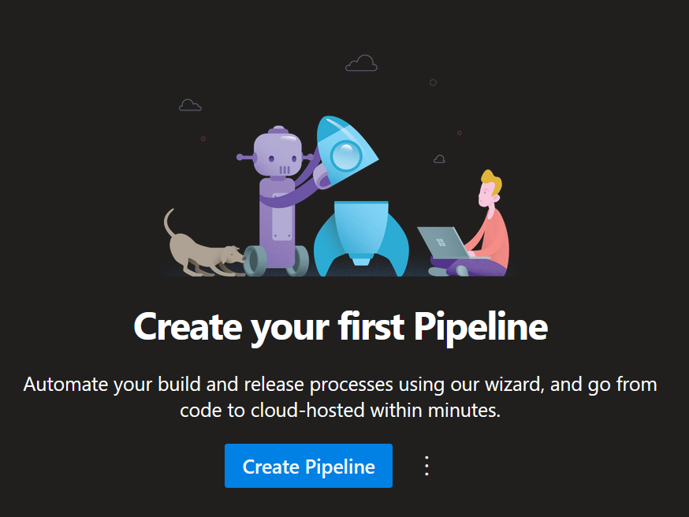

Looks simple enoughm right? Hold up for a few seconds before clicking anything.

## Faith in your new apprentice, misplaced may be

Before we create a new pipeline, we're actually going to repeat the last chapter, and set up another repo.

Why? Because separation of duties is important. We do not want any user to be able to add or remove code in our pipelines, but this honour should only be granted the people we trust. There are mainly two reasons for this.

- If someone makes a large enough PR it is very easy miss details. Details such as "also added a line or two to the build pipeline"
- If we set up a verification pipeline (which we will) then this lets anyone run code as our service / build account. this is generally a _terrible_ idea. (we'll get back to this later in this post.)

So we create a new repo, and it now look something like this:
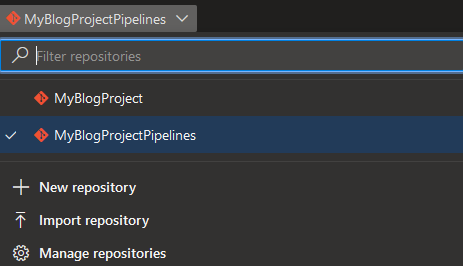

After this, back to the pipelines menu.

## My powers have doubled since we last met, count

Creating a pipeline in Azure DevOps is a fairly straight forward procedure.

Click "Create Pipeline", Select where our code is stored (Azure Repos Git), choose your repo ("MyBlogProjectPipelines"), and either point to an exisisting YAML file, or create a new starter file. We're going with the latter.

"But Bjompen, Why YAML? Why not Classic / GUI?"
Because GUI is old and bad for you, and everyone loves YAML. I promise.

The pipeline definition is created and we're greeted by a default starter YAML file. Let's just start by clicking `Save and run` to commit the YMAL file to our repo, and then start looking at what we can do with our fancy new pipeline.

## Wait for me until I return. Thing's will be different, I promise

If we go to project settings there are a number of things to configure under pipelines, but strangely few that actually seems to have anything to do with actual pipelines. Most of them irrelevant for now, so let's look at the two things I believe to be important.

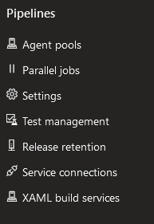

### Agent pools

This is where you configure where your pipelines will run.
On a standard installation you have [two pools set up](https://docs.microsoft.com/en-us/azure/devops/pipelines/agents/pools-queues?view=azure-devops&tabs=yaml%2Cbrowser#default-agent-pools):

- Azure pipelines.
  - This is the pool of Azure hosted build agents provided by Microsoft.
- Default
  - A starter pool where you can put your self hosted build agents. We will use and expand here when it's deployment time!

### Settings

Where there's settings, we need to click buttons, right? Well, not really, but lets look at them anyway!

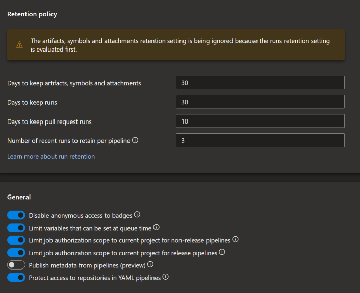

As for retention policies, these mostly comes down to what your company requires. How many days must ~~a man walk down~~ you retain the result of a built pipeline.

Most of the settings under general are default enabled, and this is a good thing.
Worth noting though is that some of these settings actually does not apply to YAML pipelines, but classic only.

- Disable anonymous access to badges
  - Badges can display things like build status, test status, and more. Allowing anonymous acces to them are generally not the worst idea, but can lead to unwanted information leakage.

- Limit variables that can be set at queue time
  - If this setting is not checked a user can potentially override default variable values in pipelines. Keeping it checked lets you set which variables can be overwritten.
- [Limit job authorization...](https://docs.microsoft.com/en-us/azure/devops/pipelines/process/access-tokens?view=azure-devops&tabs=yaml)
  - I'm batching theese together as they are similar in what they do. the "Release pipelines" on eonly applies to classic pipelines.
  - This settings limits the access of your build runner token. If this is unchecked a pipeline can for example access repos outside of the pipelines organization. Own one pipeline to own them all!
- [Publish metadata from pipelines](https://docs.microsoft.com/en-us/azure/devops/pipelines/process/artifact-policy?view=azure-devops)
  - This is a tricky one. Not much is documented around what it actually does, but enabling this lets you create query based locks when using environments and deploying to kubernetes or container images.
- Protect access to repositories in YAML files
  - This setting mucks about in your build runner access token. Very good to have enabled to prevent unwanted access to external repos, but can mess up things like [external git dependencies](https://github.com/MicrosoftDocs/azure-devops-docs/issues/11939).

All in all I'm actually quite happy with these defaults. MS did a good thing defaulting everything to enabled.

### And thats all, folks

The rest of the pipeline submenus here are truly not that interesting right now, so onwards we march.

## Remember back to your early teachings

So let's go back to the pipeline and edit some YAML!
In Azure DevOps there is a built in YAML/Pipeline editor you can reach by simply clicking "pipelines" -> your pipeline name -> "Edit"

For our recently created starter pipeline it looks like this:

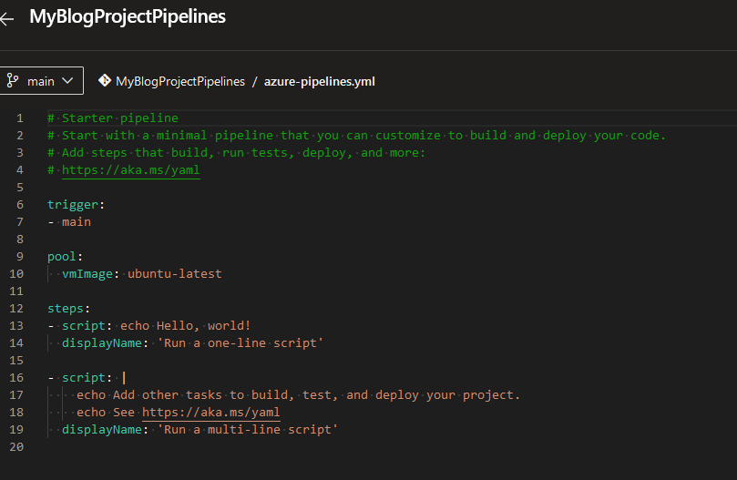

The first thing we nbeed to fix here is the trigger. Since we are storing our pipeline YAML files in a repo that will not contain our code we need to set up a trigger and a Git fetch to get the code we want to build.

What we need to add is a repository resource.
Reading [the docs](https://docs.microsoft.com/en-us/azure/devops/pipelines/process/resources?view=azure-devops&tabs=schema#define-a-repositories-resource) we can see there are many settings we can set. First of, we need to turn of the default trigger of our main branch (So we don't trigger builds in the pipeline repo).

```YAML
trigger: none
```

After this we also need to add a reference to the pipeline where our actual code is. This reference will later be used in our pipeline to clone the correct repo. (replace the "<>" fields with your names...)

```YAML
resources:
  repositories:
  - repository: <Repository identifier>
    type: git
    name: <Project name>/<Repo name>
    ref: main
    trigger:
      branches:
        include:
        - main
```

This is all the code needed to trigger our pipeline on commit to main branch in our code repo.

Next up, we need to add a Checkout step before we can work with our code.
Normally this is done automatically in Azure DevOps, but since we're working with separate repos we need to define it manually.
We can do this using the previously set repositroy identifier.

```YAML
- checkout: <Repository identifier>
```

And this is pretty much everything we need to do to set up our build and release pipeline! yesyes, we need to add the actual build and release steps, but thats for the next chapter.

For now we have a build pipeline YAML file that looks like this:

```YAML
trigger: none

pool:
  vmImage: ubuntu-latest

resources:
  repositories:
  - repository: MyCodeRepo
    type: git
    name: MyBlogProject/MyBlogProject
    ref: main
    trigger:
      branches:
        include:
        - main

steps:
- checkout: MyCodeRepo

- script: echo Hello, world!
  displayName: 'Run a one-line script'
```

We will of course verify that this all works, so lets create a file in our code repo and check that the pipeline starts.

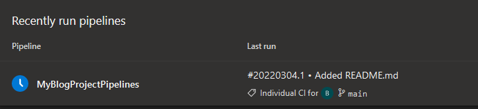

It does! but it wont finnsh just yet. If we click the blue "clock" and go in to our pipeline run we can find this:

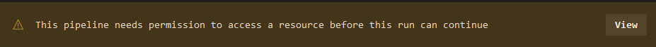

Like I've said before, there are approximately a million levels of ACLs in Azure DevOps, and this is one of them. Before a pipeline can access a [protected resource](https://docs.microsoft.com/en-us/azure/devops/pipelines/security/resources?view=azure-devops#protected-resources) you need to grant the pipeline access to it.

In our case, the protected resource is the code repo.

Clicking "view" followed by "permit" grants the pipeline the correct access.
(see [part II](posts/azdo.gitrepos.md) for details of how to find git repo security)
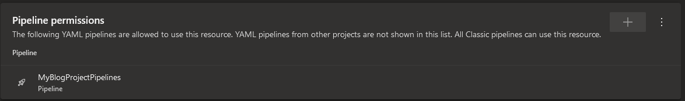

After we have approved this we get a nice, green, pipeline run!
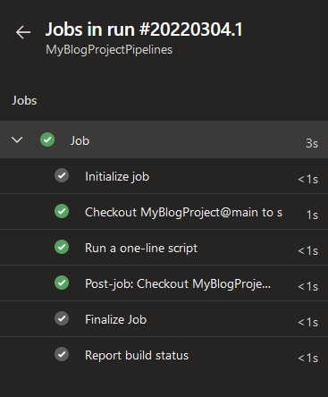

So are we done for today, Bjompen?
Not quite yet. We need one more pipeline first.
We need a build validation pipeline!

## If you wish to become a complete and wise leader, you must embrace a larger view of the Force

So what is a build validation pipeline? Well, It's pretty much a standard pipeline, but instead of triggering on a branch policy we will set it up to trigger ever time a pull request is created.

Creating the pipeline itself is actually exactly the same as the build pipeline: Pipelines -> create new -> starter pipeline.

We also will remove the trigger here, just like in the build pipeline.
For now that'll do codewise, so lets set it up as a build validation step.

In our project we got to "project settings" -> "Repositories".

In our Code pipeline (1), under the tab "Policies" (2) we can enter the branch policies for the "main" branch (3).

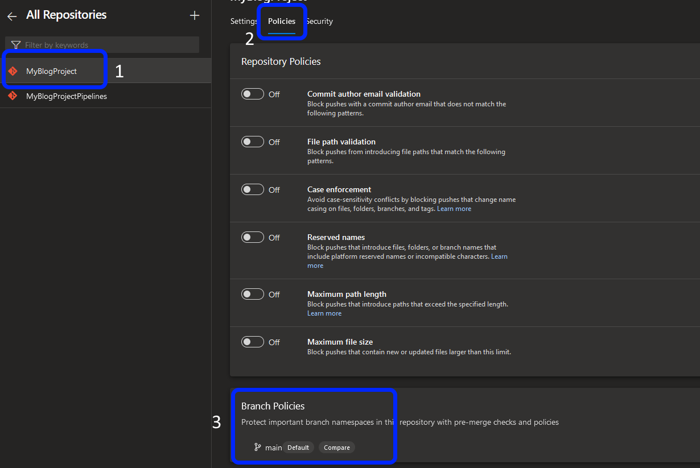

In here there is a setting called "Build Validation". According to the help text this is what it does: `Validate code by pre-merging and building pull request changes.`

Let's read that again... `...pre-merging and building...`

It will actually preform a merge of your code and execute it to see if the pull request will go through.

Now lets go back to the first paragraph again: "this lets anyone run code as our service / build account"

**If we were to have our YAML file, or our build script files, in our main code repo, and set up a validation pipeline, then anyone with access to create a PR in your repo will be able to run arbitrary code inside your build agents!**

But since we are not using a single repo for everything we'll just go ahead and click the "+" sign 😉

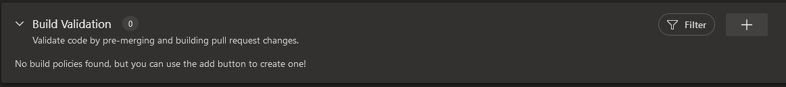

I'm happy with the default settings for mmy verification pipeline, so in the slide-out window we select our newly created pipeline, give it a display name, and click save.

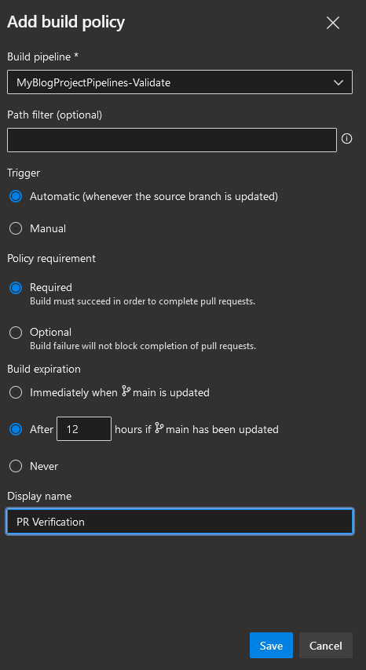

And thats it! We have our two pipelines set up.

## To a dark place, this line of thought will carry us. Hmmm. Great care, we must take

So this is running longer, and slower than I expected. Maybe next time it won't take this long. Maybe c!¤%sucker Poot*n will start WW III for real.

In the end I hope you all stay safe out there, and even those of us lucky enough to still be in countries in peace - remember: It's ok to take a time out. It's hard right now.

I'll end this post not with a star wars quote, because it doesn't feel right right now.

----
**Слава Україні!**

**Slava Ukraini!**


