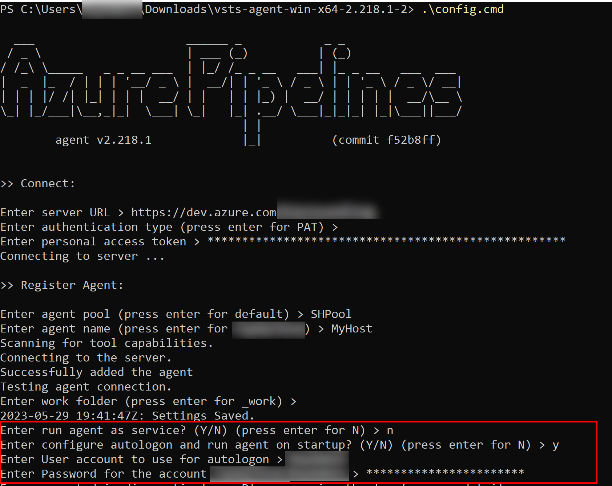
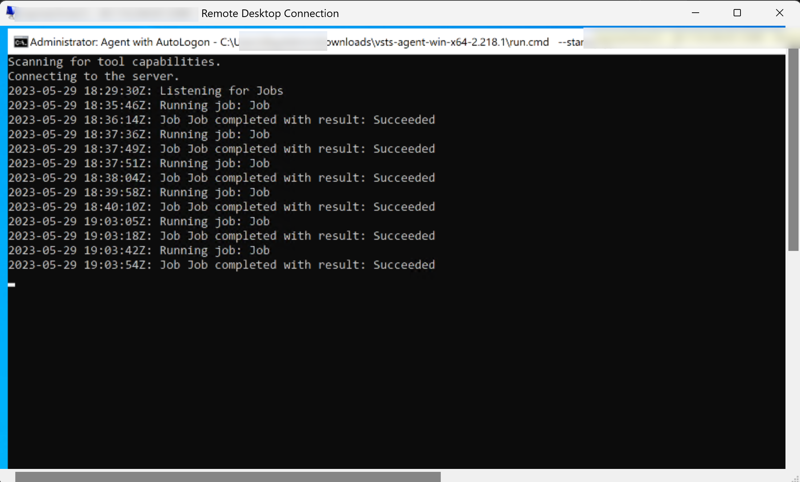
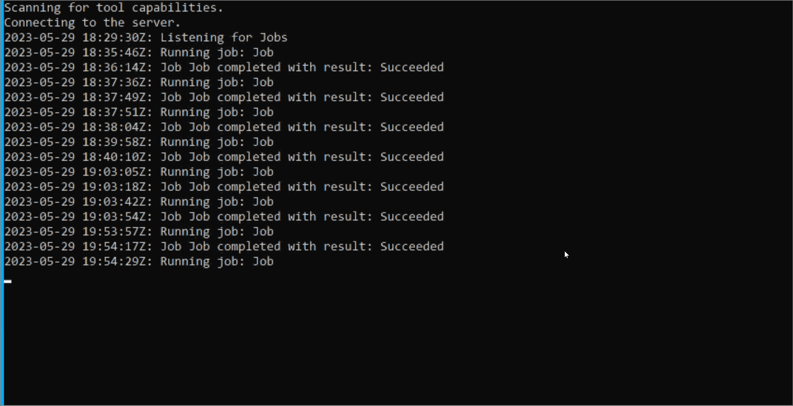
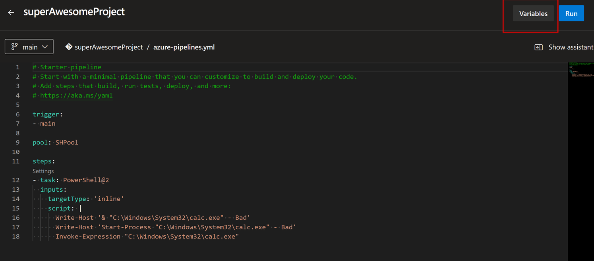
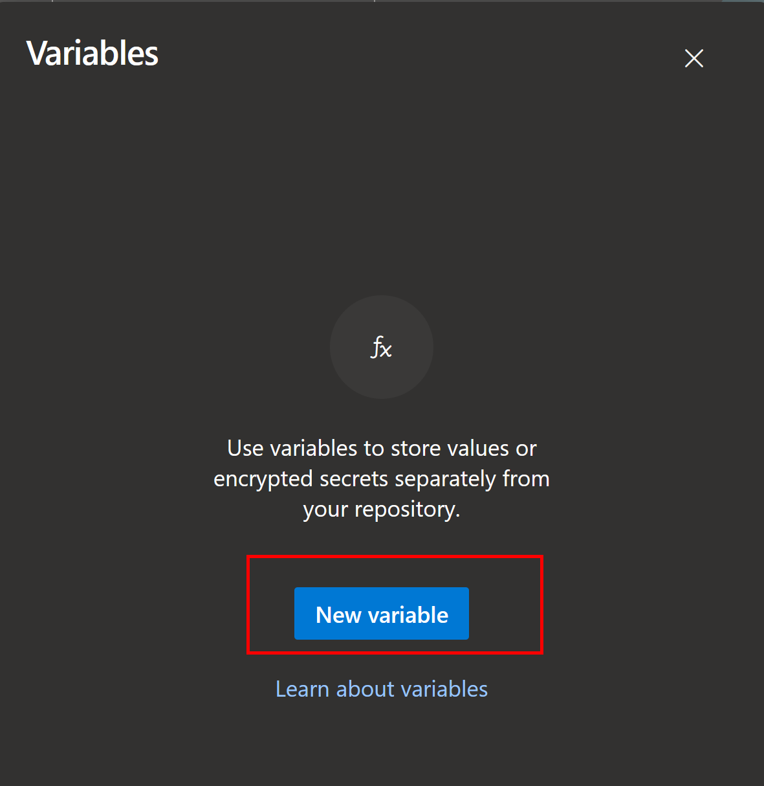
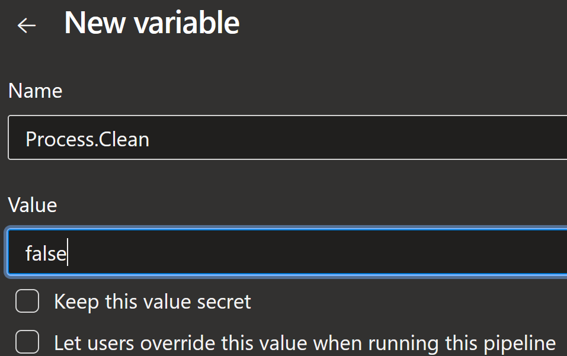
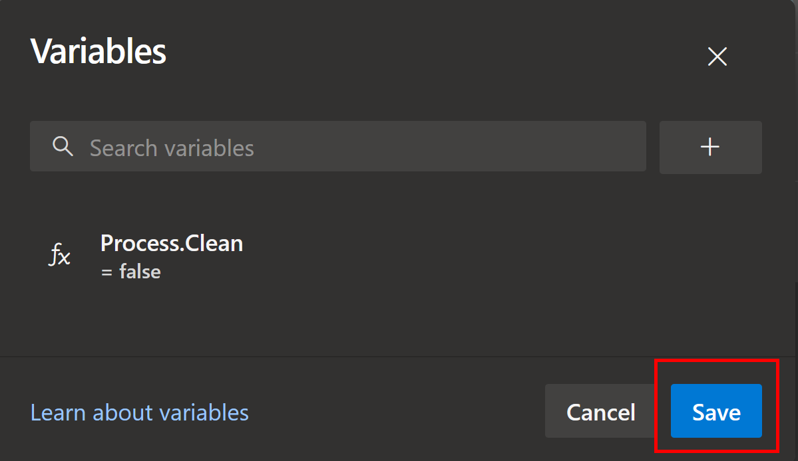
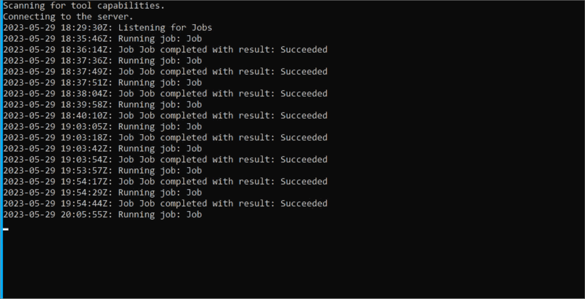

# Azure DevOps and long living processes

Long time no write again.
I've been keeping busy as b***s though, presenting at PowerShell and DevOps global, Global Azure, and in just a couple of weeks it's time to visit Prague and PSConfEU. If you haven't already, it's time to book your tickets. It's going to be awesome.
So most of my free time right now is spend writing presentations.

And playing music! I have a new old band, [Internal Decay](https://www.metal-archives.com/bands/Internal_Decay/9481), and we started to rehearsing. Hopefully there will be an album eventually. I'll let you know.

I've also joined a new client at work! new Azure DevOps adventures! Now, like most of the times I can't tell you anything about anything involving the client itself, but new clients means new challenges, and new challenges means new learnings!

One of the first tasks I was given was one of these learnings.

## The case of the missing windows

"Hey bjompen, we have this app that needs to run as administrator and runs interactively on a desktop, and we need to start it using a pipeline"

I know what you're thinking, and of course, my initial answer was "Why, in the year of [our lord](https://en.wikipedia.org/wiki/Satan) 2023, are we running apps that requires admin and desktop access?"

"This exe is a mock thing emulating a thingamajig that does blahonga with the flippetiploop. No one wants to rewrite it"

So the process right now was a bit like this:

1. Run hardware installation
2. Run software installation
3. Pause with a gate
4. Log in as admin on the server, run PowerShell, and start an .exe file with a [TUI](https://en.wikipedia.org/wiki/Text-based_user_interface)
5. Approve gate and continue
6. Send messages to clients that everything is done.
7. Clients log in as same user as above and do stuff in TUI

(ok, there a lot more to it, but simplified..)

So can we start the .exe in our pipeline? Turns out it's not that straight forward.

## Self hosted pools and interactive jobs

The first thing we need to do is to set up an interactive client.

In self hosted VMs this is actually not that hard. Download the client installer and run it with the highlighted parts here being the important ones.



This will setup automatic logon using the selected account, and will start the agent on the logged on desktop.



## Start-Process, &, Invoke-Expression, and other ways of starting an app in PowerShell

Now we only need to start the process, right?

Naturally, the logical first step is to just toss the commands in a PowerShell script and run

```Yaml
trigger:
- main

pool: SelfHostedPool

steps:
- task: PowerShell@2
  inputs:
    targetType: 'inline'
    script: |
      & "C:\Windows\System32\calc.exe"
      Start-Process "C:\Windows\System32\calc.exe"
      Invoke-Expression "C:\Windows\System32\calc.exe"
```

Now all three of these works, but the result is the same: The process starts, the job completes, and the process, calc.exe, is killed.



## Magical variables!

The very last thing an agent does once it finishes all jobs is cleaning up. This makes sense, since you can run multiple agents on the same machine. If a process is left behind and another agent starts doing stuff using the same exe/ps1/whatnot, bad things might happen. Orphaned processes are generally a bad thing.

But we want them here!

This took a bit of googling to find, but there is a magic variable called `Process.Clean`.
If we set this variable to `false` using our `Variables` button we will prevent this clean up from happening.









Now lets try the same pipeline again shall we?



Success!

## Simple, yet another undocumented feature..

I absolutely love those. Documentation is good.
Anyhow, I just wanted to write tis up before forgetting it.

Now of to rehearse presentations again.

See you in Prague I hope!
