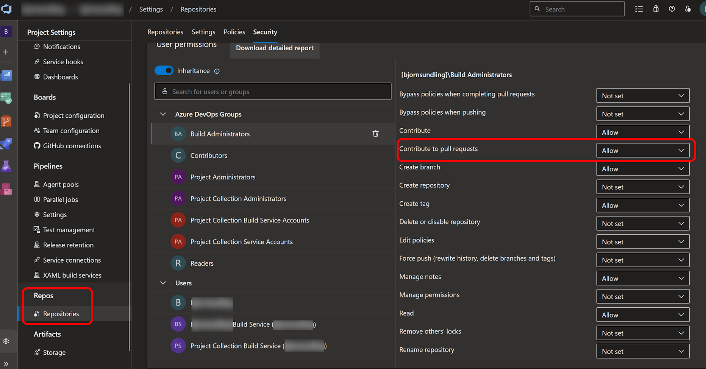
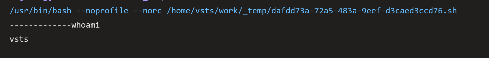
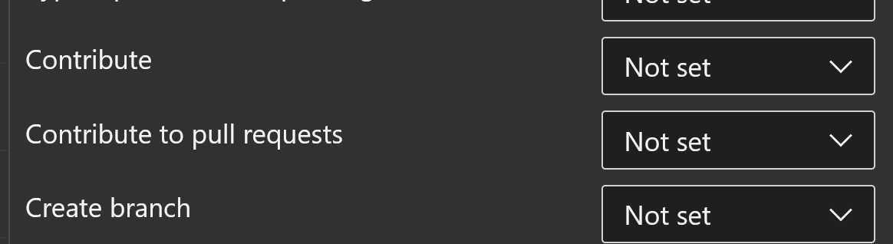
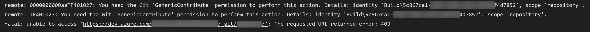
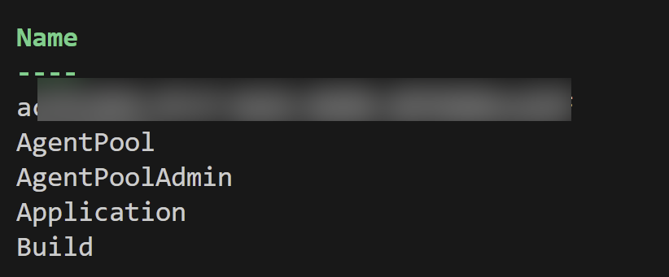
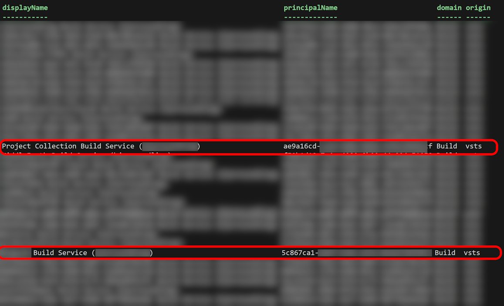
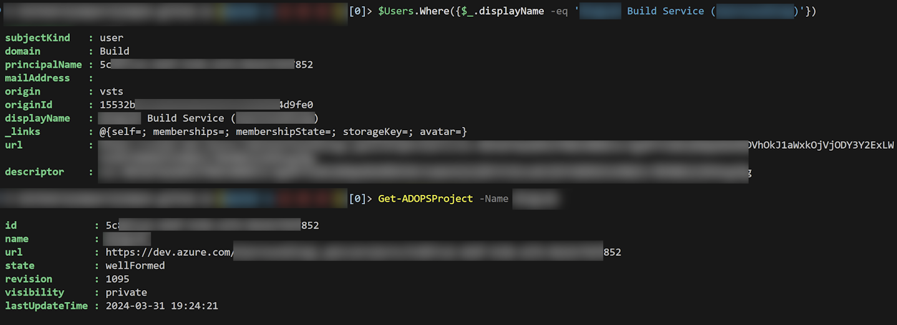
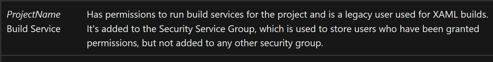

# Who am I?

Yeah, that didn't work out as planned. Apparently writing this year is harder than it has been in a long time!
Mainly I think there are two reasons behind it:

- I haven't really discovered anything amazing in quite some time. The interesting stuff I've come across I either can't talk about (NDA), or it makes me mostly upset and ranting (The so called "AI"... I have.. opinions.)
- I have been crazy focused on completing a separate project to be properly released soon(ish).

The latter also includes writing sessions for [PSConf EU](http://psconf.eu) where I am speaking in a mere two months.

And before that, as soon as next week to be exact, I'm going back to Bellevue and the [PowerShell + DevOps global summit](https://www.powershellsummit.org/). An awesome spring all in all.

So it's not that I've been lazy, I guess I just.. haven't really felt like writing.

Until now!

## Another day, another question.

The other day  a colleague asked me an interesting question.

"Bjompen, How do I know which account I am in Azure DevOps?"

I honestly didn't first understand the question. "You are the account you configure your runner to run as I guess?"

But the answer wasn't that simple. Let's expand.

## The _real_ question. Who am I?

The task they set up to do was quite simple and quite standard:

- We have a runner gathering feedback on a deploy, and posting this feedback as a comment in the pull request. The runner is running a standard Azure hosted Ubuntu image.

What we would normally do is this:

- Go in to the repo settings
- Select "Security"
- Change the correct account to grant it "Contribute to pull request"



But this is where the actual question was hiding.

There are two accounts here

- "ProjectName Build Service (orgName)"
- "Project Collection Build Service (orgName)" 

So how do we _actually_ know which of these accounts we need to grant feedback? And how can I know which of these accounts are used in my pipeline?

## I am no one

So lets start by looking at the very basics. Who is it really that is running a job on an Azure Hosted runner?

Our first pipeline looks like this:

```yaml
trigger: none

variables:
    system.debug: 'true'

pool:
  vmImage: ubuntu-latest

steps:
- script: |
    echo -------------whoami
    whoami
  displayName: 'Who am I really?'
```

If you are somewhat Linux skilled, and have ever dug through a Azure DevOps log before you may be able to figure out what the output of this command is. After all, the path to the default runner folder is `/home/vsts/work/`

And yes, the output tells us that the user we are running as is indeed `vsts`.



The problem still persists though. `vsts` after all, is not one of the afore mentioned users.

In fact, looking through [every single log available](https://learn.microsoft.com/en-us/azure/devops/pipelines/troubleshooting/review-logs?view=azure-devops&tabs=windows-agent) still doesn't tell us how the `vsts`user maps to our internal accounts, nor which one we are using.

We got to go deeper!

## Without ~~you~~ logs I'm nothing

[Musical interlude -  Placebo - Without you I'm nothing](https://www.youtube.com/watch?v=BLmypIo-wFY). Awesome song.

So if we can't wee it using our logs, how do we see what is actually going on? Well thankfully, we have a pipeline that does this magic already in place. The one where the question comes from! We can simply ~~replicate~~ steal ideas from this pipeline and see what it can tell us!

Our new pipeline looks like this:

```yaml
trigger: none

variables:
    system.debug: 'true'

pool:
  vmImage: ubuntu-latest

steps:
- checkout: self
  persistCredentials: true
- script: |
    echo -------------whoami
    whoami
    echo -------------Without Git Im nothing

    git config user.name "Da Fishy"
    git config user.email "dafishy@bjompen.com"

    git checkout -b 'testBranch'

    mkdir daFishy
    cd daFishy
    touch daFishy
    git add .
    cd ..
    
    git commit -m "Ima touch da fishy"
    git push origin 'testBranch' -f
  displayName: 'Who am I really?'
```

> [I'ma touch the fishy](https://www.youtube.com/watch?v=tvx_n6HH2n0)

And a short explanation may be in place here.

First of, if we want to be able to push stuff using git we need to store the credentials by setting the `persistCredentials` flag of the `checkout` task.

We know that setting your access rights in the `repositories` page allows us to do things with our identity. We also know that the built in runner `vsts` somehow maps to this identity.

We also know from experience (I am terrible at Git) that Git is actually quite good at giving us error messages!

So by combining these settings, creating a git branch and creating a file, then trying to push this file to our repo, can we maybe get an error message and some more info?

Before running, lets make sure none of our accounts have access to push code to our repo by making sure the following settings are `Not set` _or_ `deny`



And the run output? We'll whaddya know!



This identity tells us something completely different. But what? Who is `Build\19c59df9-7f1e-4c07-beac-51188ba21b12`?* the plot thickens!

> \* GUID replaced because reasons 😉

## Who am I? The question is - who are you?!

Turns out this user is not visible in any of the GUI user lists.

In fact - I find the documentation on the build users over all terribly lacking. Lacking to the point of "I can't find it at all".

But we have an API, and a [fairly good PowerShell module for problem finding](https://github.com/AZDOPS/AZDOPS)

```PowerShell
Connect-ADOPS -Organization myOrg -TenantId myEntraIDTennant
$Users = Get-ADOPSUser
```

Looking at a user, `$Users[0]`, tells us that a user has a domain. We can group these by running 

```PowerShell
$Users.domain | Group-Object | Select-Object -Property Name
```



The first row here is a GUID. Your Entra ID to be more precise. The rest are various built in service accounts of Azure DevOps. One of them is Build.. Just like the domain of the git error.

Let's dig deeper

```PowerShell
$Users.Where({$_.domain -eq 'Build'}) | Select-Object displayName, principalName, Domain, Origin
```

Fetching all accounts from the `Build` domain we can quickly start to see a pattern..



First of all - There are an _awful_ lot of accounts there. Now I don't know about you all, But I do _not_ like having hidden accounts laying around. Especially not accounts named `randomGuid Build service (myOrg)`.

But we also have the two highlighted ones in the picture. Recognize the name? Yup, those are our two different accounts from the `Security` settings!

So by now we could actually just get our account from the Git error and explore further.

```PowerShell
$Users.Where({$_.displayName -eq 'myProject Build Service (myOrg)'})
Get-ADOPSProject -Name myProject
```



# So what do we know?

There are a lot of things we can figure out from the above output.

For every new project created there is a build service account created. This build service account is named `projectName Build Service (myOrg)`. It is scoped to a single project, and in fact the principalName of the build account is set as project id.

We also know that when a project is deleted, the identity stays there, and the `projectName` is replaced with the deleted projects id, and since I play around _a lot_ with Azure DevOps I have about [607 tillion](https://en.wikipedia.org/wiki/Scrooge_McDuck#Wealth) enabled, uncontrolled, accounts hanging around.

And we can now see exactly which account is in use by our pipeline! (Although it is bad that we have to reconfigure it to see..)

What we _don't_ know is how to control it.

## Can I choose my account?

The short answer is "No".

The long answer is "NNNNNNOOOOOOOO".

There is no way of picking and choosing which account we are using.

But naturally there is a logical explanation and an easier way to figure out which account _should_ be used.

Already from the start my initial guess was that this account is in some way the result of the "Limit job authorization scope to current project for ... pipelines" settings, and I was correct.

In fact, this is pretty much [the only somewhat well documented detail](https://learn.microsoft.com/en-us/azure/devops/pipelines/process/access-tokens?view=azure-devops&tabs=yaml#job-authorization-scope)

There is a setting in both organization and project level called "Limit job authorization scope to current project for non-release pipelines". If this setting is `Enabled` you _will_ use the project scope identity - `projectName Build Service (myOrg)`. If this setting is `Disabled` you  will use the `Project Collection Build Service (orgName)`.

The difference between these two accounts are also somewhat well documented in the above link, in the info page, and it is one of those notes that should really be huge and blinking red..

> Quote: If the scope is not restricted at either the organization level or project level, then every job in your YAML pipeline gets a collection scoped job access token. In other words, your pipeline has access to any repository in any project of your organization. If an adversary is able to gain access to a single pipeline in a single project, they will be able to gain access to any repository in your organization. This is why, it is recommended that you restrict the scope at the highest level (organization settings) in order to contain the attack to a single project.

If I don't enable this setting _somewhere_ I am basically giving every pipeline the key to the kingdom. 

(I can't find the link again, but I am fairly sure this setting is enabled on newly created Azure DevOps organizations.)

But this is not all...

## And another thing

I mentioned this was quite badly documented. One of the reasons for this hate is that the first and as far as I know only place the build service accounts are documented and mentioned _using name_ is [this page](https://learn.microsoft.com/en-us/azure/devops/organizations/security/permissions?view=azure-devops&tabs=preview-page#service-accounts)

One could imagine that the official documentation would suggest that the local project scope account is quite important. After all, the above linked access tokens page specifically says you should always enable this setting, and when you do, this service account will be used.

What it says instead as of this writing is this:



Legacy account.

In fact, I was properly fooled when I first saw this in the beginning of my journey and theorized they are moving away from this account. Confusing to say the least.

## Wrap up

Did we achieve what we wanted? As always the answer is Yes and no. We can answer the original question: "Who am I?". You are what the setting tells you, and I do have the proof. 

- We know the runner uses an account named `vsts` and that this account maps to the built in accounts. How this works is still magic.
- We know now that we can figure out which account we are mapping to by exploiting some error messages.
- We know that the setting "Limit job authorization scope to current project for non-release pipelines" changes which account we _should_ use. (For YAML pipelines. You are using YAML only, right?! 🤐)
- The ADOPS module and the Azure DevOps API is really awesome when it comes to finding and figuring out the secrets behind the curtains.

But I also learnt some things I would like to change..
- Can we instead just include which account mapping is used in the log instead of having to take extra laps?
- Please, for the love of god, remove service accounts related to projects upon project deletion! This feels like a _major_ security issue..
- In fact - Give us a nice GUI way of finding all existing users, not just the "real human" ones.

All in all we gathered good data, interesting learnings, and in case I remember when I meet with the team - Some good feedback.

And I got to write again. I need more colleagues asking interesting questions.

Until next time, Internet.