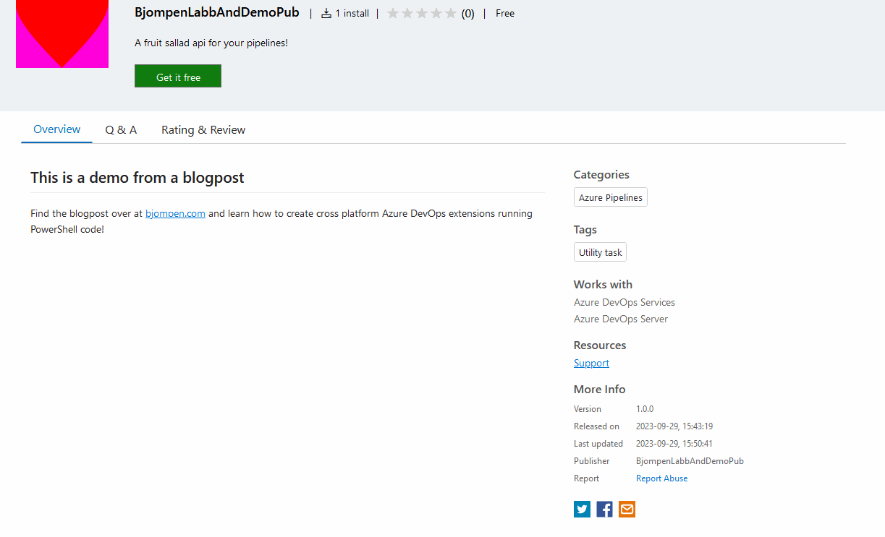

# Creating and releasing PowerShell Azure DevOps tasks

Another night, another post. Landing a bit after last couple of month of adventures, yet the chaos continues with birthdays, name giving parties, concerts, and more or less one thing every day in the calendar. I guess I'll sleep somewhere in November.

But the only way to shorten the list and lessen the stress is to do stuff, and top of the list right now is this blog post, so, well, here goes.

Recently I released my first public cross platform Azure DevOps task [Which you can find here](https://marketplace.visualstudio.com/items?itemName=Bjompen.PWSHUpdater). Doing this was way more work than creating a GitHub action, and I really couldn't find one good source of how to do this, so why not create one? But where to start? Do I need to learn TypeScript? There are so many files and folders to keep track of!

## Setting up a publisher

> Note: Before moving on a special note. I run [Firefox](https://www.mozilla.org/firefox/new/) as my primary browser, but for some reason the publisher page _does not work for me there_. I can not click any buttons. Nothing happens when I do. In order to set my publisher up I was forced to run Edge instead, so if you can not do this, try changing browsers. Apparently web standards are still hard in the year of our lord 2023..

The first thing I would recommend you to do is setting up a publisher. It is necessary to have one no matter if you publish your action publicly or just for yourself, but if you do it publicly _getting the approver verification needed to do so may take quite some time._

Creating a publisher is a fairly straight forward process: [just follow this guide](https://learn.microsoft.com/azure/devops/extend/publish/overview?view=azure-devops&wt.mc_id=DT-MVP-5005317#create-a-publisher). Do fill in as much data as you can and want to, some of it ~~will~~ may be needed to get verified.

Once your profile is created one would easily believe the [related page on making an extension public](https://learn.microsoft.com/azure/devops/extend/publish/publicize?view=azure-devops&wt.mc_id=DT-MVP-5005317) would be a good step to continue with. One would be wrong.

Instead the guide to follow is located [here](https://code.visualstudio.com/api/working-with-extensions/publishing-extension#verify-a-publisher). Although this guide only talks about Visual Studio extensions, the process is the same and you need to verify your publisher. This is done by adding a [DNS txt entry](https://www.google.com/search?client=firefox-b-d&q=dns+txt+entry) to your domain (yes, you will need a purchased domain name).

Under the `Details` tab, fill in your domain name under `Verified domain`. This _must_ be a _HTTPS_ server, NOT http. Also note: this URL will be contacted and needs to be reachable! You will need to set up some kind of HTTPS server on the receiving end.


Once this is validated you will be able to click `Verify`. This will pop up a window containing DNS data you need to publish.

TXT record name: `_visual-studio-marketplace-<yourPublisherName>.<yourVerifiedDomainWithoutHTTPS>`
> for example: _visual-studio-marketplace-bjompeniswritingabloggpost.idontreallyownthisdomain.com

The value of the TXT entry is a GUID
> for example: 2e33c93e-c69d-4b82-9c2b-c6c1692c90d8


Once your entry has propagated the verification process will begin, however this seems to be a manual process. After about two weeks of waiting I contacted support to be able to get mine actually verified, and this is why I say this process should be started early 😉


Now then, all set, it's time to start developing. Or?

## Setting up prerequisites

Almost. First you will need some stuff. Like I said, DevOps tasks aren't as easy to create as GitHub actions.

> Note: This guide is for a Windows development environment. If you run any other OS your mileage may vary.

You can follow the [official guide here](https://learn.microsoft.com/azure/devops/extend/get-started/node?view=azure-devops&wt.mc_id=DT-MVP-5005317) and jump to the next chapter, or get the short of it here. I will however add a few extra things that may be needed.

----

first of you will need [__Visual studio code__](https://code.visualstudio.com/). If you do PowerShell like me you should already use it, but just in case.

----

Next up - [__Node.js__](https://nodejs.org/en). We use this for addons and other installations, so install this, and make sure it is in your path after installation! (This may require restarts or manual path edits)


----

Once node is installed you will need the __tfx-cli__ which is installed by running `npm install -g tfx-cli` in your console. this CLI is used to compile the code in to a vsix package we can deploy to Azure DevOps.

----

Creating cross platform code in this case is done by using Typescript. VSCode comes with a good enough built in Typescript functionality, but we will need to install the __Typescript node libraries__ globally to help us do stuff like compile.
Run `npm install -g typescript` in your console to install the Typescript stuff.

----

Setting up your project using node / npm also requires a couple of runtimes.

__Python__: Download and install from [here](https://www.python.org/downloads/). Just like with npm, you may need to restart and/or add python to your path.

----

Visual Studio. This is a big one. In some cases, I don't really know when, there seems to be a requirement to install Visual Studio with the __.NET desktop development__ workload.
I _believe_ the actual requirement is some kind of VC++ runtime, but I haven't bothered to figure out which. After all, I already run Visual Studio, but if you don't - Go [here](https://visualstudio.microsoft.com/downloads/) and download the _Community_ edition. It is free for individuals. When installing it, make sure to include the _.NET desktop development_. If you didn't, no worries, just go to the search window in Visual Studio and search for _.NET desktop development_. The first hit will be installing it.
And if you do know which C++ runtime is actually needed, please let me know and I'll update this post.

----

Apart from this I will suggest installing the Visual Studio Code extension [__vsix Viewer__](https://marketplace.visualstudio.com/items?itemName=onlyutkarsh.vsix-viewer). Yes, it does appear abandoned, but it still works, and since the package to be releases is in vsix format it may hep understanding the contents and layouts.

> Note: ~~Many~~ Some guides also tells you to install the npm package `mocha`. This is a test framework for JavaScript, and while I do encourage testing your code I am not using this yet, so no need to add it for now.

__Now__ then, time to start developing.

## Creating your project

Initially, creating a project is quite simple:

- Create a folder with your task name and Set-Location to this folder. The project name will be set to the same as the folder. You can change it later if needed.

```PowerShell
New-Item azdo.xplat.task -ItemType Directory
Push-Location azdo.xplat.task
```

- Initiate your node package to create a `package.json` file

```PowerShell
npm init -y
```

- Add the `azure-pipelines-task-lib` node package and its dependencies. This will add about a million files to your folder structure. This installation is also where the requirements for Python and Visual Studio comes in. If you get the error message seen below, go back and install the prereqs mentioned above. 

```PowerShell
npm install azure-pipelines-task-lib --save
```


- Add the node types. This package gives you some additional lazy functions that we will use in our typescript later on.

```PowerShell
npm install @types/node --save
```

- Add a .gitignore file. You're using git right? If not, go back, learn git, and return when you do. Like I said, Node have a tendency to add about a million files to your code. About 0 of those needs to be in git. Add a .gitignore file in the root of your project and make the following exclusions:

```PowerShell
Pop-Location
"node_modules`r`n*.vsix" | Out-File .gitignore
```

By now your folder structure should look something like this:

```
root folder
|
| --> Project Name folder
    | --> node_modules folder - Dont even go in here.. There's a lot of stuff here.
    | --- package-lock.json
    | --- package.json
| --- .gitignore
```

or, in VSCode:


And that's almost it. Only one more project file to create. Unfortunately though this file is the biggest one, with no real lazy way of creating it, and also most of the data here is not yet available, so lets save the extension manifest file for later and instead...

## Add our PowerShell code

For this example I will use my trusty old `Invoke-FruitAPI` module. If you have seen me present on PowerShell somewhere chances are you have seen it in action as I use this for most of my demos. Its a really useful module that outputs fruits.

You can add your modules and files in just about any folder or path. In fact, If this module is not specific for Azure DevOps tasks only you probably should consider storing the PowerShell part in a separate repo and set it up in a build pipeline instead, but for now I will add my code to the same folder that the `package.json` file is located in.

My PowerShell code consists of one module called `BasicFunction` and one runner script called `MommaScript.ps1`. Again, your mileage may vary, but what you will need to do is make sure _your code or runner (MommaScript.ps1) allows all parameter inputs as string only._ As far as I know the input of _all_ parameters will be of string or null type (but please correct me if I'm wrong). My `Invoke-FruitAPI` function has one parameter of `switch` type, so I need to fix this in my `MommaScript.ps1`.

For now, the contents of my `MommaScript.ps1` looks like this:

```PowerShell
Param(
    [string]$Icons
)

ipmo $PSScriptRoot\BasicFunction\

if (-not [string]::IsNullOrEmpty($Icons)) {
    Invoke-FruitAPI -Icons
}
else {
    Invoke-FruitAPI
}

Remove-Module BasicFunction
```

And my folder structure now looks like this:

```
root folder
|
| --> Project Name folder
    | --> BasicFunctions folder
        | --- ModuleFiles.psm1, ModuleFolders
    | --> node_modules folder - Dont even go in here.. There's a lot of stuff here.
    | --- MommaScript.ps1
    | --- package-lock.json
    | --- package.json
| --- .gitignore
```

And last but not least, running the code looks like this:


It is time to combine the power of PowerShell with the cross platform world of TypeScript!

## Lets learn some TypeScript

The first typescript thing we need to do is initializing the actual project. This creates a config file that you may play around with and set a lot of Typescript things in. I haven't. In fact, the default one output here seems to work fine.

```PowerShell
Push-Location $MyProjectName
tsc --init --target es6
```

The notable thing here is the `--target` flag. Some guides seems to recommend setting different targets. I honestly don't know the difference, but for running PowerShell es6 seems to do the trick.


And once again, a file structure:

```
root folder
|
| --> Project Name folder
    | --> BasicFunctions folder
        | --- ModuleFiles.psm1, ModuleFolders
    | --> node_modules folder - Dont even go in here.. There's a lot of stuff here.
    | --- MommaScript.ps1
    | --- package-lock.json
    | --- package.json
    | --- tsconfig.json
| --- .gitignore
```

### Creating the actual Typescript PowerShell runner

Now then, time to write some typescript! But why, you may ask? There are runners called Powershell3, right? Well, yes, but those only run on Windows build hosts, and only run PowerShell, not pwsh. We want x-plat. Fortunately we don't need all too much of it.

In fact - All the typescript we need is this:

```Typescript
import tl = require('azure-pipelines-task-lib/task');

async function run() {
    try {
        const Icons: string | undefined = tl.getInput('Icons');
        
        var args = [__dirname + "\\MommaScript.ps1"];
        
        // we need to get the verbose flag passed in as script flag
        var verbose = (tl.getVariable("System.Debug") === "true");
        if (verbose) {
            args.push("-Verbose");
        }

        if (Icons) {
            // Icons variable is set. 
            args.push("-Icons");
            args.push(Icons);
        }

        // find the executeable
        let executable = "pwsh";

        console.log(`${executable} ${args.join(" ")}`);

        var spawn = require("child_process").spawn, child;
        child = spawn(executable, args);
        child.stdout.on("data", function (data: { toString: () => any; }) {
            console.log(data.toString());
        });
        child.stderr.on("data", function (data: { toString: () => string; }) {        
            tl.error(data.toString());
            tl.setResult(tl.TaskResult.Failed, data.toString());
        });
        child.on("exit", function () {
            console.log("Script finished");
        });
    }
    catch (err) {
        // @ts-ignore
        tl.setResult(tl.TaskResult.Failed, err.message);
    }
}

run();
```

Save this in a file, in the same folder as your `tsconfig.json` file, and name it `index.ts`. Done.

Not to much, right? But still, let's go through it a bit to understand what is going on here...

----

```Typescript
import tl = require('azure-pipelines-task-lib/task');

async function run() {
    try {
        //stuff happens
    }
    catch (err) {
        // @ts-ignore
        tl.setResult(tl.TaskResult.Failed, err.message);
    }
}

run();
```

We start of by importing the task library. Remember, the one we used npm to install in the prereq setup. Putting this library in the `tl` variable lets us do things like reading task input, and, like in the `catch` block here, output errors. 

We run our code in an asynchronous function, which for a PowerShell person may be a bit weird, but in this case only one function is used so in fact it shouldn't make a difference. We still start the job by invoking the `run()` function , and then.. nothing more happens.

What about the comment, `// @ts-ignore`? The Typescript linter will complain that the `err` variable is of type unknown. This comment tells the linter to ignore it.

----

```Typescript
const Icons: string | undefined = tl.getInput('Icons');
```

This is how we read parameter input. In typescript you need to tell the variable what type it is, just like you can do `[string]$Icons` in PowerShell. If you want an input to be nullable, that is "it's ok to leave this field blank', we need to say that if `tl.getInput(<inputName>)` returns something it _will_ be a string. If it is empty, cast the `Icons` variable as `undefined` type.

getInput also supports additional parameters. You can read all the API docs for it [here](https://github.com/microsoft/azure-pipelines-task-lib/blob/master/node/docs/azure-pipelines-task-lib.md)

----

```Typescript
var args = [__dirname + "\\MommaScript.ps1"];

// we need to get the verbose flag passed in as script flag
var verbose = (tl.getVariable("System.Debug") === "true");
if (verbose) {
    args.push("-Verbose");
}

if (Icons) {
    // Icons variable is set. 
    args.push("-Icons");
    args.push(Icons);
}

// find the executeable
let executable = "pwsh";

console.log(`${executable} ${args.join(" ")}`);
```

This is where we build our actual command to run in PowerShell. Create an `args` variable of type array by using `[]` around the values, then push more parameters depending on input received. From the `@types/node` library we use the magic `__dirname` to find the full path to our MommaScript.ps1.

Pushing the parameters may be done in one or two lines, either as in `__dirname + "\\MommaScript.ps1"` or as in the `if (Icons)` block.

We also set the `executable` variable to `pwsh`. This will work to start pwsh on any platform.

Last but not least, log the entire command to our console. This isn't needed, but it makes it easier to see what we are actually running in the end.

----

```Typescript
var spawn = require("child_process").spawn, child;
child = spawn(executable, args);
child.stdout.on("data", function (data: { toString: () => any; }) {
    console.log(data.toString());
});
child.stderr.on("data", function (data: { toString: () => string; }) {        
    tl.error(data.toString());
    tl.setResult(tl.TaskResult.Failed, data.toString());
});
child.on("exit", function () {
    console.log("Script finished");
});
```

While this code may be the hardest to read using fancy things like lambdas, nested functions, and more, it is also the part that requires the least knowing. This part spawns our child process using the selected executable and related args, and collects the result depending on how the PowerShell process exits and what output it receives. We use the `tl` variable from our task library to be able to set failed exits.

----

All in all, it is relatively easy code to understand. You only need to alter the input reading and possibly add some more error handling to expand it to whatever you want. There are of course _a lot_ more you can do using the task libraries, and I do suggest going through the [API docs](https://github.com/microsoft/azure-pipelines-task-lib/blob/master/node/docs/azure-pipelines-task-lib.md) as well. 


## Creating your task manifest

Before we leave our task folder there is one more file we need to create: A task manifest. This file sets all the metadata that Azure DevOps will use and know about this specific task. 

Start of, like always, by creating the file itself, `task.json`

```PowerShell
New-Item task.json
```

And fill it with data (replace this as needed for your project of course).

```json
{
    "$schema": "https://raw.githubusercontent.com/Microsoft/azure-pipelines-task-lib/master/tasks.schema.json",
    "id": "07d9735e-e36f-4f2c-abd4-c01e5a06a8a6",
    "name": "FruitAPI",
    "friendlyName": "FruitAPI",
    "description": "Run the FruitAPI. Make fruit sallad in your pipeline!",
    "author": "Björn 'Bjompen' Sundling",
    "helpMarkDown": "[Link to your repo, maybe?](https://github.com/bjompen/)",
    "category": "Utility",
    "visibility": [
      "Build",
      "Release"
    ],
    "demands": [],
    "version": {
      "Major": "1",
      "Minor": "0",
      "Patch": "0"
    },
    "minimumAgentVersion": "1.95.0",
    "instanceNameFormat": "FruitAPI $(message)",
    "inputs": [
      {
        "name": "Icons",
        "type": "string",
        "label": "OutputIcons",
        "required": false,
        "helpMarkDown": "If any value is set here we will output icons instead of text."
      }
    ],
    "execution": {
      "Node": {
        "target": "index.js"
        }
    }
}
```

Most of these fields should be pretty self explanatory, And some of them is there mostly because _I_ wanted them, but if not you can read the [official docs here](https://learn.microsoft.com/azure/devops/extend/develop/add-build-task?view=azure-devops&wt.mc_id=DT-MVP-5005317#create-custom-task), and for a full detailed list, you can go check out [the entire schema here](https://github.com/Microsoft/azure-pipelines-task-lib/blob/master/tasks.schema.json).

Also do note that even though some are not required _as per the schema_ you will need to set them if you want to publish a public task!

We will go through a couple I fell the need to mention.

----

- $schema. The value here _must be exactly `"https://raw.githubusercontent.com/Microsoft/azure-pipelines-task-lib/master/tasks.schema.json"`_
- id. Create a unique GUID by running `(New-Guid).GUID | clip` in PowerShell. This is how Azure DevOps keeps track of updates, so once set _do not change it!_
- version. This is required, and _must match what you input in the next chapter, __Create an extension manifest file___. Remember what you put here 😉
- execution. "But Bjompen, it says index._js_, didn't we name it _ts_?" Yes we did, but typescript _compiles_ to js (java script) files. More on this later.

----

Lets also do an update on our folder structure. By now it should look like this:

```
root folder
|
| --> Project Name folder
    | --> BasicFunctions folder
        | --- ModuleFiles.psm1, ModuleFolders
    | --> node_modules folder - Dont even go in here.. There's a lot of stuff here.
    | --- index.ts
    | --- MommaScript.ps1
    | --- package-lock.json
    | --- package.json
    | --- task.json
    | --- tsconfig.json
| --- .gitignore
```

And with this we are getting closer to being done. Only one more file to create!

## Create an extension manifest file

So what we are doing here is creating an extension. An extension can contain one, or more, tasks. We just recently created the _task metadata file_. It is time to create the _extension metadata file_.

We start by creating the manifest file itself - A file named `vss-extension.json` in the root folder this time.

```PowerShell
Pop-Location
New-Item vss-extension.json
```

As seen in the filename this, just like task manifests, is a json formatted file, and just like in task manifests, a lot of the fields are self explanatory. Lets start by looking at the end result in our example:

```json
{
    "manifestVersion": 1,
    "id": "AZDOXPLAT",
    "name": "A fruit sallad api for your pipelines!",
    "version": "1.0.0",
    "publisher": "bjompenlabbanddemopub",
    "galleryFlags": [
        "Public"
    ],
    "content": {
        "details": {
            "path": "README.md"
        }
    },
    "targets": [
        {
            "id": "Microsoft.VisualStudio.Services"
        }
    ],    
    "description": "A fruit sallad api for your pipelines!",
    "categories": [
        "Azure Pipelines"
    ],
    "icons": {
        "default": "icon.png"
    },
    "links": {
        "support": {
            "uri": "https://github.com/bjompen/"
        }
    },
    "files": [
        {
            "path": "AZDO.XPLAT.TASK"
        }
    ],
    "contributions": [
        {
            "id": "AZDO.XPLAT.TASK",
            "type": "ms.vss-distributed-task.task",
            "targets": [
                "ms.vss-distributed-task.tasks"
            ],
            "properties": {
                "name": "AZDO.XPLAT.TASK"
            }
        }
    ]
}
```

Just like before, I do recommend reading the [Reference documentation](https://learn.microsoft.com/azure/devops/extend/develop/manifest?view=azure-devops&wt.mc_id=DT-MVP-5005317)! There are _a lot_ of things you can set here, and many of those above are not _required_ but I wanted them there. Also do note that even though some are not required _as per the schema_ you will need to set them if you want to publish a public extension!

Lets look at the highlights again.

----

- Version. This version number _must match the version set in your task manifest earlier!_
- publisher. This must match the name of your visual studio publisher created in the beginning!
- content -> details -> path. Even though I haven't added it here, every git project should have a README.md file describing it. This lets you set this README as an extension documentation. (see [this screenshot](https://learn.microsoft.com/azure/devops/extend/develop/manifest?view=azure-devops&wt.mc_id=DT-MVP-5005317#details-page-example))
- target. Does it support Azure DevOps Server, Azure DevOps Services, or both?
- icons. You can create your own personal extension icon and include it on the published page. (again, see [this screenshot](https://learn.microsoft.com/azure/devops/extend/develop/manifest?view=azure-devops&wt.mc_id=DT-MVP-5005317#details-page-example))
- links -> support -> uri. This is required to be set if you want to publish a public extension. (At least according to the docs, I haven't verified it 😉)

### Files

I want to put this one separate because it may require some extra comments.

this is where you define what files and folders will be included in the final compiled vsix file.

The basic setting defines a path relative to the manifest root. In our case we want to include the entire 'AZDO.XPLAT.TASK' folder, so we simply input this folder name, but in some cases you may also want to include more files, external references, or shared files. For example, If you develop your module in a separate repository and [check out multiple git repos](https://learn.microsoft.com/azure/devops/pipelines/repos/multi-repo-checkout?view=azure-devops&wt.mc_id=DT-MVP-5005317) during build we may end up with a lot of different and non related folders.

You can also use this setting to "move" files and have them included in different places depending on the setup such as I did with `UpgradePWSH.ps1` in [this manifest](https://github.com/bjompen/UpdatePWSHAction/blob/main/vss-extension.json)

If you need to include more files and folders go check out the docs [here](https://learn.microsoft.com/azure/devops/extend/develop/manifest?view=azure-devops&wt.mc_id=DT-MVP-5005317#files)

----

For the rest of the manifest, the documentation is actually fairly good. [No need for me to replicate information](https://learn.microsoft.com/azure/devops/extend/develop/manifest?view=azure-devops&wt.mc_id=DT-MVP-5005317).

And with this we are actually done! The only thing left to do is check out the resulting folder structure:

```
root folder
|
| --> Project Name folder
    | --> BasicFunctions folder
        | --- ModuleFiles.psm1, ModuleFolders
    | --> node_modules folder - Dont even go in here.. There's a lot of stuff here.
    | --- index.ts
    | --- MommaScript.ps1
    | --- package-lock.json
    | --- package.json
    | --- task.json
    | --- tsconfig.json
| --- .gitignore
| --- vss-extension.json
```

And create and release our cross platform extension!

## Compiling typescript

Compiling typescript may actually be the absolute hardest part of this entire process.

Step in to the folder where `index.ts` is located and run the command `tsc`

That's it. Well, mostly at least. If you have done this once the compiler may complain that the result file exists, so we're going to add some forces remove first.

```PowerShell
Push-Location $MyProjectName
Get-ChildItem index.js -ErrorAction SilentlyContinue | Remove-Item -ErrorAction SilentlyContinue
& tsc
```

Running this will create a new file called `index.js` which if you remember, was the filename we input in our task manifest file before. 

## Compiling our task

The final thing we need to do before publish is to create a vsix package containing all our data. Again this is a super advanced procedure.

We start by removing any already existing vsix files, and then run the compiler using the `tfx` command.

```PowerShell
Pop-Location
Get-ChildItem *.vsix | Remove-Item
& tfx extension create --manifest-globs .\vss-extension.json
```

And if all is done correctly it should look a bit like this:


And the result should be a vsix file in your root folder. Before we move on, lets explore it!

### Looking inside a vsix file.

If you installed the vsix viewer extension you should have an additional menu option when right clicking your vsix file:


It may be hard to see, but this option opens the file in a pane right below your file browser where you now can see all the files and the structure of your vsix file. Unfortunately you can not open or edit the files here, but this helped me a lot when trying to figure out relative paths in my code.


If you are set on optimizing your delivery and size and only include the files needed in your package this may help quite a lot, but optimizing is a whole different post. For now it is time to...

## Publish and install your extension

It is time. Time to upload and test your stuff. Time to release. Time to get famous. Assuming of course that your application for verification has gone through 😉

If it haven't, no worries, you can always publish and share extensions, you just need to do it all manually. Let's do it!

We start this where we started our journey: [In our publisher page](https://marketplace.visualstudio.com/manage/publishers/)

In the top menu there is a "+ New extension" button. Click it and select "Azure DevOps", select, and upload your newly created vsix file.


Once verification of your task is complete (this commonly takes not more than a minute or two and the blue arrow changes to a green check mark) you can share, install and test it. How you do this depends on the status of your publisher though. Following [this guide](https://learn.microsoft.com/azure/devops/extend/publish/overview?view=azure-devops&wt.mc_id=DT-MVP-5005317#share-your-extension) will get you there.

Once shared, install it to your organization like you would any other extension



And add it to your pipelines


I guess the only thing left to do is try it all out, right?

```Yaml
trigger: none

stages:
- stage: TestingMyTask
  jobs:
    - job: Win
      displayName: Run Windows tests
      pool:
        vmImage: windows-latest

      steps:
      - task: FruitAPI@1

      - task: FruitAPI@1
        inputs:
          Icons: 'yesPlease'

    - job: Linux
      displayName: Run Ubuntu tests
      pool:
        vmImage: ubuntu-latest

      steps:
      - task: FruitAPI@1

      - task: FruitAPI@1
        inputs:
          Icons: 'yesPlease'

    - job: MacOS
      displayName: Run MacOS tests
      pool:
        vmImage: macos-latest

      steps:
      - task: FruitAPI@1

      - task: FruitAPI@1
        inputs:
          Icons: 'yesPlease'
```

And lo and behold, it works!!


## Summary

Like I said - There is a whole lot of things needed to create a cross platform Azure DevOps task, but once up and running it really isn't that hard to create more and more. Some basic typescript is needed, but truly not that much, and google is your friend.

And don't worry if you don't succeed the first time. If you look closely on the last screenshot of the pipelines it says version is 1.0.2. It took me two extra versions to get these demos working, and they were pre set up 😂

You can find all of the code created in this blog post [here on my GitHub page](https://github.com/bjompen/bjompen.github.io/tree/master/posts/azdo.xplat.task/AZDO.XPLAT.TASK), and in there you also have a `setupProject.ps1` file including all the PowerShell commands run in the post.

If you download it and build you will have to restore nuget packages first by running the command `npm install` in the folder containing the `package.json` file to recreate all the modules, followed by running all the build commands.

And maybe this summary can serve as help for someone to not have to go through all the millions of pages it took me to piece it all together.

Also I believe this is the longest blog post I've written so far! If you made it all the way through, congratulations 😂

For me, it is now Friday afternoon, time to end the day, crack open a beer and cook some dinner. After 8 hours of writing I think I deserve it.

Until next time, internet. Stay classy.
