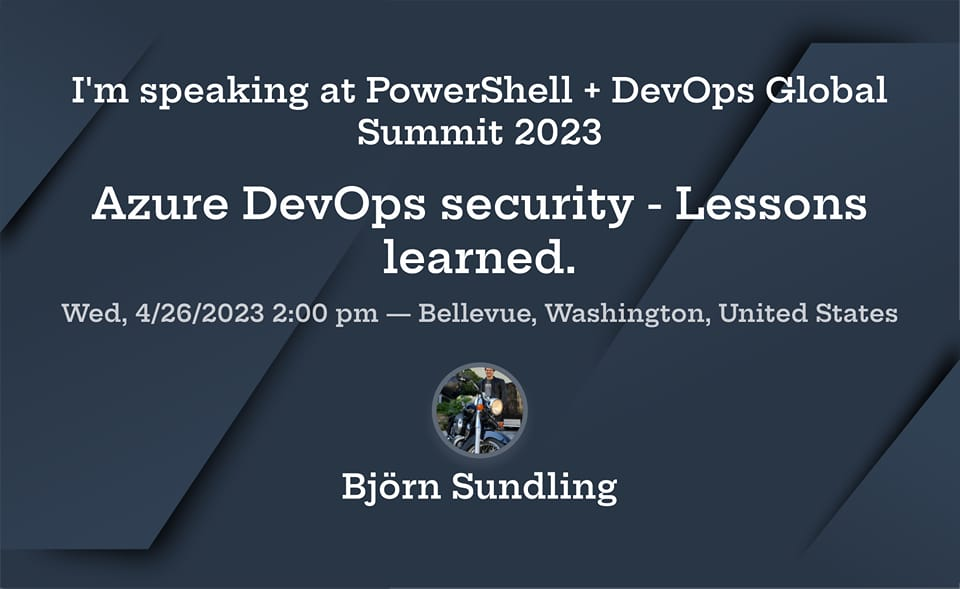

# Defender for DevOps and MSDO - An introduction pt.2

## It's fascinating how much can happen in such a short time

I released the first part of this intro a mere five days ago, yet a lot have happened since.
Most importantly, this!



I'm crazy happy and proud to do this, and it will be an awesome way to kickstart my 2023, but first I'm looking forward to spending my winter vacation writing presentations.

I also released a new module to the PSGallery: [YAPG - Yet Another Password Generator](https://www.powershellgallery.com/packages/yapg/1.0.0).

This is a function I have used for a long time to generate [XKCD correct horse battery staple](https://xkcd.com/936/) style passwords that I just finally decided to clean up and release after a mere three odd years 😂

Apart from this I had time for some family holiday traditions, but those are not for this blog to hear about...

## So... Pt. 2 - Lets look at Defender for DevOps this time

[Last time](./azure.defenderfordevops.md) we set up MSDO and scanned our pipelines, configured some pipeline settings, and looked at some build results and how to fix them, and of course we all know this is all that really matters, but I have heard rumours about another type of people. Weird people.

__People who works in GUIs.__

## Defender for Cloud - Security for GUI people

Before we go install defender for DevOps, we may need to take a very short look at [Defender for Cloud](https://learn.microsoft.com/en-us/azure/defender-for-cloud/defender-for-cloud-introduction) since that is in fact where Defender for DevOps "lives".

Wo what is Defender for Cloud? We can let Microsoft explain it to us in the most abstract way:

> Microsoft Defender for Cloud is a Cloud Security Posture Management (CSPM) and Cloud Workload Protection Platform (CWPP) for all of your Azure, on-premises, and multi cloud (Amazon AWS and Google GCP) resources.

If we instead peal away a couple of layers of sales pitch we will find a collection of tools to protect your Azure resources by for example

- Gathering logs to see that they are running correct
- Checking configurations against known exploits
- Make sure you follow security best practices
- Lets you "take action" on these issues

With this in mind I guess it makes sense to place Defender for DevOps here as well, so lets set it up, shall we?

Well, first a short yet important note:

> NOTE: At the time of this writing Defender for DevOps is in [public preview](https://azure.microsoft.com/en-gb/support/legal/preview-supplemental-terms/), and running it is free of cost, however this may change and a price at some time in the future may be charged. I take no responsibility for any costs inferred by using this guide. Remove your resources once you're done playing around 😉

Ok, now lets set things up.

## Setting up Defender for DevOps in Azure

Setting up Defender for DevOps is a pretty straight forward process

- Connect to your Azure Devops or GitHub environment
- Set up any repos and resources to keep track of

A connection is created by entering the [Azure portal](portal.azure.com) and going to the Defender for DevOps blade that can be found by searching in the top search field


Once we are in the Defender for DevOps blade, we go to the `DevOps security` tab to find all the buttons to be clicked (for now at least)


I highly recommend to go read the documentation linked in the [read more](https://learn.microsoft.com/en-us/azure/defender-for-cloud/defender-for-devops-introduction) button as well, as it contains a lot of good to knows, but here we'll just click `Add connector`

We are going to set up a connection to our previously created pipeline in Azure DevOps, so the first thing we must do is to let Azure connect there.

> NOTE: To do this you must be logged on to Azure using an account that has quite a lot of access in Azure DevOps as well.


The first window, although quite standard when creating Azure resources, contains a couple of interesting things

- The resource group. Just like all other Azure resources we need to either create a new one or use an already existing one. The interesting part here is what will happen in it, which we will look at later.
- The region. We can only create this in Central US. I Hope this changes when it leaves public beta.


Once we set the basics up we need to select plan to use. Basically, Pick our license. There is one to choose from.

Note however, like I wrote a bit further up, pricing details.


After this though things does get a bit more interesting. On page three we are greeted with nothing but an `Authorize` button. Clicking this will let Azure access your Azure DevOps environment, and you can select your organization and which projects to monitor.


After this, we can just click through the `review and create` step and start the installation!

Or actually, lets do one thing first.

In Azure DevOps, go to user settings (small icon of person and cog wheel in the corner) and click `Profile`

In the profile page, click `Authorizations`

It should look something like this:


Once you actually start the creation you will have to grant the `Microsoft security DevOps` application some access rights. This should be done automatically through a popup window, but in some cases this seems to be problematic.

Once the installation has gone through, if we click refresh in the Azure DevOps Authorization page it should now instead look like this


> Fixing the application authorization:</br>
> If you, like me, have access to a number of different organizations and propagated accounts sometimes it seems like Azure tries to connect you to the wrong organization.
Even though I pick `MyOrganization` in the dropdown I was greeted a number of times with this error message

The fix is to go to [this page](https://aex.dev.azure.com/me), and in the drop down of your available directories make sure the correct one is selected.
</br>
> more info can be found [here](https://learn.microsoft.com/en-us/azure/defender-for-cloud/troubleshooting-guide#troubleshoot-azure-devops-organization-connector-issues)

## A post installation note

Before we go exploring I want to take a chapter for some interesting details around this setup. If you're only interested in a how-to you may skip this chapter without missing anything important.

As some may know I am not a big fan of ClickOps, but prefer to write templates and deploy as code. Not only because it makes stuff repeatable and all that, but I also believe I learn more about things if I see what goes on under the hood.

In the case of Defender for DevOps this turned out to be harder than expected.

If we go to the resource group we selected when setting things up and look it will show us no resources unless we check the `Show hidden types` checkbox.


Depending on the choices you make during setup the resources created are in order of types:

- microsoft.security/securityconnectors
- microsoft.securitydevops/azuredevopsconnectors
- Microsoft.securitydevops/azureDevOpsConnectors/orgs/
- Microsoft.securitydevops/azureDevOpsConnectors/orgs/projects/
- Microsoft.securitydevops/azureDevOpsConnectors/orgs/projects/repos

Going about to create these resources in [bicep](https://learn.microsoft.com/en-us/azure/azure-resource-manager/bicep/overview?tabs=bicep) was not as straight forward as expected since none of them have any documentation available on learn, and the little docs [I could find](https://github.com/Azure/azure-rest-api-specs/tree/main/specification/securitydevops/resource-manager/Microsoft.SecurityDevOps/preview/2022-09-01-preview/examples) (thank you [Stefan](https://github.com/StefanIvemo))was far from complete.

One thing I got stuck on was the `azureDevOpsConnectors` resource requiring a authorization code. The API spec has the following information


yet nothing about what authorization code it means, nor where to get it.

A bit of [f12](./f12.md) and my good friend and colleague [Emanuel](https://github.com/PalmEmanuel) figured out that this application uses a static URL link to generate this token that looks like this:

> https://app.vssps.visualstudio.com/oauth2/authorize?client_id=15aaae2a-1f1a-4f02-9762-47cf0ec5591f&response_type=Assertion&state=R0RwSGZKaGh4QzNNUWFhQkxtWFRvNWhsR09HM29BdC9hMkg0U2M5Qlpncz0=&scope=vso.agentpools%20vso.auditlog%20vso.auditstreams_manage%20vso.build_execute%20vso.code_write%20vso.entitlements%20vso.extension%20vso.graph%20vso.identity%20vso.memberentitlementmanagement%20vso.notification_diagnostics%20vso.packaging%20vso.project%20vso.release%20vso.securefiles_read%20vso.serviceendpoint%20vso.symbols%20vso.taskgroups_read%20vso.threads_full%20vso.variablegroups_read%20vso.work_write%20vso.hooks_write&redirect_uri=https://portal.azure.com/tokenAuthorize

This ClientID seems to be one of Microsofts "secret" oath ClientIDs just like the PowerShell one [Simon blogged about here](https://blog.simonw.se/getting-an-access-token-for-azuread-using-powershell-and-device-login-flow/) but this one results in exact 0 hits on google.. So maybe now I'm the first 😂

Unfortunately though even with this auth code I get from using this auth flow I fail to create all resources needed. I will continue to play with this, but for now I will have to set this up using the Azure portal.

We can also see all the access rights given in the link, and one of those is quite interesting, namely the last one: `vso.hooks_write`. This access right can not be granted to a manually created resource, as [the checkbox is hidden](https://aex.dev.azure.com/app/register/). We can find it in the source of the page though, with this documentation

```json
vso.hooks_write": {
    "scope": "vso.hooks_write",
    "title": "Service hooks (read and write)",
    "description": "Grants the ability to create and update service hook subscriptions and read metadata, including supported events, consumers, and actions.",
    "inheritsFrom": "vso.hooks",
    "isPrivate": true,
    "isDeprecated": false
}
```

All interesting stuff, but anyway, on with the exploration!

## Setting up some monitoring

Once we have gone through the installation we can go back again to the `DevOps Security` page to check on the resources we connected. It may take a short while for Azure to connect and index all your projects and repos, but once the show up we immediately get our first security review!


Already we have some data here. Pull request status is `off` on all of my repos.
This is a bit of a misleading headline though as it actually has nothing to do with pull requests on my actual repo. What it _really_ means is that we have not yet enabled `Pull request annotations`, so lets try it out.

### The first thing we want to do

is go to our Azure DevOps project and [follow this guide](https://learn.microsoft.com/en-us/azure/defender-for-cloud/enable-pull-request-annotations#enable-build-validation-policy-for-the-ci-build) to set up build validation.

> Note: This guide is actually a bit misleading. You have to select a pipeline to run on pull request to set up build validation, and this actually opens up another security issue completely, but that is out of scope for this blog post and something I may write about in the future.

Once this is done it's as easy as 1,2,3,4. Go back to Defender for DevOps, check the checkbox of our repo, and click `Configure`, and in the slide-in window check `Pull Request Annotations` and `Save`


A refresh of the page should now show you a flashy green `on` on your repo instead.

## Testing out PR annotations

In pt.1 of this series I inventoried my repo and found amongst other stuff some secrets, yet the status of my repo is a yellowish `Healthy`?

One thing worth knowing is that even though Defender for DevOps has inventoried our repos, it does not take in to account what is already there until you run a new pipeline.

Let's go back to our repo, remove the fixes we did so our passwords will be flagged, and create a pull request.


Success! Bad passwords are detected, and comments are posted to my PR.

There is still one thing to note here though.
By default Azure DevOps allows you to accept a pull request without taking action to its comments. To make sure your developers actually have to manage this make sure the setting `Check for comment resolution` is enabled.


One rather unexpected thing is that even though I have found secrets in my pipeline, and in my repo, the Defender for DevOps dashboard still shows no secrets exposed. At first I thought this was because it takes some time for reports to reach the Azure portal, but after waiting and refreshing for half a day I'm starting to believe either I did something wrong, or it doesn't report faults on pull requests here.


Lets try to merge my code and see if my reports looks different shall we?

### Merged code makes the Defender for DevOps go round

After merging my code to main it takes mere seconds before my repo pops up top in the repo list, and everything turns red in my dashboard. My conclusion is that the Defender for DevOps dashboard actually only reports issues in the main or master branches of your repos. What it defines as a branch and what it defines as the main branch is still not known to me.


What more here is that once my first issues are triggered it also seems to find recommendations, although they actually don't have anything to do with my repos or Azure DevOps at all. It seems Defender for DevOps just needed a push to get started.

## Taking action inside Defender for DevOps

Now that we have an issue we can start exploring what actions we can take from here. In general I find this GUI quite confusing. Not that it is hard to navigate compared to anything else in Azure, but there are many ways to do seemingly the same things, and other ways that _should_ do the same thing but doesn't

For example finding details about a specific issue.
There are two ways to get to almost the same results.
Either we can click on the unhealthy resource, and the recommendation


Or you click `Exposed secrets` in the dashboard.
The latter of these gives you a list of all out Azure DevOps resources with this specific issue.

Although these two blades look pretty similar, if you go the latter way you will be able to assign an owner to a specific issue on a specific resource, where as if you do the former, the `Assign owner` is simply greyed out.


Trying to assign an owner gives me the fantastic error message `Failed to create requested assignments. Please try again later.`. I'm guessing this is because we need some kind of issue management setup to do this, but this is a future research task.

### CLicking in to an issue

gives you a quite good guide on what actions you should take on this particular finding


You can even get more details about the issue including links back to the repo and pipeline, which files and branches was involved, and more by either

- clicking the findings id in this window

or

- clicking `Take action` and the findings id

Really good stuff, but why `Take action` doesn't seem to include any way of.. well.. taking action is another of the weird GUI design decisions I guess.


### Any which way

you go to your finding you can also choose to trigger a logic app from here. This may be really useful as it should be able to for example send an email to the person creating the pull request, automatically closing an account who's secrets was exposed, or create issues in your DevOps board.

I will explore this option further in the future.

## A note on removing Defender for DevOps

Like I stated somewhere in the beginning the cost for Defender for DevOps is currently nothing, yet this may change in the future, and so to end this session of exploration I wanted to remove my resources.

In Azure this simply meant removing my resource group, but in Azure DevOps this was harder. Looking back at the beginning we found our authorized app in Azure DecOps, and there is a `revoke` button there, however this button doesn't seem to do anything at all for me.
The app will not be removed.

Instead we had to go [here](https://aex.dev.azure.com/me), select the correct directory in the drop down, click `Manage authorizations`, and in the popup find the smallest most well hidden `Revoke` button.


## Conclusion

In the end I am not nearly as thrilled about Defender for DevOps as I was about MSDO in chapter one. I find the GUI confusing, and there is not much I can do there.

I do however this would be a really nice addon to the boards viewed by managers, security staff, and other people outside of the dev department.

I also hope that once more features are added to the Defender for DevOps blade the GUI makes more sense (but on the other hand I rarely find GUIs logical to start with..)

I will definitely keep an eye on this in the future,
and might even spend some time learning logic apps to see if they could do some useful automation here (Although I would much prefer to trigger an Azure function, but that's another story.)

## But for now

I feel like I've clicked enough. Time to go back to my lovely console. Maybe write a presentation... Only four months to go. And oh, I need to book flights. And hotel. Do I remember where I saved my ESTA? Is my passport valid?

Till next time.
