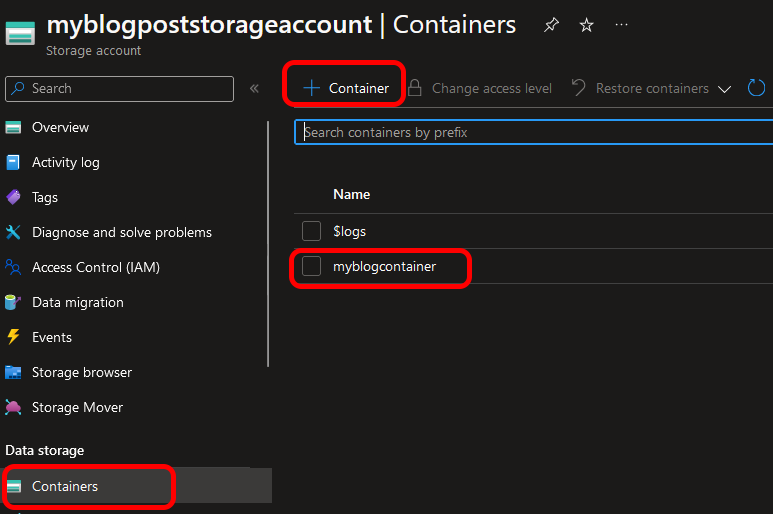

# Blob lister

I've been having some morale issues lately. Hard to find the energy to get started with anything really, an instead of code I've mostly found myself playing music or taking the dog to the woods to pick some mushrooms. The end result is fantastic though: I have more mushrooms than jars at home, and literally nowhere to store it. The good kind of problems.

## Music wise

We have resurrected an old band from.. well, long enough ago that there was no internet, and people feel old when we mention it, but with not only old songs it is crazy fun to be back rehearsing again. A couple of songs are in the making already, some done even, but before you get to hear those there is a re-release of an old album going on. More on both of these when more info is available.

One of the things we realized though was that we can use modern technologies to help out rehearsals. It is always easier to get stuff done if everyone is prepared.

So we did some home recordings of all the songs, and split them on channel so that  I can rehearse guitar and bass parts, drummer has the songs without drums, and so on.

At first we shared them over chat only. That worked. For a while. Searching isn't optimal. There has to be a better way, right? Like.. Azure blob storage! Well. Almost.

## The goal

[__If you are not interested in the post, the result can be found here!__](https://github.com/bjompen/blobLister)

Now sure, you could argue that I could just copy the blob link to each individual blob, but that doesn't really solve the original issue - finding links in a chat.

I could also just create a static page and link to each individual file using pure old school HTML, but that would then require an update each and every time a new file is uploaded to my container.

I also want my not so computer literate bandmates (sorry Micke 😁) to be able to simply add a blob and it will be downloadable, and hence automatically added to the download list.

## Sharing files over Azure Blob storage

Setting up and sharing a file over Azure blob storage is quite easy. You start by setting up a storage account, either from the [market place](https://portal.azure.com/#view/Microsoft_Azure_Marketplace/GalleryItemDetailsBladeNopdl/id/Microsoft.StorageAccount) or using a IaC language of choice [(for me, that's bicep)](https://github.com/Azure/bicep).

Since there are a million guides out there already on this, I wont bother with it here more than to say you need a storage account and a container.



Once your storage account is set up and you have added a container to it it's time to share. The easiest and best way to do this I find is using a SAS token. It is fairly secure, and works very well in the scenario we're after.

The token we create needs to have nothing more than read and list actions and only on blob containers and objects. You can also set a date, and since we are sharing this with people as an app I am going to set it relatively far of in the future.


Once this is set, copy the _Blob service SAS URL_.


So far so good. This is where the fun begins.

## Listing the content of a container

If you have worked with storage before you probably already know the standard URL format: `https://StorageAccountName.blob.core.windows.net/ContainerName/BlobName`.

The link we copied above only points to the storage account, so we need to append the container to it as well.

combined they look like this:

> https://myblogpoststorageaccount.blob.core.windows.net/myblogcontainer?sv=2022-11-02&ss=b&srt=c&sp=rl&se=2099-11-14T18:32:23Z&st=2023-11-14T10:32:23Z&spr=https&sig=l0Ng//c0D3ThatSEEmsT0BeSOM3K1ndOFBaS364=

But posting this in our browser doesn't work and gives us an error message! 


This is because by default, if you do not append storage type and action the blob will automatically assume you are trying to reach a blob, and the call won't work. If we instead append `&comp=list&restype=container` at the end of our string and try 

> https://myblogpoststorageaccount.blob.core.windows.net/myblogcontainer?sv=2022-11-02&ss=b&srt=c&sp=rl&se=2099-11-14T18:32:23Z&st=2023-11-14T10:32:23Z&spr=https&sig=l0Ng//c0D3ThatSEEmsT0BeSOM3K1ndOFBaS364=&comp=list&restype=container

we get a much better result.

## Add some data!

Since we still haven't added any files to our storage the result will be empty for now, but uploading a couple of files to our container makes the resulting xml table look something like this:


Now this is perfect! We see all our blobs. But it's not exactly usable. Time to add a front end.

## Time to write some...

[JavaScript!!](../images/blobLister/FrauJavascript.gif)

I can't say I'm a big fan of [JavaScript](../images/blobLister/FrauJavascript.gif), but when it comes to easy front ends it does have a lot of things going for it. For example. dynamically updating webpages!

### HTML

The first thing we need to do is define our webpage layout. As I am going for simple we only need to define our body and some basic HTML tags, and save this as `index.html`

```HTML
<!Doctype Html>  
<Html>     
<Head>      
<Title>     
Blob Lister
</Title>  
</Head>  
<Body>
    <p id="showresulthere"></p>
</Body>   
</Html>  
```

Sure, you could add some fancy [CSS](https://blog.roostech.se/) and make it pretty, but we play metal. Metal shouldn't be pretty.

### Static values

Next up we need to add some [JavaScript](../images/blobLister/FrauJavascript.gif) to automatically update the "showresulthere" table with the values.

We start of by setting some static values

```JavaScript
var keyString = "si=storage&spr=https&sv=2001-01-01&sr=c&sig=l0Ng//c0D3ThatSEEmsT0BeSOM3K1ndOFBaS364="; 
var containerString = "https://myblogpoststorageaccount.blob.core.windows.net/myblogcontainer";
var url = containerString + '?' + keyString + '&comp=list&restype=container';
```

You may already have it figured out, but if not

- keyString is everything of the SAS token we copied _after_ the question mark (but not including the "browse containers" part)
- containerString is everything of the SAS token we copied _before_ the question mark. This will be the base of our link URLs.
- URL is simple concatenating the strings to the same link we have above including the "browse containers" part.

### XMLBrowser

Another thing [JavaScript](../images/blobLister/FrauJavascript.gif) has that is reminiscent of PowerShell is the ability to parse XML documents. In PowerShell we would type cast an object to `[XML]`, where in [JavaScript](../images/blobLister/FrauJavascript.gif) we can use the [XMLHttpRequest()](https://developer.mozilla.org/en-US/docs/Web/API/XMLHttpRequest_API/Using_XMLHttpRequest) function.

```JavaScript
var req = new XMLHttpRequest();
req.open('GET', url, false);
req.send(null);
var xml = req.responseXML;
var users = xml.getElementsByTagName("Name"); 
```

XMLHttpRequest() accepts three parameters

- [method](https://restfulapi.net/http-methods/)
- URL
- Should we use asynchronous. Since we won't be able to do anything before this is done anyway we want it to be synchronous for now.

Once we have sent the request our req variable will be populated with all kinds of fancy information. For example, the xml response.

Since it is xml we can then use the getElementsByTagName() function to get only the values we want. _Beware!_ This requires us to know we only have the correct set returned. Validate it before production, and hope no one ever updates your XML schema 😉

In the blob scenario I know the name tag only returns what we want. Almost.

### Filter and update

The XML query returns an array, a list of values, one for each blob. Unlike PowerShell we can't index them straight away but need to loop through them using a `for` loop. Which isn't a for loop, but a foreach loop. Sometimes [JavaScript](../images/blobLister/FrauJavascript.gif) makes no sense.

```JavaScript
for (let item of users) {
    if (item.innerHTML.match(/\.mp3$/)) { 
        var href = containerString + '/' + item.innerHTML + '?' + keyString
        document.getElementById("showresulthere").innerHTML += '<p><a href="' + href + '" download = "' + item.innerHTML + '">' + item.innerHTML + '</a></p>';
    }
}
```

Since the XML query will also return _every single file_, and we are only interested in our audio (mp3) files, we will filter them using `if` and some RegEx. If you need a lesson in this, drop me a mail, and well get it done. 

Another curiosity from the internet is that we have HTML tags surrounding our actual value and we need to expand the name using the `.innerHTML` member. this tells our XML "browser" that we are only interested in the value, not how we publish it on a webpage. The line `var href = containerString + '/' + item.innerHTML + '?' + keyString` uses simple string interpolation to create the URL pointing to this specific file/blob by reusing the previously set static values.

The last line of our script starts by getting the `showresulthere` element from our HTML using the `document` magic variable. This variable points to the current loaded page. We then add (`+=`) a link to this container by using some more concatenation. The end result should look something like this: 

> `<p><a href="https://UrlToBlobWithConnectionSASStringAdded" download = "filename.mp3">filename.mp3</a></p>`

> But wait - What about the download tag? Most modern browsers are set to default stream media. If I click a mp3 link, Firefox will start playing the song inside the browser. the `download` tag tells browsers to always download the link instead of streaming. _However!_ this tag _only_ works if the target and link is on the same base URL. If you host the HTML on a different place than your blobs this tag wont matter.

### Functionisation (?)

Just like working with PowerShell, [JavaScript](../images/blobLister/FrauJavascript.gif) makes use of functions, and just like PowerShell we use the keyword `function` to define it. We are going to give our function a name, and if we need to send some parameters to it. We don't.

```JavaScript
function listFiles() {
    // Inset code here
}
```

And this is it. Our [JavaScript](../images/blobLister/FrauJavascript.gif) is done.

### Inserting it to our webpage

Combining it all to one page and our index.html will look something like this:

```HTML
<!Doctype Html>  
<Html>     
<Head>      
<Title>     
Blob Lister
</Title>  
</Head>  
<Body onload="listFiles()">
    <p id="showresulthere"></p>
    <script>  
        function listFiles() {
            var keyString = "si=storage&spr=https&sv=2001-01-01&sr=c&sig=l0Ng//c0D3ThatSEEmsT0BeSOM3K1ndOFBaS364="; 
            var containerString = "https://myblogpoststorageaccount.blob.core.windows.net/myblogcontainer";
            var url = containerString + '?' + keyString + '&comp=list&restype=container';
            var req = new XMLHttpRequest();
            req.open('GET', url, false);
            req.send(null);
            var xml = req.responseXML;
            var users = xml.getElementsByTagName("Name"); 
            for (let item of users) {
                if (item.innerHTML.match(/\.mp3$/)) {
                    var href = containerString + '/' + item.innerHTML + '?' + keyString
                    document.getElementById("showresulthere").innerHTML += '<p><a href="' + href + '" download = "' + item.innerHTML + '">' + item.innerHTML + '</a></p>';
                }
            }
        }
    </script> 
</Body>   
</Html>  
```

Now you may notice a couple of things added here. We need to wrap the function inside `<script>..</script>` tags. This simply lets the HTML interpreter know this is [JavaScript](../images/blobLister/FrauJavascript.gif) and should be read as such.

The other thing is the `<Body>` tag that got an additional `onload="listFiles()"` tag. This tells the browser that as soon as the body tag is loaded, we execute our function. This function then returns all blobs, and places the links in our "showresulthere" object.

## Upload it and start sharing your blobs

Now we only need to upload the index.html to our blob storage. Preferably the same one that hosts our blobs as you can then share them all using the same SAS token.


Share the index.html link with your band

> https://myblogpoststorageaccount.blob.core.windows.net/myblogcontainer/index.html?sv=2022-11-02&ss=b&srt=c&sp=rl&se=2099-11-14T18:32:23Z&st=2023-11-14T10:32:23Z&spr=https&sig=l0Ng//c0D3ThatSEEmsT0BeSOM3K1ndOFBaS364

and they will be greeted with something like this instead!


And updating with our next song is as simple as uploading another blob.

And of course, if you want to, you can use any URL shortener, or create a DNS alias to simplify this link as well.

## In the end

My band can easier access all our songs. I only have to add new tracks to a blob (for now. Upload may be added sometime if I have the energy), and we only have one link to remember.

And my lack of motivation is still there, but at least I got something done. I hope this helps you too.

And again, you can find the code [here](https://github.com/bjompen/blobLister)

Until next time, internet!
