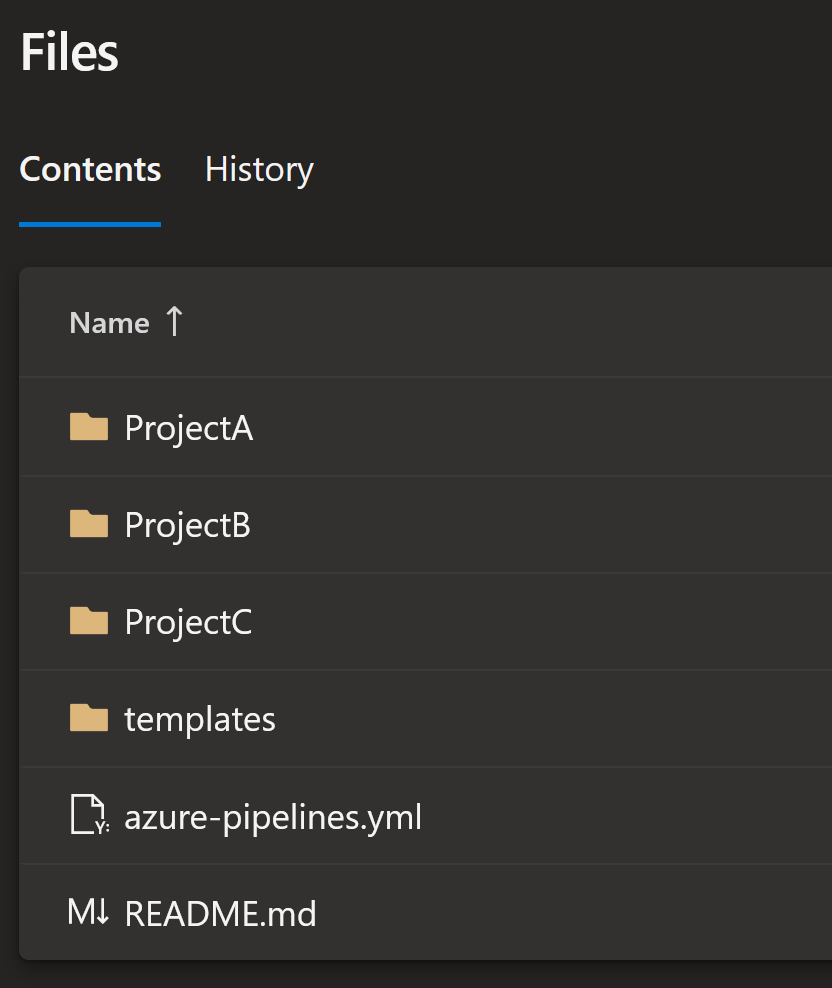

# ch ch ch ch chaaaangeees

[](https://www.youtube.com/watch?v=4BgF7Y3q-as)

Some changes are big, and some are small.

Some goes on to change the world, and some changes you personally.

Some may seem totally insignificant to most people, but may mean the world for others.

But as a developer, they all should be treated the same:

Checked in to git with a proper commit message.

## I recently had an interesting question

And it is one I've stumbled on before as well, and as we all know: If you solve an issue twice it's time to automate it.

> I have a repository with multiple projects in it. How can I set up a pipeline that checks what files actually changed and only build those parts of a project that changed?

Turns out the answer is surprisingly easy and we already have all the tooling in place.

## The repository

Lets start with the repository layout. We have three different projects with separate build scripts, aptly named "ProjectA", "ProjectB" and "ProjectC".

We also have a folder of some templates, a readme, and, of course, our pipeline yaml file.



## The tooling

Like I said, surprisingly simple and already in place there is a fantastic tool for keeping track of what changes in a repo: Git.

There is a git command, `git diff`, that checks what has changed in a repo. If you run it with two commits as parameter it will show the difference between those two commits.

And commits may be given either by commit id or checksum, or using the word `HEAD` for latest, and `HEAD^` for latest - 1.

Last but not least, we're adding the parameter --name-only to limit our output to only file names.

```PowerShell
PS C:\> git diff HEAD HEAD^ --name-only
ProjectB/ProjectB.ps1
ProjectB/ProjectBDocs.md
ProjectC/ProjectCDocs.md
README.md
```

Git is fantastic in so many ways, and it will give us what we want, but in order to do some nifty stuff with it we're also going to use PowerShell.

## The pipeline

So once our changes are found, we're pretty much only going to add some PowerShell magic to our commands

```PowerShell
$gitChanges = git diff --name-only HEAD^ HEAD |
  ForEach-Object { $_.Split([System.IO.Path]::DirectorySeparatorChar)[0] } |
  Select-Object -Unique
```

By splitting our git output on `[System.IO.Path]::DirectorySeparatorChar` we make sure it behaves well no matter the operating system, and selection only the first object will only give us the root folder or filename. Since we don't care if one or more changes are made in each project, we can minimize our result list with `Select-Object -Unique` and only get one result per root object.

We can then use `Write-Host` to set a variable that we can use in our next step, and.. well that's it really!

We ended up with a pipeline looking like this:

```YAML
- task: PowerShell@2
    name: getGitChange
    inputs:
    targetType: 'inline'
    script: |
        $gitChanges = git diff --name-only HEAD^ HEAD | ForEach-Object { $_.Split('/')[0] } | Select-Object -Unique
        $gitChangesAsString = $gitChanges -join ','
        Write-Host "##vso[task.setvariable variable=filesChanged]$gitChangesAsString"
    pwsh: true

- task: PowerShell@2
    name: buildProjects
    inputs:
    targetType: 'inline'
    script: |
        [array]$GitChanges = "$(filesChanged)".split(',')
        foreach ($project in $GitChanges) {
            if ($project -like "*project*") {
                Write-Host "Currently building $project"
            }
            else {
                Write-Host "Project $project does not match build filter. Ignore."
            }
        }
    pwsh: true
```

Well, the "Currently building $Project" if statement should actually also trigger a pipeline in the templates folder with related parameter values for that project, and we do have some variable magic to set those parameters.. But those are for some other time.

## Quick and simple

That's the way we like it, right? Gives us more time to play with more fun stuff, such as [this](https://learn.microsoft.com/en-us/azure/devops/integrate/get-started/authentication/service-principal-managed-identity?view=azure-devops) that I spent most of today with, and hopefully a post on how we can use this will be done before the weekend is over.

'Til next time, happy pipelining!