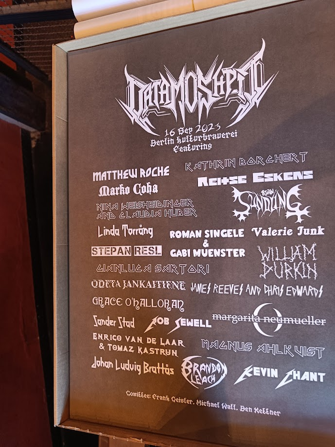
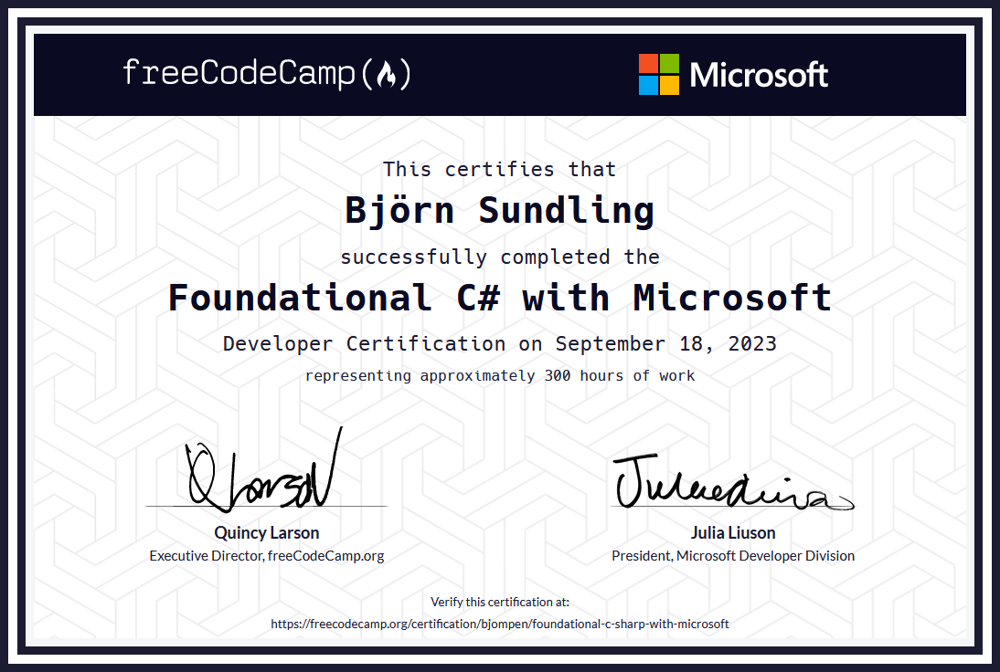

# Metal moshing mad - A status update

Have you ever had that feeling where you have nothing to do, yet stress out over everything anyway?
Where your motivation just goes _"Nope"_ and the struggle to get anything done is just... hard?

Well of course you have. We all have motivational ups and downs.

This summer I had a motivational high. So much to do. So much I wanted to start with. So many balls tossed up in the air.

This September they all crashed down.

Not that I don't enjoy it, I absolutely do, but energy wise.. Well, it does take its toll.
But I have my ways to solve this, and that is what todays post will be about.

But first, a status update! What have I done since last time.

## PWSH Updater

I recently released a new.. thing.

[**The PWSH Updater**](https://github.com/bjompen/UpdatePWSHAction/)

As some may or may not know I am a small part of the [PowerShell Bicep module](https://github.com/PSBicep/PSBicep) team. I don't do much, but help out when and where I can.

In the latest version of this module there ended up being some issues.

Bicep normally is a self contained executable. This is a good thing as you can spread and include all needed dependencies inside the executable itself, and prevent stuff like DLL loading errors. In PowerShell this isn't really doable. The Bicep module instead builds and compiles the needed files in our build job. (If this makes you curious I suggest asking [Emanuel Palm](https://github.com/PalmEmanuel) or [Simon Wåhlin](https://github.com/SimonWahlin)how it works.)

This now lead to a compatibility issue.

In Azure DevOps and GitHub runners, if you run a PWSH script task, it will always run the latest [LTS version](https://learn.microsoft.com/powershell/scripting/install/powershell-support-lifecycle?wt.mc_id=DT-MVP-5005317). Right now this is 7.2.

This version runs DLLs that is incompatible with the latest Bicep release.

So I created this function, GitHub action, and Azure DevOps task to be able to up- or downgrade the built in PowerShell version to any version you want.

This was a lot of fun, since it was my first time developing an Azure DevOps task, and hopefully next "real" post will be on how to do this. For now, go check it out. You may like it.

## Data moshpit

The 16:th of September I did a presentation called "[De Mysteriis Dom Datanas](https://www.youtube.com/watch?v=zNs4zSKK9S4)" at the [data moshpit](https://www.data-moshpit.com/) event.

This was very much a double edged sword for me. I literally don't know _anything_ about the [data platform](https://www.microsoft.com/en-us/microsoft-cloud/solutions/intelligent-data-platform). I honestly had to google what it was for this session.

So why did I do a presentation there? Well.. Because it's a conference on metal! How could I not send something to a conference that requested an intro song (I picked the best intro of black metal ever: [Mayhem - Freezing moon](https://open.spotify.com/track/4AP3a7eEOlz5sTJiWnv2C6?si=0ccb07d9286d42f8))

As for the topic, it turns out that even a session "from the other side" can be interesting. Yes, I don't know anything about SQL or Databases, but since we still have to deal with them sometimes, what are some issues I've encountered in doing so?

All in all I think this was one of the cooler conferences I've visited, and I really hope it will take place (and that I get to speak at it) next year again. Thanks, Ben!

(Bonus game: Name the band each speaker was referencing!)

## Double certificates

Last but not least in todays big three: More certifications!

I already wrote about my journey towards Az200 so no need to redo that one, But quite recently [FreeCodeCamp](https://www.freecodecamp.org/) together with Microsoft launched the [Foundational C# with Microsoft](https://www.freecodecamp.org/learn/foundational-c-sharp-with-microsoft/) certification. I am not a C# Developer, but I have dabbled in it a bit, so I thought this would be a fun one to go through.

And it was! The layout of the certification is that for each question in the FreeCodeCamp course you _have_ to go through one chapter in Microsoft learn. This is verified by connection your [learn profile](https://learn.microsoft.com/users/me/activity?wt.mc_id=DT-MVP-5005317) and your FreeCodeCamp account. This also means it is not possible to just "answer the question and move on".

Sure, you could just go to the learn chapter and go "next -> next -> finish", and I do confess, some chapters I just skimmed through (I already knew the difference between `Console.Write()` and `Console.WriteLine()`) but I did actively try to do each and every challenge and test.

Once you have done all the chapters you are good to take the actual certification test.

Just as with all certifications my initial plan was "Take it once to see how it goes, follow up to improve", but lo and behold, first try and I passed with a descent score of 69/80 (nice!) and I can officially add this one as well to my ever growing list of certifications:

For now I am happy with this and I honestly don't think I'll be doing any more certifications for now. Don't want to end up in the "no work, only certificates" category 😉

## Solving time issues and saving your health

Apart from all this I had a lot of personal stuff going on. One of my best friends got married, and I and my wife (My wife waaay more than me...) helped out arranging the marriage, the party, and everything around it. This of course was great fun, and I do enjoy helping out, but there is a limited amount of time available.

To solve this I often try to create a schedule for everything I do. Not one that states "do this between 9-10" but more in the way of "between n:th and x:th of octember, focus on this for one hour per day". This helps me solve my puzzle, and even lets me make sure to add time for other hobbies, and so I was thinking it might help others as well.

### What do I _need_ to do.

Start with lining up what is necessary and have a due date:

- Wedding planning. Obviously there is a due date here.
- Presentation. Also an obvious due date.
- Get the Az200 certificate.

### What do I _want_ to do

Next up is the things I have planned that doesn't necessarily involve due dates, but "while the idea still is hot"

- Get another certification (C#)
- Learn how to create Azure DevOps cross platform tasks.

### What I _enjoy_ doing

This is the easiest, but somehow also the hardest one to plan. Things that I enjoy doing. That makes me happy.

- Play music
- Computer games
- Motorcycle, riding or fixing my bike.
- Fishing

### Schedule and priority

Once we have this list I start by setting the time frame per day. The baseline is always "One hour per day, at least one from each list every week depending on urgency".

This may then end up like this

| Monday | Tuesday | Wednesday | Thursday | Friday | Saturday | Sunday |
|-|-|-|-|-|-|-|
| Write presentation | Play a game | Do a learn chapter | Play music | Write presentation | Go on a bike ride | rehearse with the wedding band |

Once the base plan is set, add priority. The three tasks with due dates was in order:

- Az200 certification: mid August
- Wedding: early September
- Presentation: mid September.

That means when I started all of this I had full focus, 3-5 days a week, only on the Az200 certification. Once this was done, main focus was on Presentation. Wedding planning was so much depending on other people I could only solve things when other people were available.

This leaves 2-4 day / week for fun, and I try to change this up as well. "Last time I played some games, but I haven't gone fishing in a while, lets do that tonight."

Like I said, my basic rule of time is "one hour a day", however once I get started I often find myself spending many more hours doing "thing-o-the-day". After all I do enjoy them all, it is just so easy to instead of doing anything get stuck in front of generic-sitcom-on-Netflix, and this is something I honestly do not enjoy.

So there we have it. My weird but working way of getting stuff done.

## Wrap up

The last thing on my current to do list was this one. Write a blog post summing it all up, and mentioning how I manage my time 😁

Next cycle of stuff begins now. It contains a cool project, at least one blog post, and hopefully some real life C# coding (if I can figure it out that is..)

It also contains winter preserving two bikes, celebrating three birthdays, and if I can afford it, trying [that new Bethesda game](https://store.steampowered.com/app/1716740/Starfield/) out.

So much to do I might just need to get started right away.

Until next time, Internet!
