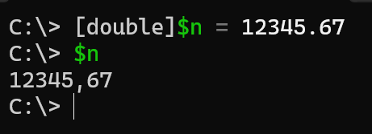
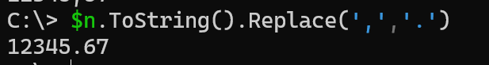
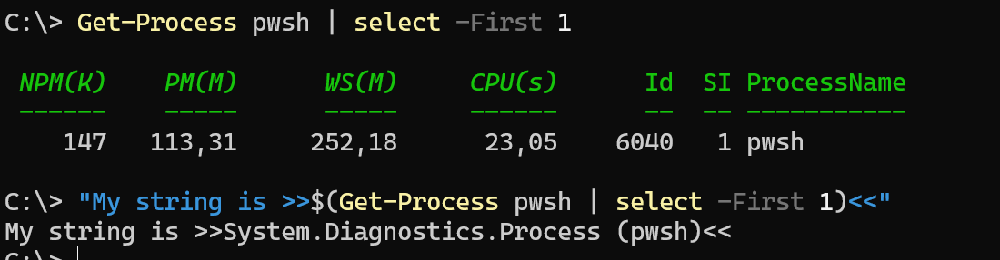
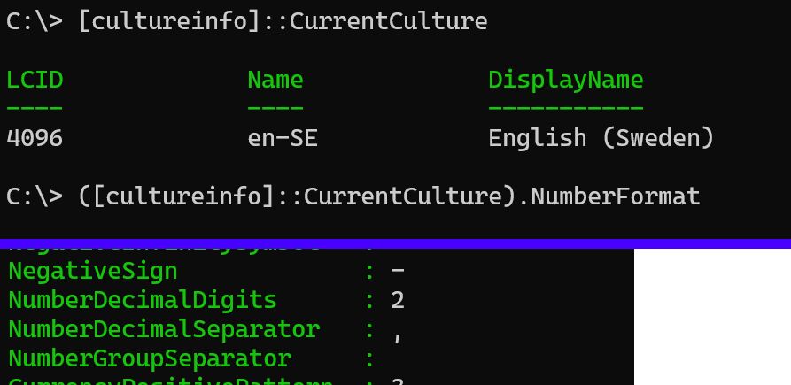
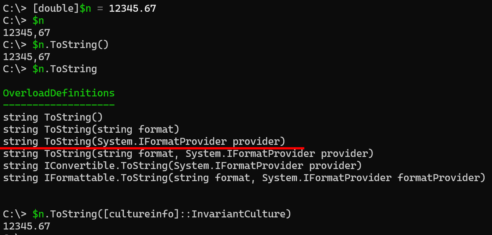
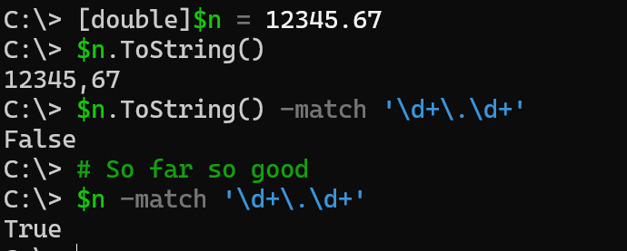
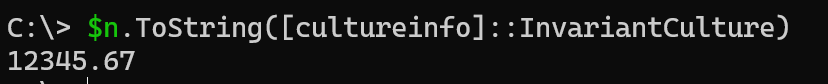
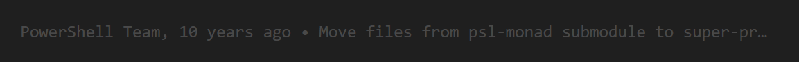

# On regex, and the less helpful helpfullness of PowerShell

Oh lawd he writing!

I'm getting worse at this. Perhaps because I am less inspired. Perhaps because I do other things. Perhaps.. well, whatever.

But here we are, almost out of 2027 already, and life is still moving ahead fast. I recently was rewarded my fifth year as an MVP - yay blue disc! - I've bought a house, My band is recording our forthcomming full length album, I have a couple of upcomming presentations, family takes its time, and I should probably try to have some time for work as well every now and then. Keeping buissy.

But I still do PowerShell, and therefore it is time for another instance of my favourite series: "On the less helpfull helpfullness of PowerShell" (see [this](posts/pwsh.emumeratehash.md) or [this](posts/pwsh.unwrappingobjects.md) for others). So what did I stumble on? Lets dig in..

### The problem..

I was looping through about 150k of objects in a table. Each object had some various data and datatypes, string, int, and doubles. My problem - I needed to make sure that all numbers was in the same format: no thousand separators, dot for decimal separator, so `123456.78`.

I am a Swede. Sweden doesn't use dots for decimal separators, we use commas, so `123456,78`.

This means that if I create a variable of type [double] we get a comma separator in the output. Note that we still need to use dot when casting the variable, as comma means something else in PowerShell. 



The simple solution to change my comma to a dot is of course to use replace, but in order to do so we first need to convert our double to a string to be able to use the .Replace() method



This works flawlessly. Until today that is.

Suddenly my code started throwing errors of type `InvalidOperation: Method invocation failed because [System.Double] does not contain a method named 'Replace'.` This is of course true, [double] doesnt have a replace method... But the surounding lines was what made me curious.

### RegEx and types

In short, the code looked a bit like this

```PowerShell
# Do stuff..
if ($myVal -match '\d+\.\d+') {
    $myVal.Replace(',','')
}
```

For those of you who doesn't read RegEx, this checks for strings (RegEx only do strings) with the pattern `<digit><dot><digit>` or `12345.67`. It does not match on commas, so `12345,67` will not match.

Remember, Sweden use commas, yet this if statement matches my number.

[This shouldn't match...](../images/doublematch/3.png)

It isn't hard to figure out _what_ is messing with us here. PowerShell does implicit type casting - read all about it [here](https://learn.microsoft.com/powershell/module/microsoft.powershell.core/about/about_type_conversion?wt.mc_id=DT-MVP-5005317) - which means if I do not enforce an object type PowerShell will try to do its best to make things work.

In my case, I have a double type, but RegEx only takes strings, so PowerShell will be kind enough to convert my double to a string and perform the match. My problem is _why_ it is messing with us. Again, my country locale doesn't use dots.

So lets look a bit at converting objects shall we?

### ToString() - Where the magic happens

Every now and then in PowerShell we expect one result output to screen or file, but get another. The typical examle is when we do string expansion using f.eg a process and it tells us the type instead of the name.



We can of course alter what is shown by using CmdLets like `Select-Object -ExpandProperty` or dotting our properties, but if we dont, implicitly in the backend PowerShell will run the .ToString() method on our object to be able to output it to whatever destinaation we want, console, file, etc. The result you can see in the first image above here.

My number is of type `[double]`, and outputing my variable will processwise do something like this:
- Take the value of my number
- convert it to a string representation of a number that can be printed to my console
  - by using my local culture settings and number separators.

If we do not provide any information, PowerShell will default to use my current culture language settings. We can find those by running `[cultureinfo]::CurrentCulture`. To be precise, in the case of a number type it will use the `NumberFormat` property of this object.



If we look at the `ToString()` method itself it behaves a bit different depending on what objects we are working with. In the case of a number, we can actually alter the output behaviour by using the `System.IFormatProvider provider` parameter and input another culture, or for that matter, the invariant culture (the one that goes for uncultured people?).



Again, if we do not alter it, all of this is implicit. PowerShell does it magically using .Net methods behind the scene. And with that known, back to my problem..

### RegExing a double

Lets look back at my problem, and see where the unexpeted behaviour is - the -match operator:



Ok, so by now it is quite obvious: The string conversion of the regex -match operator changes my culture... But why?
Well... The only way to figure this one out is to dig in to the PowerShell source code. I'll save you some searching - it took me some hours to find where the match operator is actually created, but `Get-ChildItem | Select-String -pattern '-match'` is a good tool :)

In the file 'src\System.Management.Automation\engine\lang\parserutils.cs' we find this code block

```c#
internal static object MatchOperator(ExecutionContext context, IScriptExtent errorPosition, object lval, object rval, bool notMatch, bool ignoreCase)
{
    RegexOptions reOptions = ignoreCase ? RegexOptions.IgnoreCase : RegexOptions.None;
// some things cut for brevity

    IEnumerator list = LanguagePrimitives.GetEnumerator(lval);
    if (list == null)
    {
        string lvalString = lval == null ? string.Empty : PSObject.ToStringParser(context, lval);
```

What it actually _does_ is:
- get the string thats on the left hand side - `lval`
- If that string is _not_ empty we use the `PSObject.ToStringParser` method to access the string value. For reference, context is "where you are". Console, callstack, etc.

Worth noticing is that the `-Match` operator, once it has parsed all data left and right side, calls the `[Regex]` method, so it is actually the exact same process, and issue, whichever way we go.

Ok, so what does the `ToStringParser()` do? Back to searching. 
In the file 'src\System.Management.Automation\engine\MshObject.cs' we find tha actual definition of the PSObject. The object that all other PowerShell objects are built upon.. As such, it contains all the base methods we normally work with, such as the `ToString()` method.

In c# we can have multiple parameter setups. This is what is shown above as overload definitions. Apart from the public methods we can also have internal methods. These act like our PowerShell helper functions. The `ToStringParser()` method is an internal method, with two overload definitions; One with two parameters - `internal static string ToStringParser(ExecutionContext context, object obj)` - and one with three parameters `internal static string ToStringParser(ExecutionContext context, object obj, IFormatProvider formatProvider)`. We are obviously calling it with two parameters, so how does that method look? well...

```c#
internal static string ToStringParser(ExecutionContext context, object obj)
{
    return ToStringParser(context, obj, CultureInfo.InvariantCulture);
}
```

... Yupp.. there it is. The `ToStringParser()`, if called with two parameters, adds the third as `CultureInfo.InvariantCulture`. And what happens if we convert a double to a string using InvariantCulture?



### And there you have it

A "bug" that pretty much only will happen if you are in a country which does _not_ use dots for decimal separators and use RegEx to match and find dots. It took me ~20 years to find this bug.. I wonder how many others have stumbled on it before me...

### The end

My good friend Mathias asked how long it has been there.. Fortunately git can answer those things:



Since PowerShell went open source.

Another good friend, Justin, gave me the only acceptable answer for the issue: "Have you tried not being Swedish?"

The less helpfull helpfullness of PowerShell strikes again.
