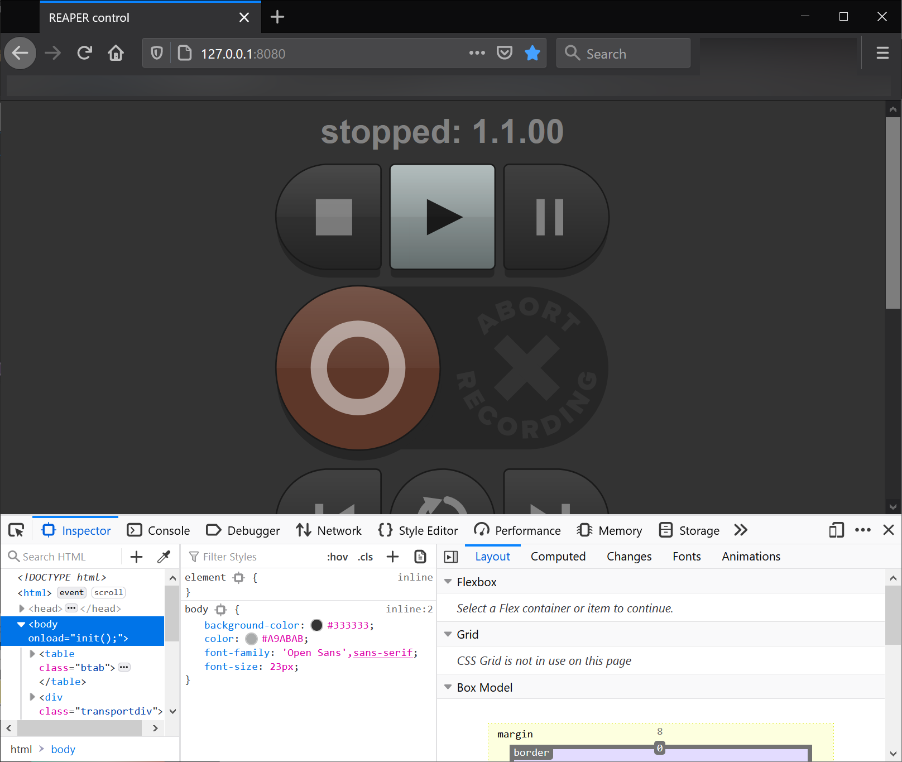
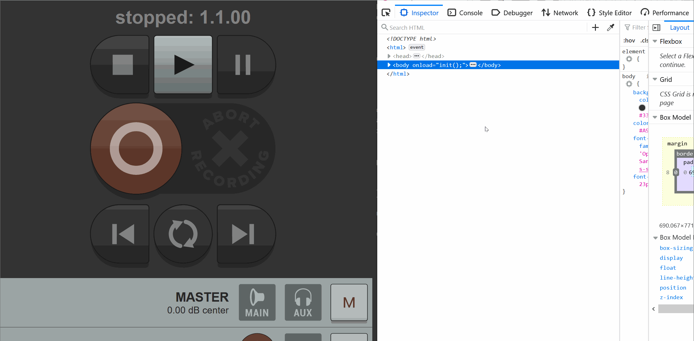
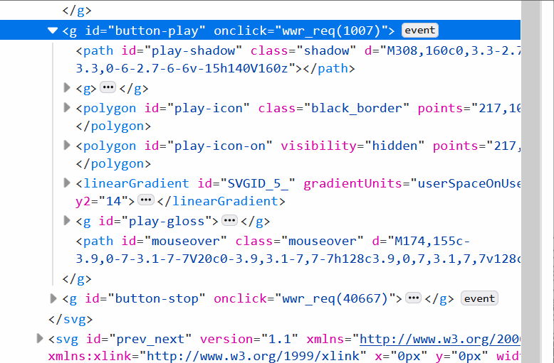
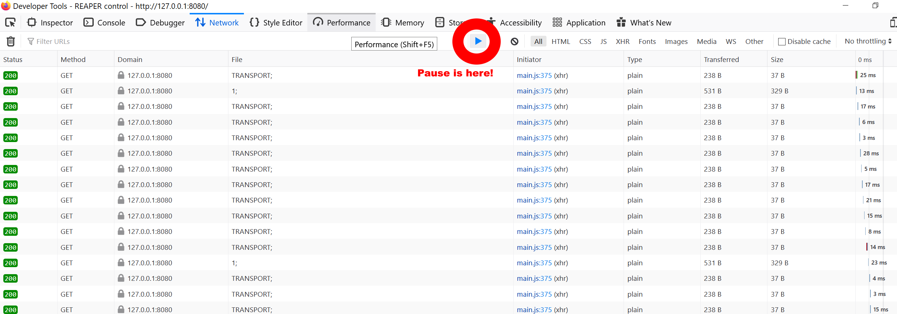
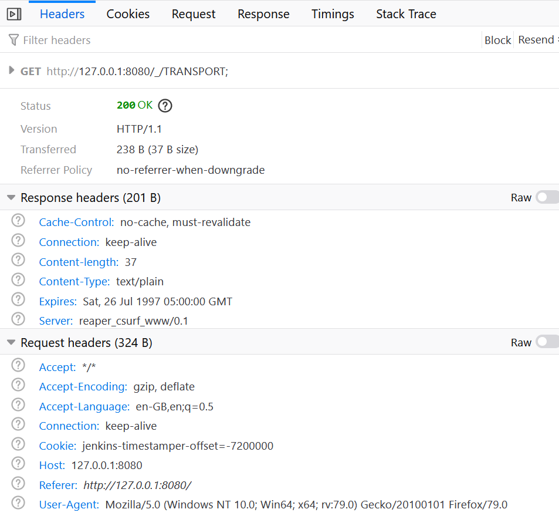
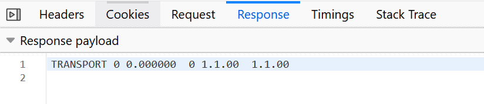
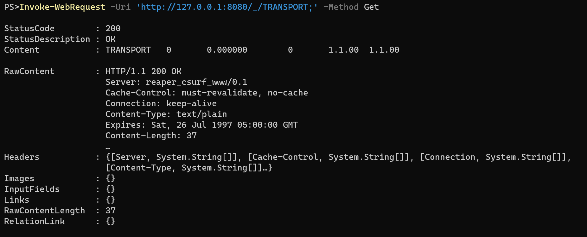
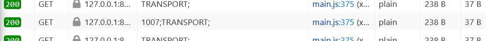
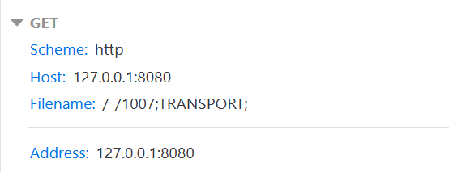
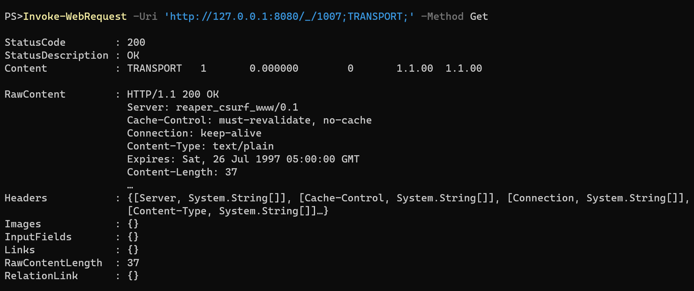

# F12 - Your friendly neighborhood gossip person

*I'm bored. There was a long time since I had any new project to work on, and I can't figure out what interesting thing to do.*

*Everything interesting I could do, someone else has already done, and everyone writes better code than me.*

Know the feeling? I imagine everyone does.

When I end up like this, I tend to go play some guitar instead.

So I recently switched DAW [and wrote about it here](changingdaw.md "How I switched DAW and lived to tell the tale."), which gave me some new interesting things to do...

### I just recently read a really good blogpost

About [How to call REST API from Powershell](https://4bes.nl/2020/08/23/calling-a-rest-api-from-powershell/) By [Barbara Forbes](https://twitter.com/Ba4bes). 

Well written, and clear. Just the way I like it.

But there is something I've been meaning to write about a while that goes outside of the "standard" way of calling web stuff in PowerShell.

**What if there is no API?**

### So how does these two things connect?

Well, it turns out Reaper has a really cool web applet thing that allows you to control some basic actions using a web browser.

The problem is that this is not run through a normal web API, but through a custom built web server with some JavaScript on top.

So how does one figure out what to do without an API, with no proper documentation, and a very limited JavaScript skill?

### Developer mode

Every single browser today (that I know of at least) has a built in developer tools app that you reach by clicking F12. I'm using Firefox, but it's pretty similar in most browsers.

So if we start by browsing to our webpage, and click F12, we get something like this:

Of course you may undock the developer tools to a separate window by clicking the three bullets on the far right. I will do this in most screenshots for clarity.

### Exploring a webpage

So let's start by looking at what the webpage contains, shall we?

If we click the "element picker", The little "arrow in a box" top left, and hover the webpage, the inspector will show us where this code exists, and what it does.

Now, most of this data you find here is things like icons, layout, design... You know, the stuff we automation nerds don't really care about.

But if we check out the object ID "button play" there is an action connected to it called "onclick", and an event connected to this action. Dare to guess what "onclick" means?

If we then expand the "event" by clicking on it, we can see the actual code that runs when play is clicked.

Ok, some JavaScript function that does something, and the number 1007. One step towards knowledge.

### Whadyasayin?

Next tab to check out is the network one. This tab will show you what your browser sends, and receives, from the web server.

It turns out Reaper web controller is incredibly chatty, and if I leave the developer tools open for more than a few minutes, it simply crashes, so lets start by clicking "pause", and check out some basics.

So what are we looking at? Lets go through it row by row.
- The first row is response codes. 200 is good, 400 is bad (You probably know of error 404?)
- Second row is the method. GET means we are fetching stuff from the server. other common ones are POST and PUT, and there are more too..
- Domain. What server are we talking to.
- File. This is the most interesting one as it specifies what are we asking the server to send us.
- Initiator. Where in the source code of the page are we when this happened.
- And the rest is pretty self explanatory...

If we double click a row we get even more information about this particular request, such as the request we sent....

...And the response we got.

Cool. Lets try to copy this request in PowerShell.

Cool! We can get... something?

### What about the button clicking?

Being as chatty as reaper is, Let's empty the network watcher (by clicking the garbage can), un-pause the capture, click play, and pause it again as soon as possible, to see what happens...

Within a few milliseconds of clicking the play button, we capture this package

And checking details we can see this

Wait... wasn't 1007 the string that was in the JavaScript bit we saw before? And we have a GET, and a filename. Lets try it in PowerShell again...

Ey presto! Play is pressed!

(Ok, a blog might not be the best medium for sound, but I promise you, it works...)

### The end is nigh! 

Armed with this knowledge we can actually start traversing every button, seeing what codes is sent in the "onclick" event,

and use the network monitor to verify finds and see what more data is sent and/or received.

But now that you're already here reading instead of hacking webpages, let's take a few minutes to check one more thing.

### The keys to the kingdom

Let's quickly check out the debugger tab.
This tab contains outlines of all JavaScript functions the webpage uses, and also the source code of all included (or loaded? If you have the answer, please tell me... This tab is a bit of a mystery to me still...) datafiles.

In the case of the reaper control surface we have two files:
- (index), or index.html. Layout, looks, and events.
- main.js, the source of all JavaScripts run on the page.

Here's the thing:

*Reapers main.js contains detailed descriptions of every command, how to call it, and what the response is*

So why didn't I just start with this one? Well this is kind of an edge case in my limited experience. It is very common that your JavaScript files are [minified or uglified](https://stackoverflow.com/questions/19694448/whats-the-difference-between-concat-and-uglify-and-minify), which more or less makes the code unreadable, And even more so when you, like me, isn't comfortable with JavaScript to start with.

But there are times when you can find really useful pieces of data here too. Like in the case of Reaper.

### Last, but not least

So where did this lead me?

Well, I wrote PowerShell functions for the most common actions, and [published my code on GitHub](https://github.com/bjompen/PSReaper)

I figured out there are some things you simply can't do through the web console, so those are out for now.

But most importantly:

*I'm no longer bored. I have a new project to work on, and I have a million interesting things to do with it.*

*Everything interesting I could do wasn´t already done, and while everyone might write better code than me, I just released something I'm proud of.*

Until next time, Internet.
