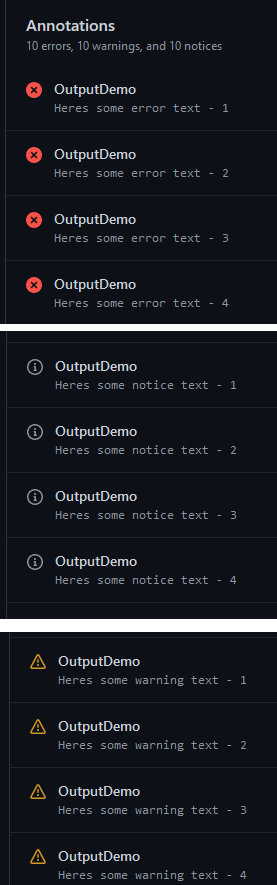

# GitHub. Light, Camera, Action(s)

Poor poor Bjompen!

I'm sick. After comming back from [Ignite](./ignite2022.md) I spent the week celebrating the birthdays of two kiddos and one wife, and I'm fairly sure someone brought me the gift of strep throat.

So here I am, spending my days drifting in and out of sleep, watching movies, unable to talk.

But I don't need no voice to write code, so I took the time to wrap up [PSSecretScanner 2.0](https://github.com/bjompen/PSSecretScanner), and one of the things added there was a GitHub action.

One thing I don't like about GitHub is the documentation. It's there, absolutely, I just dont thinks it's easy to understand. Whenever I go search for types of output I _always_ end up on [this page](https://docs.github.com/en/actions/using-jobs/defining-outputs-for-jobs). Looks good, right? The only problem:

**This doesn't output anything**

so lets look at how to output stuff in GitHub. For real.

## If it doesn't output anything, what does it do?

Ok, first of, let's grab the bull by its horns.

The above linked article is not about output _to the console_ but output between different job.
I can use this to get the result from my pwsh code `job1` and use that value as input to my code in `job2`.

I would say this reminds me mostly of the [task.setvariable](https://learn.microsoft.com/en-us/azure/devops/pipelines/process/set-variables-scripts?view=azure-devops&tabs=powershell#set-an-output-variable-for-use-in-future-jobs) function in Azure DevOps.

I would call this dependency or passing data between jobs, not output, but ok GitHub. Like I said: I don't like GitHub documentation.

## So lets go look at output instead

Actual output. To console.

### The first thing we're going to look at is grouping

This is something that makes it easier to read logs and colapse or exand what matters to me right now.

We can do this in GitHub output by using the PowerShell command

```PowerShell
Write-Output "::group::My group name"
# PowerShell code goes here
Write-Output "::endgroup::" 
```

How does this look?


### So what is this "::" thing about?

GitHub refers to this not as output, but as [workflow commands](https://docs.github.com/en/actions/using-workflows/workflow-commands-for-github-actions), and we can use these to send notifications to our GitHub runner and change the output to console and runs.

The basic format for all of these, like for example \:\:group\:\: is

```PowerShell
Write-Output "::<command>::Message to show
```

To some commands we can also add some predefined parameters to our command and make it look like this instead

```PowerShell
Write-Output "::<command> file=<filename>, line:<line number, a positive int>, title:<message title>::Message to show
```

We're going to look at three different commands and how they look to start with: `notice`, `warning`, and `error`.

## Output to summary

When you enter a specific run of an action or workflow you are imediately greeted with a summary page, and this is where the workflow command output ends up.

Using for example the commands

```PowerShell
Write-Output "::group::Sending a notice without metadata"
Write-Output "::notice::This text goes after the last colon sign"
Write-Output "::endgroup::"   
```

will output the following to the log


But it will also add this to the summary page
(OutputDemo is the name of the job given in the workflow)


So I mentioned we could also use parameters. Lets see what that looks like by using the code

```PowerShell
Write-Output "::group::sending a notice with metadata"
Write-Output "::notice file=/path/to/MyFile.txt,line=666,title=Something went wrong with MyFile.txt::This text goes after the last colon sign"
Write-Output "::endgroup::"
```

This will result in the following log


Worth noting is that the log does not output any metadata. The summary on the other hand looks like this


Nice!

Trying the other two workflow commands, \:\:warning\:\: and \:\:error\:\:, gives a very similar, yet coloured output with different icons.

the code block

```PowerShell
Write-Output "::group::sending a error with metadata"
Write-Output "::error file=/path/to/MyFile.txt,line=666,title=Something went wrong with MyFile.txt::This text goes after the last colon sign"
Write-Output "::endgroup::"

Write-Output "::group::sending a error without metadata"
Write-Output "::error::This text goes after the last colon sign"
Write-Output "::endgroup::"
    
Write-Output "::group::sending a notice with metadata"
Write-Output "::notice file=/path/to/MyFile.txt,line=666,title=Something went wrong with MyFile.txt::This text goes after the last colon sign"
Write-Output "::endgroup::"

Write-Output "::group::Sending a notice without metadata"
Write-Output "::notice::This text goes after the last colon sign"
Write-Output "::endgroup::"    

Write-Output "::group::sending a warning with metadata"
Write-Output "::warning file=/path/to/MyFile.txt,line=666,title=Something went wrong with MyFile.txt::This text goes after the last colon sign"
Write-Output "::endgroup::"

Write-Output "::group::Sending a warning without metadata"
Write-Output "::warning::This text goes after the last colon sign"
Write-Output "::endgroup::" 
```

results in the following log entries


and the following summary


## But wait.. What just happened?

The keen eyed among you may have already noticed that I started with outputing the error message, yet the workflow did not break, but ended successfully.

Thats because _workflow commands only changes the output._

In order to actualle change the workflow behaviour we need to start looking at PowerShells own native commands for output.

Lets add all our favourite "standard" output CmdLets, skipping `Write-Error` for now because reasons, and `Write-Process` because it makes no sense here..

```PowerShell
Write-Output "::group::std powershell outputs"
Write-Output "using write-output"
Write-Host "using write-Host"
Write-Verbose "using write-Verbose" -Verbose
Write-Information "using write-Information"
Write-Debug "using write-Debug" -Debug
Write-Warning "using write-Warning"
Write-Output "::endgroup::" 
```

This results in the following in the log (and nothing in summary)


We can also change some of this behaviour by enabling the stream output in PowerShell

```PowerShell
Write-Output "::group::std powershell outputs"
Write-Verbose "using write-Verbose" -Verbose
Write-Debug "using write-Debug" -Debug
Write-Output "::endgroup::" 
```


Both outputs gets enabled.

## Time to break stuff

So now we know how to write to log, and how to write to summary page, but we still haven't stoped the pipeline on failure.

Just like in standard PowerShell this is where `Write-Error` and `throw` enters.

Lets try the following

```PowerShell
Write-Output "::group::breaking the pipeline"
Write-Output "Before we pull the breaks"
Write-Error "Danger - Danger Will Robinson!"
Write-Output "After we pull the breaks"
Write-Output "::endgroup::" 
```

The log now shows the following, and we can clearly see that the pipeline is stopped.


We also get an error in the summary page, however, not the message I had hoped for...


Unfortunately the result is exactly the same using `throw`

## Tying it all together

So we now know we can alter our output using PowerShell write-* commands, and we cna write stuff to the summary using workflow commands.

Can we tie the together to get a _good_ error message thrown when our pipeline breaks?

Well.. unfortunately no.

```PowerShell
Write-Output "::group::sending a error using Write-Error"
Write-Error "::error file=/path/to/MyFile.txt,line=666,title=Something went wrong with MyFile.txt::Huge problems! Break the pipeline!"
Write-Output "::endgroup::"
```

this only results in the following logs and summaries


## Summary

So: In order to actually get a proper output the way I want it, this is what I ended up doing

```PowerShell
Write-Output "::notice::This is something important to log"

Write-Output "::error file=/path/to/MyFile.txt,line=666,title=Something went wrong with MyFile.txt::Huge problems! Break the pipeline!"
Write-Error "Something went wrong and we need to stop"
```

This way I can log stuff to the summary the way I want, and break with a clearer message in the summary if needed.

But like a good nerd I'm not done yet.

## Playtime

So we learned a couple of other things here as well

- The summary supports multiple messages with titles
- The console supports colours

Lets see if we can learn more about those shall we?

- How much data does the summary fit?
  - 10 lines of each type. Log show all 15 but summary only 10.

```PowerShell
1..15 | % {
    Write-Output "::notice::Heres some notice text - $_"
}
1..15 | % {
    Write-Output "::warning::Heres some warning text - $_"
}
1..15 | % {
    Write-Output "::error::Heres some error text - $_"
}
```



- Can we group stuff on title to fit more in the summary?
  - No. We only get more entrys with the same title.

```PowerShell
Write-Output "::group::sending more notices with the same title"
1..3 | % {
    Write-Output "::notice title=Something is wrong::message number $_"
}
Write-Output "::endgroup::"
```


- Console obviously supports colours. [So does PowerShell](https://duffney.io/usingansiescapesequencespowershell/). Can we do this in the console?
  - Oh yes, we can!

```PowerShell
Write-Output "::group::Testing Colours!"
0..255 | % {Write-Output "`e[38;5;${_}mColour is $_`e[0m"}
Write-Output "::endgroup::"
```


In fact, we can use most ANSI sequences mentioned in Josh's blogpost linked above. Cool Stuff!

## Back to bed

So I did manage to figure a whole lot of interesting stuff out even though my brain currently moves in slow motion. I guess I'm calling the doctor tomorrow to get me some penicillin.

Unless I find some other interesting hole to dig to deep in.

See you on the other, more colourfull, side.
