# Same same, but different.

Ok, enough with the bragging Björn, lets go back to the learning!

Well, ok then.

Truth is I have no less than two bigger projects going for the summer / fall.

One of them is mentioned here before, one of them isn't.

None of them are what we're going to talk about today 😉

## Just before I left for Prague

A colleague of mine had an interesting question.

> If I tag an issue in my GitHub repo with "DependsOnOtherProject", can I automatically create an issue in OtherProject and link back to this one just so we know we have a dependency somewhere?

> Errrr.. but why?

Asked other colleague.

> Wouldn't it be easier to just not have issues in OtherProject and point to always using FirstProject for issue tracking?

Well.. yes. But where's the fun in that?

So I know we can use all kinds of triggers in a GitHub workflow, and I know we can use the API to create an issue, so lets try it, shall we? even if it won't be the solution implemented we learn stuff!

## Setting stuff up and creating a workflow

The first thing we need is of course two repos:
- SourceRepo
    - This is where we will tag issues and trigger the workflow
- DestRepo
    - When a tag is applied on an issue in SourceRepo, an issue will appear here magically

In our source repo we also create a workflow yaml file. That's a good start.

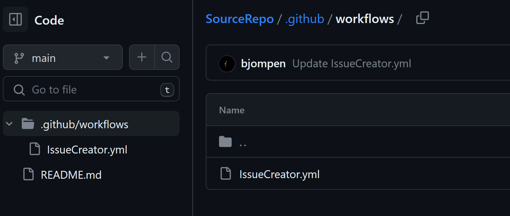

## Baseline YAML

There are a couple of things every GitHub workflow needs:

- A name
- A trigger
- One or more jobs
  - running on some kind of agent
  - containing one or more steps / GitHub actions

So far nothing super hard.

Name. Call it something. This will show up on the workflow page, but that's pretty much it.

Jobs. Were going to run API calls, and I prefer to do those in PowerShell, so create a job with a name. We can run on GitHub Ubuntu agents for this task.

The trigger is a bit more complicated.

According to [the docs](https://docs.github.com/en/actions/using-workflows/events-that-trigger-workflows#issues) there are almost 20 different ways of triggering a workflow from an issue, The one we're looking for is "labeled" which means "when an issue gets a new label. Even if an issue is created and labeled directly this workflow trigger will work.

So far so good, and our YAML file currently looks like this

```YAML
name: IssueToIssue

on: 
  issues:
    types: [labeled]

jobs:
  create_issue:
    runs-on: ubuntu-latest
    steps:
      - shell: pwsh
        run: |
          # PowerShell code goes here
```

As we can see, the name is also shown in the summary of actions of our repo.

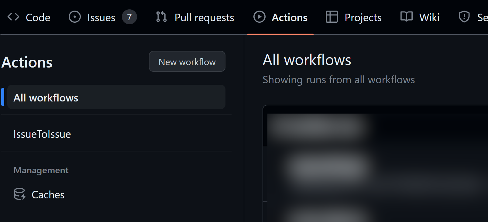

## Adding the code

This is where it actually starts to get interesting.
The closest thing to documentation I could find on GitHubs page [was this article](https://docs.github.com/en/actions/managing-issues-and-pull-requests/commenting-on-an-issue-when-a-label-is-added) that does describe how to comment on an issue, but it uses a GitHub action. Sure, we could do that, but I don't like to do stuff without understanding them.

Fortunately there is documentation on GitHub APIs, and [it is quite good!](https://docs.github.com/en/rest/issues/issues?apiVersion=2022-11-28#create-an-issue)

Sure, the examples are in cURL, but it's not super hard to translate to PowerShell.

```bash
curl -L \
  -X POST \
  -H "Accept: application/vnd.github+json" \
  -H "Authorization: Bearer <YOUR-TOKEN>"\
  -H "X-GitHub-Api-Version: 2022-11-28" \
  https://api.github.com/repos/OWNER/REPO/issues \
  -d '{"title":"Found a bug","body":"I'\''m having a problem with this.","assignees":["octocat"],"milestone":1,"labels":["bug"]}'
```

And translated to PowerShell

```PowerShell
$Body = @{
    title = "Found a bug"
    body = "I'\''m having a problem with this."
    labels = @("bug")
}
$JsonBody = $Body | ConvertTo-Json -Compress

$Headers = @{
    'Accept' = 'application/vnd.github+json' 
    'Authorization' = "Bearer <YOUR-TOKEN>"
    'X-GitHub-Api-Version' = '2022-11-28'
}

$InvokeObject = @{
    Method = 'Post'
    Uri = 'https://api.github.com/repos/OWNER/REPO/issues'
    Body = $JsonBody 
    Headers = $Headers
}

Invoke-RestMethod @InvokeObject  
```

I see one issue here.. and many more in the future.

## \<YOUR-TOKEN\>

Obviously we need some kind of token to create issues. Fortunately for us GitHub runners actually creates those tokens automagically!

Again, [back in the docs](https://docs.github.com/en/rest/overview/authenticating-to-the-rest-api?apiVersion=2022-11-28#authenticating-in-a-github-actions-workflow) we can see that we have a magic variable called `$env:GITHUB_TOKEN` that we can use. 

Unfortunately this one is scoped to the working repository. If we want to do stuff in SourceRepo this would do, but since we are creating issues in another repo we need to either create a GitHub app (loads of work) or use a PAT (somewhat more insecure). I'm going to opt for the latter.

### Fine grained tokens

Is a neat feature of GitHub. Yes, they are still in beta, but they do work.

If you click your profile picture and select "Settings"

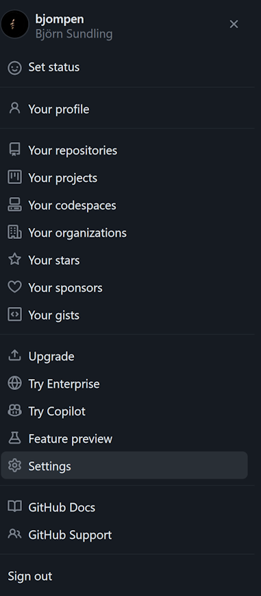

Scroll to the very bottom of the left menu and click "Developer settings"

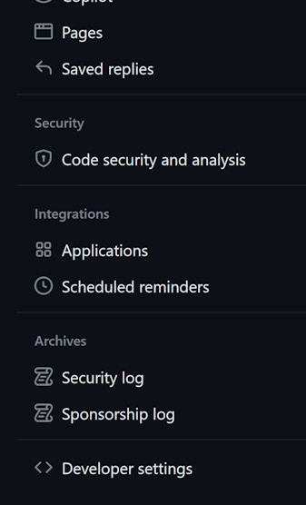

Select "Fine-grained tokens" and click "Generate new token"

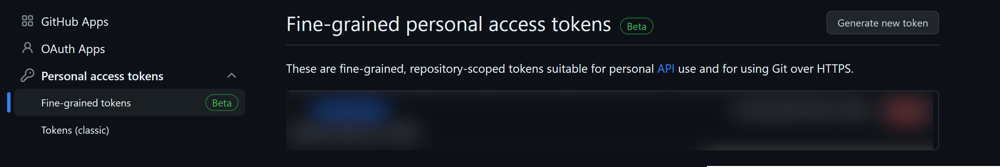

You will then have to pass your 2FA and such, but should end up around here

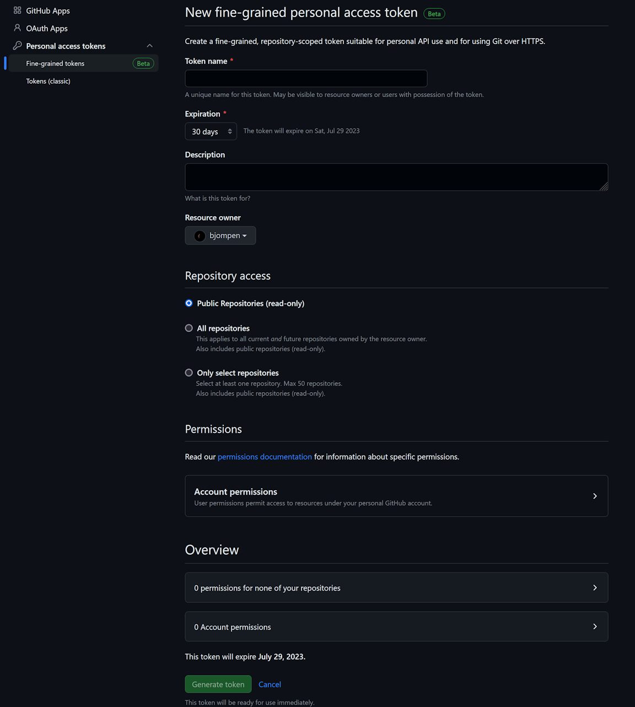

Under repository access you need to grant your token access to the two repos you will be working in

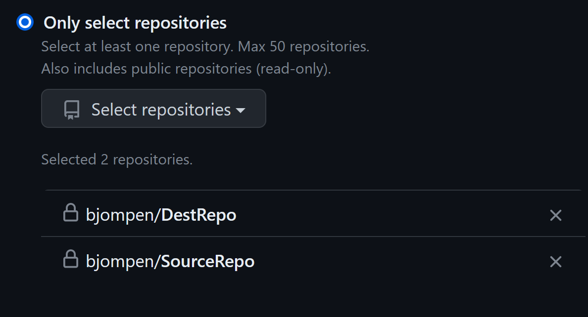

You also need to specify the repo permissions

- Actions: Read-Only
- Issues: Read and write

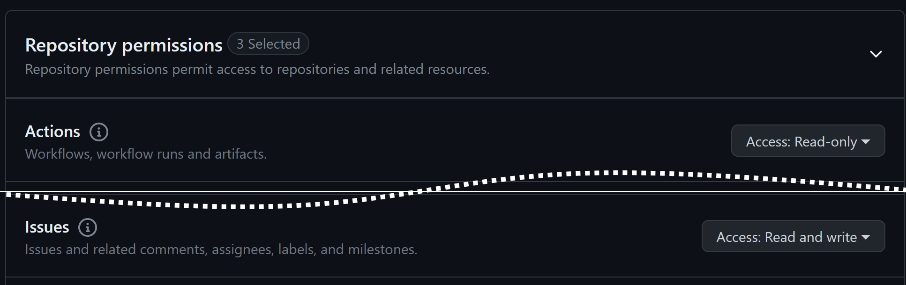

Click "Generate token", and make sure to save it somewhere! You will never get a second chance to see it.

Once created, if you click it, it should look something like this:

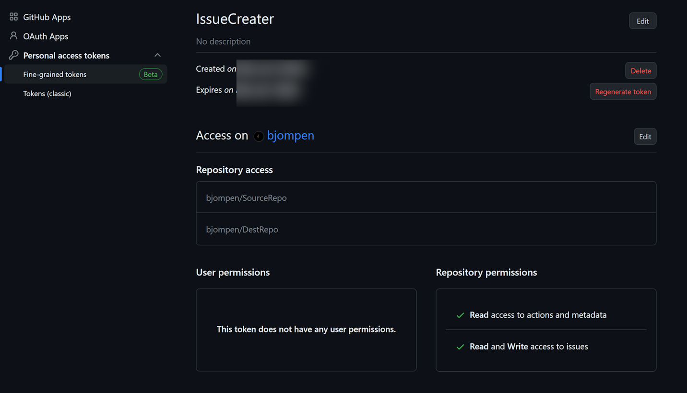

### Store your token as a secret variable

Once your token is created, of to our SourceRepo we go to store it as a secret we can use.

In the SourceRepo, we click "Settings" - "Secrets and Variables" - "Actions"

Create a new repository secret, give it a name, and input your PAT that you just copied, right? I TOLD YOU SAVE YOUR TOKEN D#¤%*IT! 😂

Good. The only thing left is to add it as an environment variable to our YAML and set it to be used as my token.

```YAML
steps:
  - shell: pwsh
    env:
        PAToken: ${{ secrets.PATOKEN }}
    run: |
        # Cut for brevity here..
            $Headers = @{
                'Accept' = 'application/vnd.github+json' 
                'Authorization' = "Bearer $($env:PAToken)"
                'X-GitHub-Api-Version' = '2022-11-28'
            }
```

## The event that moves the body

[Magne, if you're listening, I love you](https://www.youtube.com/watch?v=GCQJdvLlGD8)

This is where the fun began. 

There is a GitHub variable expansion thing used almost everywhere that looks like this: `${{ some data goes here }}`

In the event of a trigger it looks like this: `${{ github.event.metadataheader.metadatavalue }}`

The problem is that the documentation of what data a trigger contains, and how to get that data, is.. shall we say "limited and scattered".

If we look at [the docs for the trigger again](https://docs.github.com/en/actions/using-workflows/events-that-trigger-workflows#issues) there is a link to the ["Issues" in the REST API documentation.](https://docs.github.com/en/rest/issues?apiVersion=2022-11-28). If we follow this link, scroll down to "Events" and click ["Get an issue event"](https://docs.github.com/en/rest/issues/events?apiVersion=2022-11-28#get-an-issue-event), on your right hand side you have a json example response

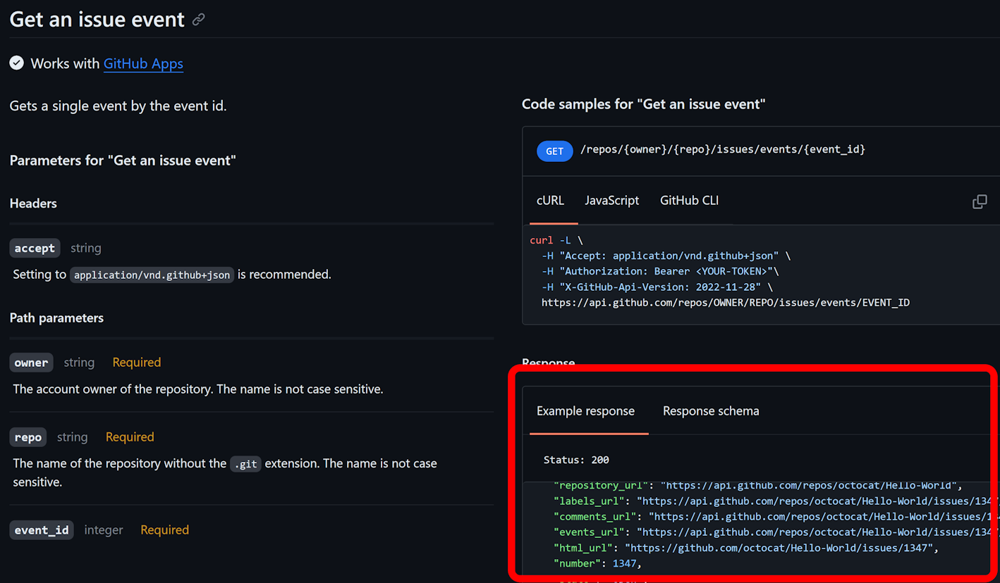

A bit further down on the same page we have the same example but for [List issue events](https://docs.github.com/en/rest/issues/events?apiVersion=2022-11-28#list-issue-events)

And as far as I can tell, my trigger metadata is some kind of mixture of these two objects.

Seriously GitHub people - You need to up your game _a lot_ when it comes to triggers and metadata.

It took a number of guesses, but in the end I found that I have a metadata header called "issue" that contains the metadata found in the issue header of the ["get an issue event" article](https://docs.github.com/en/rest/issues/events?apiVersion=2022-11-28#get-an-issue-event),
and I have a label header as seen in the ["list issue events" article](https://docs.github.com/en/rest/issues/events?apiVersion=2022-11-28#list-issue-events)

And I could do some more YAML magic!

```YAML
if ("${{ github.event.label.name }}" -eq 'MyLabel') {
    $Body = @{
        title = "${{ github.event.issue.title }}"
        body = "${{ github.event.issue.Body }} `n`nOriginal Issue URL: ${{ github.event.issue.url }}"
        labels = @("bug")
    }
```

## The end result YAML

In the end we have created a secret, mapped it to our SourceRepo, and we have a YAML that looks like this

```YAML
name: IssueToIssue

on: 
  issues:
    types: [labeled]

jobs:
  create_issue:
    runs-on: ubuntu-latest
    steps:
      - shell: pwsh
        env:
          PAToken: ${{ secrets.PATOKEN }}
        run: |
          if ("${{ github.event.label.name }}" -eq 'DependsOnOtherProject') {
              $Body = @{
                  title = "${{ github.event.issue.title }}"
                  body = "${{ github.event.issue.Body }} `n`nOriginal Issue URL: ${{ github.event.issue.url }}"
                  labels = @("DependsOnOtherProject")
              }
              $JsonBody = $Body | ConvertTo-Json -Compress

              $Headers = @{
                  'Accept' = 'application/vnd.github+json' 
                  'Authorization' = "Bearer $($env:PAToken)"
                  'X-GitHub-Api-Version' = '2022-11-28'
              }

              $InvokeObject = @{
                  Method = 'Post'
                  Uri = 'https://api.github.com/repos/bjompen/DestRepo/issues'
                  Body = $JsonBody 
                  Headers = $Headers
              }
              Write-Host $($InvokeObject | ConvertTo-Json -Depth 10)
              Invoke-RestMethod @InvokeObject  
          }
```

Time to go create some issues!

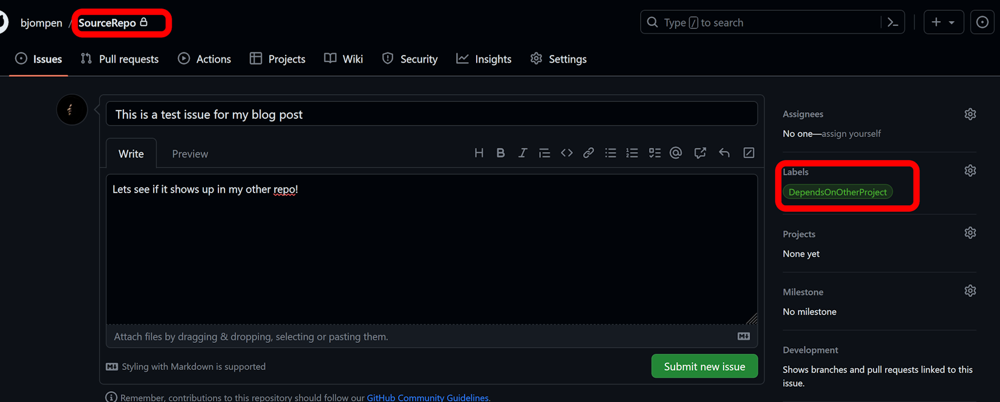

The workflow in running successfully

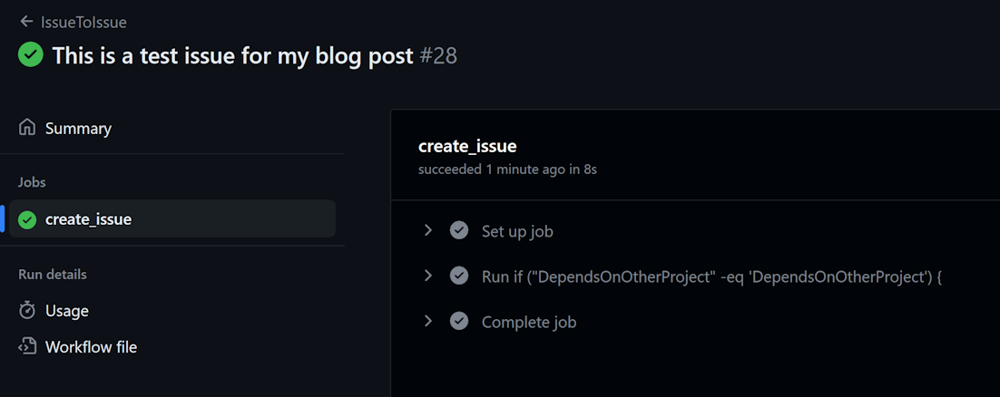

And it shows up in our destination repo!

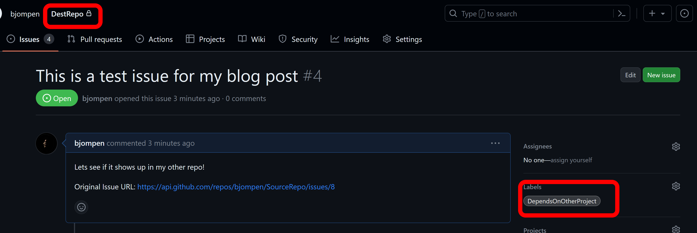

## Issues

So there is still one thing I don't like.

Since we are using a PAT the new issue will be created as me. If we want this to be created by a bot of some kind, well, you need to create a GitHub app that can authenticate. Maybe I'll look in to that in the future, but as of now, this works, and even though we ended up not using this solution it was a fun bit of learning and digging in to GitHub triggers.

## And that's what we said we would do, right? Back to the learning?

Well hold on to your horses, we're going for a bumpy fall of learning stuff! 

Until next time, internet.
