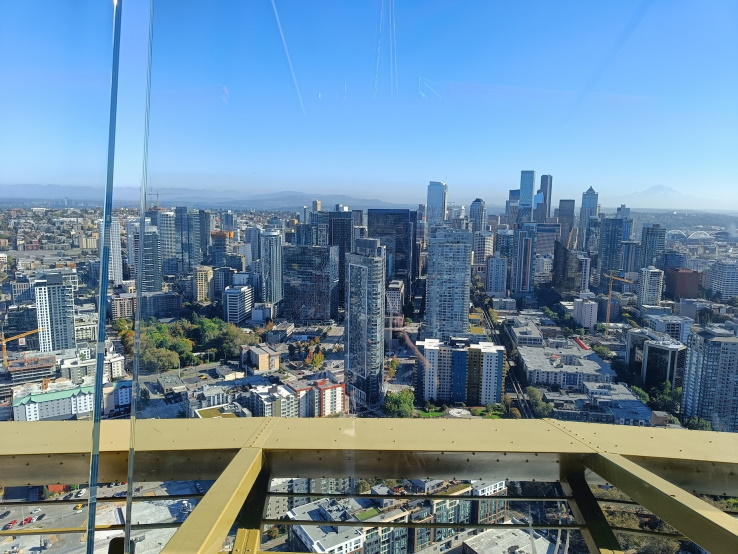
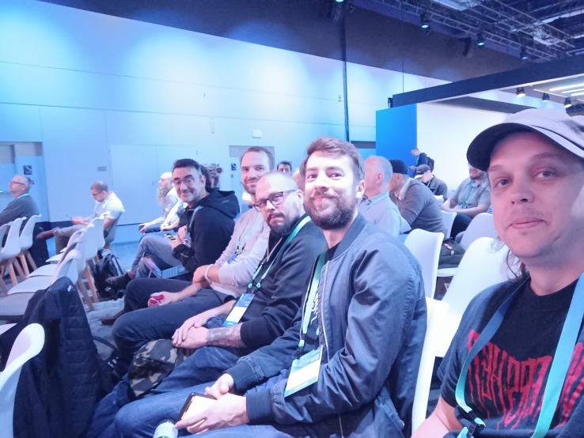
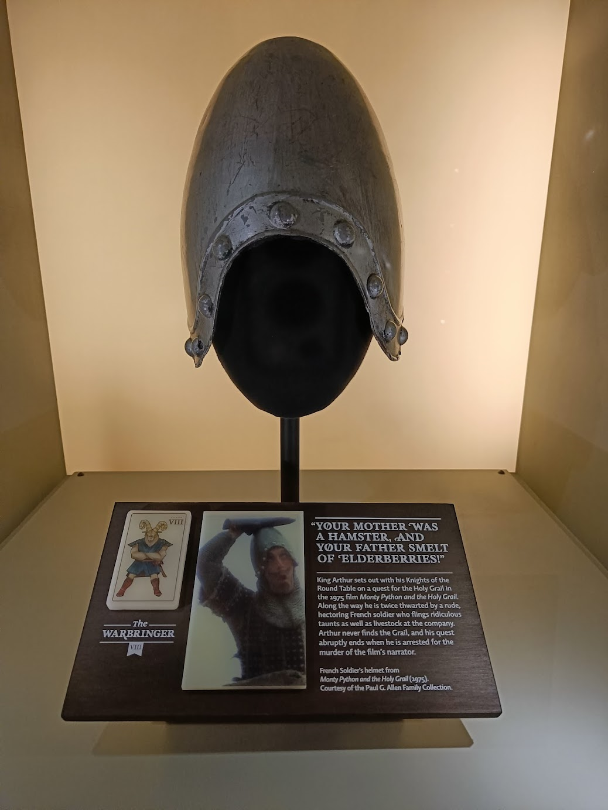

# Ignite 2022: The good, the bad, and the ugly

I have the best workplace. Not only do they encourage me to do cool stuff and learn new interesting things, but sometimes they also pay for me to go have fun on the other side of the world.

And so it happens I am currently in a hotel room in Seattle, writing this.
After two days of Ignite, and some time touristing in the city, it's time to start gathering my thoughts and memories.

## The good

Start on top, and it can only get worse..

### Day 1

Our first day in Seattle was tourism only. This is good as it allows me to catch up on the sleep schedule and not be quite as jet lagged when listening to presentations. I took the chance to see the things the tourist guide tells you to, the space needle (AAHHHHHH HEIGHTS! 😱), Pike market (Fantastic!), and the Museum of pop culture (They had the real[Greedo!](https://starwars.fandom.com/wiki/Greedo)). Weather was amazing, and all in all I had a great time.

### Day.. well, the rest of the days

Ignite is big, although this is the smallest one yet, and Microsoft does spend _a lot_ of money making it worth while. The location, [Seattle convention center](https://seattleconventioncenter.com/), leaves nothing missing. Loads of areas for presentations, meetups, and to spend some time alone. Something needed after years of nothing, as the social capital isn't really what it once was.

We joined for the keynote and opening sessions, and there was some seriously cool stuff presented. My key takeaways that I will go home and research are

- [Defender for DevOps](https://www.microsoft.com/en-us/security/business/cloud-security/microsoft-defender-devops)
- [Codex](https://learn.microsoft.com/en-us/azure/cognitive-services/openai/how-to/work-with-code)
- [Microsoft dev box](https://azure.microsoft.com/en-us/services/dev-box/)
- [Azure deployment environments](https://learn.microsoft.com/en-us/azure/deployment-environments/overview-what-is-azure-deployment-environments)
- [GitHub advanced security for Azure DevOps](https://devblogs.microsoft.com/devops/integrate-security-into-your-developer-workflow-with-github-advanced-security-for-azure-devops/)
- [Azure kubernetes fleet manager](https://techcommunity.microsoft.com/t5/apps-on-azure-blog/azure-kubernetes-fleet-manager-preview/ba-p/3651516)

Unfortunately, this is pretty much where the good ended...

## The bad

### Presentations

After the keynote, it's of to join sessions. Awesome. I want to learn more about the cool stuff you just mentioned.

You may notice I gave no introduction to the products linked above..
There were zero presentations on any of these products.

none.

Sure, there were other presentations, and they weren't bad*, But it was not what I wanted to see presented. What's new in .Net 7? Sure, cool stuff, but thats not news any more.

But hey, presentations are only a small part of conferences. It's about meeting people, right? Of to the hub we go! Lets mingle!

The hub was meant to be a room full of breakout sessions, meetups and mingle. Instead it was a big room of chaos. There were no less than four different areas, each with 2 or more breakout rooms, none of them sound isolated, and only some of them had mics and sound. To top it of, there were no clarity at all as to which places did what, if there were any specific topics, or screens to direct you where you would fit in.
"Yellow is dev, Red is 365..." or something similar would have made it so much easier to find out where I would like to hang and meet, and having trouble hearing to start with, the lack of isolation made it near impossible to hear anything, or even talking amongst friends.

And while on topic of rooms: It took me quite some time to figure out the room names as well. The only signs I could find had the name "800 Pike" om them, on sticks carried by people all over the place, and "800 pike" wasn't a room, but a building (I learned after one of my colleagues said "were sitting in the 800 pike room"). Over all it took way to long to even find out where to go, and I ended up spending just about all my time in the dev presentation room since at least I knew there would be somewhat interesting topics there.

In the end, No complaints about the presenters, I know they had way to little time to prepare for stuff, and like I said: The presentations weren't bad, they just weren't what I hoped for.

... Ok, one complaint about presenters: Many of the presenters are native English speakers, and speak fast. Since I'm not I would have preferred them to speak slower. Remember, I have to translate all that you say to understand it. I have limited processing power.

Pictured, left to right: [Tomas](https://twitter.com/TomasLepa), [Markus](https://twitter.com/Degerlunden), [Daniel](https://twitter.com/DanielKallstrom), [Emanuel](https://twitter.com/PalmEmanuel?), and me, waiting for a keynote.

_\* ([Scott Hanselman](https://twitter.com/shanselman) and [Mark Russinovich](https://twitter.com/markrussinovich) was truly a work of stage nerd magic. [Go watch!](https://ignite.microsoft.com/en-US/sessions/6b3aecf1-92ba-41f7-81eb-fdad7b4b4138))_

## The ugly

Which leaves us with the ugly. I'm not really sure what this would be though, so here are just some of the things I thought about that really wasn't about the presentations or trends, but just... lacking.

- Food. Soggy burritos and whatever the pulled beef burger was supposed to be, that mostly tasted terrible. It really shouldn't be too hard to find a good caterer in a city of this size. On the other side, the evening food in the after party was nice.
- Sponsor areas. In those times where no interesting sessions takes place, I love to stroll the sponsor areas at Ignite. It's like a party floor, filled with games, toys, beer, and sure, sales people too (nothings perfect). This year each sponsor had a separate room, hidden away somewhere where you just know if you enter you are caught in a sales pitch. I passed those rooms a couple of times, and never saw a person in there that wasn't working.
- Swag, or the lack of it. I don't want another backpack, nor do I need another water bottle, but something fun for the kids when I get home would have been nice. Or, for that matter, put up a sign and say "Instead of giving you a backpack, we gave the money to charity"*. Or.. something. Microsoft is the worlds richest company, they can bloody well afford it.
- The after party. Free beer and tasty food is super nice, but there was pretty much nothing to do except getting drunk and eating. No games, no fun, no concerts (A great DJ hidden in a corner I found only when looking for something to do), all set in an interior that reminded me mostly of my old school lunch room. Yay, party...
- Last but _definitely_ not least: In many, if not all, of the sessions we were told to fill in the evaluations. In no session they told us _where the evaluations can be found._ I did find them in the scheduler, but only when I searched for the above linked Scott and Mark video... To top it of - I still have no idea where and how to give event feedback that isn't related to any particular session.

\* Homelessness in Seattle is insane, at least compared to what we see in Sweden. The cost of a water bottle and a backpack could probably feed someone for a couple of days.

## The end?

Not really, as I still haven't left Seattle. Tomorrow we are visiting the Microsoft office in Redmond, hopefully including the standard photo in front of the logo, but as for Ignite, this is the end for me this year.

Over all I am happy to be here. I actually kind of like Seattle, something I can't say of many places except my home. I think London is more or less the only city other than Stockholm where I ever really enjoyed "the city".

And I love the fact that my employer lets me do these things. It's one of the things that makes me enjoy going to work every day, knowing they value me enough to do this.

But seriously, Microsoft, If you are going to do Ignite again, you need to step up your game. Big time. Otherwise you might as well just skip it completely and release stuff without big bangs.

I'll leave you with the absolute best thing I found here so far: An image from the museum of pop culture.

