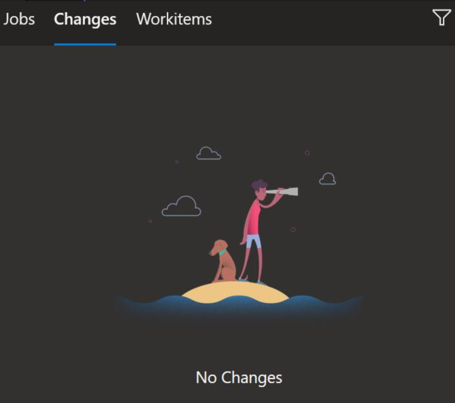
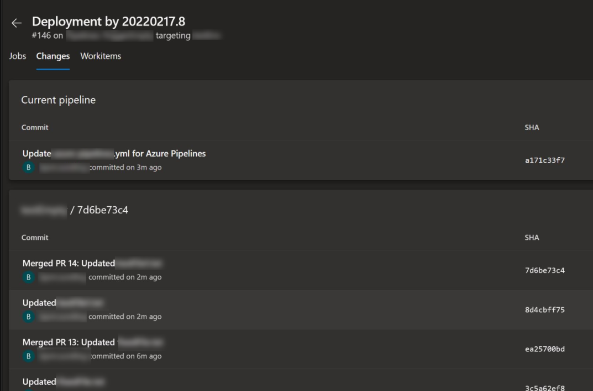

# Bjompen Potter and the hair pulling case of the missing commits

In my research around Azure DevOps I recently stumbled on an interesting problem.
I wanted to add [Environments](https://docs.microsoft.com/en-us/azure/devops/pipelines/process/environments?view=azure-devops) to add some easy and fancy traceability to my pipelines.

## Always start with reading the docs

According to the documentation linked above, getting started with environments is easy:

- Create an environment
- or dont and we'll create it for you.

Sounds simple enough, doesn't it? And it is! My environments are created and used.

[So lets read some more](https://docs.microsoft.com/en-us/azure/devops/pipelines/repos/multi-repo-checkout?view=azure-devops)

---
No `checkout` steps

The default behavior is as if `checkout: self` were the first step, and the current repository is checked out.

---

but...

## Dude, where's my commits?

The feature I am currently looking at in environments is the [Deployment history](https://docs.microsoft.com/en-us/azure/devops/pipelines/process/environments?view=azure-devops#deployment-history), and more exactly, the commit history.

So after setting everything up according to the documentation, I had a pipeline looking like this:

```yaml
# triggers and stuff up here
stages:
- stage: Stage 1
  jobs:
  - deployment: DeployWeb
    displayName: deploy Web App
    pool:
      vmImage: 'Ubuntu-latest'
    environment: 'MyEnvironment'
    strategy:
      runOnce:
        deploy:
          steps:
          - script: echo Hello world!
            displayName: 'Run a one-line script'
```

As you might see, this is almost an exact copy of the documentation yaml.

However, when I went in to the commit list, I was greated by this:



## Finding the difference in a world of similarities

I started asking around, and it turns out I know noone who had really used this before. We mostly only use environments for the approvals.

However, _some_ pipelines, in _some_ environments does in fact show changes.

Of course, we needed to figure out exactly what makes a change show up here, so me and two of my colleagues spent quite some time compairing pipelines, yaml, and trying to figure out what made a difference:

- Adding and linking workitems? No change.
- Using pull requests instead of #PTMF? Nope.
- Having the pipeline in the same or a different repo as the code? No difference at all.
- Adding a PublishPipelineArtifact step to the pipeline? YES! Well, no, turns out to be a false positive. Back to the drawing board.

Untill Jens cracked it.

## Check-ch-check-check-check-ch-check it out - Beastie boys, 2004

In the first part I linked to the `checkout` docs.

There seems to be something magic going on in that command, and infact, the documentation _should_ read something like this instead:

---
No `checkout` steps

The default behavior is as if `checkout: self` were the first step, and the current repository is checked out, unless you are using environments.

---

And, for that matter, the documentation for Environments probably should mention this as well somewhere:

---
When using `environment:` in a `yaml`pipeline you _must_ also add `- checkout: <MyRepo>` to the pipeline.

---

Adding `- checkout: self` and `- checkout: MyCodeRepo` to the code makes the commits show up!



So, this is what we need to have in our yaml file to get the beautiful, and easy to find, traceability we want:

```yaml
# triggers and stuff up here
stages:
- stage: Stage 1
  jobs:
  - deployment: DeployWeb
    displayName: deploy Web App
    pool:
      vmImage: 'Ubuntu-latest'
    environment: 'MyEnvironment'
    strategy:
      runOnce:
        deploy:
          steps:
          - checkout: self
          - checkout: MyCodeRepo
          - script: echo Hello world!
            displayName: 'Run a one-line script'
```

## Before we finnish

I would love for someone to explain this further to me.

- Why does it behave like this?
- What does `- checkout` _acutally do_?

and maybe most of all

- Am I wrong or is this actually the way it should be?

But untill anyone can explain this, I guess I'm manually chigeddy-checking my code out.

## Shoutout

Huge thank you and shoutout to my absolutely brilliant colleagues [Jens Nilsson](https://twitter.com/nilssonjensa) and [Sebastian Claesson](https://twitter.com/SebClaesson) for figuring this out. I couldn't have done it without you. Literally, since Jensa wa the one who found it 😁
