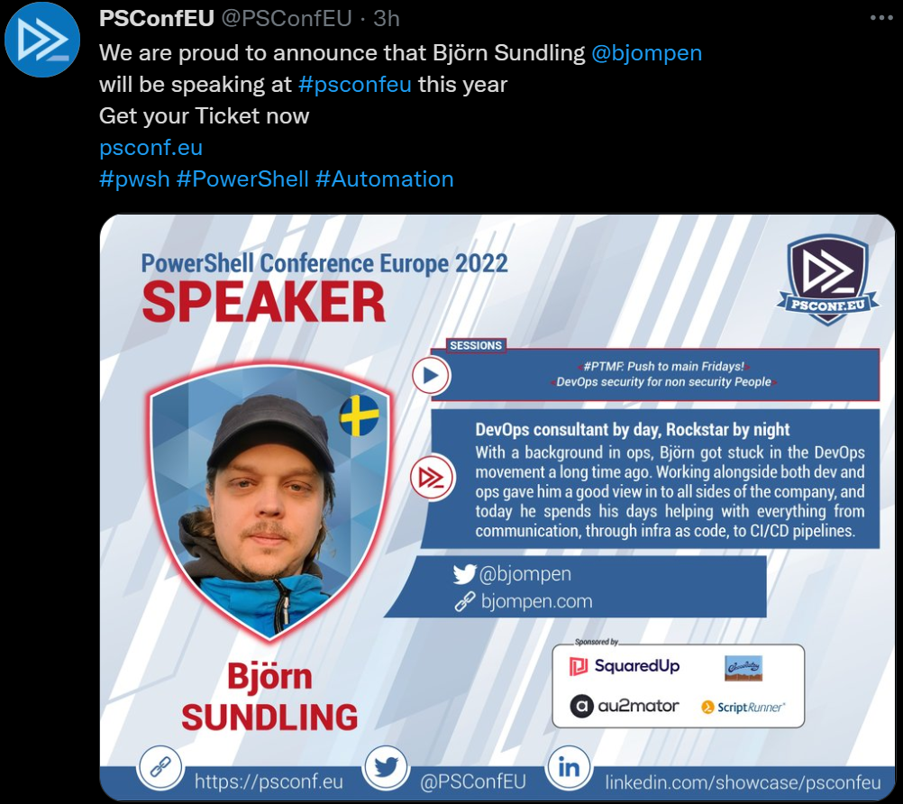

# PSConfEU - I'm presenting!

Last couple of years have been exhausting. We all know it. Corona has taken a toll on everything and everyone.

Me, I've spent two years sitting in my couch. While I truly appreciate the fact that I can work from home, I have reached a point where my but actually hurts from spending too much time in said couch.

My sciatic nerve is messing with me.

## But things are changing

One of the things I've missed the most about the last couple of years have been [PSConfEU](https://psconf.eu/), a conference I've visited since the first time it took place.
A small conference, about 3-400 people, where all my heroes talk about all the supercool stuff they've done, what they're working on, and where the community is going.

## I've done some sessions before

In the Swedish PowerShell user group, at local meetups, and such smaller things, but never got the courage to even send a session suggestion to anything bigger. Every year when PSConf opened their CFP I've started writing something only to get struck by imposter syndrome and never click submit.

Until last fall.

## So imagine my surprise a couple of weeks ago when a mail dropped in to my inbox

`Your session <name>. has been accepted - please confirm`

I don't think I've ever replied to a mail that fast..

And today, this is posted on twitter.

I honestly don't think I've ever been this proud before.

I'm doing two presentations:

- #PTMF: Push to main Fridays!
  - A rather basic type getting started with Azure DevOps. We'll build a basic YAML pipeline, include testing, Linter, and push to gallery, and make it stable enough to #PTMF without problems.
- DevOps security for non security People
  - A free follow up on the previous session. Now that we have a pipeline, what tools and options do we have available to make sure our security and integrity is up to speed, traceable, and good enough to release (from the perspective of someone who hates security 😉)

## So now awaits 5 months

5 months of writing.

5 months of learning.

5 months of nervousness.

5 months of imposter syndrome.

## but after that

I'm sharing stage with the people who inspire me!

I'm sharing stage with the people who helped me!

I'm sharing stage with the people who I aim to be like.

## And hopefully

I can inspire someone else to send a session suggestion next year.

You will be in Vienna with me.

This @#$%! pandemic let's us go through with it.
