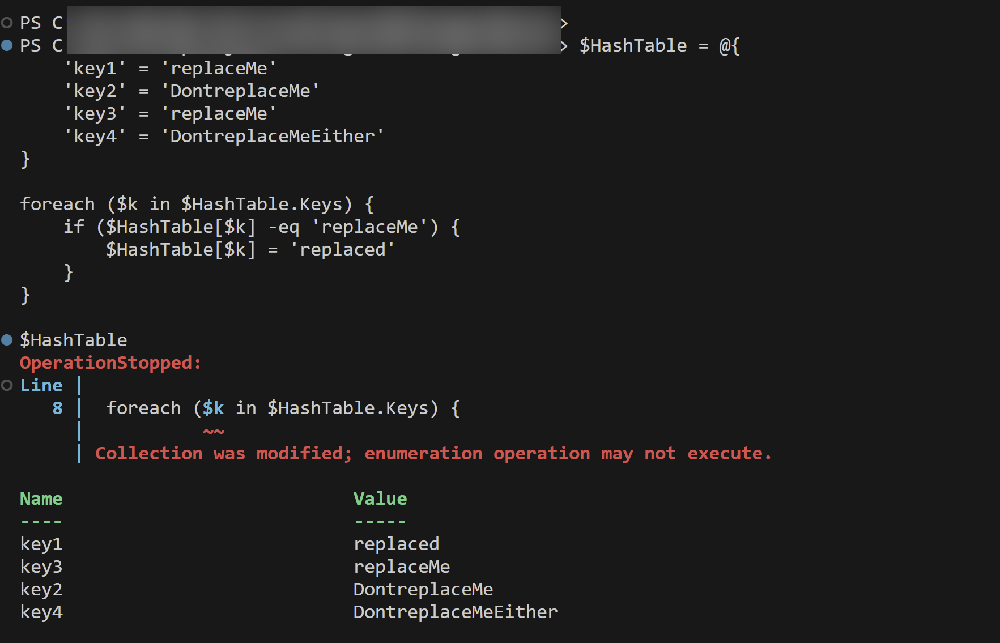
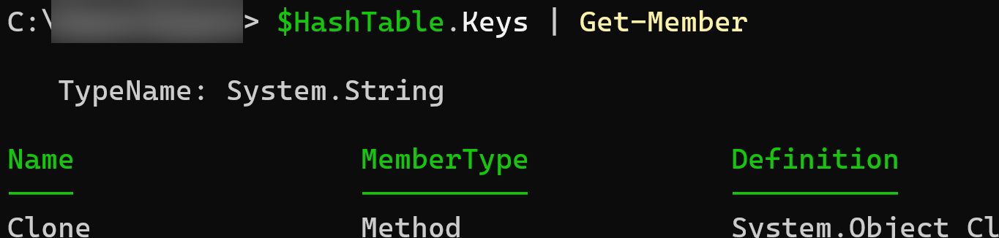
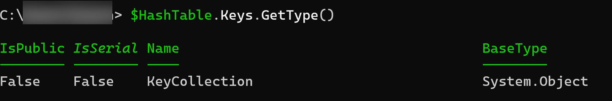
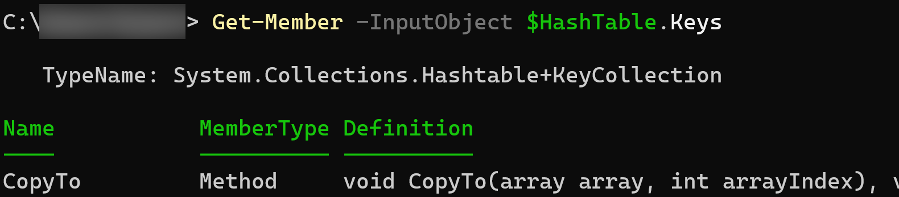
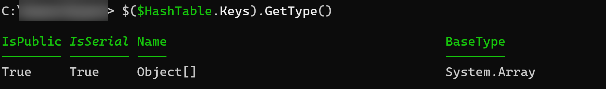
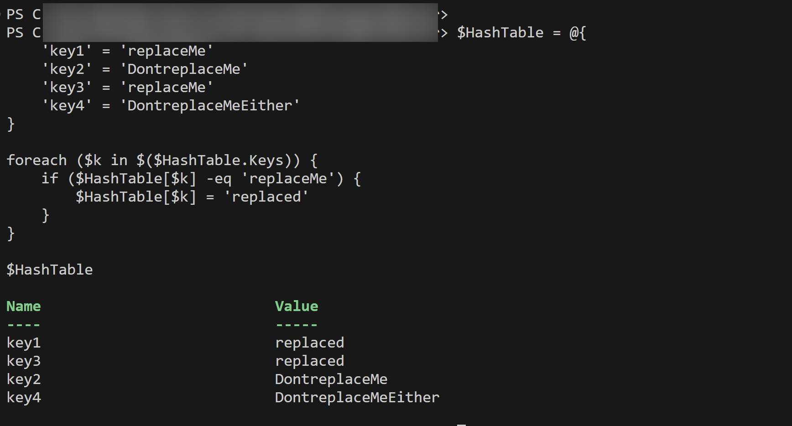

# On ICollections, and the ~~less helpful helpfulness~~ weirdness of PowerShell

_Or_

## I as in "I had some troubles getting here"

It's a weird thing, writing. Sometimes the words just flows from my fingers, then, like the wind changed, it's just.. empty.

I started writing two posts already this year, but the words just don't seem to come along. Well fact is, I have stuff to say, and discoveries to share, so lets just say this post will be what it is, and what it is is "short".

## I as in "I am visiting Belgium!!"

First of - I am Incredibly happy to once again be selected as a speaker of PSConfEU 2024! This is my absolute favourite conference of the entire year, filled to the brim with amazing sessions, some of my absolute favourite people in the world, and like someone once said: "If you have a PowerShell question that no one here can answer, then there is no answer to that question".

I'm giving two sessions, One on managing Azure DevOps, and one on RegEx, and my plan is to release the first version of my Azure DevOps toolkit by then as well (way to spoil the surprise, Bjompen! 😂).

I do hope to see you all there. If you haven't already bought tickets, go to [psconf.eu](https://psconf.eu/) and get yours!


And if you happen to prefer the continent of the other side of the puddle, I am, as posted before, speaking there as well at [the PowerShell + DevOps global summit](https://www.powershellsummit.org/), or, if you are one of the chosen ones, come see me at my first ever MVP summit this spring 😉

There, that said, let's talk PowerShell. Kind of like we do at the conferences!

## I as in "I should probably have some material to present.."

Working on the above mentioned toolkit I stumbled upon an interesting feature. Like many other PowerShell peeps I use hashtables for all kinds of stuff.One of the things I needed here was a folder based structure of configurations that overwrite each other. No biggie, I thought, and wrote the following code:

```PowerShell
$HashTable = @{
    'key1' = 'replaceMe'
    'key2' = 'DontreplaceMe'
    'key3' = 'replaceMe'
    'key4' = 'DontreplaceMeEither'
}

foreach ($k in $HashTable.Keys) {
    if ($HashTable[$k] -eq 'replaceMe') {
        $HashTable[$k] = 'replaced'
    }
}

$HashTable
```

(well.. No, I didn't, but I wrote similar code that does what I wanted..)

Just to be clear, the result I expected here was of course that my hashtable should now have key1 and key3 replaced with the text 'replaced', while key2 and key4 should be left as is.

So, hit run, and..


Well that's right...

### I as in "I cant change this Collection"

The solution to this is in fact not to hard to figure out, but in order to understand _why_ this happens lets look at the object we are working with

The "default" way of doing this is of course 

```PowerShell
$HashTable.Keys | Get-Member
```

The problem here is that because of PowerShells habit of [unwrapping objects](posts/pwsh.unwrappingobjects.md) we only get to see the contents of the keys, which is string.



Strings should not be an issue, so lets un-unwrap the object and check the actual container

```PowerShell
$HashTable.Keys.GetType()
```



Ok, it is a KeyCollection, that contains strings. Let's look at the container then, shall we?

```PowerShell
Get-Member -InputObject $HashTable.Keys
```

Now this is interesting.. 



----

So what we are _actually_ working with when doing `$HashTable.Keys` is a hashtable with a [_nested type_](https://learn.microsoft.com/dotnet/framework/reflection-and-codedom/specifying-fully-qualified-type-names?wt.mc_id=DT-MVP-5005317#specify-special-characters) of KeyCollection, and the keys are in fact strings.

(For a old but good explanation of nested classes, you can go read [this post by Phil Sullivan](http://blogs.embrs.net/Article/Index/Creating%20an%20Instance%20of%20a%20Nested%20Class%20in%20PowerShell) or for that matter [the official docs](https://learn.microsoft.com/dotnet/csharp/programming-guide/classes-and-structs/nested-types?wt.mc_id=DT-MVP-5005317))

This does not fully explain why the values can't be changed though.

## I as in "I need to read the docs"

There are limited amounts of docs on classes amongst the PowerShell documentation, but since PowerShell is .Net we can absolutely just [read their docs on the Hashtable.Keys property.](https://learn.microsoft.com/dotnet/api/system.collections.hashtable.keys?view=net-8.0&wt.mc_id=DT-MVP-5005317)

The first hint we have here is actually in the very first line: "Gets and ICollection..."

The "I" in an ICollection is short for Interface. For C# and similar languages this is a common thing, but in PowerShell we don't stumble upon interfaces to often.

## I as in "I don't know what an Interface is"

As always we start [over at the docs.](https://learn.microsoft.com/dotnet/csharp/language-reference/keywords/interface?wt.mc_id=DT-MVP-5005317)

But the short of it is that an interface is a contract between two or more classes, constructs, or other .Net things.

Lets say you create a car. The interface states "Cars have doors and engine". You then create "Volvo", that implements this contract alongside the Volvo specific members `StartEvenIfItsColdOutside=$true` and `SummonBondlurk()`. You can also implement "Tesla" that implements this contract along with its own members for `GlitchyDoorsThatLeakWater=$true` and `SelfIgnite()`.

Most importantly is that the implemented classes, Volvo and Tesla, _can't break the contract of needing doors and engine_.

Back at the docs we can also see that there are [many different types of interfaces](https://learn.microsoft.com/dotnet/csharp/language-reference/keywords/interface?wt.mc_id=DT-MVP-5005317#default-interface-members), one of which is.. Nested types!

## I as in "It's getting clearer now"

So we know now that `$HashTable.Keys` really returns a nested type (the `+` sign), that the nested types is an interface (the "I"), and that interfaces are static.

The last piece of the puzzle is how we pass data..

## I as in "Is this your data, or a copy of it?"

There are two ways an object can be passed between different scopes, functions, and, well, anything really: By reference, and by value.

we even have this described in the PowerShell `Get-Help about_ref` chapter. In fact, even the cause of our issue is in this help chapter, But I am getting ahead of myself.

Extremely simply put: ByValue means you can change the value of a passed object without changing the original object, and ByReference means that changing the passed object _also changes the original object_.

Not so simply put, I recommend [reading the docs again 😁.](https://learn.microsoft.com/powershell/module/microsoft.powershell.core/about/about_ref?view=powershell-7.4&wt.mc_id=DT-MVP-5005317)

So you probably guessed it by now: Does hashtables use ByValue or ByReference? [Even this is answered at learn](https://learn.microsoft.com/powershell/scripting/learn/deep-dives/everything-about-hashtable?view=powershell-7.4&wt.mc_id=DT-MVP-5005317#copying-hashtables), but yes, ByReference.

## I as in "If you got this far without hating me I am impressed"

So lets look back at our code and how it behaves

```PowerShell
foreach ($k in $HashTable.Keys) {
    if ($HashTable[$k] -eq 'replaceMe') {
        $HashTable[$k] = 'replaced'
    }
}
```

1. Our foreach loop will start by expanding `$HashTable.Keys` and get a referenced list of type `KeyCollection`, that is a static nested class of `hashtable`.
2. As hashtables _always_ passes objects ByReference this KeyCollection will actually point back to our original hashtable and not be a stand alone list of strings as the first Get-Member hinted of.
3. Our foreach loop then takes the first `KeyCollection` object returned, runs the loop and changes the value of `key1`, which not only changes the value of `$hashtable`, but _also_ the expanded list in point 1
4. When we reach key3 we can now see that _since the foreach loop started there has been a change in the referenced object `$hashtable` and our in-memory list of `KeyCollection` type is not valid and can't be written to any more!

## I as in "Is it possible to remove a reference?"

The answer of course is "yes". It's not even that hard.

In our particular case we are iterating through the keys, and like we saw earlier, the `KeyCollection` contents are but strings, so with some _very basic_ variable expansion we can convert our list of keys to a string array by doing `$($HashTable.Keys)`.

```PowerShell
$($HashTable.Keys).GetType()
```



This will now expand our reference list and put it in an in memory variable, loop through _this_ list instead, and not the reference, and therefore it doesn't matter if the original is changed.

```PowerShell
$HashTable = @{
    'key1' = 'replaceMe'
    'key2' = 'DontreplaceMe'
    'key3' = 'replaceMe'
    'key4' = 'DontreplaceMeEither'
}

foreach ($k in $($HashTable.Keys)) {
    if ($HashTable[$k] -eq 'replaceMe') {
        $HashTable[$k] = 'replaced'
    }
}

$HashTable
```



And so the project moves on...

## I as in "I got here at last..."

Like I said, this took me some time. Maybe the mood and text flow will be back and I can get that other post out as well. (Hint: There is no such thing as an AI...)

If not, do catch me while I'm out there somewhere for some chitchat. I still love talking, meeting people, and sharing my knowledge, although sometimes you have to drag it out of me.

And also, even though the price for a PSConfEU ticket is high, career wise it is one of the best investments your boss will make. The energy you bring home is worth it 100 times over.

And as for yourself, there's coffee, beers, and me as well.

Until next time, Internet. Sleep well.
