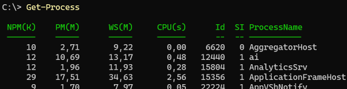

# On Get-Member, and the less helpful helpfulness of PowerShell

If my employer ever tries to get me to go back full time to the office I have some requirements:

- Allow me to bring my dog to the office
- One bed available after lunch
- 1 hour post-lunch power nap.

Let's just say fist week of work after vacation has given me a hard time to keep my eyes open, and I'm really happy to have to possibility to have a mid day siesta.

## I recently came across and replied to a thread on Mastodon

By [Joshua McKinnon](https://infosec.exchange/@onelin) on an interesting behaviour of PowerShell. You can go read the entire thread [here](https://infosec.exchange/@onelin/109685569185550280), but here's the post and reply:


Get-Member being one of [the](https://learn.microsoft.com/powershell/module/microsoft.powershell.core/get-help?view=powershell-7.3&wt.mc_id=DT-MVP-5005317) [big](https://learn.microsoft.com/en-us/powershell/module/microsoft.powershell.core/get-command?view=powershell-7.3) [three](https://learn.microsoft.com/en-us/powershell/module/microsoft.powershell.utility/get-member?view=powershell-7.3) CmdLets you should know I decided this needs to be written about again.

## PowerShell, the quirks, and why I love it

The above thread actually manages to bump in to no less than three different PowerShell phenomena:

- The output system doesn't show the entire truth
- PowerShell is super helpful in guessing what you want
- Get-Member's most used behaviour is actually not always showing reality

The first issue here is something not always clear, especially for beginners or people to used to working in an object oriented shell, and the last two are extremely useful once you learn to and remember them, but even after some 15 years in the PowerShell prompt I get bitten by them every now and then still.

So let's look at them one by one, and go back to the basics a bit.

## PowerShell, Objects, and output

When you start working in PowerShell the first important thing to remember is this:

> Unlike for example bash, where everything is text, PowerShell works with objects

What does this mean for a mere mortal?

We can think of it like this:

The output of a command, `Get-Wardrobe`, returns your wardrobe. The returned object however, our wardrobe, contains so much more information.

On the first level we have shelves, them also being Objects. My wardrobe has six of them. (Five plus one hanger)

After this each shelf contains yet other Objects, such as socks, pants, shirts, and underwear.

We can also find even more information here, like for example

- Interests in the form of band shirts and sock prints (Properties)
- and we can probably figure out your [Favourite colour](https://i.redd.it/mugkt9g6bntz.jpg)

Some of these can even contain  more levels of information such as socks -> foot size...

In the end, This simple "Wardrobe" contains a while lot of stuff.

The issue PowerShell has though is how to fit all of this data on screen? And do we really _need_ all data on screen?

Lets take a real world example

### Get-Process

This command is very much like the `ps` command of bash - It outputs running processes.

If we run this command as is, it will output a table containing "NPM(K)", "PM(M)", "WS(M)", "CPU(s)", "Id", "SI", and "ProcessName".



For now, it doesn't matter what those properties are, but what matters is that just like our wardrobe, there are many more levels of information of a process such as

- Start information
- Command it started with
- Can I kill this process?

and _much_ more.

So why can't we see it? And why do we see what we do? And how do we see _everything_?

The first answer is rather easy: Because screen size is limited and the objects still exists in their fullest we don't need to see everything.

The second question though is more intricate. To explain it _very_ shortly PowerShell will start by looking at what _type_ of object we are working with. If it is a known type, PowerShell will check for a [format.ps1xml](https://learn.microsoft.com/powershell/module/microsoft.powershell.core/about/about_format.ps1xml?view=powershell-7.3&wt.mc_id=DT-MVP-5005317) file that tell it what to ouput. If no such file is found it will try to work some magic to figure out what data to display (yes, you may read this as "Bjompen doesn't really know, its some kind of magic".)

The third one is both the easiest, and the hardest... Simply because there are about a million different ways to do it.

One way, the one Joshua used, is to pipe your result to a `Format-*` command, selecting all properties in the output like this

```PowerShell
Get-Process | Select-Object -First 1 | Format-List -Property *
# Select-Object is only used here to limit output.
# fl * that Joshua mentioned is an alias for "Format-List -Property *"
```

What we need to remember here though is this:

> Since we are working with objects, all of our data is still there, it's just not printed to screen.

Which leads us to the second issue

## The less helpful helpfulness of PowerShell - It knows what you want before you do

Lets run the above command again, and this time capture it in a variable.

```PowerShell
$MyVar = Get-Process
```

This will work just as expected, and all our processes will now be contained in our variable.

One of the things some programmers find weird about PowerShell is that we don't have to tell it what type of variable we are working with. PowerShell will simply find out that "oh, the result of this command is a list of processes, ergo, I should probably be a list."

This is super useful, and one of the true strengths of PowerShell.

Except when it isn't.

Let's try another command.

```PowerShell
Get-Process | ForEach-Object { $MyVar += $_ }
# Don't run this. Its a really ugly piece of code, but it works to prove my point.
```

Logically, one might think this would do the same as before: Grab all processes and put them in a list called MyVar, But PowerShell is friendly and helpful and will cause your output to look like this


So why is this?

When the _first_ object is returned from Get-Process, it will put this object in your variable `$MyVar`. Since we do not tell PowerShell what _kind_ of object to expect, it will look at the object and go "Oh, this is a process, ergo I, the variable MyVar, should be a process!"

Super smart. Except now, when the _second_ process tries to add itself to the list, the `$MyVar` variable will instead go "I'm a process, and you can't add a process to a process" and the red list of death will ensue.

### So how do we fix this

Like I said - PowerShell is helpful, but sometimes it is wrong. In this cases we need to _tell_ PowerShell that "No, you _will_ be a list. because while you are smart, I am smarterer."

There are two common ways to do this:

In the pipeline directly

```PowerShell
Get-Process | ForEach-Object { [array]$MyVar += $_ }
```

Or by pre creating the variable

```PowerShell
$MyVar = @()
Get-Process | ForEach-Object { $MyVar += $_ }
```

So to sum it up:

> If you want to be 100% sure what type of object you are working with, don't let PowerShell decide for you. Cast your variables as the type you expect them to be!

### Bonus: This also helps you from getting the wrong data in variables

A typed variable will always only be able to contain your expected type

```PowerShell
$MyInt = 'Hello' # This will, quite expected work fine
[int]$MyInt = 'Hello' # This however will throw an error.
```


## On Get-Member, Types, and the different ways of running it

Ok, we know that we are working with objects that contains _all_ data in our output, even though it only displays some parts of it, And we know that we can capture them in lists and variables either magically or typed. Lets look at the `Get-Member` command and its behaviour.

Let's capture our processes again and look at the members of the result

```PowerShell
$MyVar = Get-Process
$MyVar | Get-Member
```

The output should look something like this


We can clearly see that this is a process from the type name, "System.Diagnostics.Process", and we can see what we can do to a process, for example we could run the method `$MyVar.kill()`.

But `Get-Member` is in fact lying to us.

If we again think of our wardrobe, instead of saying "The object returned from `Get-Wardrobe` is a wardrobe, and this is what a wardrobe can do" PowerShell lets us know that "This wardrobe contains socks that can tell you feet sizes, and t-shirts that can tell you favourite bands"

Remember - PowerShell is helpful to us. When piping a _list_ of objects to get member, it will not show you information about the list itself, but because of how the pipeline works and PowerShell being helpful it will show us _What we can do with each object inside the list_.

If we want to know what we can do to our _wardrobe_ we instead need to run the command

```PowerShell
Get-Member -InputObject $MyVar
```


Suddenly it is a "System.Object[]", which is PowerShell for "an array", and shows us what members and properties an array has.

## To wrap it up

The minutes of confusion from the Mastodon toot is understandable - Sometimes PowerShell is in fact a bit too helpful for our own best. Like I already mentioned, Even though I've ben doing PowerShell for _many_ years I still stumble on this every now and then.

But it does make sense in a way, even though it's not always clear from the start. Just remember:

```PowerShell
$MyVar.GetType() # Always shows the type of the variable, not the contents
$MyVar | Get-Member # Shows you members and member types of the objects _inside_ a list
Get-Member -InputObject $MyVar # Shows members of the variable, not the contents

# And last but not least, alter the output and display _all_ properties:
$MyVar | Format-List -Property *
# Or if you're lazy
$MyVar | fl *
```

And keep exploring your objects.
