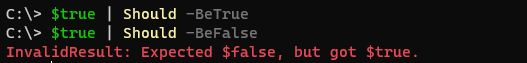
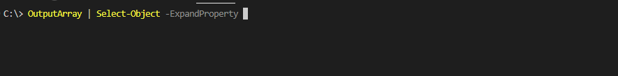
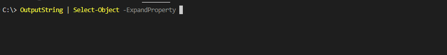
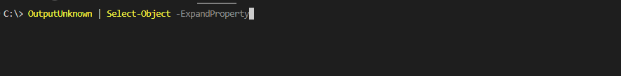

# On arrays, unwrapping objects, and the less helpful helpfulness of PowerShell

In a mere two days I'm leaving for [PowerShell + DevOps global summit](https://powershellsummit.org/) in Bellevue to give a presentation on Azure DevOps security.
I have 45 minutes to speak and my latest run through was just over one hour long.

I should probably cut it down a bit.

So instead, like a proper good speaker, I am procrastinating and writing a blog post! 

Some time ago I wrote a post called [On Get-Member, and the less helpful helpfulness of PowerShell](posts/pwsh.getmember.md) where we looked at the sometimes unexpected behaviour of PowerShell objects. Well, Today I stumbled upon one more, so let's make this a series!


## The function

So, short story even shorter, I was writing a new function for [the ADOPS module](https://github.com/AZDOPS/AZDOPS) and was writing a test.

The function in question, somewhat simplified, calls an API, and loops through the result, creating an array containing of one hash table per result.
Mocked and simplified and replacing the API with a dummy for the demo, it looks like this:

```PowerShell
function DontUnwrap {
    param (
        [int]$OneOrMore
    )

    # This is what we really do
    # $MyList = (Invoke-RestMethod -Method GET "url").Objects
    # And it will return one or more strings (organizations you belong to in Azure DevOps)
    
    # This is how we fake it
    if ($OneOrMore -eq 1) {
        $MyList = $('one')
    }
    else {
        $MyList = $('one', 'two')
    }

    $res = @()

    # The data is different, but the object stays the same
    foreach ($ListObject in $MyList) {
        $listData = [ordered]@{
            MyValue = $ListObject
            'one' = 'one'
            'two' = 'two'
            'three' = 'three'
        }
        $res += $listData
    }

    $res
}
```

So of to write tests shall we!

## Pester me this

I recently learned you can actually run pester as normal console commands now. Awesome! This simplifies stuff _a lot_.
The behaviour of console-pester is a bit different than "normal" pester though. A successful test gives no output, and a failed fails like it usually does.
It looks a bit like this:



Now this greatly simplifies the my issue here.Just create the function in your console and run. 

```PowerShell
PS > (DontUnwrap).Count | should -be 2
PS > (DontUnwrap -OneOrMore 1).Count | should -be 1
InvalidResult: Expected 1, but got 4.
```

Well that's not good.


## So what is happening here

PowerShell is kind. It helps you. A lot. Sometimes too much. and it likes to unwrap objects. We may see the same result in a different way using `Get-Member`

```PowerShell
PS > (Get-Member -InputObject (DontUnwrap)).TypeName | Select-Object -Unique
System.Object[]
PS > (Get-Member -InputObject (DontUnwrap -OneOrMore 1)).TypeName | Select-Object -Unique
System.Collections.Specialized.OrderedDictionary
```

If the output object is a list containing only one result, PowerShell will unwrap it and just return that one result! Since we only get one result, we only create one hash table, and since that hash table contains four keys, count -eq 4. Makes sense, but it will create problems for us.

## The problem with unwrapping

Lets put our function in a workflow. The function calling our function will need to index it.

```PowerShell
PS > $one = DontUnwrap -OneOrMore 1
PS > $many = DontUnwrap 
PS > $one[0]
one
PS > $many[0]
Name                           Value
----                           -----
MyValue                        one
one                            one
two                            two
three                          three
```

In order to work with this we will need our function to _always_ output an array and prevent PowerShell from unwrapping it.

## Typed objects

In the previous post one of the ways to solve out issue was to hard type the object types, so this seems a logical step start with.

```PowerShell
function DontUnwrap {
    param (
        [int]$OneOrMore
    )

    if ($OneOrMore -eq 1) {
        $MyList = $('one')
    }
    else {
        $MyList = $('one', 'two')
    }

    [array]$res = @()

    foreach ($ListObject in $MyList) {
        $listData = [ordered]@{
            MyValue = $ListObject
            'one' = 'one'
            'two' = 'two'
            'three' = 'three'
        }
        [array]$res += $listData
    }

    [array]$res  
}
```

And trying it out

```PowerShell
PS > (DontUnwrap).Count
2
PS > (DontUnwrap -OneOrMore 1).Count
4
```

Nope. Still bad. But why? Well, unwrapping is not a feature of the function itself but a feature of PowerShell. It doesn't really matter what we do inside function as the unwrapping is done _after_ the function has outputted the result.

We could demonstrate this by thinking of our command like a pipeline instead. If we don't change the default behaviour it will look a bit like this

> Run actual typed pipeline | unwrap my objects | output it to console or variables

Looking at it from this view may also make it somewhat clearer why these commands work

```PowerShell
foreach ($thing in $one) {"doing stuff with object $($Thing.MyValue)"}
doing stuff with object one
foreach ($thing in $many) {"doing stuff with object $($Thing.MyValue)"}
doing stuff with object one
doing stuff with object two
```

The unwrapping in this case would be done _after_ our command has written the result to console (after "run actual typed pipeline") and so no unwrapping has taken place yet.

Onwards my steed, to the next solution.

## Kicking it old school

This phenomena is not new in PowerShell. It's even one of the fundamental design decisions that allows us to work with PowerShell the way we expect to but as noted, sometimes weird.

So we had a solution to it [a long time ago](https://stackoverflow.com/questions/2756183/how-to-stop-powershell-from-unpacking-an-enumerable-object).

We can prevent all unrolling by adding a comma before our returned output.

```PowerShell
function DontUnwrap {
    param (
        [int]$OneOrMore
    )

    if ($OneOrMore -eq 1) {
        $MyList = $('one')
    }
    else {
        $MyList = $('one', 'two')
    }

    $res = @()

    foreach ($ListObject in $MyList) {
        $listData = [ordered]@{
            MyValue = $ListObject
            'one' = 'one'
            'two' = 'two'
            'three' = 'three'
        }
        $res += $listData
    }

    , $res 
}
```

And verifying it

```PowerShell
PS > (DontUnwrap).Count
2
PS > (DontUnwrap -OneOrMore 1).Count
1
```

so what does comma do? In this case it works as a [unary operator](https://learn.microsoft.com/en-us/powershell/module/microsoft.powershell.core/about/about_operators?view=powershell-7.3#comma-operator-) creating an array with one member. 

One member you say? What if we get no results at all? Let's verify the behaviour shall we?

```PowerShell
function DontUnwrap {
    param (
        [int]$OneOrMore
    )

    if ($OneOrMore -eq 0) {
        $MyList = $()
    }
    elseif ($OneOrMore -eq 1) {
        $MyList = $('one')
    }
    else {
        $MyList = $('one', 'two')
    }

    $res = @()

    foreach ($ListObject in $MyList) {
        $listData = [ordered]@{
            MyValue = $ListObject
            'one' = 'one'
            'two' = 'two'
            'three' = 'three'
        }
        $res += $listData
    }

    , $res 
}
```

```PowerShell
PS > (DontUnwrap -OneOrMore 0).Count
0
PS > (DontUnwrap -OneOrMore 0).GetType()
IsPublic IsSerial Name                                     BaseType
-------- -------- ----                                     --------
True     True     Object[]                                 System.Array
```

Looks good to me! Or.. the output looks good to me.

## Modern talking

Well... It does work, but another of the key aspects of PowerShell is readability, and I for one do not find this easy to understand. 

I try to write code that requires little to no google of what a command does given you know PowerShell and finding a random comma would require me to google what it does.

So back in PowerShell version 4 "we" actually added a parameter to solve this using `Write-Output`: [`-NoEnumerate`](https://learn.microsoft.com/en-us/powershell/module/microsoft.powershell.utility/write-output?view=powershell-7.2&WT.mc_id=ps-gethelp#-noenumerate)

Using this parameter and Write-Output instead of implicitly returning our result we can achieve the same result but a bit more readable.

```PowerShell
function DontUnwrap {
    [OutputType([array])]
    param (
        [int]$OneOrMore
    )
    
    if ($OneOrMore -eq 0) {
        $MyList = $()
    }
    elseif ($OneOrMore -eq 1) {
        $MyList = $('one')
    }
    else {
        $MyList = $('one', 'two')
    }

    $res = @()

    foreach ($ListObject in $MyList) {
        $listData = [ordered]@{
            MyValue = $ListObject
            'one' = 'one'
            'two' = 'two'
            'three' = 'three'
        }
        $res += $listData
    }

    Write-Output $res -NoEnumerate
}
```

```PowerShell
PS > (DontUnwrap).Count
2
PS > (DontUnwrap -OneOrMore 1).Count
1
PS > (DontUnwrap -OneOrMore 0).Count
0
```

Readable, working, and logical. Just the way we like it!

Sure, we just broke compatibility with PowerShell version 3 and earlier, but seriously, if you're still running those it's far beyond update time.

## Bonus: OutputType

One thing I haven't mentioned yet is the concept of OutputType. Mainly because it will not actually matter to our issue at hand since like mentioned the unwrapping occurs _after_ output.
But there is a way to let your console know what type of object you are returning from your function.

[The `[OutputType()]` class.](https://learn.microsoft.com/en-us/powershell/module/microsoft.powershell.core/about/about_functions_outputtypeattribute?view=powershell-7.3)

Wo what does it do if it doesn't help us with unwrapping? 

Lets look at some brand new code

```PowerShell
function OutputString {
    [OutputType([string])]
    param (
    )

    Write-Output 'hello' -NoEnumerate
}


function OutputArray {
    [OutputType([Array])]
    param (
    )

    Write-Output 'hello' -NoEnumerate
}

function OutputUnknown {
    param (
    )

    Write-Output 'hello' -NoEnumerate
}
```

Notice all three functions are exactly the same apart from the OutputType, but since PowerShell will now know what to expect in a pipeline we get some magic functionality in our console, for example `Select-Object` will know what properties from the command can be expanded and we can use tab completion!

Array:



String:



While unknown.. well.. does nothing.



So I do suggest using this as well where it makes sense. It just doesn't matter for us today 😉

## Wrap up

So, In the end, my function will look like this to solve the unwrapping issue, have it readable, and help console output.

```PowerShell
function DontUnwrap {
    [OutputType([array])]
    param (
        [int]$OneOrMore
    )
    
    if ($OneOrMore -eq 0) {
        $MyList = $()
    }
    elseif ($OneOrMore -eq 1) {
        $MyList = $('one')
    }
    else {
        $MyList = $('one', 'two')
    }

    $res = @()

    foreach ($ListObject in $MyList) {
        $listData = [ordered]@{
            MyValue = $ListObject
            'one' = 'one'
            'two' = 'two'
            'three' = 'three'
        }
        $res += $listData
    }

    Write-Output $res -NoEnumerate
}
```

And I really should go practise my session some more.

After lunch.
