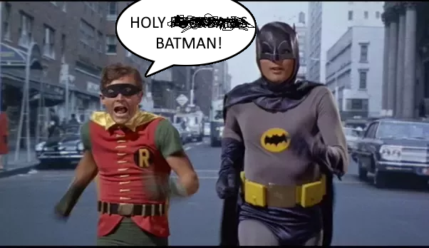
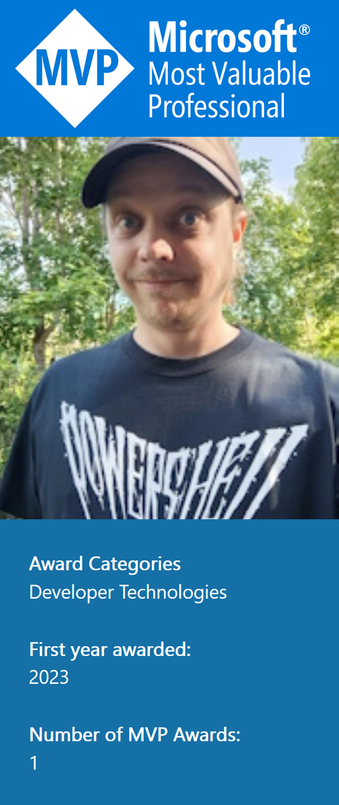

# Oh.. My.. God...

There are times in your life that just makes you loose everything.

I don't mean that in the bad way, even though we do have those as well, but I'm talking about those times when you truly have to stop and pinch yourself.

When things happen and still, a month later, you can't really grasp it.

June 2023 has been one of those times.

## The first of June I got a mail

no.. wait.. let's start even earlier..

## 10+ years ago

I joined the [PowerShell user group](https://www.facebook.com/groups/psugs) in Sweden. Back then I also started to find my own community heroes. Those people who knew stuff. And I learnt about this thing they called them selves.

MVPs.

I can't say I understood anything about what it meant, but those "MVPs" seemed to show up in my communities, and on all conferences I went to.

And I very much remember a discussion I had with a colleague where I said something like "I want to be a creator, not just a user. I want to be someone who comes up with the cool stuff that people use. Like MVPs. I want to be like those"

## The road to MVP is paved with good intentions

Fast forward a bit. I can't say I ever really believed I was going to be an MVP, but I had a goal. I created my first blogs, started to talk more and more at our user groups, and tried to get even more involved in our community.

But all of those things are hard!

My first blog went inactive. So did my second one.

My wish to create a Swedish PSDay sort of... just didn't happen. (I still own the URL though 😂)

And speaking at larger conferences is scary!

So I gave up.

## Gave up? like... properly gave up?

Nope. I gave up caring.

I stopped caring if anyone actually read my blog. If I spend less time looking at statistics, I can spend more time writing.

And I stopped caring that the smartest people I know already stood on my stages. Sure, I'll never be _that_ good, but I can still write a CFP right? The worst that will happen is I get a no.

And suddenly..

Things started to happen.

Not because I tried to make things happen, but because I started doing stuff because I found them interesting.

Not because "MVPs do this" but because "I like to do this"

## Changing jobs

Three years ago I changed jobs also.

In some cases my previous employer did support me doing fun stuff, But the drop was when I wanted to go to PSConfEU 2018 and they started to make a fuzz about it. "Can't you go to something in Sweden instead? If you get to go then everyone wants to go.. we cant afford this"

If you don't support my education, I'm not going to support you making money.

So I left and joined my current employer.

And few things have made my life so inspiring. Having an employer that actually 100% supports my education, and my learning is just amazing. They give me time to do research, to write blogs, and to go to conferences. They help me out monetary when I have to chip in for travels and hotels.
No, I can't spend 100% of my time playing around, but the fact that I have the support of my managers is invaluable.

## 2023 - the year we made contact

And so, in February this year, I got a mail. "You have been nominated"...

Yes, I was told they would recommend me, but suddenly, it's real!

One of the things everyone I talked to mentioned though, was "the interview"

It seems most people are contacted by their local MVP Person for an interview if you're actually up for it.

And I heard nothing.

Silence.

[void]

And I was convinced. No interview, no title.

## Back to the first of June

When I suddenly got a mail. Turns out, not everyone  gets "the interview".

I don't think I've ever been this proud of anything I've ever done.

Heck, I didn't even finish school and honestly, I was probably voted most likely to barely get a job.

Yet here I am.

Alongside my heroes.

[An MVP in the Developer Technologies category!](https://mvp.microsoft.com/en-us/PublicProfile/5005317)

## So this was June first

Why haven't I written about it before?

Well.. I still haven't really realized it's true. But most of all, I've been _crazy_ stressed. Why? Well.. It's "the month".

## One week (+ a few days) ago

I left for Prague and PSConfEU.

The conference I first visited 2015, before it was called PSConfEU, in Stockholm.

I wasn't supposed to visit that one as I already had spent my yearly education budget, but since it was in Stockholm I managed to convince my boss to chip in anyway.

And there, in a basement of a hotel in Stockholm, was the second time I truly got to see those heroes. The smart ones. The ones that build solutions that was soooo coool and that I only used. The ones I wanted to be.

That was 2015.

In 2023 I did my second year as a speaker, giving presentations on GitHub actions and CD pipelines. Sharing stage with my heroes.

And even get to hear people say _I inspire them_.. I don't think I've ever been this proud.

How'd it go? Well I bombed the GitHub session pretty bad according to myself. But you know what? I don't care. I don't care if anyone else thinks "oh, he made a fool of himself" or "heh, he doesn't know what he's talking about".

Because I am there. Along side my heroes. Doing sessions. Writing posts. Inventing stuff I find cool.

## And it took me here. To the month.

That month were I could go on stage, alongside the smartest people of my community.

And for the first time ever open a session by saying the words

> ## "Hello, my name is Björn, And I am a Microsoft MVP" 

