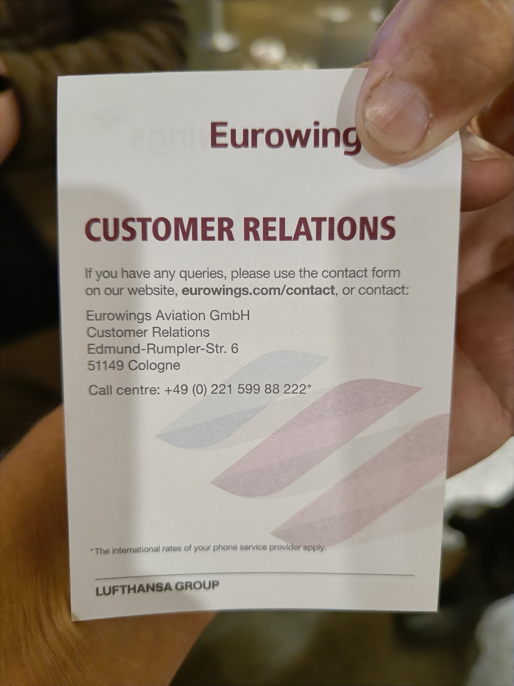
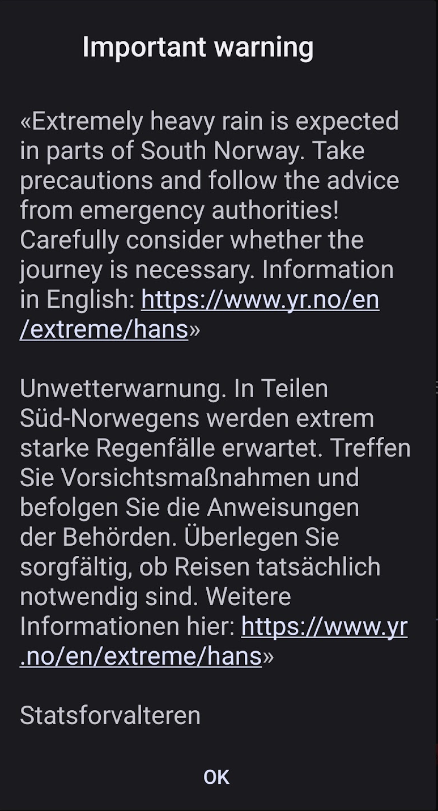
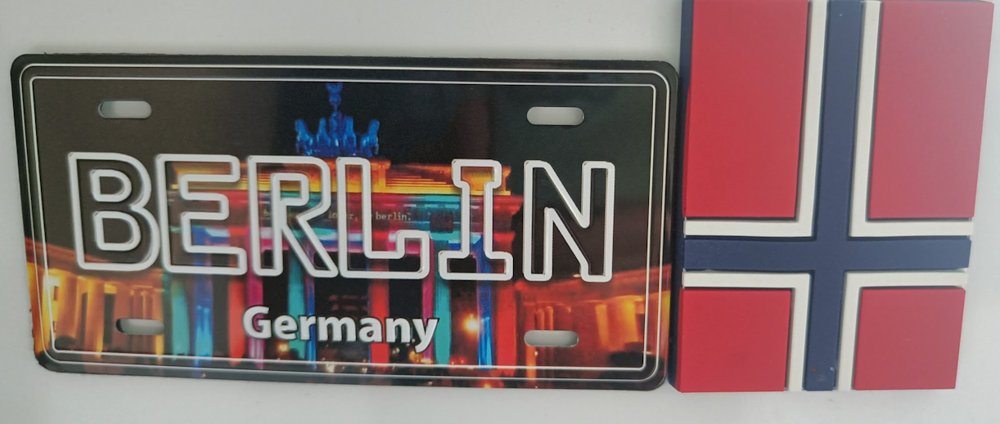

# And now for something completely different - Wacken 2023, the adventure.

I was supposed to go back to studying, but I kind of need to get this story of my chest first.
Studies will have to wait until the afternoon.

## A couple of moths ago

My friend Alex called me and said he had a ticket to Wacken over. One of the people joining him had to cancel. All I had to do was to get to Berlin and bring some clothes. We'll buy food and drinks, and go by car.

Wacken being one of those that you as a metal head should check at least once, I was happy to join. Not necessarily the best line-up, but absolutely ok.

So I bought me some tickets from eurowings and left for a last adventure before going back to work. Little did I know what an adventure it would be.

## STO - BER

One of the downsides of cheap airlines is that you often get uncomfortable times. I guess it's easier to go cheap at 6.30 than around lunch.

So after a massive night of sleep I got up at 3.30 and went to Arlanda to catch a 6.30 flight. Checked in bags required to bring my sleeping bag and rain clothes just in case the weather was bad.

Got to berlin and met up with Vali who lives there and this is where the problems started. He immediately told me "They are asking people to not come right now. Updates will come at 10".

Turns out the rain clothes would be needed. The parking spaces at wacken was so wet people couldn't drive, and the queues was already so long they reached nearby cities in all directions. "Please let us get the queues shorter before adding new cars." Sure thing.

and 10 came. And went. No news.

Around 12-13 there was an update. "We're closing the car parking. Come here, but leave the cars."

So how does one go to Wacken without car? You go to Itzehoe and get the bus from there. That's pretty much the only way.

The problem: There are about a million billion cars out there right now. All needing a parking space in Itzehoe.

Next plan: Book a hotel in Hamburg and drive to and from every day.

So that we did, and we decided to instead of going to wacken to stand in a queue or going to Hamburg and hope, we'll go Wednesday morning. Sure, we will miss a couple of bands, but that's ok, we still had some shopping to do buying a mattress and some rain clothes.

## It's Wednesday, my dudes

8.30. Alarm rings. I am greeted by Vali and Alex, already up.

"🤘 Are you ready to go to WACKEEEEEEN!!! 🤘"

"HELL YEAH!"

"We're not going"

They closed the entry. Literally. The news said "We are currently talking to everyone in the car queue telling them to go home. We can not let people in."

And they did send people home.

Now since this was last minute prices for flights to Sweden had gone up and since Vali lives there and I wasn't homeless it would be cheaper to just stay in Berlin for a couple of days, so that became the plan.

## Berlin, part 1.

Vacation in Berlin then. What do we do?

Well Wacken is live streamed! Let's watch that for news and music.

And let me tell you, it was _muddy_.

I do understand that they had to stop cars from driving there, as every single car had to be towed by tractor to get in place. This meant that instead of 1 minute to park your car it took over 10 minutes to do it, one at a time, and each time the tractor made the mud even muddier [(there are images on google, but copyright..)](https://www.google.com/search?q=wacken+2023+parking).

But we also followed sites like Reddit.

And it turns out that if you just ignored the recommendations and went anyway chances are fairly big you'd still get in! The reward for following advice was a literal "f**k you" from the organizers.

I do understand the reasoning, but inconsistency makes everyone angry. Seriously, this combined with incredibly slow updates and information was the primary reason I am not going to try this again.

We even looked at going to [Rockstadt](https://www.rockstadtextremefest.com/) festival in Romania instead, and had information been out when they actually said it would be that would have worked. Now it was too late.

## Berlin, Part 2.

So we decided to go to the local pub life.

In this case I can't blame anyone, but our adventures were.. Let's just say not followed by good luck.

The first place we visited burnt down an odd year ago.

The second place just wasn't there any more.

But we found a descent place called [Rock und Wikinger bar](https://www.facebook.com/Wickibar/) that still existed.

And we took the chance to go see [Oppenheimer](https://www.imdb.com/title/tt15398776/) at the movies.

And we went to the [planetarium](https://www.planetarium.berlin/#/) which I can't recommend high enough. 

All in all we did have a good time in Berlin.

And then I went home...

## There's something wrong with the weather...

Berlin airport is notoriously bad. They recommendation from the airport itself is to have at least 2.5 hours there. The recommendations from the people I met in berlin was 3-4.

So when Sunday came and I was going home I left in good time. Left at 18, plane takes of at 21.30.

I already knew it was raining in Sweden, so I jokingly said to my friends "We'll see if the plane can land", made my goodbyes and left with the s-bahn.

Halfway between the station I entered on and the next the train stops. Caller says something in German that I can't understand. My German is only good enough for food and beer. I text Alex: "Heh, I don't believe in omens, but if I did, this would be a bad one!"

Time to start believing in omens I think.

I got to the airport, still in good time. Gate opens at 21. Go to the bag tag machine. "Your name cant be checked in. Go to check in station 523-525." Ok. Only.. There is no check in 523-525. It only goes to somewhere around 400. Thank you.

Try again, this time not using my passport / first name. Works. Apparently names can't contain ö or something. 

But even though the info, in German, was wrong it was a good experience. I got through check-in and security in less than 20 minutes instead of 2 hours, and I now had 3 hours to spend on an airport. Blergh.

## 3? nonono...

As we closed in on 21 there was a delay. And one more. Eventually the plane was supposed to leave a 22 something. But at 21.30 the plane hadn't even arrived! We are _not_ leaving at 22. And we didn't.

I ended up spending well over 3 hours there. Podcasts truly are amazing.

I honestly don't know when we left, but if was late. The flight should take about 1:45, so I'd be in Arlanda at around 1 in the morning. At least that's what I thought.

I was half dozed of, listening to podcasts, when I heard the familiar sound of an airplane message.

"Ladies and gentlemen, there is a storm in Arlanda that prevents us from landing, and we are running out of gas. We will therefore fly to Oslo instead. More information soon"

Oslo.

That's not home.

## Oslo, day 1.

So to Oslo we went. The airplane landed at late hours. I honestly lost track of time. So tired, I only wanted a bed.

"Ladies and gentlemen, we are just going to find a company to refill our fuel and we will get back to Stockholm as soon as possible."

I booked eurowings, and yes, you get what you pay for. Seats in airplanes are normally uncomfortable. Seats in a eurowings airplane is crazy uncomfortable. Sure, 1.5 - 2 hours are ok, but nothing I would recommend. My back and my butt hurts.

After about 30 more minutes it's message time.

"I'm so sorry, no company could come here to refill our fuel tanks. We will drop you of now so you can leave. Please go get your luggage then go to the information desk for more info."

Insert curse words here.

The queue inside to the information desk is long. The staff at the information desk is.. not there.

By now I think the time was somewhere around 2.30. I was tired and angry, but I honestly felt more sorry for the small kids who couldn't sleep and cried, and the parents of those kids.

One person in the queue started screaming "WHATS HAPPENING!". I don't think I've ever been so close to punching someone. Screaming isn't helping and we're all tired. Shut up.

After what felt like ages a information person shows up. Or, well, a person. The only information this person had was a single piece of paper with a link to a webpage.

"I don't know anything. You have to book your own hotel and we will get back to you tomorrow" he kept repeating. He had exactly one copy of said note, so we had to take a photo of it. They literally didn't even give him copies of the note.

"Do you have any list of hotels around here or something?"

"No"

That's literally all the info we got, and it took ages to get it.

So suddenly we're an entire airplane full of people looking for hotels with no plan at all.

Outside of the Oslo Gardemoen airport there is a sign: "SAS Radisson blue hotel". Naturally, since we had no info, that's where everyone went. And naturally, they were pretty soon fully booked.

Eventually, thanks to google maps, I found a hotel nearby that had rooms free. 175 kronor later I finally got some sleep. I think the time was 4. Breakfast served until 9.30. 4 hours of sleep.

## Oslo, day 2.

I can't claim to be well rested. I am still angry. I need to get home.

So I call the number on the sign from yesterday. A German lady answers in broken English.

"Can you help me? What do we do now? will we be rescheduled?"

"We cant do anything from here, I can't help you, goodbye."

And I am not lying. There was no interest in helping us out, and zero interest in getting us back to Sweden. So I used the URL on the note which literally lead to the standard support page. There was a button there saying something like "Check if you are eligible for a refund". Clicking this simply said my plane has been cancelled! (Hint: Cancelled != redirected). I was not eligible.

I ended up filling in no less than two different forms asking how I could get home.

Started looking for airlines to fly me back to Sweden. Norway is close, there are a lot of them.

But wait, first, let's look at the storm and see if I can get home at all!

### Hans

Hans is the name of the storm. It started in south Sweden, went upwards, messing up Arlanda, and also up the Swedish west coast.

And if you go up the west coast of Sweden, eventually you end up in...

Oslo.

The weather reports for Oslo is level red warning. Chaos. Don't leave the house. Outside the hotel the rain is absolutely pouring down.

Train it is. Those are at least somewhat more rainstorm resistant, and there is one train per day directly between Oslo and Stockholm, so that's the one I got.

The trip from Gardemoen to Oslo city passed the airport, and yes, there were _a lot_ of cancelled flights. On the train to Oslo there were also reports of railway closings due to rain, but fortunately for me those were still south of Oslo, and passed my station.

And hey, [Neseblod](https://neseblodrecords.bigcartel.com/), one of the most famous metal record stores ever, is just a 15 minute walk from the station! And since I love Norwegian music this suits me fine.

If the rain isn't absolutely pouring that is. I made it about 200 meters before I was soaking wet. We're staying at the station.

## Norway, oh lovely expensive Norway

I don't know if it is common knowledge, but Norway is expensive. And I don't mean prices are above Swedish, I mean they have some of the highest prices _in the world_ for everything. I had lunch, a small bowl of rice, beans, and taco meat, and a small coke. over 200 sek, or 20€. It's so expensive doing anything will make normal people broke. And this is where eurowings dropped us of with no money.

So I spent some 3 odd hours on a train station doing nothing before the train finally left for Sweden.

## Home sweet home

Let me tell you, twice I got this warning before the train even left Norway, and I was not feeling good about my journey. After all, south is exactly the direction we start out going.

Fortunately though the train actually went almost without hiccups!

Well, at one time we were powerless for about 20 minutes, and at one time they had to drive back for some time due to some reason I couldn't hear, but in the end we actually made it to Stockholm after about 8 hours on a train. Thank god!

Only 45 more minutes by Stockholm local trains to Märsta where I live, then a 30 minute walk because busses don't go to my place at the ungodly hours of midnight.

But I'm home!

30+ hours and well over 3000 sek spent.

Still no answer or any communication from eurowings. In fact, the only thing I found on the page was a note saying "It may take up to seven months to get a refund". 

__SEVEN MONTHS!__

## Wacken 2023, a recap.

I am one of those cheesy persons who buys a fridge magnet from my travels. I expected to get one from Wacken as well.

But I didn't make it to Wacken. I didn't make it to the pubs. I barely made it to Sweden.

And I lost two vacation days due to not getting home when I was supposed to start working.

And I might have to drag eurowings to the ombudsman to get my money back.

But I did have a great time in Berlin with my friends.

And unlike a lot of other people I didn't have to pay for hotels or rental cars.

And I did get home eventually.

And I did in fact get not one, but two new magnets for my fridge.

Huge thanks to Vali for having us there for a week.

And now that this is out of my system, let's hope we can go back to normal. Back to studies.
