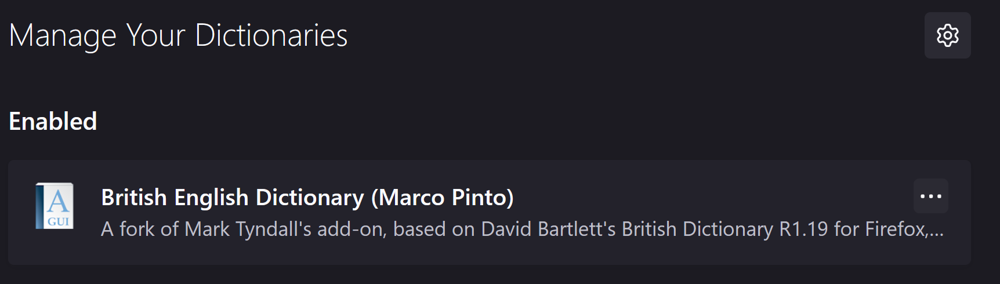
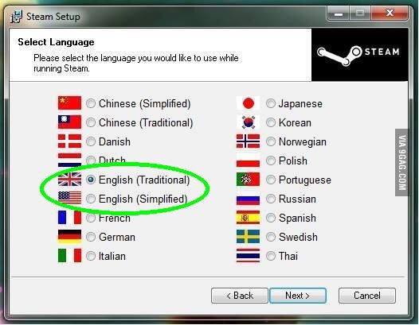

# YAPG - Yet another password generator

I like to write blog posts. When I first started doing this for real I struggled a bit with it.
Partly because I was worried about what people would think, 
but also because I never thought I'd have anything to say.

Imposter syndrome is a b**ch.

One thing I did to get rid of some of these anxieties was to simplify my blog.
I removed everything. This page has no cookies, no counters, no comments.. nothing.
I literally have no idea if anyone has ever visited it, And I honestly find that relaxing. 

I write for myself instead of worrying about what anyone thinks.

## But there is a downside

Like I said, I like to write blog posts, but I still ever so often reach a point where I want to write, but have no idea about what

I haven't really made no great discoveries lately, nor built anything super cool (at least nothing I can talk about publicly),
Yet I want to write something.

That's why I have posts such as [this](posts/nothingnew.md) in my history.

And that's why todays post is written.

I realized I still haven't written about YAPG.

## YAPG?

So what is YAPG?

YAPG is short for `Yet Another Password Generator`

A long time ago I read [this cartoon on XKCD](https://xkcd.com/936/) and it got me thinking about my password strategies.
Sure, I do use [keepass](https://keepass.info/) to manage my passwords, but sometimes that's not possible due to lack of access to my  computer or phone,
and sometimes I don't even work on my own computer (the life of a consultant!)

And whenever I am forced to make up a password right now, I, like so many others, end up stuck knowing approximately four words in the English language, and let me tell you right now:

> You should not set your admin password to **CorrectHorseBatteryStaple** 😉

Wouldn't it be good if we could generate passwords in that same format, a number of words, in a reusable fashion?
And most importantly: _Something that you may even remember without sacrificing security!_

And so it came the first version of the `New-YapgPassword` was built.

## The word list

The first thing to figure out was how to find a list of words? 

Some requirements I had:

- It needs to be big enough to not be easy to guess (A wordlist with 5 words would not create that many different permutations)
- It needs to be easy to parse in PowerShell (Some kind of text format)
- And it needs to be open source so I can include it in my distribution.

Of to google I went.
And I immediately realized I actually already used the answer.

Firefox.

It is [open source](https://searchfox.org/mozilla-central/source), and has a somewhat kind [license](https://www.mozilla.org/en-US/MPL/), and most importantly: has built in support for spell checking. It must be hiding a wordlist somewhere, right?

And so it did, and it didn't take long before I found it.



> Of course we're aiming for the queens English and not English (Simplified)
> 

## Some maths

Before I had something useful there was some filtering to do. Some words are too short. Some contains weird characters.

In the end I went the simple route and filtered on everything that starts with a character. This still results in the odd weird one, but it covers enough to not end up with pure crap.

I honestly don't know how many was included in he wordlist to begin with, but the resulting wordlist contains no less than 96583 unique words.

If we still follow the **CorrectHorseBatteryStaple** formula that would mean we have...

```PowerShell
PS > [math]::Pow(96583,4)
8,70167310612987E+19
```

Now I'm no security expert, nor a math one, but that looks like enough permutations to make them hard to guess.
([Wolfram Alpha says it is 87 quintillion](https://www.wolframalpha.com/input?i=96583%5E4))

So lets add some complexity to make it even worse.

## Your password must contain at least one of each

- A - Z
- a - z
- 0 - 9
- Special characters

Is something we often see, so I needed to add this as well.

### Capitalization

The easy path would of course be to capitalize each word, but that would make it easy to guess which character, so instead I opted to capitalize one random character in the word.

The average length of a word is 8,4 characters, so for simplicity: 8

```PowerShell
PS > $AllWords | % {$_.split('/')[0].Trim()} | % {$_.length}  | Measure-Object -Average

Count             : 96583
Average           : 8,45327852727706
```

8 different ways of spelling each word gives us the formula `(96583 * 8)^4` which, [again according to wolfram alpha](https://www.wolframalpha.com/input?i=%2896583+*+8%29%5E4), gives us 356 Sextillion permutations.

### Special characters

I don't want to break words. That would after all make them harder to remember. So instead I opted to add special characters _between_ words.

Now the list of special characters are almost endless, but to lessen the risk of

> Sorry, that character isn't allowed

I limited the amount to ascii characters 33 - 47

```PowerShell
PS > (33..47 | % {[char][int]$_}) -join ' '
! " # $ % & ' ( ) * + , - . /
```

If we have four words, that would give us 3 special characters; Word1_Word2_Word3_Word4.

This is where my lack of maths skills start to show, but 15 characters to the power of 3 gives us 3375 permutations of characters, and now I believe we have the formula `((96583 * 8)^4)*3375`, and the number of possible passwords is now [1 octillion](https://www.wolframalpha.com/input?i=%28%2896583+*+8%29%5E4%29*3375)

### Numbers

Last but not least we need numbers.

Like all good nerds with predictable passwords I opted for [leet](https://en.wikipedia.org/wiki/Leet) replacements.

A small helper function checks if the current character is one of the list of possible replacements, and if it is it randomly replaces them. Or not. Quite frankly I have _no idea_ how to calculate this, but for the sake of trying;

```PowerShell
PS > $AllWords.Count
96583
PS > ($AllWords | % {$_.split('/')[0].Trim() -match '[abegilostz]'}).Count
96583
```
So every single word has a possible permutation.

If every single word gets only one replacement we should add a *2 somewhere in the word count and may (again, I'm not good at math) end up with this formula: `(((96583 * 8)*2)^4)*3375`, which gives us [19 octillion permutations](https://www.wolframalpha.com/input?i=%28%28%2896583+*+8%29*2%29%5E4%29*3375)

## The module

So we can generate approximately 19 octillion unique passwords while still following the basic formula: It's (almost) human readable and (almost) possible to remember!

I may or may not write a blog post some time about how to release a module, but today is not that day. Instead lets just be happy that I released this as a one-function-module on the PowerShell gallery, and you can install it by running `Find-Module yapg | Install-Module`, or picking it up from my [GitHub page](https://github.com/bjompen/YAPG).

For myself, this means that on every new computer I get, and as soon as someone needs me to generate a password, I run the command

```PowerShell
PS > New-YapgPassword -AddChars -Capitalize -Leet -Passwords 10
ex0rCise+un4nim4Ted+decomp3N5a7ed*perf0rmaNce
0n3-d1m3n5ion4117y/N0r0nhA(wi7s(5p4nd3x
Kar0Ro#4rsphen4minE,Par7r1si0"geoc0r0N4
t3a84g'6impY.und3ciPher3d+hom0Morph
Pou13nc#5DR4M%pygM34n#5la1ns
Clo6hy.f3rox.71me-serv3R-s3minaRy
maj0rE773!aCque57#s31f-45Sured(4m3Rican4
5imul4n7$5w1n3fl3e7/oligopHreni4&P03
Cu1tus+una5s4i148ili7y+41ve0lu5't1nGe
4bomasum+B3n70N-Hed6erley#1ut30uS
```

Or simpler still

```PowerShell
PS > New-YapgPassword -Passwords 10
DamianAuffermannscorpionFlitcham
neighbourshipignobleScudderdodge
camelliaMadingleymistlikeMemorial
Watlingpneumatocystinflationistporn
prohibitorvineyardlocknutGanesh
sphingomyelinguddlertwo-facedbolthole
HabershamWHOISassembly'smephedrone
subcategoriseWeidingerblanketcommemorator
hippocentaurcock-a-doodle-doomihrabtubectomy
resistantWiseputschZiB
```

And voila: Simple, somewhat human readable passwords!

## Disclaimers and warnings

This isn't a flawless password generator. As you can see from the examples it will include some random characters that may not be supported. Sometimes it generates gibberish. And if, by chance, it should generate the phrase **CorrectHorseBatteryStaple**: Do not use it in production 😉

And if you don't think 19 octillion passwords are enough, try this for some 19 octillion+ extra passwords

```PowerShell
PS > New-YapgPassword -Dictionary (Get-Module yapg | % Path).Replace('yapg.psm1','sv-SE.dic') -Passwords 10
trillanUVBkonkurrenssituationloksele
menshistorienkärnkraftsolyckaklövergrandezza
reserverapäronpestfikastuganygravida
gillessalsommarkattflagigkonsthistorien
handikapprådförskärargrampositivdubbeltydighet
kiwimoussenittioettmiljardervärldsstädervinberg
mattvävarköföreträdeförolyckadblåshals
paragrafrytteribiff Stroganoffamaryllislökdetachera
rävbandmaskbaxaskrudkammaremedtagit
tetralogimorotsmobbpresslåsboningslänga
```
